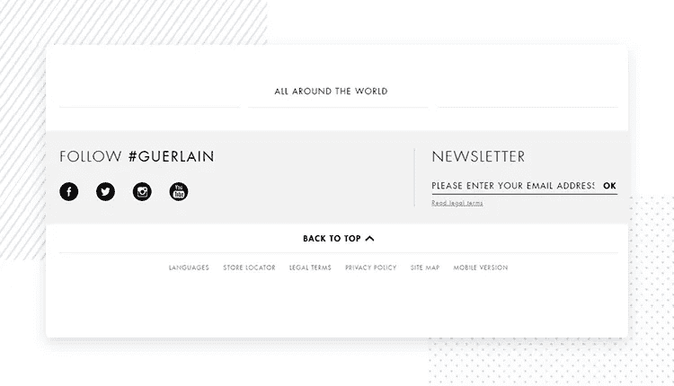
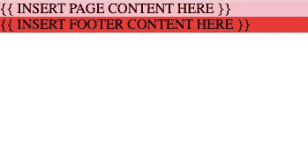
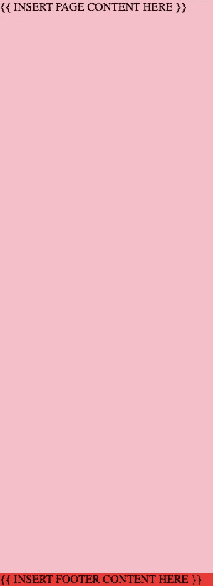

# 如何让你的页脚保持在页面的底部，简单又不费力

> 原文：<https://levelup.gitconnected.com/how-to-keep-your-footer-at-the-bottom-of-the-page-the-easy-way-20aa3bcd621f>



多漂亮的页脚啊！要是我们能把它固定在这一页的底部就好了…

“三大”CSS 问题之一如下:

> 如何让我的页脚紧贴页面底部？

在 Reddit 上第 5 次回答这个问题后，我决定写一篇博文是必要的。以下是方法。

(旁白:如果你想知道，另外两个“三大”CSS 问题是“我如何使元素居中”和“为什么我的样式不适用”)。

TL；灾难恢复和全部代码在底部。

## 设置

首先，我们来看看设置 HTML。下面是一些最简单的 HTML:

```
<!DOCTYPE html>
   <html lang="en">
     <head>
    <meta name="viewport" content="width=device-width, initial-scale=1.0">
</head>
  <body>
    <div class="main">{{ INSERT PAGE CONTENT HERE }}</div>
    <footer>{{ INSERT FOOTER CONTENT HERE }}</footer>
  </body>
</html>
```

除了一个`meta viewport`标签，这里没有太多特别的。这个标签是超级标准的，无论如何都应该自动包含在你的 html 页面中。然而，我们*在这里需要*的原因是因为我们将使用依赖于视口的`vh`单位。

这种方法如此强大的原因之一是您的 HTML 保持语义，没有侵入性的包装器或额外的元素。

然而，它如此强大的另一个原因是因为它是可扩展的。也许你正在做一个两层页脚的设计——不要担心！在第一个页脚后再贴一个页脚，它也会被压到底部。

你也可以随意设计你的`main`和`footer`的风格。我们只添加了少量的样式，所以它也不会影响您的样式表。

## 款式

首先，我们需要做一些基本的样板文件来使其可见。我所做的就是给`footer`和`main`添加背景色。



这是我们在这一步应该看起来的样子。

现在，我们可以很容易地知道一个元素占据了多大的空间。我们还需要做一些样板样式:

```
body {
  min-height: 100vh; margin: 0;
  padding: 0;
}
```

第一部分有点神奇:我们告诉 HTML，如果身体没有占据全屏，那么我们需要让它占据全屏！这样，如果我们没有很多内容，页脚就不会浮到页面中间。不过，它也说，如果我们*确实*有很多内容，我们应该让它增长到它的大小——在这种情况下，页脚已经粘在底部，因为内容本身正在向下推它。

其余的超标准，我很确定如果你是一个前端开发人员，你已经这样做了。它只是去掉了所有浏览器默认的一些难看的样式。为什么是违约？我不知道，但我们希望它消失。

这不是强制性的，但是它会让你的布局看起来更清晰，因为你的页脚边缘没有白色，你的像素会精确地排列到屏幕的边缘。

## 秘制调味酱

那么，下一步就是秘方出现的地方:flexbox。

我们需要让整个屏幕成为一个 flexbox，这样孩子们就可以使用一些令人惊叹的 flexbox 属性。

如果你不知道 flexbox 是什么，好消息和坏消息:好消息是你不需要为此了解它的任何东西。坏消息是你错过了前端开发人员最棒的工具之一，而且你现在这个周末有计划了:)。

我们需要向 body 标签添加两种样式:

```
body {
  /* what we already have */
  min-height: 100vh;
  margin: 0;
  padding: 0; /* what we're adding */
  display: flex;
  flex-direction: column;
}
```

这两种风格会告诉身体这是一个 flexbox，它应该垂直地执行它的灵活动作。这很方便，因为我们需要垂直执行一些灵活的动作！

具体来说，我们将需要执行灵活增长。这是剩下的款式这是*唯一的*剩下的款式了！)

```
.main {
   flex-grow: 1;
}
```

现在，如果我们看我们现在非常高的页面，我们应该看到:



嘿！页脚在这里！

我们刚刚告诉`.main`要做的是尽可能地长高，*在*之后页脚占据它的自然空间。这意味着页脚需要多大就有多大，正文内容会增长以填充剩余的空间。

这个方法最棒的地方在于:

*   不受 HTML +最小代码的影响
*   布局后，您可以随心所欲地设计造型
*   自然布局(无幻数)
*   灵活(尝试添加页眉。我保证这很容易——就像页脚一样！)

`tl;dr`:我们把主要内容告诉`flex-grow`来填满所有可能的空间。因此，页脚内容自然布局，但在页面的底部。

这是我们构建的完整代码示例:

```
<!DOCTYPE html>
 <html lang="en">
  <head>
   <meta charset="UTF-8">
   <meta name="viewport" content="width=device-width, initial-scale=1.0">
   <title>Document</title>
   <style>
    body {
     margin: 0;
     padding: 0;
     min-height: 100vh;
     display: flex;
     flex-direction: column;
    } .main {
     flex-grow: 1;
     background-color: pink;
    } footer {
     background-color: red;
    }
   </style>
  </head>
  <body>
   <div class="main">{{ INSERT PAGE CONTENT HERE }}</div>
   <footer>{{ INSERT FOOTER CONTENT HERE }}</footer>
  </body>
</html>
```