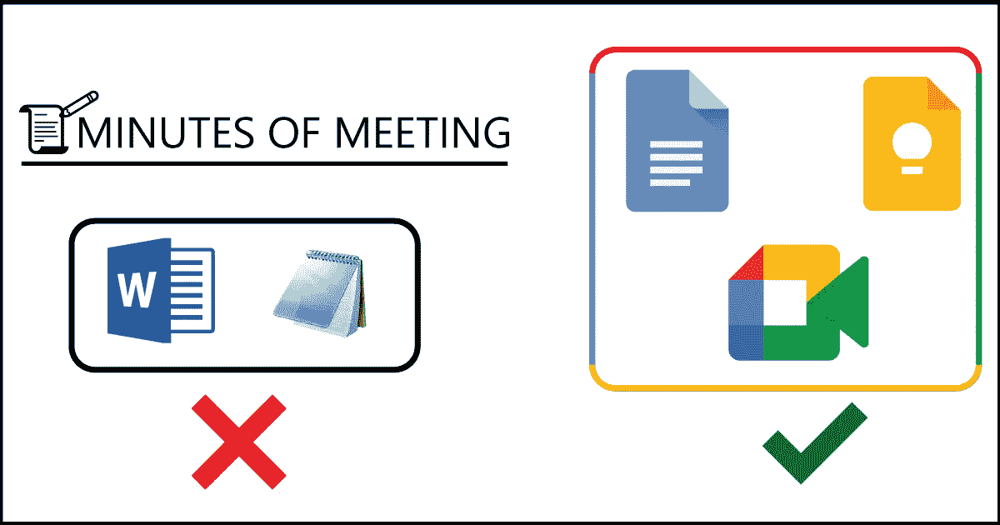
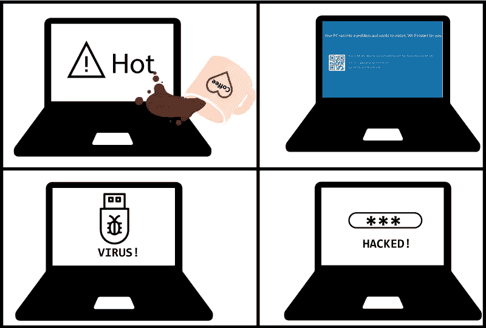
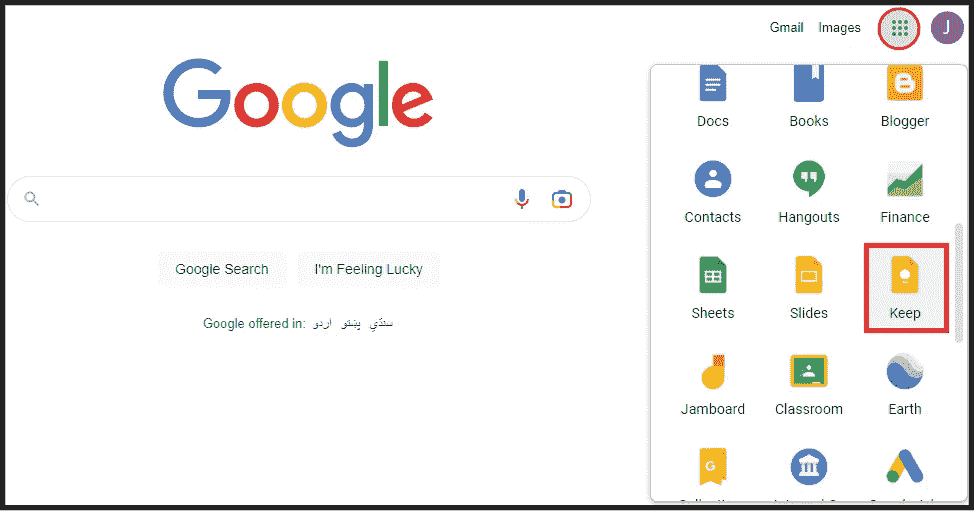
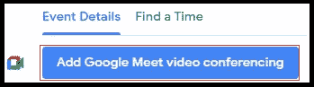
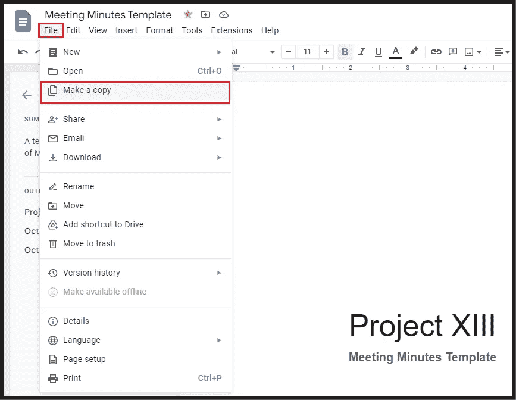

# 如何让你的会议记录安全有序？

> 原文：<https://levelup.gitconnected.com/how-to-keep-your-minutes-of-meeting-safe-organized-e524c5be7a6e>

探索使用 Google Apps 组织会议记录的有效方法。

创建会议记录——有效的方法

# 问题是

约翰·多伊是一位年轻、敬业、勤奋、热情的企业家，每天都要与多个客户打交道。在他的公司里，他是**的技术销售主管**，他从客户那里收集软件需求，将它们解释成有意义的用户故事，并将其转发给开发团队。

在与客户进行长时间的会谈后，约翰会将**会议记录(MoMs)** 打在单独的 MS Word 文件中。不幸的是，他从来没有备份过自己的工作，总是将进度保存在本地的惠普 Pavilion Aero 笔记本电脑上。一个晴朗的日子，由于不确定的原因，他所有的努力都毁了:

*   他的机器被黑了！
*   一个 [**蓝屏的死亡**](https://www.next7it.com/insights/what-is-blue-screen-of-death/#:~:text=A%20blue%20screen%20of%20death%2C%20or%20BSOD%20for%20short%2C%20is,a%20computer%20has%20%E2%80%9Cdied%E2%80%9D.) 撞毁了笔记本电脑。
*   他用了一个被感染的 u 盘抹去了他所有珍贵的数据。
*   一个热咖啡杯溅到了笔记本电脑上。

数据丢失因素说明。

我想我们不想知道接下来发生了什么，对吗？

# 解决方案

像无名氏一样，我们经常犯同样的错误，导致不确定的情况。为了克服这种可怕的经历，我们将会看到更好的方法来让我们的妈妈们更安全、更有条理。

## 💡*从记事本*切换到 Google Keep

Windows 记事本确实是一个方便的工具，可以帮助记录会议中的关键点，但也有一些我们经常忽略的缺点。

1.  我们只能输入文本或表情符号。
2.  我们不能在记事本中保存图像。
3.  我们不能将内容导出为 PDF 或 Word 文件。
4.  我们不能以富文本格式复制/粘贴内容。

另一方面，使用 Google Keep 是保护我们珍贵数据安全的更好选择。我们需要一个谷歌账户，瞧，我们进去了。

从应用程序栏导航到 Google Keep

***要访问 Google Keep app，我们还可以在浏览器的网址中输入***[***【keep.google.com】***](http://keep.google.com/)***。***

以下是 Google Keep 的一些好处:

*   我们的数据现在可以在云上获得，这意味着数据备份不再那么麻烦。
*   我们可以通过插入文本、表情符号、代码片段、图像、图画和复选框来格式化我们的内容。
*   我们可以通过添加标签来对多个笔记进行分类。
*   我们可以将笔记导出为谷歌文档格式。
*   我们可以通过设置提醒来区分笔记的优先顺序。
*   我们可以在会议期间与客户分享我们的笔记。
*   我们可以从多种设备访问我们的数据，如 [**、智能手机**](https://play.google.com/store/apps/details?id=com.google.android.keep&hl=en&gl=US) 、[**iphone、iPad、**和 **Apple Watch**](https://apps.apple.com/us/app/google-keep-notes-and-lists/id1029207872) 。

## 📃使用谷歌文档组织你的妈妈

我们不需要维护单独的记事本或 MS Word 文件，我们可以使用一个谷歌文档模板，通过以下步骤跟踪我们项目的进展。

1.  访问[**meet.google.com**](https://meet.google.com/)并创建一个谷歌日历事件。
2.  点击 **Google Meet 视频会议**按钮(可选)。

导航至 Google Meet 链接生成器按钮

3.完成后，点击**保存**按钮。

4.打开 [**会议纪要 Google Doc 模板**](https://docs.google.com/document/d/1iHfWTzUfbdMDZvrmyWPKIxe8FbDZn3v3I0ziithSIpU/edit?usp=sharing) ⁴文件。

5.从**文件**菜单中，选择**制作副本**将其复制到您的 Google Drive 上。

复制*会议纪要*模板文件

6.最后，用您的内容替换占位符文本。

# 结论

非常感谢！我希望你喜欢读到这里。使用以上两种方法，我们不仅为创建的**会议**记录获得同步数据，而且我们的团队协作变得更加有效和健壮。

# 参考

**【1】:什么是死亡蓝屏？| next7it.com** [https://www . next 7it . com/insights/what-is-blue-screen-of-death](https://www.next7it.com/insights/what-is-blue-screen-of-death/#:~:text=A%20blue%20screen%20of%20death%2C%20or%20BSOD%20for%20short%2C%20is,a%20computer%20has%20%E2%80%9Cdied%E2%80%9D.)

**【2】:Google Play 上的 Google Keep App**
[https://play.google.com/store/apps/details?id = com . Google . Android . keep&HL = en&GL = US](https://play.google.com/store/apps/details?id=com.google.android.keep&hl=en&gl=US)

**【3】:在 App Store 上 Google Keep App**
[https://apps . apple . com/us/App/Google-Keep-notes-and-lists/id 1029207872](https://apps.apple.com/us/app/google-keep-notes-and-lists/id1029207872)

**【4】:会议纪要模板文件** [https://docs . Google . com/document/d/1 ifwtzufbdmdzvrmywpkixe 8 fbdzn 3v 30 ziithsipu/edit？usp =分享](https://docs.google.com/document/d/1iHfWTzUfbdMDZvrmyWPKIxe8FbDZn3v3I0ziithSIpU/edit?usp=sharing)