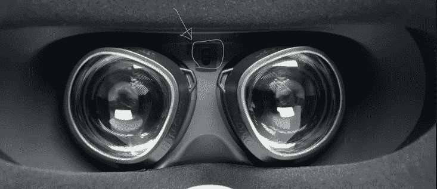
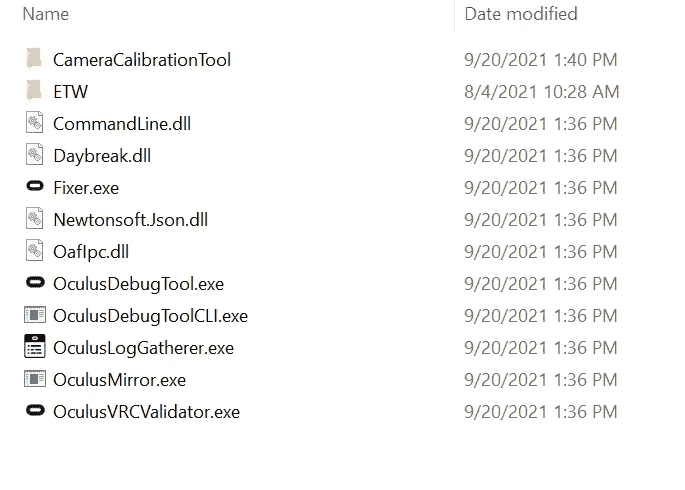
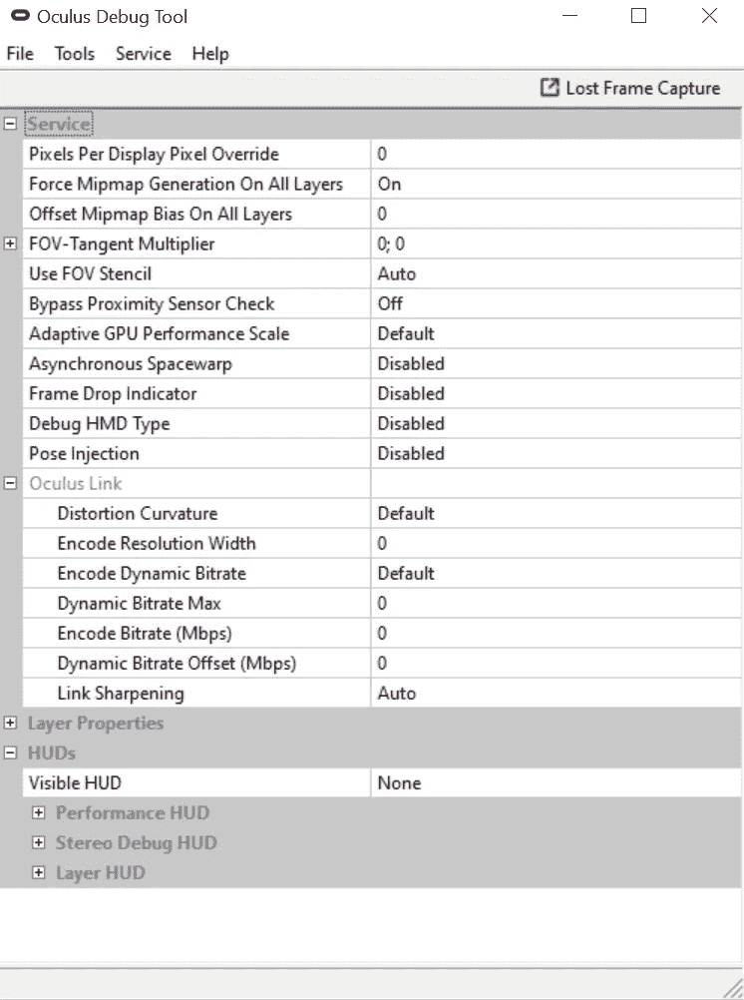
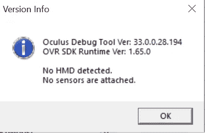
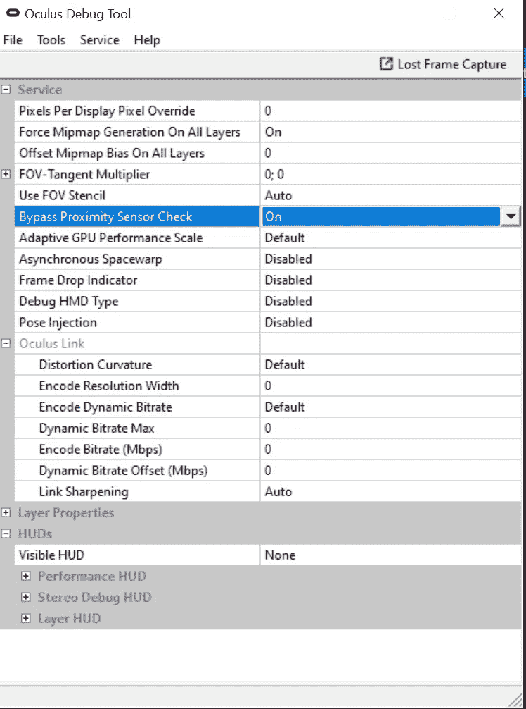

# 如何让你的 Oculus Quest 2 在关机时不进入睡眠状态

> 原文：<https://levelup.gitconnected.com/how-to-keep-your-oculus-quest-2-from-going-to-sleep-when-you-take-it-off-8cfb4b661248>

## 这是一个记录不多的问题，但是感兴趣的人想要解决的数据收集问题

## 我的使用案例

我是研究 XR/AR/VR 流媒体的，所以游戏体验并不总是我所研究的，有时候我只是想把一个游戏流式传输到耳机上，收集指标。如果不解决这个问题，我就无法在不戴耳机的情况下收集数据，如果我离开游戏区去洗手间，我将不得不重新开始长达几个小时的数据收集会话，或者遭受脏数据(恐怖)

## 我们开始吧

一个接近传感器可以检测你的脸离耳机有多远，这就是 Oculus Quest 如何检测它是否在你的头上。接近传感器位于 Oculus Quest 2 的两个眼睛镜片之间和上方。



[3]源图像。处方镜片适配器。[https://wid movr . com/product/oculus-quest-2-prescription-lens-adapters/](https://widmovr.com/product/oculus-quest-2-prescription-lens-adapters/)

当它不在你的头上时，它会进入待机模式以节省电池。

[1]转到此处:

```
C:\Program Files\Oculus\Support\oculus-diagnostics
```

对我来说是这样的:



[1]

你要发射 OculusDebugTool.exe[1]

您的机器上必须已经安装了 Oculus Link 软件，并且在启动 Oculus Quest 2 之前，必须用电缆将其连接到您的计算机。

这是我的样子:



以下是我的版本信息:



注意它说没有检测到 HMD。HMD 的意思是头戴式显示器。尽管有这个错误信息，我的 Oculus Quest 2 实际上还是插上了。忽略这个错误信息对我来说似乎没什么问题，但我不知道为什么当我的 Quest 2 接通电源并且 Windows 可以清楚地检测到它时，它却说没有 HMD。**耸肩* *

找到名为“旁路接近传感器检查”的设置，并将其从“关闭”切换到“打开”[1](屏幕下方)



[1]

现在你可以摘下耳机，在不退出游戏的情况下快速喝一口水。[1]

然而，你不能简单地把它放在你的桌子上，让它继续运行，你需要定期移动它或移动你的头来保持清醒，否则它会进入待机模式。截至 2021 年 9 月 24 日，Oculus 或开源社区仍然没有针对该问题的修复程序。[2]

## 注意

另一位作者也对他解决这个问题的方法留下了有用的评论，如果我的解决方案由于某种原因对你不起作用，请检查一下。如果您可以确认或拒绝任何解决方案，请留下评论让其他人知道，以便我们可以跟踪这个不太记录在案的问题。

你知道你可以为一篇文章鼓掌不止一次吗？只要按住拍手按钮。是的，我知道这听起来像是作弊，但不是。以下是我通常鼓掌的次数:

0 ->不同意/没看完
1 - >中立，不过我给你可惜鼓掌
~4 - >不喜欢全部，但是也有好的地方
~16 - >这是一篇相当不错的文章
~50 - >大家都需要看这个！

# 参考

[1]旋风杰克 1988。如何让你的 oculus quest 在摘下来的时候不进入睡眠状态！[https://www.youtube.com/watch?v=Kzv3w0TKTiU](https://www.youtube.com/watch?v=Kzv3w0TKTiU)

[2]Thegamer.com。埃里克·斯威策。自动睡眠缺陷。[https://www . the gamer . com/quest-2-网飞-自动睡眠-bug-defect/](https://www.thegamer.com/quest-2-netflix-auto-sleep-bug-defect/)

[3]形象。处方镜片适配器。[https://wid movr . com/product/oculus-quest-2-prescription-lens-adapters/](https://widmovr.com/product/oculus-quest-2-prescription-lens-adapters/)