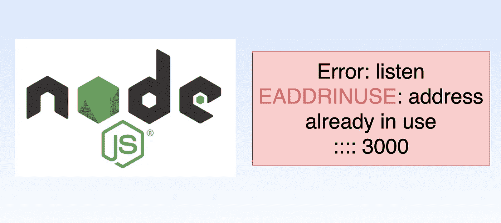
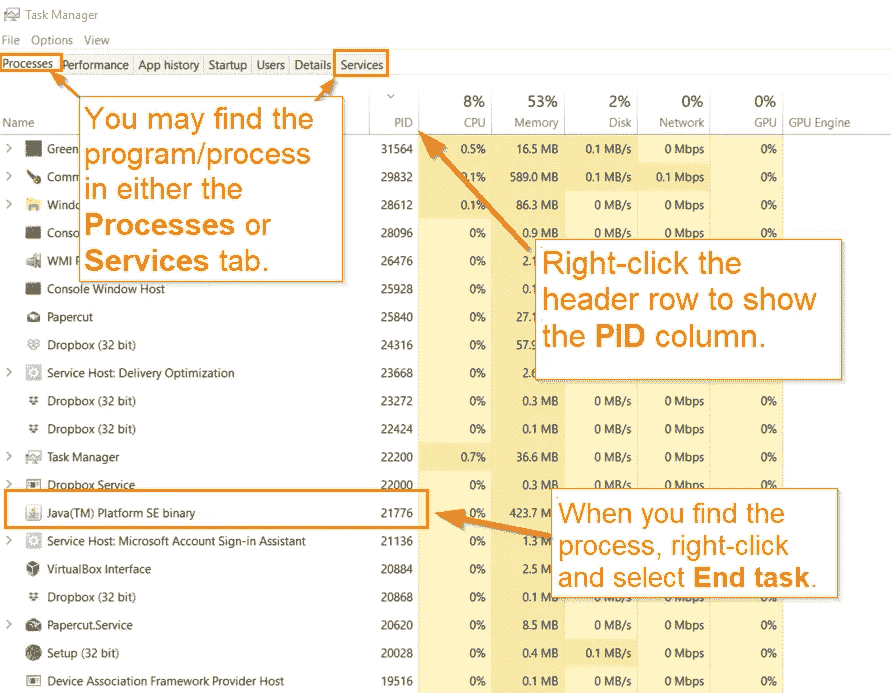
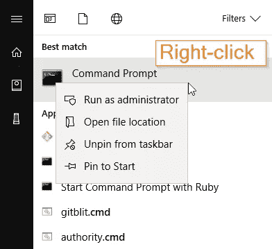

# 当看到“EADDRINUSE:地址已被使用”时如何杀死服务器

> 原文：<https://levelup.gitconnected.com/how-to-kill-server-when-seeing-eaddrinuse-address-already-in-use-16c4c4d7fe5d>

关于如何在 Mac/Linux 和 Windows 上发生“EADDRINUSE”时手动**终止进程**的教程。



Nodejs 监听 EADDRINUSE:地址已被使用

# 问题是

当尝试重新启动一个节点应用程序时，前一个没有正常关闭，您可能会看到一个“**listen EADDRINUSE:address in use**”错误，例如:

听着 EADDRINUSE:地址已经被使用

## 这个问题背后的原因

这背后的原因是

> 当进程崩溃或终止时，不调用。它只在事件循环结束时被调用，因为`server.close()` *类似于*结束事件循环(它仍然需要等待当前正在运行的堆栈),所以把它放在退出事件中是没有意义的。

## 解决办法

对该应用程序的正确修复应该是

*   崩溃时，做`*process.on('uncaughtException', ..)*`
*   并且在杀做`*process.on('SIGTERM', ..)*`

当这个 **EADDRINUSE** 问题已经发生时，为了解决它，您需要**手动终止进程**。为此，您需要找到进程的进程 id (PID)。您知道该进程正在占用您的机器或服务器上的特定端口。

# 手动终止进程

## 适用于 Mac/Linux

为了找到与端口相关联的进程 id (PID)

```
⇒ lsof -i tcp:3000 
COMMAND PID   USER  FD  TYPE DEVICE             SIZE/OFF NODE NAME 
node    44475 chen5 31u IPv4 0x8b1721168764e4bf 0t0 TCP *:strexec-s (LISTEN)
```

然后终止该进程

```
kill -9 44475
```

使用`-9`选项确保进程立即终止

如果你得到权限错误，你可能需要使用`sudo`关键字，例如:

```
sudo kill -9 44475
```

## 对于 Windows

**解决方案 1:任务管理器**

从**进程**或**服务**选项卡中打开任务管理器应用程序(**taskman.exe**)，按 **PID** 列排序。要显示 **PID** 栏，右击标题行并从列表中选择 **PID** 。右键单击想要停止的流程并选择**结束任务**。



Windows 中的示例，来源于互联网

**解决方案 2:使用命令提示符**

导航到**开始>运行>** 键入**命令** **>** 右键单击**命令提示符**，然后选择**以管理员身份运行**。



来源于谷歌搜索

使用 [netstat](https://docs.microsoft.com/en-us/windows-server/administration/windows-commands/netstat) 命令列出所有活动端口。`-a`开关显示所有正在使用的端口，而不仅仅是与当前用户相关的端口。`-n`选项停止主机名查找(这需要很长时间)。`-o`选项列出了负责端口活动的进程 ID。`findstr`命令匹配包含 PID 字符串的标题行，您正在寻找的端口，在前面带有冒号的端口格式中，是 **:3000** 。

```
C:\Users\admin>netstat -ano|findstr "PID :3000" 
Proto Local Address Foreign Address State PID 
TCP 0.0.0.0:3000 0.0.0.0:0 LISTENING 18264
```

要杀死这个进程(其中 **/f** 是 force):

```
taskkill /pid 18264 /f
```

# 尽情享受吧！

大概就是这样。感谢阅读

# 分级编码

感谢您成为我们社区的一员！升级正在改变技术招聘。 [**在最好的公司找到你的完美工作**](https://jobs.levelup.dev/talent/welcome?referral=true)**。**

**[](https://jobs.levelup.dev/talent/welcome?referral=true) [## 升级—转变技术招聘

### 升级—转变技术招聘🔥使软件工程师能够找到完美的角色…

作业. levelup.dev](https://jobs.levelup.dev/talent/welcome?referral=true)**