# 如何从网络上启动任何移动应用程序

> 原文：<https://levelup.gitconnected.com/how-to-launch-any-mobile-app-from-the-web-1ad785a0e0a6>

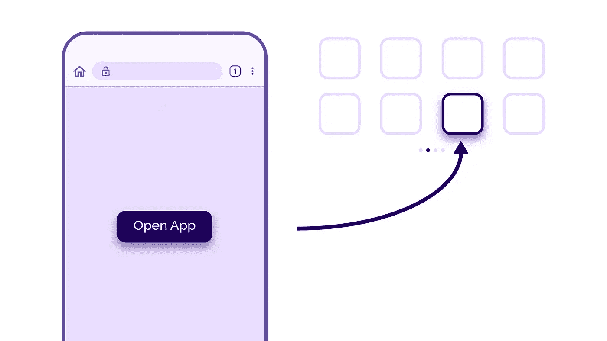

最近，我的工作任务是了解是否有可能推出一款我们公司在 iOS 和 Android 上都没有的应用程序。稍加挖掘，简短的答案是肯定的！值得注意的是，这种方法不同于应用程序的深度链接。这种技术将允许您简单地启动应用程序，仅此而已。

对于本文，我们将尝试推出 Google Home 应用程序。

# ios

让我们找到 Google Home 应用程序的 URL 方案。

这种方法需要访问物理 iOS 设备。

从在 Mac 上下载[图像](https://imazing.com/)开始。这个工具允许你管理你的 iOS 设备上的各种内容，但最重要的是，它允许我们提取我们想要的应用程序的 IPA。你不需要为 iMazing 的高级版本付费。

启动 iMazing 并插入您的设备。

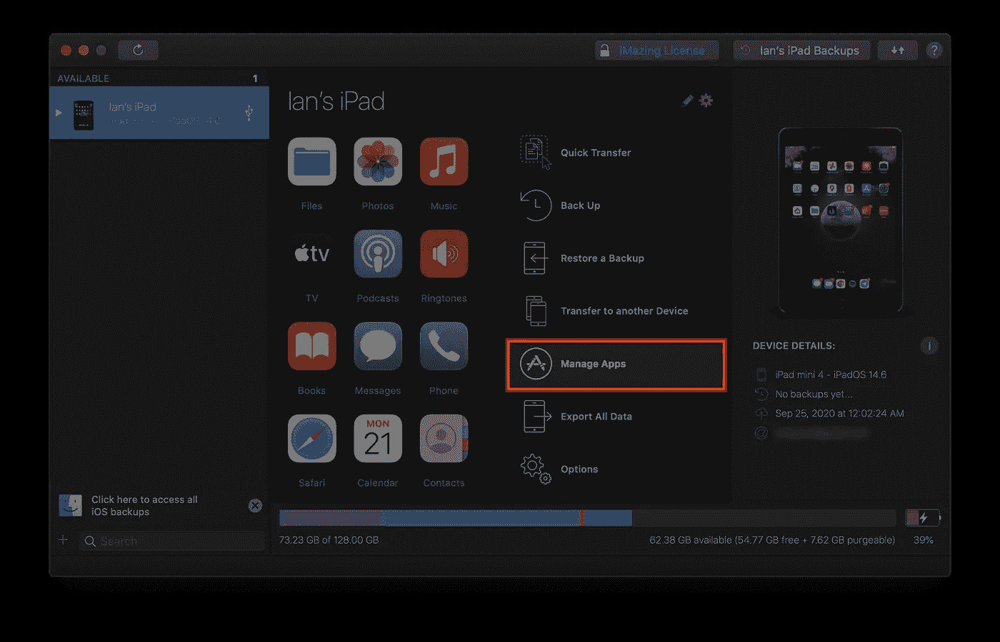

选择“管理应用程序”您可能需要输入您的 Apple ID 密码。此外，加载应用程序列表可能需要几分钟时间。

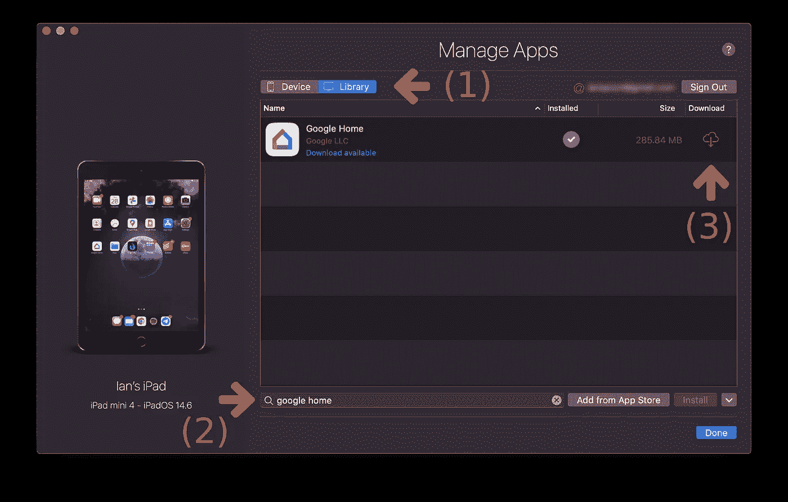

加载应用程序后，请执行以下操作:

1.  选择顶部的“图书馆”
2.  搜索 Google Home 或您想要的应用程序，或者如果您的设备上没有该应用程序，请单击“从 App Store 添加”。您只能添加您已经使用当前 Apple ID 购买的应用程序。
3.  单击下载图标

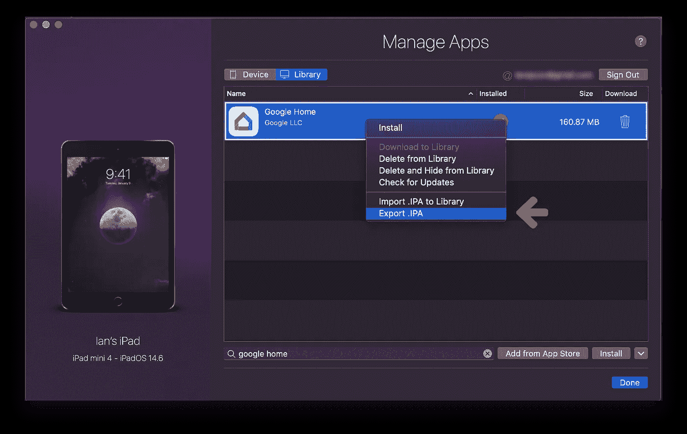

下载完成后，右键单击应用程序，选择“导出”。IPA”，并将其保存在您想要的文件夹中。

现在，是时候提取 URL 方案了。

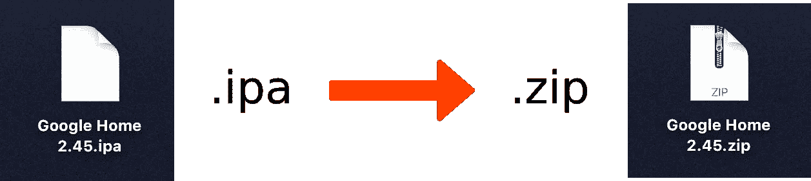

首先，获取您下载的`.ipa`文件，并将其文件类型重命名为`.zip`

双击它将其解压缩，然后导航到`.app`文件。

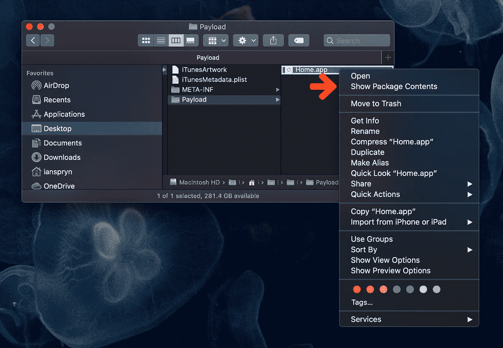

右键单击它并选择“显示包内容”

一旦打开，你会看到一个`Info.plist`文件。在您选择的编辑器中打开它。在`CFBundleURLSchemes`阵法下寻找条目。

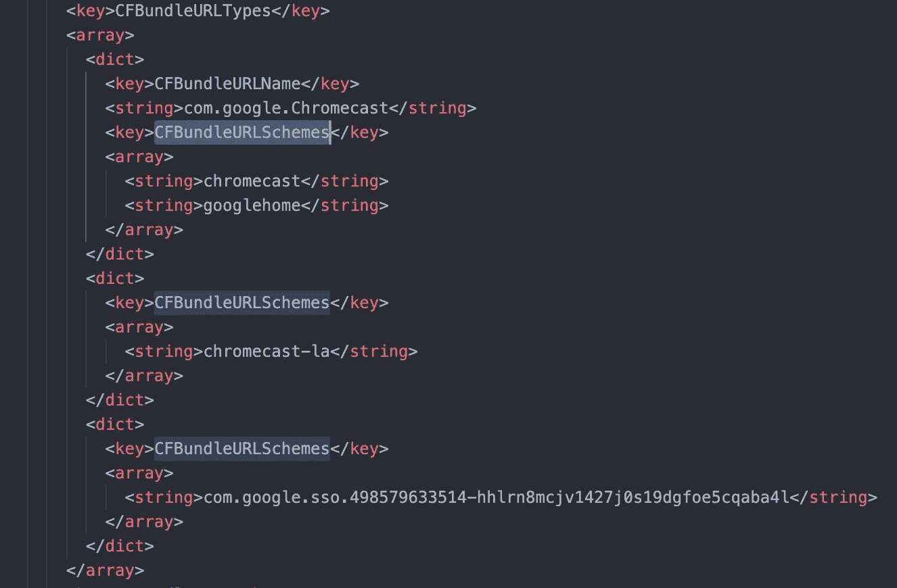

信息列表

看起来这里有很多可以挑选的。对于本文，我们将使用`googlehome`。但是值得一提的是，如果使用的话，这些都可以工作。

# 机器人

对于 Android，我们需要两样东西来启动应用程序:

1.  应用程序 ID
2.  应用程序方案及其关联的主机

应用程序 ID 很容易找到。只需在你的浏览器中进入 Play Store 并找到应用程序。

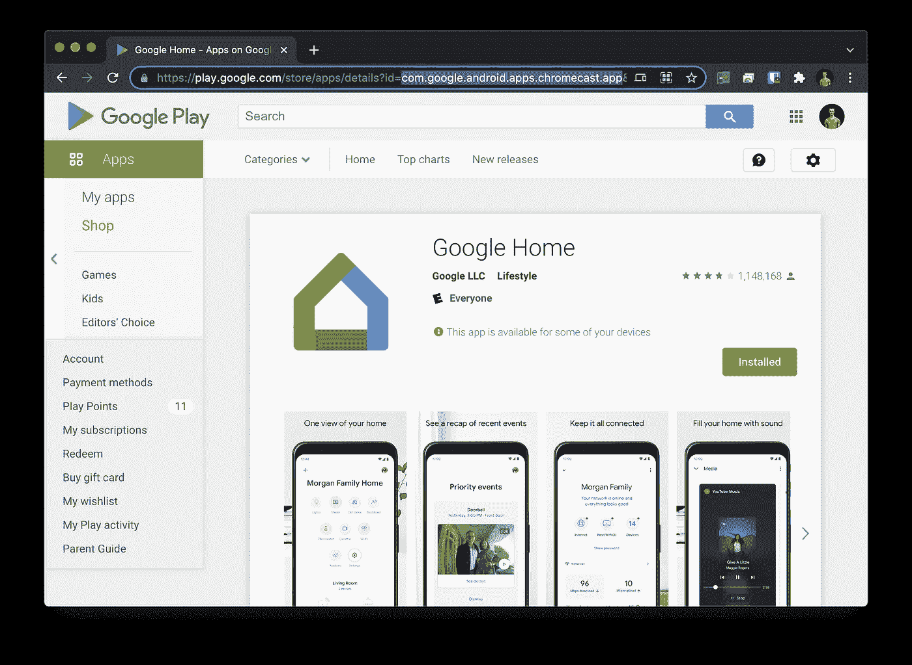

我在上面截图的地址栏中突出显示了应用程序 ID。

应用程序方案有点复杂，但仍然是可行的。

有很多方法可以获得安卓应用的 APK。你可以找教程，但是我会分享我喜欢怎么做。我喜欢用 [APKMirror](https://www.apkmirror.com/) 或者 [APK Pure](https://apkpure.com/) 。有时一个网站有 APK，而另一个没有。

您也可以使用 ADB 从设备中提取 APK。阅读这篇 Stackoverflow 帖子的更多内容。

一旦你获得了你的 APK，前往 [APKTool](https://ibotpeaches.github.io/Apktool/install/) 并遵循你的平台的安装说明。这个工具将允许你反编译应用程序，以便我们可以提取我们需要的信息。

一旦你遵循这些指示，`apktool`应该在你的终端上工作。


运行以下命令:

```
apktool d path/to/your/app.apk
```

一个包含提取内容的新文件夹将出现在您的目录中。在它的内部，您会找到`AndroidManifest.xml`文件。在文件中搜索`android:scheme=`。您可能会找到多个结果。

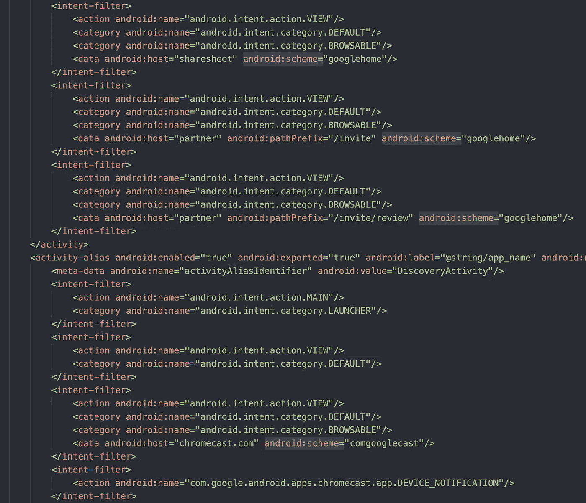

AndroidManifest.xml

我们需要的是正确的`android:host`和`android:scheme`，但是我们怎么知道选择哪一个呢？有时有几个可供选择。在这种情况下，有几十个。

简短的回答是试错。但是我们可以通过挖掘缩小范围。

查看给定`<intent-filter>`标签的父标签`<activity>`或`<activity-alias>`。再看`android:name`属性。下面是来自 XML 文件的两个:

```
<activity ... android:name=”com.google.android.apps.chromecast.app.deeplink.DeeplinkActivity” ...>...<activity-alias ... android:name=”com.google.android.apps.chromecast.app.DiscoveryActivity” ...>
```

如果我们想要深入链接到应用程序的特定组件，DeeplinkingActivity 可能是有用的，但那是另一篇文章。另一方面，DiscoveryActivity 听起来很有趣，因为它听起来像是应用程序的主页。果不其然，如果我们查看内部，我们会发现一个条目包含一个等于`chromecast.com`的`host`和一个等于`comgooglecast`的`scheme`。太好了！我们现在拥有了启动 Android 应用程序所需的一切。

# 编写 JavaScript

许多文章展示了如何确定用户是在 iOS 还是 Android 设备上。本文并不关注这一点，所以我们将有两个按钮，每个启动应用程序。

```
<button onclick="launchAppOnAppleDevice()">iOS Device</button>
<button onclick="launchAppOnAndroidDevice()">Android Device</button>
```

iOS 是两个平台中最容易设置的。

```
function launchAppOnAppleDevice() {
   const url = "googlehome://";
   window.location.replace(url);
}
```

就是这样！

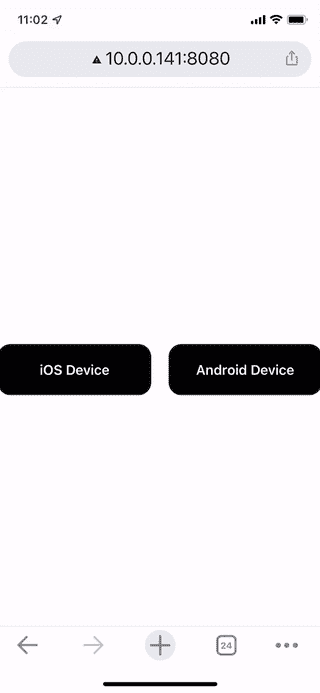

在 iOS 上启动

如果设备上没有安装该应用程序，Safari 将显示一个带有错误的弹出窗口。根据我的经验，如果应用程序无法启动，很难找到一种可靠的方法来引导用户进入应用程序商店。

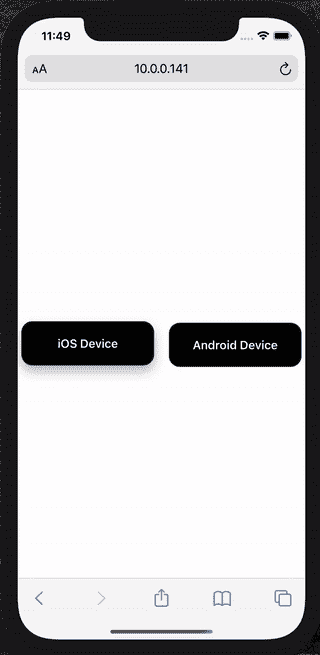

在未安装应用程序的情况下在 iOS 上启动

Android 的设置稍微复杂一些，但是如果你不想理解本质的细节，它对你来说只是一个快速的复制和粘贴。

Android 使用一种叫做 Intents 的东西。你必须以一种特殊的方式编码你的链接，以便成功地启动应用程序。如果你想了解更多，请访问 [Android Intents with Chrome](https://developer.chrome.com/docs/multidevice/android/intents/) 。

您的意向 URL 将类似于以下内容:

```
intent://ANDROID_HOST/#Intent;scheme=ANDROID_SCHEME;package=APP_PACKAGE;end
```

对于 Google Home 应用程序，

*   `ANDROID_HOST = chromecast.com`
*   `ANDROID_SCHEME = comgooglecast`
*   `APP_PACKAGE = com.google.android.apps.chromecast.app`

```
function launchAppOnAndroidDevice() {
   const url = "intent://chromecast.com/#Intent;scheme=comgooglecast;package=com.google.android.apps.chromecast.app;end";
   window.location.replace(url);
}
```

这里有一个重要的注意事项。如果你注意到当你点击 Android 按钮时，尽管你已经安装了应用程序，它仍会将你带到 Play Store，那么请仔细检查你的 ANDROID_HOST 和 ANDROID_SCHEME 值，或者尝试`AndroidManifest.xml`文件中的其他值。

恭喜你！你现在可以在任何一个平台上运行任何应用。

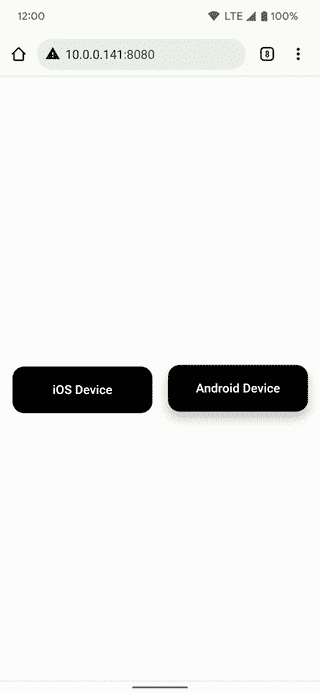

在 Android 上启动

如果该应用程序没有安装在设备上，Android 会礼貌地带你到 Play Store，而无需任何额外的跑腿工作，在我看来，这是对苹果方法的一大胜利，苹果方法只是弹出一个警告对话框，没有简单可靠的方法来检测它的失败。

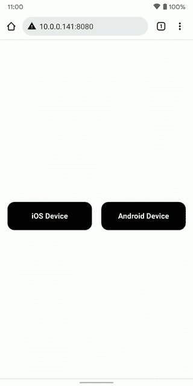

在没有安装应用程序的情况下在 Android 上启动