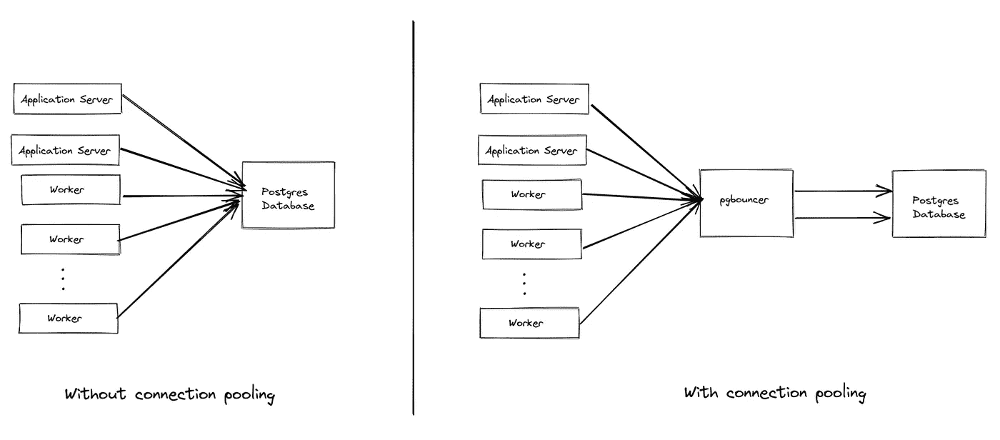
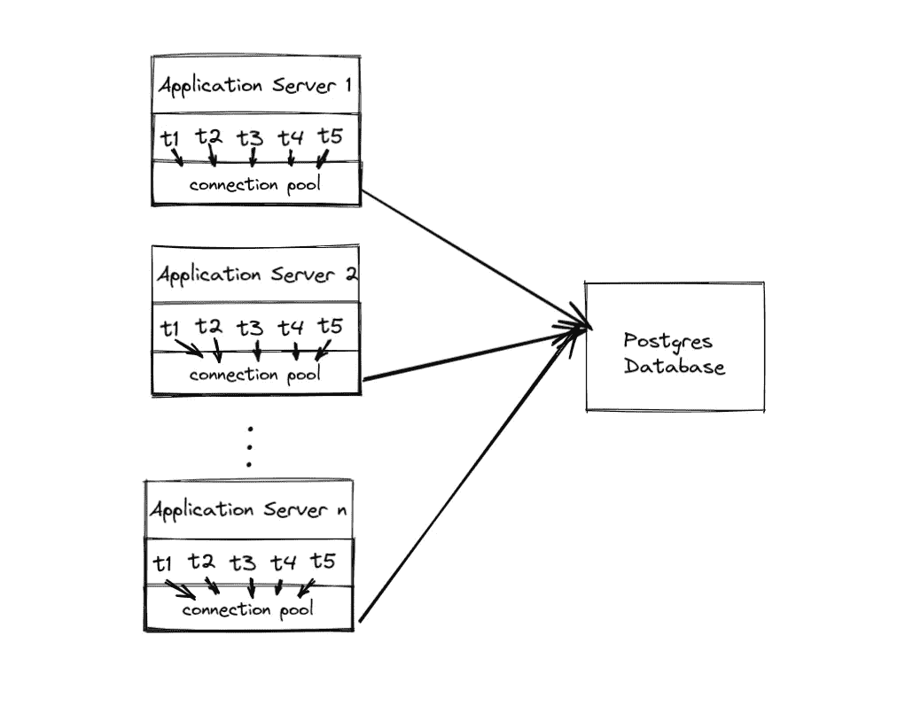

# 如何启动 pgbouncer 容器

> 原文：<https://levelup.gitconnected.com/how-to-launch-pgbouncer-container-140be66776eb>

## 安全地横向扩展应用服务器，同时保持最小数量的数据库连接

# 什么是 pgbouncer

**pgbouncer 是应用服务器之间的连接池中间件软件**&Postgres DB 实例。连接池的目的是**让应用程序高效地连接到 Postgres 实例**。pgbouncer 是如何做到这一点的？通过重用到数据库的连接。

在 Postgres 中(通常是大多数数据库)，建立一个连接是非常昂贵的，每个连接花费大约 1.5-14.5 MB 的**。**如果你有 100 个打开的数据库连接，仅仅维护这些连接就需要大约 1.45GB 的内存，这是一种浪费。记住，任何浪费的资源都会转化为金钱损失。此外，目前大多数 DBaaS 产品都限制了每个数据库实例的连接数。例如，定价为 50 美元的 Heroku Postgres 标准 0 实例最多只允许 120 个连接。当您需要向外扩展后端服务器超过这个限制时，就需要在应用服务器和 Postgres 实例之间使用连接池。



有和没有连接池的系统之间的比较

从应用服务器的角度来看，它认为自己连接到了一个普通的 Postgres 服务器。它没有连接池概念。这里的应用服务器指的是你的后端软件，无论它们是用 Laravel PHP、Python Django、Ruby on Rails 等编写的。

## 优势

*   您可以很好地扩展您的应用服务器。以我的经验，并不是说你可以无限制的扩展你的服务器；相反，它解除了限制。例如，以前，您的 Postgres 实例最多可以支持 100 台服务器。有了 pgbouncer，它大概可以支持多达 500 台服务器。这个数字取决于你的工作量。
*   **pgbouncer 可以充当数据库路由**。您可以将单个 pgbouncer 实例连接到多个不同的数据库实例。从那里，您可以相应地设置路由。
*   **它可以保护您的数据库实例免受大量连接建立的影响。**在 pgbouncer 中，可以设置 Postgres 服务器的最大连接数和应用服务器的最大连接数。如果您的系统试图打开超过最大允许连接数的连接，pgbouncer 将在连接到达上游数据库服务器之前拒绝该连接。

## 不足之处

一切都是有代价的。

*   **它为你现有的系统增加了一个新元素。**这意味着你的系统复杂性增加了。操作一个新的软件需要技能和努力来保持其正确运行。
*   **这可能是您系统中的单点故障**，除非您使用 HAproxy 或 AWS 网络负载平衡器建立高可用性模型。同样，高可用性设置不是一件容易的事情。

## 不要与应用程序级连接池混淆

您可能已经注意到，现在许多 ORM、数据库适配器和 web 框架都有内置的连接池特性。在他们的文档中可以看到: [Ruby on Rails](https://api.rubyonrails.org/classes/ActiveRecord/ConnectionAdapters/ConnectionPool.html) 、 [Django](https://docs.djangoproject.com/en/4.0/ref/databases/#persistent-connections) 、 [Sequelize.js](https://sequelize.org/master/manual/connection-pool.html) 、 [Prisma](https://www.prisma.io/docs/concepts/components/prisma-client/working-with-prismaclient/connection-pool) 、[elixin Ecto](https://hexdocs.pm/phoenix/ecto.html#repo-configuration)、 [Go Database](https://go.dev/doc/database/manage-connections) 等。



应用程序级连接池

**应用级连接池只管理服务器级线程中的线程**。如果您启动了数百台服务器，每台服务器都将建立到数据库服务器的连接，从而导致大量的连接。这并不能解决向系统添加服务器时的高连接数问题。

## 何时使用 pgbouncer

在我看来，只有在您向外扩展应用程序服务器，并且您的数据库连接很累的时候，您才应该使用 pgbouncer。例如，您的数据库最多允许 100 个连接，但是您有 200 个应用服务器(并且每个服务器运行多个线程)。理论上，您的数据库实例将无法处理来自应用服务器的 200 多个数据库连接，这是 pgbouncer 的理想用例。

如果您不需要很多服务器来支持您的用户，您最好不要使用连接池，因为它的好处是最小的。

## 何时不使用 pgbouncer

**你不应该使用 pgbouncer 来加速你的查询**。考虑先做容易实现的优化，比如添加相关的表索引、构建物化视图、扩展数据库服务器等。，然后在您的系统中实际安装 pgbouncer。

如果您的查询速度很慢，安装 pgbouncer 不会有太大帮助。

## 哪些公司在用 pgbouncer

它们在大型互联网公司中很受欢迎

[](https://blog.twitch.tv/how-twitch-uses-postgresql-c34aa9e56f58) [## Twitch 如何使用 PostgreSQL

### Twitch 拥有大约 125 台数据库主机，为生产中的 OLTP 工作负载提供服务，通常作为集群的一部分…

博客. twitch.tv](https://blog.twitch.tv/how-twitch-uses-postgresql-c34aa9e56f58) [](https://about.gitlab.com/blog/2017/10/02/scaling-the-gitlab-database/) [## 扩展 GitLab 数据库

### 长期以来，GitLab.com 使用一台 PostgreSQL 数据库服务器和一个副本进行灾难恢复…

about.gitlab.com](https://about.gitlab.com/blog/2017/10/02/scaling-the-gitlab-database/) [](https://github.com/PostHog/posthog-cloud) [## GitHub-post hog/post hog-cloud:post hog 多租户环境的内部脚本

### 这个库用于运行 PostHog Cloud (app.posthog.com)。它使任何人都可以注册一个帐户，并创建…

github.com](https://github.com/PostHog/posthog-cloud) [](https://mattermost.com/blog/optimizing-database-connection-loads-with-pgbouncer-and-testwick/) [## 使用 PgBouncer 和 Testwick 优化数据库连接负载

### 大多数工程师都知道，一个小的错误配置可能会导致一些大麻烦。通常，我们倾向于…

mattermost.com](https://mattermost.com/blog/optimizing-database-connection-loads-with-pgbouncer-and-testwick/) 

# 我们开始吧

## #1 发布 Postgres 容器(可选)

```
$ docker run \
    -e POSTGRES_PASSWORD=password 
    --network=host
    --name postgres
    postgres
```

如果您已经有一个运行在笔记本电脑或云中的数据库，您可以跳过这一步。

注意，我们在启动这个 Docker 容器时使用主机网络，以便步骤#2 中的 pgbouncer 容器可以到达它。

## #2 启动 pgbouncer 容器

要启动 pgbouncer 容器，您需要以下环境变量:

```
$ docker run \
    -e "POSTGRESQL_HOST=localhost" \
    -e "POSTGRESQL_USERNAME=postgres" \
    -e "POSTGRESQL_PASSWORD=password" \
    -e "POSTGRESQL_DATABASE=postgres" \
    -e "PGBOUNCER_POOL_MODE=transaction" \
    -e "PGBOUNCER_PORT=6432" \
    --network=host \
    --name=pgbouncer \
    bitnami/pgbouncer
```

在这段代码中，我们使用了`transaction pool mode`。一般来说，这是你想要的，因为这是一个有效的方法，但这有一个警告。事务池模式确实支持预处理语句，这是 Ruby on Rails 的默认设置。如果你使用 Ruby on Rails，[你可以在 database.yml](https://stackoverflow.com/questions/22813750/how-to-disable-prepared-statement-in-heroku-with-postgres-database) 中禁用它。

有多个 pgbouncer Docker 图像可用。就我个人而言，我更喜欢 Bitnami pgbouncer Docker 图像，因为它们比其他图像更具时代感。

## #3 连接到数据库

```
$ psql -h localhost -U postgres -d postgres -p 6432 -W
$ <PASSWORD>
```

记住将数据库设置为`postgres`,因为这是 Docker 容器中指定的默认数据库名称。

## #4 拆卸

要删除创建的容器，请运行以下命令

```
$ docker rm -f pgbouncer postgres
```

# 下一步是什么

如果您只想对单个数据库实例使用 pgbouncer，那么您可以这样做。然而，pgbouncer 提供了更多的东西。请考虑学习如何手动配置`pgbouncer.ini`文件。从那里，您可以更改它的日志配置、管理员用户凭证、上游数据库用户凭证等。了解哪种`pool mode`适合您的工作量也很重要。

请记住，还有其他几种连接池软件可供选择。对于 Postgres，可以查看 [pgpool](https://www.pgpool.net/mediawiki/index.php/Main_Page) 和[Yandex odessy](https://github.com/yandex/odyssey)。如果你使用的是 MySQL，你可以查看一下[的 ProxySQL](https://proxysql.com/) 和[的 Vitess](https://vitess.io/docs/12.0/overview/whatisvitess/) 。

# **奖励:连接 pgbouncer 和 Heroku**

要连接到 Heroku Postgres，我们需要使用从 pgbouncer 到 Postgres 服务器的 SSL 连接。

```
$ docker run \
    -e "POSTGRESQL_HOST=<HEROKU PG HOST>" \
    -e "POSTGRESQL_USERNAME=<HEROKU PG USERNAME>" \
    -e "POSTGRESQL_PASSWORD=<HEROKU PG PASSWORD>" \
    -e "POSTGRESQL_DATABASE=<HEROKU PG DBNAME>" \
    -e "PGBOUNCER_POOL_MODE=transaction" \
    -e "PGBOUNCER_SERVER_TLS_SSLMODE=require" \
    -e "PGBOUNCER_SERVER_TLS_PROTOCOLS=secure" \
    -p 6432:6432 \
    --name=pgbouncer \
    bitnami/pgbouncer
```

## 我是怎么发现的

*这部分更多的是讲述我第一次使用 pgbouncer 容器的经历。如果你不感兴趣，可以跳过这一部分。*

最近，我遇到了一个可伸缩性问题，我需要将我的 Sidekiq workers 扩展到一个特定的数量，但是这个数量太大了，足以损害我的 Heroku Postgres 实例。为了进行测试，我想从我的笔记本电脑上启动 pgbouncer 并连接到远程 Heroku Postgres 实例。

经过几个小时的搜索，我发现 Heroku 确实提供了一个 pgbouncer buildpack。然而，我不想在我的 Heroku Dyno 上启动 pgbouncer，而是在我的本地笔记本电脑上。我以前一直想使用连接池软件，但一直都不是时候。

经过几个小时的调试，我想知道为什么我不能在我的 pgbouncer 和 Heroku 之间建立连接。好在 Github 上有源代码。

[](https://github.com/heroku/heroku-buildpack-pgbouncer) [## GitHub-heroku/heroku-build pack-pgbouncer:在 dyno 中运行 pg bouncer 以及您的应用程序

### 这是一个 Heroku buildpack，允许在 dyno 中运行 pgbouncer 和应用程序代码。这是命中注定的…

github.com](https://github.com/heroku/heroku-buildpack-pgbouncer) 

在 [gen-pgbouncer-conf.sh](https://github.com/heroku/heroku-buildpack-pgbouncer/blob/main/bin/gen-pgbouncer-conf.sh) 文件中，我们可以看到它正在使用安全的服务器连接。

```
server_tls_sslmode = prefer
server_tls_protocols = secure
server_tls_ciphers = HIGH:!ADH:!AECDH:!LOW:!EXP:!MD5:!3DES:!SRP:!PSK:@STRENGTH
```

结果是我需要加强与 Heroku 服务器的 SSL 连接。从那里，我可以在我的本地 Docker 容器中复制相同的设置，然后瞧！它工作得非常好！

# 了解更多关于 pgbouncer 的信息

[](https://stackoverflow.blog/2020/10/14/improve-database-performance-with-connection-pooling/) [## 使用连接池提高数据库性能

### 我们倾向于依靠缓存解决方案来提高数据库性能。在内存中缓存频繁访问的查询或…

stackoverflow.blog](https://stackoverflow.blog/2020/10/14/improve-database-performance-with-connection-pooling/) [](https://www.enterprisedb.com/blog/taking-advantage-write-only-and-read-only-connections-pgbouncer-django) [## 利用 Django 中的 pgBouncer 的只写和只读连接

### 我们来设定场景。我们有以下要素:一个流中的三个或更多 PostgreSQL 服务器的集群…

www.enterprisedb.com](https://www.enterprisedb.com/blog/taking-advantage-write-only-and-read-only-connections-pgbouncer-django)  [## 了解连接和池

### 什么是连接，它们如何影响我们的系统，以及如何和为什么池工作-注意如何流行的应用程序…

sudhir.io](https://sudhir.io/understanding-connections-pools)  [## PostgreSQL 连接的开销

### 这篇博文解释了 PostgreSQL 连接的成本。TLDR；保持低数量的 PostgreSQL 连接…

hans.io](http://hans.io/blog/2014/02/19/postgresql_connection)