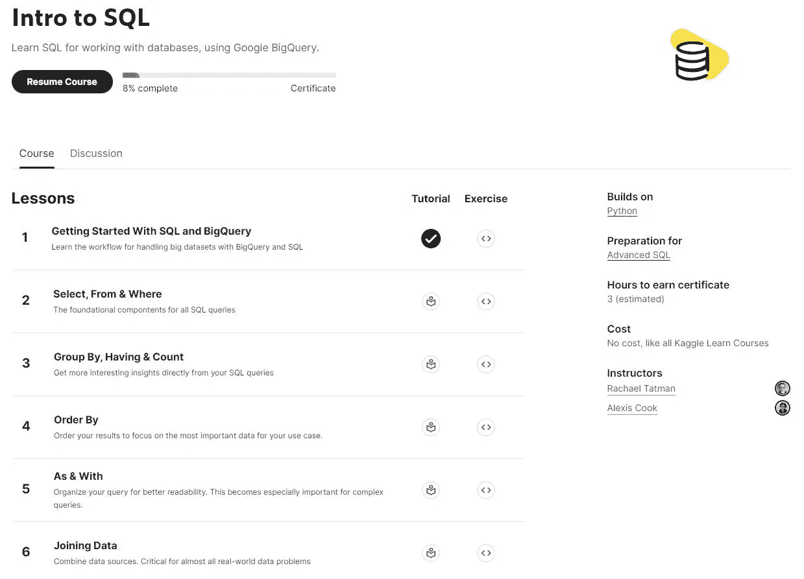
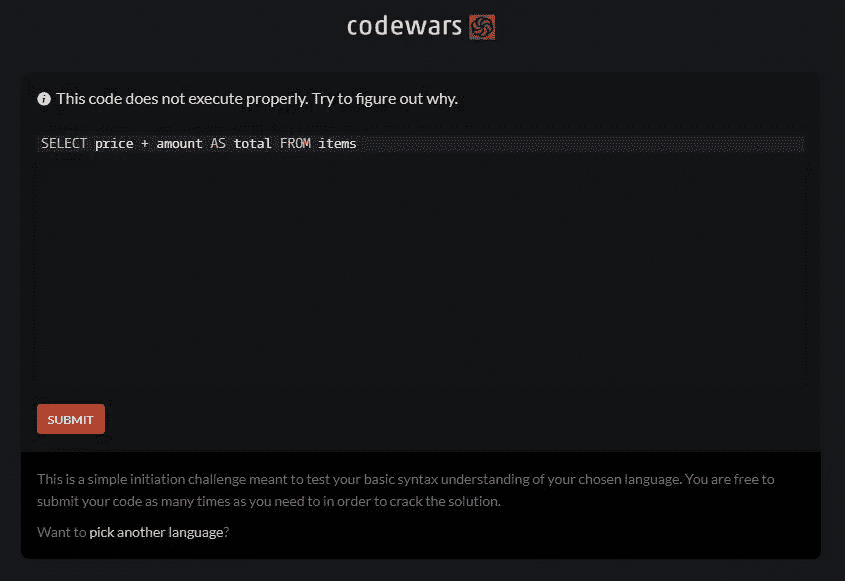
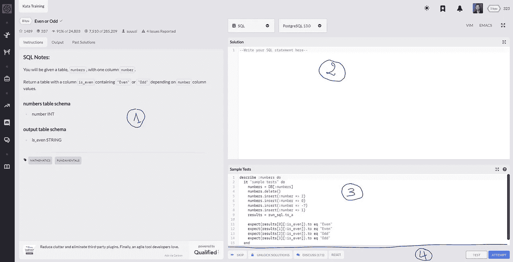
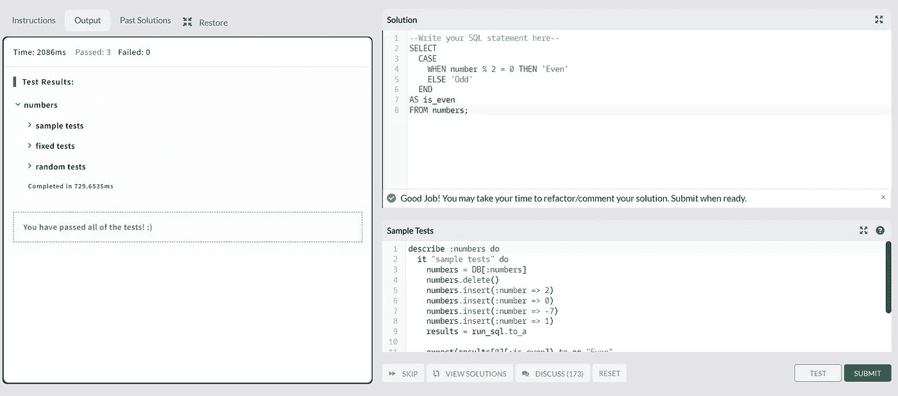
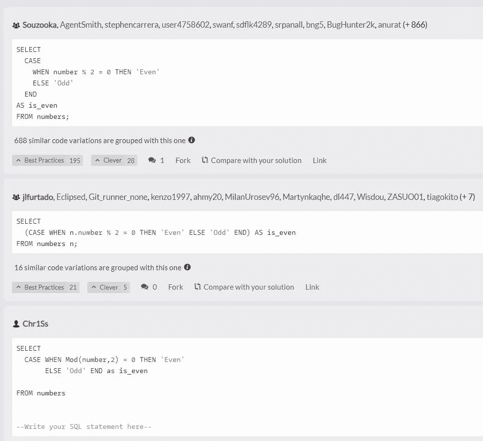

# 如何学习 SQL，每天 10 分钟

> 原文：<https://levelup.gitconnected.com/how-to-learn-sql-10-minutes-a-day-bbe023c01470>

## 这是我作为首席技术/数据保持最新状态的方法。

几乎每个人都必须与数据打交道。虽然您可以利用 Microsoft Excel 或 Google Sheets 等电子表格，但大多数有趣的信息都存储在数据库中。

**当今最常见的数据库结构之一是关系数据库。**与关系数据库齐头并进的是结构化查询语言或 SQL(发音为 S-Q-L 或 sequel)。

事实上，无论你现在从事什么工作，你都被数据包围着。

> 掌握一门“数据”编程语言的基础知识可以为技能和简历带来显著的附加值。

作为一名技术/数据主管，我必须在短时间内帮助许多客户精通 SQL。他们中的大多数人从来没有编写过代码，甚至没有打开过命令提示符(电影中的“终端”！).

> 如果你对学习 Python 感兴趣，我做了一篇“[Python 版](/master-python-10-minutes-a-day-5aeab489e227)”的文章。

如何学习 SQL，每天 10 分钟—学分: [Sunder Muthukumaran](https://unsplash.com/@sunder_2k25?utm_source=medium&utm_medium=referral)

如果你每天花几分钟时间，SQL 是很容易学会的！

无论你是学生、再培训者，还是只是想学习一些基础知识，这篇文章都适合你。

## 1.在 2 小时内学习 SQL 的基础知识

> 如果你已经对 SQL 有了基本的了解，跳到下一章。

首先，在[Kaggle.com](https://www.kaggle.com/)上创建一个账户，转到“课程”部分，做完整个[SQL](https://www.kaggle.com/learn/intro-to-sql)模块。

在 Kaggle 上，你可以免费学习 SQL 的基础知识🚀

您将知道使用 SQL ( *和 Google BigQuery* )的基本要素:

*   [什么是 SQL](https://www.kaggle.com/code/dansbecker/getting-started-with-sql-and-bigquery)；
*   [**所有 SQL 查询的基础组件**](https://www.kaggle.com/code/dansbecker/select-from-where)；
*   [如何用 SQL 汇总数据](https://www.kaggle.com/code/dansbecker/group-by-having-count)；
*   [如何用 SQL 对数据进行排序](https://www.kaggle.com/code/dansbecker/order-by)；
*   如何组织你的 SQL 代码以获得更好的可读性？
*   [如何组合多个数据源](https://www.kaggle.com/code/dansbecker/joining-data)；

> 如果你验证了每个系列的练习，你将会收到一张**证书**，你可以把它放在 LinkedIn 或其他地方。

## 如何在 SQL 中进步并保持最新？

我必须跟上许多技术/技能/生态系统的发展:

*   数据工程(阿帕奇气流、Airbyte、提督)；
*   专业的数据可视化和处理工具(Tableau、Data Studio、Power BI)；
*   系统和服务器管理(Bash、NGINX、安全概念)
*   用于测试、性能、监控、静态代码分析的工具
*   数据收集、操作和处理工具(Excel、Google Sheets)；
*   Python 数据操作库(Matplotlib，Numpy，Pandas，Plotly)
*   机器学习(分类、回归、NLP 基础)

> 但是一个正常构成的人不可能保持在所有这些技术的顶端*🤨*；这是不可能的！

## 如何快速学习并记住一个最大值？

人类的大脑是非凡的；它只需要周期性地重新激活小的记忆来“记忆”大量的知识。

反过来，如果你不更新你的知识，你的大脑会消除它认为无用的东西。

**保持动力，提高记忆回忆，** [**定期做拼图和练习有帮助**](https://en.wikipedia.org/wiki/Kata#Outside_martial_arts) **。**

## 我的 SQL 练习列表可以在 Codewars 上免费获得

要做这些小练习，你不需要在电脑上安装 SQL 你必须登录免费的[Codewars.com](https://www.codewars.com/)平台。

一旦您在列表中注册并选择了 SQL，平台将向您推荐初级水平的第一个“形”:

您的第一个 SQL 挑战！

正如你所看到的，“总数”应该是“价格”乘以金额，而不是两者之和。

因此，要修复代码，您可以将表达式中的“+”替换为“*”，然后就可以访问挑战列表了。

## 如何做一个挑战？

首先，您必须访问[练习菜单](https://www.codewars.com/kata/latest/my-languages)，选择 SQL 作为语言，然后选择其中一个练习。作为第一个例子，你可以从最受欢迎的一个开始，[“偶数或奇数”挑战](https://www.codewars.com/kata/latest/my-languages)。

以下是截至 2022 年 10 月 Codewars 的 UI:

1.  你必须解决的练习的挑战说明；
2.  编辑器界面，您可以在其中编写 SQL 代码；
3.  Codewars 将执行来检查您的代码的测试；

然后你可以通过点击“测试”来尝试一个小系列的测试:

一旦代码看起来正确，点击“测试”。

如果所有的验证测试都通过了，那么我们可以通过点击“尝试”，然后“提交”向社区提交我们的解决方案，并获得一些荣誉(和级别)。

> “测试”和“尝试”之间的区别在于，“尝试”将使您的代码通过一组更具挑战性的有效性测试。

提交您的解决方案或点击“查看解决方案”按钮，以访问社区提出的所有解决方案:

通过阅读别人设计的代码和评论，你会学到很多东西！

一旦你在网站上注册，以下是按类别分类的要做的动作列表:

*   [SQL 基础](https://www.codewars.com/kata/search/sql?q=&tags=Fundamentals&beta=false&order_by=sort_date%20desc)(初学者)；
*   [数据科学](https://www.codewars.com/kata/search/sql?q=&tags=Data%20Science&beta=false&order_by=sort_date%20desc)或[统计](https://www.codewars.com/kata/search/sql?q=&tags=Statistics&beta=false&order_by=sort_date%20desc)用 SQL
*   [与 SQL 的数学运算](https://www.codewars.com/kata/search/sql?q=&tags=Mathematics&beta=false&order_by=sort_date%20desc)；
*   [用 SQL 进行大脑训练](https://www.codewars.com/kata/search/sql?q=&tags=Algorithms&beta=false&order_by=sort_date%20desc)(适合技术面试！) ;

## 提高技能的完美时间表

下面是一个有效的时间表的例子，我和我的学生在短期培训(3 到 5 个月的强化培训)中验证了这个例子:

**第 1 个月**:周一至周六每天 1 " *基础*"形

**第 2 个月**:2*基础*周一至周四每天的形(在[试&重复](https://www.sneci.com/blog/the-kata-method-improvement-adaptation-for-better-results/)“模式”+1“*肌肉你的大脑*”或“*数学运算*”一周内要做的形

**第 3 个月** : 2 统计数据和特定数据的形式(仅当您也需要在这些方面进行改进时)

> 如果你已经精通另一种编程语言，并且乍一看很难用 SQL 实现，要知道 Codewars 上的 Kata 通常可以在几种编程语言中使用。

形的编程语言选择器

你可以先用你喜欢的语言做形，然后用 SQL，并比较结果:这种方法将帮助**你理解编程语言**在基本概念(数组、函数、变量等)上的不同。).

> 对于纯逻辑练习用处不大。

如果你对这个培训时间表有任何疑问，或者其他关于如何快速接受培训的建议，请随时在评论中与我分享，或者[关注我](https://medium.com/@mickael-andrieu/)，我会在发布新文章时通知你！

 [## 通过我的推荐链接加入 Medium-mickal Andrieu

### 作为一个媒体会员，你的会员费的一部分会给你阅读的作家，你可以完全接触到每一个故事…

mickael-andrieu.medium.com](https://mickael-andrieu.medium.com/membership)