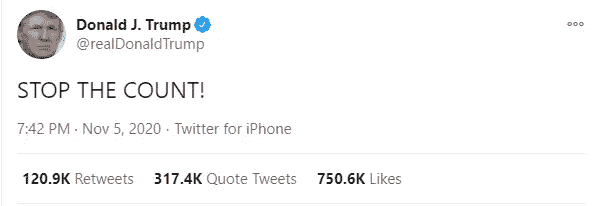
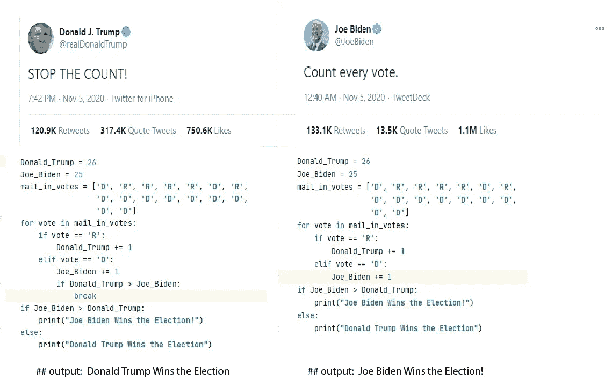

# 如何从唐纳德·特朗普的推文中学习编程(包括代码)

> 原文：<https://levelup.gitconnected.com/how-to-learn-to-program-from-donald-trumps-tweet-includes-code-a35dbc33bce1>

从总统的一条推文中学习一个编程概念。


摄影:Karan Jagota

这篇文章既不是关于唐纳德·特朗普，也不是关于 2020 年美国大选。我只是试图从唐纳德·特朗普的最新推文中创建一个病毒帖子。所以，忍受我吧，就像你一样，忍受他凌晨 3 点的微博。我要求你们每个人把政治放在一边，专注于学习编码概念。



来源:[https://Twitter . com/realDonaldTrump/status/1324353932022480896](https://twitter.com/realDonaldTrump/status/1324353932022480896)

在编程中，在编写循环时，我们经常会遇到这样的情况:我们希望根据某个条件来停止循环。如果以上任何一个词让你感到困惑，那么不要担心！你会在这篇文章中了解到这一切。继续读下去。

要理解这篇文章的其余部分，你需要知道一些事情。如果你没有技术背景，那么你需要知道一些技术编程术语来理解这篇文章的内容。它们如下-

## **数据结构**

它是同一数据类型的数据值的集合。例如，**列表**是一种可以保存多个数据值的数据结构。

```
list = [1,2,3,4,5,6,7,8,910]
```

## **声明**

语句是程序员给计算机并执行它的命令。每个计算机程序都包含计算机以逐行方式运行的多行代码。示例:

```
list = [1,2,3]
```

上面的代码片段是一个告诉计算机在内存中存储一个列表的语句。

## **循环**

循环是给计算机的一个指令，通过它你可以任意多次执行一个或多个语句。

```
list = [1,2,3,4,5]for element in list:
    print element       ## output: 1 2 3 4 5
```

## **引入中断语句**

break 语句是在循环中遇到的语句，循环立即终止，程序控制在循环后的下一条语句处继续。

```
break
```

编程无处不在，我们可以通过各种方式学习，甚至可以从美国第 45 任总统的推特上学习。唐纳德·特朗普不是程序员，我们也不是生活在一个只有计算机和开发人员的世界，但如果我们有，那么这就是唐纳德·特朗普会喜欢的程序。

来源:[https://gist . github . com/karan jagota/f 32 f 89 e 7515216859 CFD 90 b 9 CB 74 B1 a 9](https://gist.github.com/karanjagota/f32f89e7515216859cfd90b9cb74b1a9)

上面的代码片段基本上是不言自明的。这使得唐纳德·特朗普成为 2020 年总统大选的赢家。然而，如果我们想以编程的形式可视化候选人的 tweet，那么我们可以在如下图所示的代码中实现。



Karan Jagota 摄

## 外卖食品

我再次尊重两位总统候选人以及他们各自的支持者。我无意伤害任何人的感情。我只是试图创建一个帖子来解释和帮助初露头角的开发人员更有计划地看待事情。请把政治放在一边，专注于学习。

请在推特上告诉我你对这个话题的想法。我很想和 dev 好好谈谈。链接:[https://twitter.com/IamKaranJagota](http://Again, I respect both the presidential candidates along with their respective supporters. I have no intent to hurt anyone's feelings. I am just trying to create a post explaining and helping budding developers to see things more programmatically. Please, keep the politics aside and focus on learning.   Do let me know your thoughts on the subject on Twitter. I would love to have a good dev conversation. Link to my profile: https://twitter.com/IamKaranJagota)