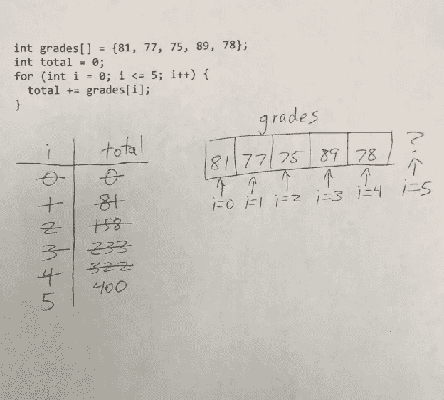

# 如何学习编程:阅读程序模板

> 原文：<https://levelup.gitconnected.com/how-to-learn-to-program-reading-program-templates-f795b6ebc3bc>


# 识别模板使你成为更专业的程序员

学习计算机编程的顺序教学方法的第三步是学习如何阅读程序模板。模板是一组表示通用代码使用模式的编程指令。模板提供了一种从学习如何编写代码到能够使用程序解决问题的方法。成为一名专业程序员需要学会识别何时应该使用特定的模板来解决问题。

# 编程模板的示例

模板的第一个例子是“变量交换”。该模板如下所示:

1.  给你两个带值的变量。
2.  引入一个临时变量，并将第一个变量的值赋给它。
3.  将第二个变量的值赋给第一个变量。
4.  将临时变量的值赋给第二个变量。

当您需要交换两个变量的值时，这个模板可以应用于任何情况。这种情况在排序应用程序中最常见，但在其他情况下也会发生。

另一个模板例子是“读取一个，处理一个”。模板定义为:

1.  从用户或数据结构中获取值。
2.  用该值执行一些计算。
3.  回到步骤 1，直到没有更多数据或用户选择停止。

该模板可用于多种情况。一种是当你需要读取一个数组的元素来执行一些任务时，比如寻找存储在数组中的一组测试分数的平均值。另一个例子是，当您希望提示用户输入一定迭代次数的数据，或者直到用户使用 sentinel 值选择退出。

第三个模板示例是“最大/最小”。该模板用于查找一组数据的最大值和/或最小值。该模板如下所示:

1.  使用 if 语句将第一个值与数据集中的其他值进行比较。
2.  如果还有其他值要检查，则跳过检查的第一个值，对其他值重复步骤 1。
3.  如果没有其他要比较的值，则达到 else 条件。

在搜索或排序数据时，此模板在许多情况下都会用到，也是让学生练习使用布尔逻辑的好模板。

# 如何练习阅读代码模板

学生通过查看模板并确定它们是否被正确实现来练习阅读代码模板。如果模板没有正确实现，学生需要能够找出代码写错的地方，并纠正它，以便模板按照预期的方式工作。

以下是 Python 中一个不正确的变量交换程序示例:

```
number1 = 1
number2 = 2
temp = number1
number2 = number1
number1 = temp
```

然后学生在程序上做一个变量追踪，发现数字 1 和数字 2 都以相同的值-1 结束。

为了正确地解决问题，学生需要看到在第一个变量的值被赋给临时变量之后，第一个变量需要获得第二个变量的值，第二个变量获得临时变量的值。代码应该如下所示:

`number1 = 1
number2 = 2
temp = number1
number1 = number2
number2 = temp`

下面是来自另一个模板的示例—处理一个数组的所有元素，这次是用 C++编写的，这段代码也写得不对:

```
int grades[] = {81, 77, 75, 89, 78};
int total = 0;
for (int i = 0; i <= 5; i++) {
 total += grades[i];
}
```

当在这个程序上完成一个变量跟踪时，包括画出数组，学生们会看到循环超出了数组的上限并访问了未初始化的数据。下面是这段代码的跟踪结果:



在 C++中，这不是一个错误，total 的值会被存储在程序试图访问的内存位置的任何数值数据(我称之为垃圾数据)所修改。学生需要有阅读代码的经验，才能理解为什么会出现这种错误。

# 用英语描述程序模板

我和学生一起做的另一个练习是让他们阅读实现模板的代码，并让他们描述代码的作用。对于我的学生来说，这是一个非常大开眼界的练习，因为他们发现对模板和/或代码的了解很少，很难写出好的描述。

以下 Python 代码实现了一个数字处理模板，该模板将一个数字分解为其组成数字:

该程序的示例描述如下:

这是一个数字提取程序。该程序通过计算一个数除以 10(模数)后的余数，然后将该数除以 10 来永久删除该数字，从而将该数分解为单个数字。因为 Python 做浮点除法，所以在执行除法运算时，结果必须先转换成整数，然后再存储回数字中。程序循环，直到数字达到 0 或负数。

让学生写出程序描述的过程有助于在学生的头脑中确定程序的含义。我甚至经常让我的学生把这些写在纸上，而不是打出来，因为最近的研究表明，手写事实比打字更有助于学生记忆，因为打字往往会导致打字员在打字时让单词从他们的手指间流过，而不是注意单词在说什么。

# 程序模板是大量的专业知识

专业领域的研究人员早就发现，专家通过“分块”他们领域中的重要模式而成为专家。经典的例子是国际象棋大师花费数小时研究的棋盘位置块。通过一遍又一遍地研究这些位置，棋手将能够在象棋比赛中需要时非常迅速地回忆起它们。

同样，程序模板是编程的棋盘位置块，尤其是对于初级程序员，当他们过渡到中级和高级专业水平时。通过学习阅读和理解程序模板是如何工作的，学习型程序员可以使用这些模板来更快地解决问题和提高编程效率。

阅读和理解程序模板是学习计算机编程的顺序教学方法的第三步。第一步是学习阅读代码，第二步是学习根据一组清晰的指令编写代码。序列中的最后一步是学习将程序模板应用于独特的情况，我将在以后的文章中讨论这一步。

*原载于 2020 年 2 月 21 日 https://thelearningprogrammer.com*[](https://thelearningprogrammer.com/how-to-learn-to-program-reading-program-templates/)**。**