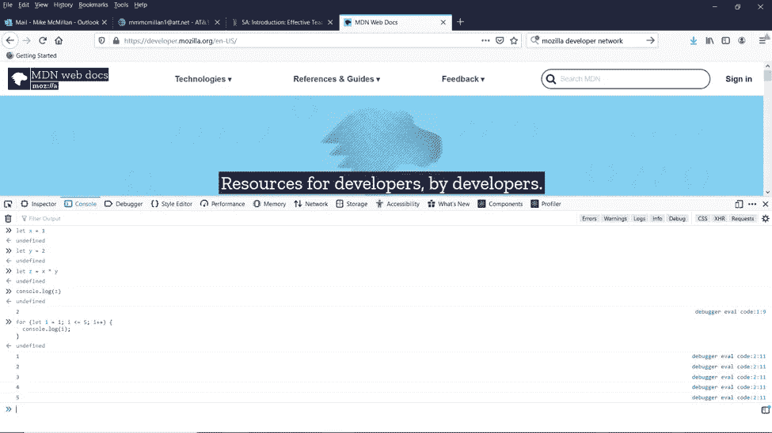
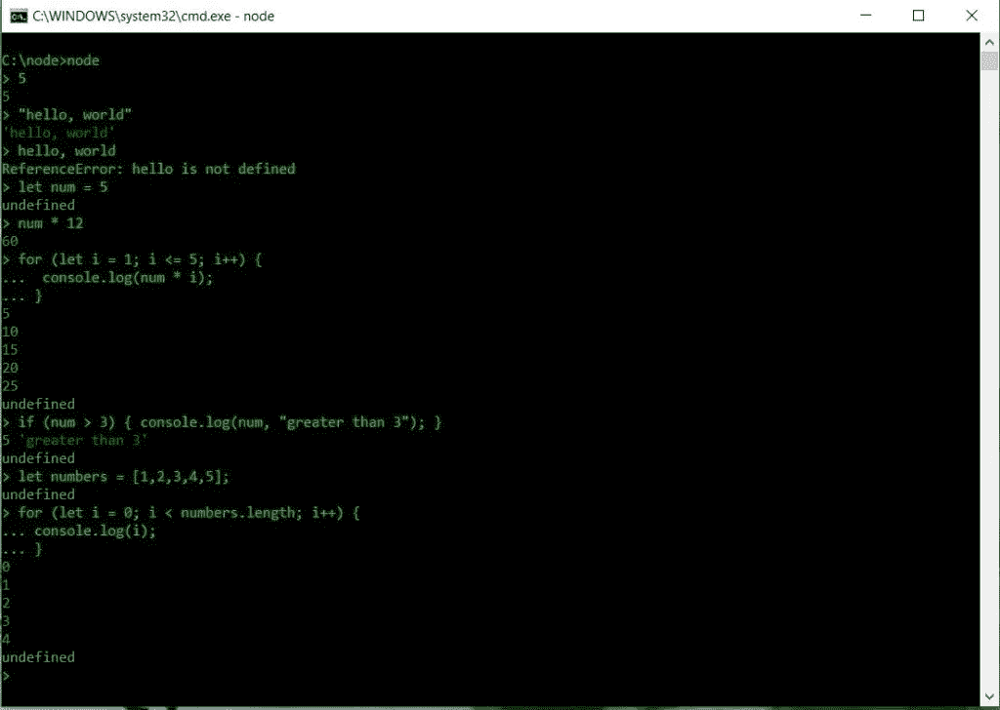
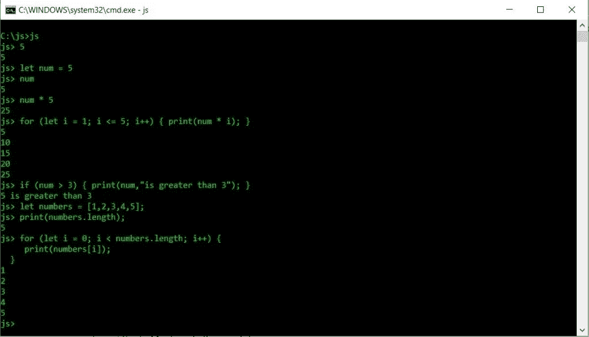
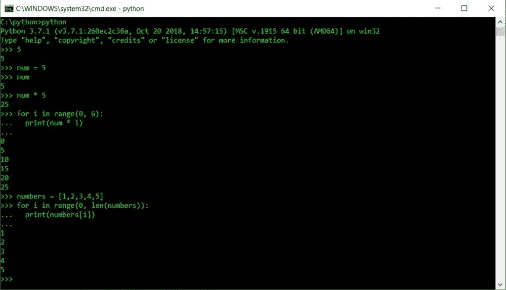
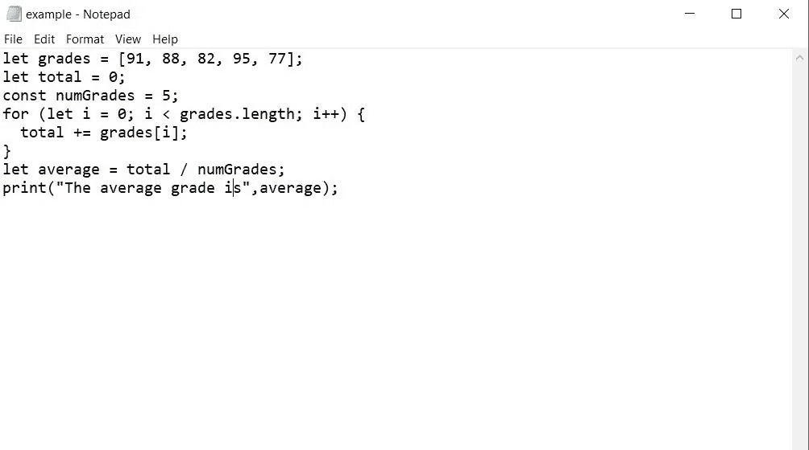
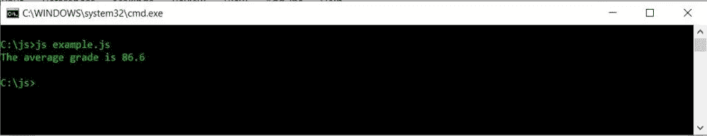
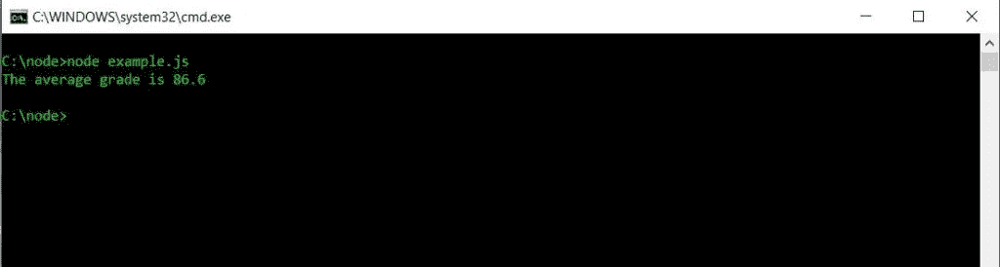
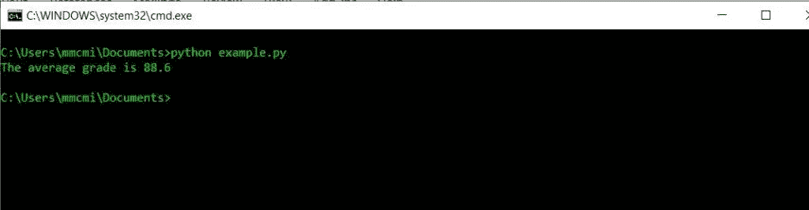

# 如何学习编程:从解释型语言开始

> 原文：<https://levelup.gitconnected.com/how-to-learn-to-program-start-with-an-interpreted-language-b9b680158586>


所以你想学习如何写计算机程序？你从哪里开始？你先学什么语言？在本文中，我将建议您从一种解释型语言开始，这种语言有一个 shell 程序(也称为 REPL ),您可以用来练习。

# 什么是外壳程序？

shell 程序是一种允许您在终端中键入编程语句并立即接收这些命令的输出的程序。Shell 程序也称为 REPLs，代表读取-评估-打印-循环。换句话说，REPL 是一个程序，它读取编程语句，评估(执行)它们，打印它们的输出，然后循环返回，以便您可以输入另一条语句。

Python 和 JavaScript 等语言都有 shell 程序，可以用来练习编写程序。这是因为 Python 和 JavaScript 都是[解释语言](https://en.wikipedia.org/wiki/Interpreter_(computing))，为解释语言实现 shell 程序是很常见的。

像 C++和 Java 这样的编译语言，没有语言自带的复制器，但是你可以购买单独的 REPL 程序。但是，我建议您从 Python 或 JavaScript 开始您的编程教育，因为解释型编程语言通常比编译型语言更容易学习，所以让我们看看如何获得这两种语言的 REPLs。

当我在许多年前黑暗的第一台 PC 时代开始我的编程教育时，几乎每台 PC 都有一个 BASIC 解释器，其中一些将解释器安装在 ROM 中。你只要启动计算机，你就立即进入了 shell 程序。我仍然记得，拿着课本坐在电脑前，开始输入基本语句，看看会发生什么是多么容易。每个人都应该这样学习编程。

# Python 和 JavaScript 外壳程序

当你下载 Python 语言时，你会自动得到一个 shell 程序。要使用它，只需打开一个命令提示窗口并键入`python`。您将看到一条简短的消息，然后会出现 Python shell 程序提示:

```
>>>
```

Python shell 现在正在等待您输入 Python 语句来进行评估。在本文的后面，我将向您展示如何使用 Python shell。

获得 JavaScript 的 REPL 有点困难。JavaScript 世界中一个非常受欢迎的选择是一个名为 Node.js 的程序。Node 是一个用于创建 JavaScript 应用程序的系统，但是当你下载 Node 时，你还会得到一个 JavaScript REPL。进入 Node 的[主页](https://nodejs.org/en/)下载 Node。安装完成后，您可以通过在命令提示符下键入`node`来启动 shell 程序。程序加载后，您会看到如下提示:

```
>
```

现在您可以开始输入 JavaScript 语句，并让 shell 程序解释它们。

JavaScript 的另一个选择是 SpiderMonkey shell 程序。这个 shell 程序是由 Mozilla (Firefox)开发的，它也可以解释 JavaScript 代码，但是有一些与 Node 不同的特性。你可以在这里找到蜘蛛猴外壳程序[。在您下载了适合您的计算环境的 shell 程序后，您可以通过键入“js”来打开 shell 程序。shell 提示符如下所示:](https://archive.mozilla.org/pub/firefox/nightly/latest-mozilla-central/)

```
js>
```

您已经准备好开始输入 JavaScript 语句了。

使用 JavaScript 解释器的第三种方法是打开一个 web 浏览器，找到该浏览器的开发工具选项。那里会有某种类型的解释器，您可以使用它来执行 JavaScript 语句。下面是 Firefox 使用的 JavaScript 解释器的屏幕截图:



# 示例外壳交互

下面是一些屏幕截图，展示了一些与 Spidermonkey、Node 和 Python shell 程序交互的例子，顺序如下。



从这些例子中可以看出，与 shell 的交互非常简单和直观。只需输入想要执行的语句，就可以立即在 shell 中看到结果。

# 编写 Shell 脚本

JavaScript 和 Python shell 程序也允许您编写所谓的 shell 脚本。shell 脚本是一个写在文本文件中的程序，然后交给程序解释器运行。一旦您使用 shell 程序掌握了一门语言，您就会想转而使用 shell 脚本来编写更复杂的程序。

下面是一个为 Spidermonkey 编写 shell 脚本的例子。我在 Windows 环境下工作，所以我做的第一件事就是打开记事本(请不要妄加评论)，输入我的程序。我必须确保在保存文件时，按照 shell 的要求，用. js 扩展名保存它。以下是文本文件的屏幕截图:



下一步是从命令行执行脚本。下面是一个屏幕截图:



我可以使用 Node 执行相同的程序，只是我需要将打印功能更改为 console.log，因为 Node 不使用打印功能。以下是屏幕截图:



我可以用 Python 做同样的事情。首先，在文本编辑器中创建一个 Python 程序，并确保用. py 扩展名保存它。如果你要复制我的程序，你需要做一两处修改，但是我会把这些作为练习留给你，就像任何一个好的老师会做的那样。然后用脚本文件的名称调用 shell 程序。下面是一个屏幕截图:



# 在线口译环境

您可以使用几个在线 JavaScript 和 Python 解释器。只需搜索基于网络的 JavaScript 或 Python 解释器，你就会看到几个可以用来在线探索这些语言的网站。我最喜欢的托管许多不同语言的网站之一是 [repl.it](https://repl.it/) 。我鼓励你去探索他们的网站，和那里的许多解释者一起玩。该网站还提供在线编译器，您可以使用这些编译器来学习编译语言，如 C++和 Java，而不必下载和安装编译器和/或 IDE 来编写、编译和运行程序。

# 为什么要从翻译开始？

与先学习编译语言相比，先学习解释型编程语言有几个优点:

1.  一个解释器可以让你输入一条语句并立即看到结果。每次你想评估一个程序时，编译器会强迫你经历编辑-编译-编译-运行的循环。
2.  解释语言的语法比编译语言更加用户友好。例如，Python 不需要花括号来指定代码块(它使用缩进)，Python 语句也不必以分号结尾。
3.  输入语句和查看结果的简易性鼓励了探索，因为没有这么长的程序开发周期(参见上面的原因 1)。
4.  一些编程概念首先使用解释器更容易演示。例如，当我教我的学生文字对自身求值时，很难用编译语言来证明这一点。有了解释器，学习者可以简单地在 shell 中键入一个文字值，然后看到 shell 只返回这个值。另一个例子是操作顺序。学习者可以修改算术语句中的操作顺序，并看到即时的变化，而无需经历编译周期。

# 用解释器学习编程

如果你刚开始学习编程，选择一门有你可以使用的 shell 程序的语言。学习编程的最好方法是探索这种语言可以用简短的程序做什么，逐步建立更难、更复杂的程序。使用 shell 程序可以很好地做到这一点。如果您正在学习 C++或 Java，请寻找我在本文前面提到的 shell 程序。

最重要的是开始。开始写程序，现在就开始。

*原载于 2020 年 2 月 15 日 https://thelearningprogrammer.com*[](https://thelearningprogrammer.com/how-to-learn-to-program-start-with-an-interpreted-language/)**。**