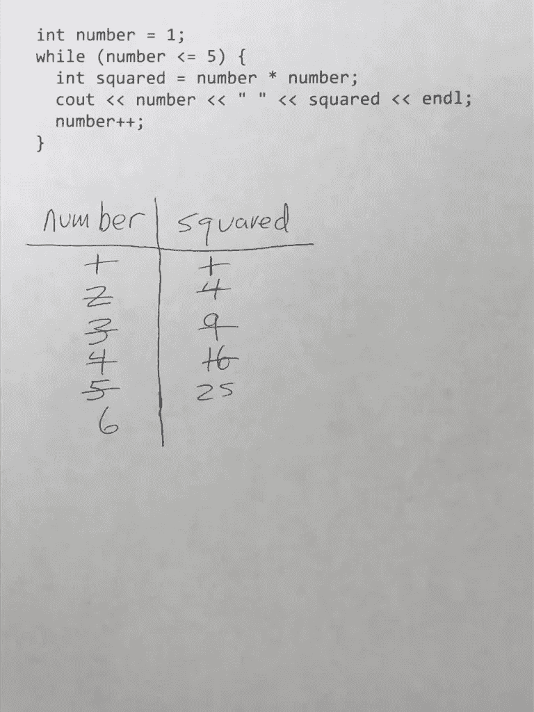
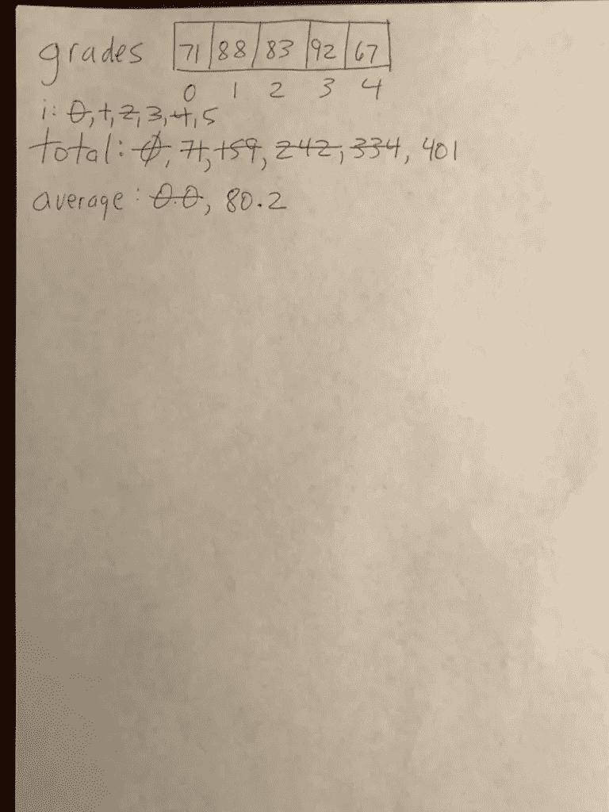
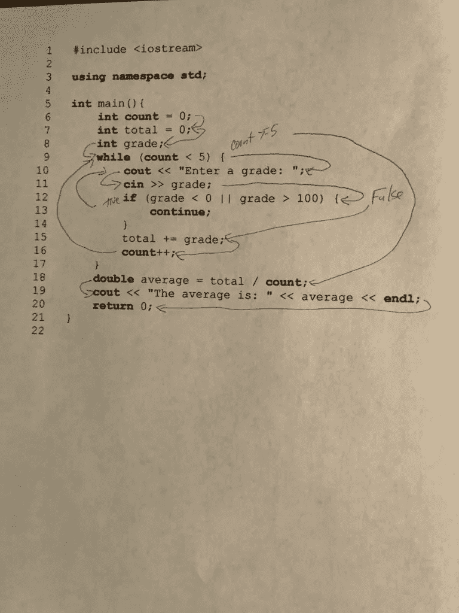
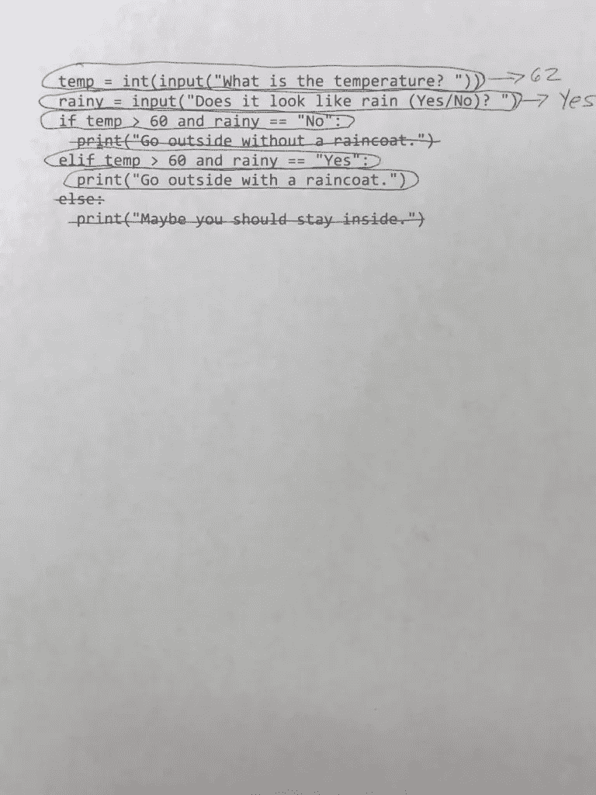
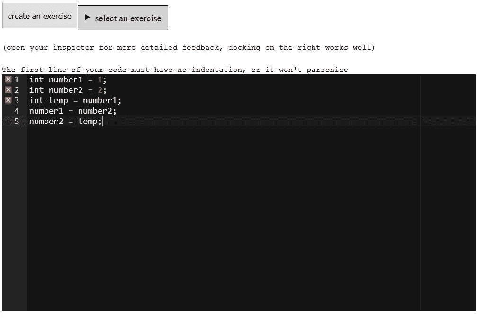
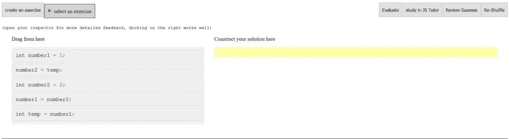
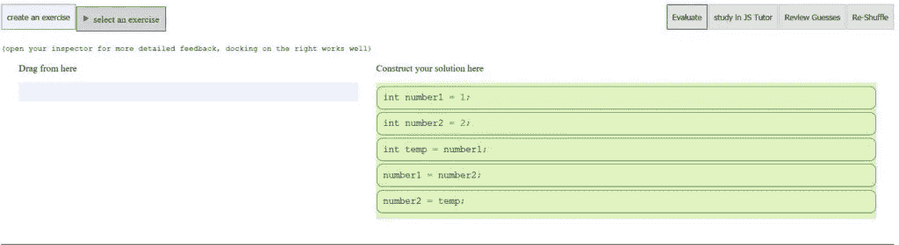

# 如何学习编程:变量和程序跟踪

> 原文：<https://levelup.gitconnected.com/how-to-learn-to-program-variable-and-program-tracing-f8249d997c5c>

学习任何新的编程结构都有四个主要步骤。第一步是通过跟踪变量和代码来学习如何阅读代码。第二步是从伪代码编写代码。第三步是学习如何阅读代码模板，比如交换两个变量的模板或者测试一个值是否在可接受的范围内的模板。第四步是能够将学到的代码模板应用于独特的问题。

华盛顿大学的一组研究人员在一篇论文中把这些步骤列为顺序教学理论。这篇论文的主要作者是 Benjamin Xie，你可以在的网站上找到这篇论文。

在本文中，我将讨论编程指导理论的第一步——通过练习变量和代码跟踪来学习如何阅读代码。

# 为什么学习如何跟踪代码很重要

变量和代码跟踪(程序跟踪)用于教导学生如何阅读程序，并通过能够从程序开始到程序结束跟踪控制流来准确预测其行为。在谢、*等人、的论文中，作者声明跟踪代码是一种不同于编写代码的技能，并且是在学习编写代码之前必须掌握的技能。如果一个学习者没有掌握阅读代码和预测代码的行为，就不能指望他写出原始代码。教授这项技能的一个好方法是跟踪代码，包括变量和整个程序。*

# 变量跟踪

有几种方法可以练习变量跟踪。一种方法是在程序上执行变量跟踪。这种技术通常在课程的最开始教授，因为学生们被介绍程序如何处理算术语句。例如，下图显示了一个示例 C++ while 循环和一个变量跟踪，其中写下变量的新值，然后在变量获得新值时标记出来:

一个更复杂的问题可能需要学生演示如何在计算中使用数组数据。给定这个 JavaScript 程序:

`let grades = new Array(71, 88, 83, 92, 67);
let total = 0;
let average = 0.0;
for (let i = 0; i < grades.length; i++) {
total += grades[i];
}
average = total / grades.length;
print("The average grade is", average);`

这个例子演示了在程序执行时显示变量及其更新的另一种方式。

# 程序跟踪

程序跟踪让学生指出程序中的控制流程，有时通过画箭头来指出流程，有时通过圈出已执行的行或标出未执行的代码行。我们将在本节中查看所有这些示例。

第一种类型的程序跟踪是绘制箭头来指示程序中的控制流。下图演示了如何显示一个程序的控制流，该程序有一个循环和循环内的一个`if`语句:

跟踪程序的另一种方法是圈出执行的程序行，并标出不执行的程序行。下面是一个在涉及`if-else if`语句的程序中使用这种技术的例子:

该程序轨迹表明第二个`print`语句将被执行，因为温度在 60 度以上，而外面正在下雨。

这些类型的练习要求学生通过理解程序结构如何影响程序的控制流来学习如何预测程序的行为。

# 帕森斯问题

帕森斯问题是一组混乱的代码行，学生必须按照正确的顺序排列，这样程序才能正确执行。这些类型的问题非常适合用来判断学生阅读代码的能力。事实证明，它们在教授编程方面比编写代码或修复现有代码中的错误更有效(参见这篇[论文](https://dl.acm.org/doi/10.1145/3141880.3141895))。

这是一个简单的帕森斯问题的例子，涉及到使用帕森斯问题生成器的变量交换。第一个屏幕截图是代码顺序正确的程序:

然后单击 Generate an Exercise 按钮，代码被混在一起，放入块中，如下所示:

然后，学生将方块拖到右边的空白区域，然后点击“评估”按钮，查看他们的答案是否正确，如下一个屏幕截图所示:

帕森问题是测试代码阅读知识的一种有趣和不同的方式，需要在计算机科学教育中找到更大的作用。我将在以后的文章中详细阐述为什么帕森斯问题如此有效。

# 阅读代码先于编写代码

正如 Benjamin Xie 和他的合著者在论文[计算机编程入门指导理论](http://benjixie.com/publications/)中所述，当学生通过使用各种跟踪技术首先接触代码阅读时，他们会更好地学习编程。通过代码和变量跟踪练习阅读代码和参与实践练习，以及学习如何识别代码错误，帮助学生在首次尝试编写程序之前更好地理解代码的工作原理。当今计算机编程教育的一个主要缺点是，教师让学生在第一天就开始写代码，这对新程序员来说太快了。

初学编程的学生在开始编写自己的代码之前，需要学习阅读代码，理解它的含义、工作原理、如何识别程序中的错误以及它为什么工作。

一旦学生开始写代码，他们需要慢慢地开始，在开始处理更难的问题之前，采用清晰的、类似英语的指令，并将这些指令转化为工作代码。这一步是我下一篇文章的主题。

*原载于 2020 年 2 月 17 日 https://thelearningprogrammer.com***。**