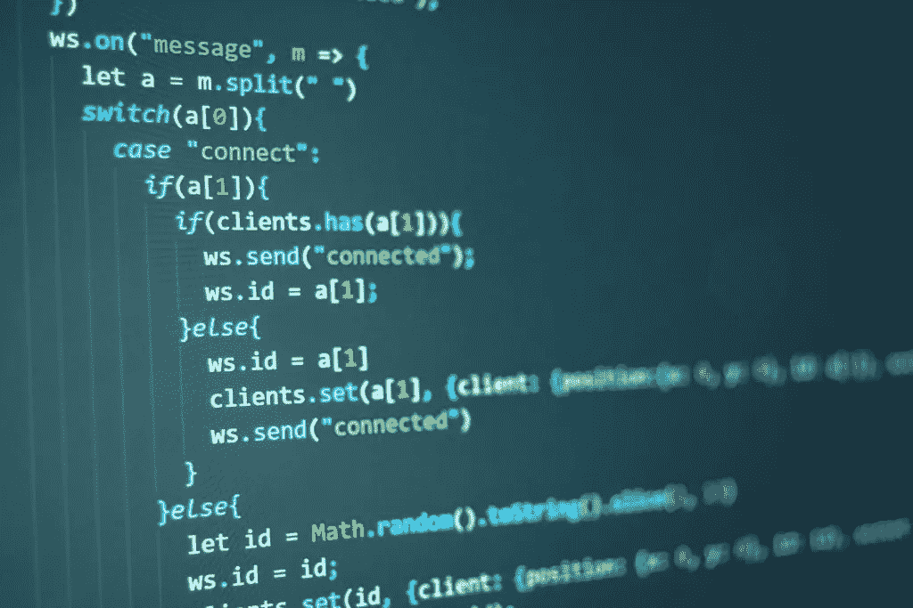

# 如何学习编程:写代码

> 原文：<https://levelup.gitconnected.com/how-to-learn-to-program-writing-code-8bd178219977>



# 在你能读代码之前，你不能写代码

顺序教学[方法](https://www.tandfonline.com/doi/abs/10.1080/08993408.2019.1565235?journalCode=ncse20)教授编程的四个步骤是:1)阅读和理解代码；2)写代码；3)阅读和理解程序模板；以及 4)将程序模板应用于独特的情况。我在以前的[文章](/how-to-learn-to-program-variable-and-program-tracing-f8249d997c5c)中讨论了这个过程的第一步，在本文中，我将深入到第二步:根据简单、清晰的指令编写代码。

# 从阅读代码到编写代码的转变

许多编程和教科书作者在教授初级程序员时犯的一个错误是让学习者过早地开始编写代码。初学编程的人需要花大量时间阅读代码，并学会在看到代码执行之前预测代码序列的行为。

学习如何阅读代码应该通过编程结构来分解，比如`if`语句和不同类型的循环。例如，在期望学习者编写有效的`while`循环之前，他们应该在许多不同的情况下多次练习阅读`while`循环和跟踪代码，例如计数控制循环和哨兵控制循环。只有在通过多次跟踪来练习循环之后，学习者才有足够的经验来理解循环的行为，从而能够开始编写他们自己的有效循环。

当学习者过早开始编写代码时，他们就会在代码中遇到错误。如果他们没有阅读足够的编程构造中的代码来理解该构造应该如何形成，他们将会收到语法错误。然后，如果他们没有通过代码阅读来预测编程结构的行为的经验，当他们试图使用该结构编写程序时，他们的代码中就会出现逻辑错误。

# 学习编写代码

在学习者发展的这个阶段，学习编写代码包括获取清晰、简单的指令，并将它们翻译成程序。

下面是一个涉及变量交换的清晰、简单的指令示例:

*   将 x 和 y 声明为变量，并将它们分别设置为值 1 和 2。
*   将 temp 声明为第三个变量，并将其值设置为 x。
*   将 x 的值设置为 y。
*   将 y 的值设置为 temp。
*   显示 x 和 y 的新值。

学习程序员应该能够把这些指令翻译成一个工作程序。下面是 Python 的翻译:

下面是学习 if-else 结构时可以使用的另一个示例:

*   提示用户输入一瓶汽水的价格。
*   如果碳酸饮料的价格低于或等于 2 美元，那么推荐购买碳酸饮料。
*   如果碳酸饮料的价格高于 2 美元，那么建议不要购买碳酸饮料。

以下是用 JavaScript 翻译的内容(使用 Spidermonkey shell):

```
putstr("Enter the price of a soda: ");
let price = parseFloat(readline());
if (price <= 2.00) {
 print("You can buy the soda.");
}
else {
 print("Do not buy the soda.");
}
```

# 用于理解的注释代码

虽然程序员之间对于何时注释代码以及注释多少有一些争议，但是学习中的程序员应该经常写注释。他们应该这样做来证明他们对所写内容的理解。

每一行代码都应该有一个注释来表达程序员认为那一行代码应该做什么。下面是一个例子，说明学习者应该如何在程序中使用注释，该程序利用 while 循环对用户输入的数字求和:

```
# set accumulator to zero
total = 0 
# counter to control loop starts at 1
count = 1 
# loop condition tells how many times to iterate
while count <= 10: 
 # prompt the user to enter a number
 print("Enter a number:", end=" ")
 # get number as string from user
 number = input() 
 # convert number to integernumber = int(number) 
 # add number to the total
 total = total + number
 # increment the count by 1 so loop will stop 
 count = count + 1 
# display the total
print(total)
```

当然，有经验的程序员绝不会在他们的程序中加入如此明显的注释，但是学习型程序员需要让他们的意图变得清晰，无论是对他们自己还是给他们反馈的人。

尽管评论可以放在一句话的末尾，但我更喜欢学习者把评论放在句子的前面。这迫使他们陈述下一条语句要做什么，然后他们就可以写这条语句了。

最终，随着学习程序员变得更有经验，我允许他们从代码中删除他们已经证明熟练的结构的注释。然而，当他们学习一个新的构造时，他们的第一次编码尝试必须包括每个语句的注释。

# 注释对于理解错误很重要

我让我的学生在每一行之前写下评论，这样我可以检查他们的意图。这样，我可以更容易地确定错误是由语法的误用或误解引起的，还是由程序逻辑的误用或误解引起的。

另一种说法是，注释允许我快速判断学生是否理解使用编程构造的目的，以及/或者学生是否不理解如何正确地构造该编程构造。在这种情况下，我让学生回到第一步，让他们做更多的变量和程序跟踪，直到他们有信心理解这个构造是如何工作的。

但是评论不仅仅是给老师的。当学生开始学习如何编写代码时，先写注释可以让他们思考他们要做什么，并确保他们理解他们试图解决的问题。

# 记忆语法模板很重要

从代码阅读阶段到代码编写阶段，如果有必要，我让我的学生学习并记住他们正在学习的每个结构的语法模板。这一点很重要，因为当他们编写代码时，如果他们记住了某个结构的语法模板，他们就已经知道如何从语法上形成该结构，并且他们可以专注于使用它来解决问题。这减少了认知负荷，也减少了学生在代码编写阶段犯语法错误的机会。

关于语法模板，我已经单独写了[和](/learning-how-to-program-creating-syntax-template-chunks-b9d50893cf2d)，但是这里有一些流行语言的例子:

**for 循环— C++:**

```
for (init-variable; condition; variable-mod) 
{
 statements;
}
```

**while 循环— Python:**

```
while (condition):
  statements
```

**函数(繁体)— JavaScript:**

```
function function-name (parameter list)
{
 statements;
 return statement;
}
```

当这些模板被记住后，学生可以集中精力使用它们，而不必回忆它们是如何形成的。我每天在课结束的时候都会对我的学生进行语法模板的测试，就像我初中的公民学老师曾经在每节课结束的时候对我们进行州议会的测试一样。

# 代码编写只是这个过程中的第二步

学习编写代码对于任何一个初学编程的人来说都很重要，但这只是四步过程中的第二步。首先，学习程序员需要知道如何阅读和解释(非技术意义上的)代码。接下来，他或她需要学习如何根据清晰、准确的指令编写代码。第三步，也是本系列的下一篇文章，是能够为他们正在学习的构造应用一个通用代码使用模板。最后，学习程序员需要能够将这些模板应用于独特的问题。

一旦学生达到第四阶段，他们就可以进入更高级的编程主题，如算法、数据结构和面向对象编程。

*原载于 2020 年 2 月 19 日 https://thelearningprogrammer.com**的* [*。*](https://thelearningprogrammer.com/how-to-learn-to-program-writing-code/)