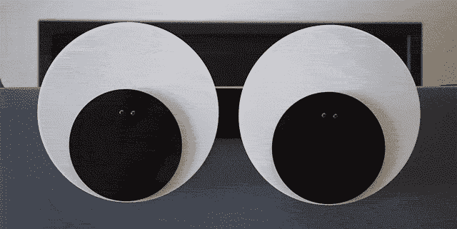
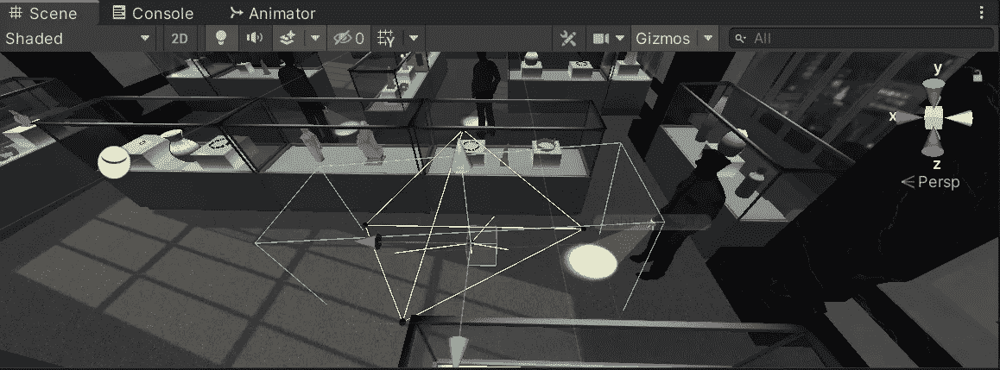
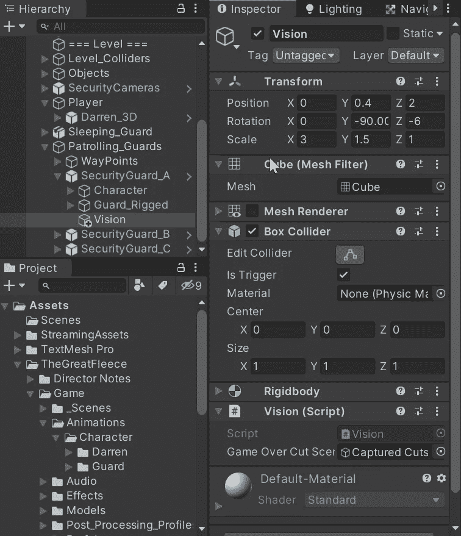
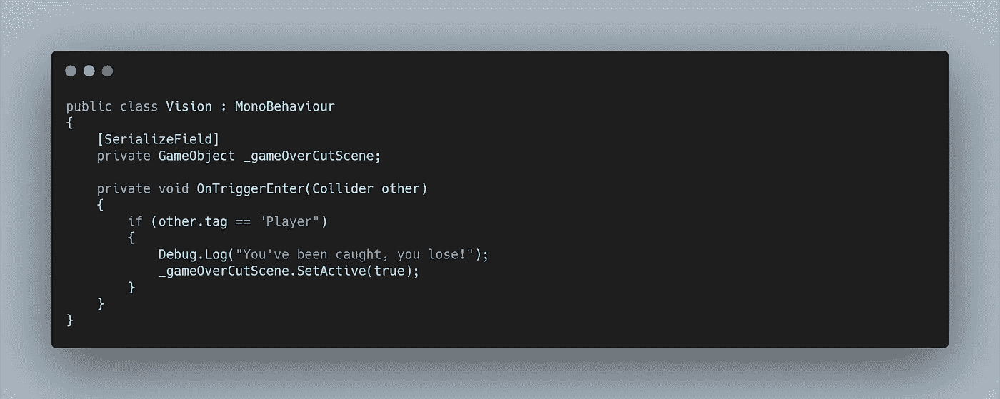
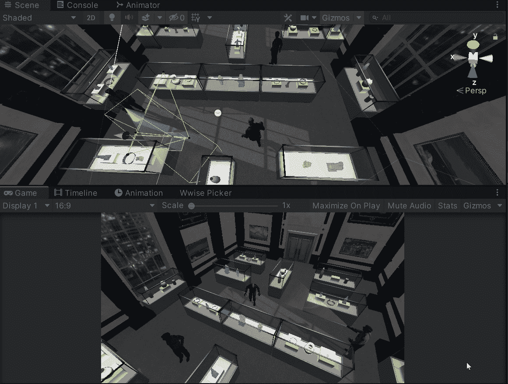

# 如何让我们的 AI 看到！

> 原文：<https://levelup.gitconnected.com/how-to-let-our-ai-see-bd81719a6f06>

昨天，我们使用**导航代理为我们的 **AI** 控制的守卫创建了路径点。**今天，我们要给他们光明！我们希望守卫能够检测到**玩家**，并通过过场动画触发我们的游戏。

要设置这个，我们可以创建一个**立方体**并在每个防护中创建子立方体。禁用**网格渲染器**并添加一个**盒子碰撞器**允许我们创建一个模仿手电筒光线的盒子区域，这将作为一个**触发器。**

为了创建功能，我们需要创建一个**脚本。**在这个脚本中，我们获取了一个对我们想要启用的过场动画的引用，然后我们简单地使用 **Unity 的 OnTriggerEnter 方法**来检测碰撞。如果与玩家发生冲突，我们可以激活过场动画。

