# 如何利用 Xcode 的构建配置

> 原文：<https://levelup.gitconnected.com/how-to-leverage-xcodes-build-configurations-5516ac3743e4>

## 为不同的构件类型更改 iOS 应用程序图标

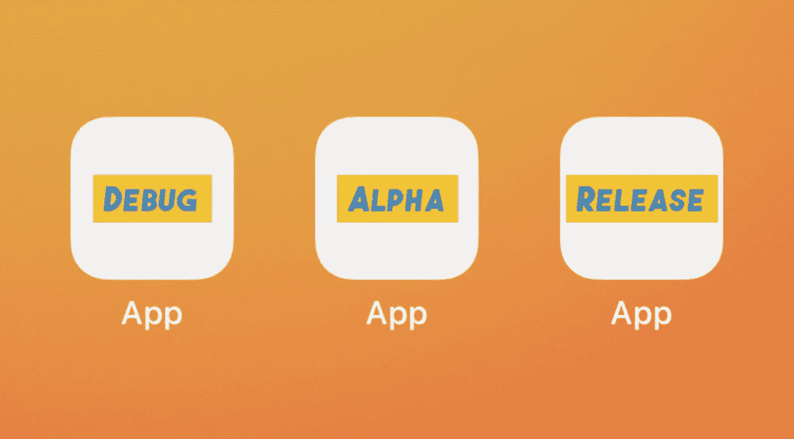

在本教程中，我们将学习如何构建 iOS 应用的三个版本——调试、alpha 和发布。我们还将为每个应用程序使用不同的图标，以便更容易区分它们。

这是您在本文结束时将学到的内容:

*   如何在 Xcode 中创建构建配置？
*   如何在构建配置中引用三组应用程序图标。
*   如何在您的设备上安装同一应用程序的多个版本类型。

事不宜迟，我们开始吧。

# 我们开始吧

我们从一个名为“App”的空项目开始:

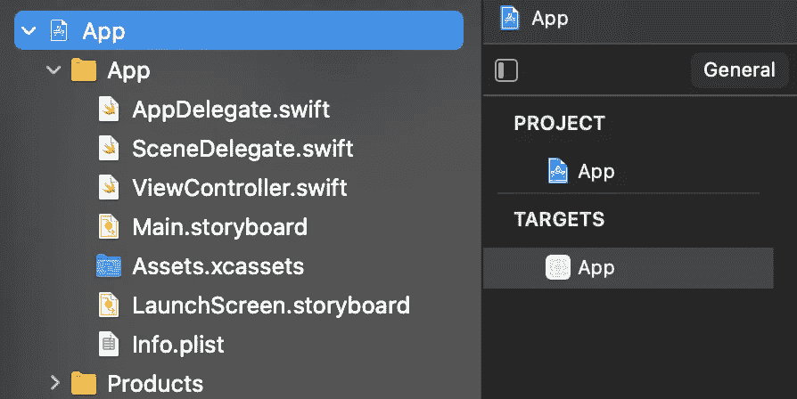

我们的第一步是点击“项目”标题下的“应用程序”:

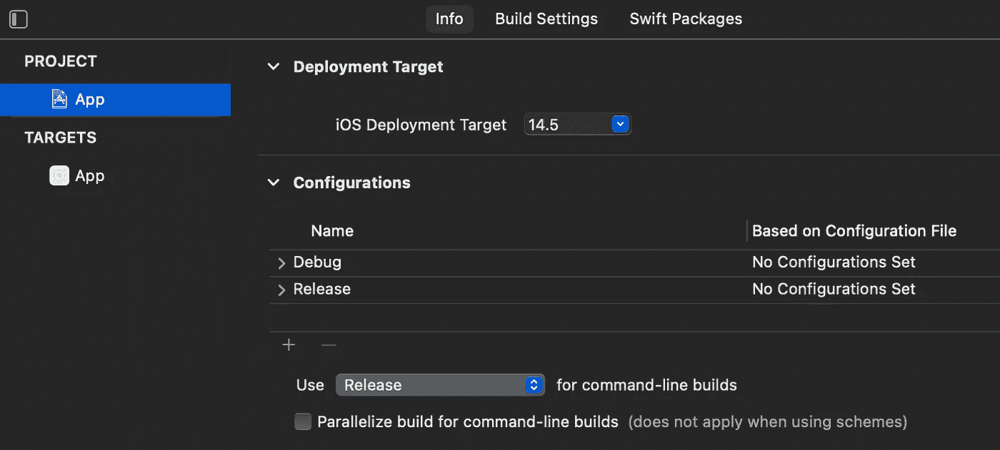

这里我们看到 Xcode 已经为我们提供了“调试”和“发布”配置。我们的任务是创建一个“阿尔法”配置:

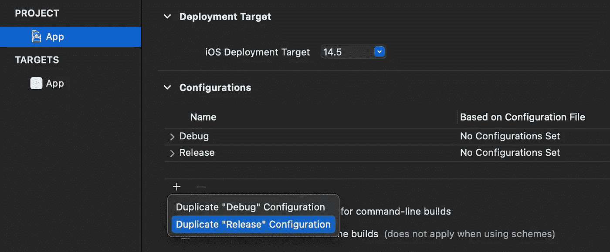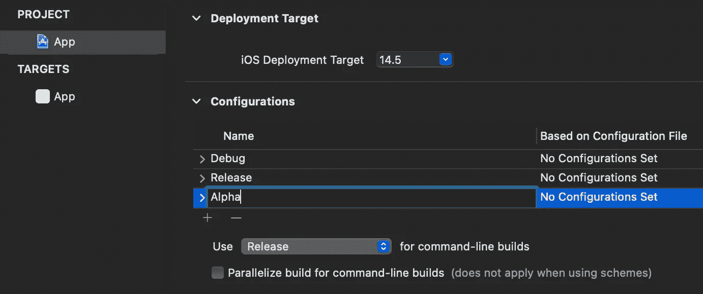

正如我们所看到的，我们创建了一个“发布”配置的副本，并将其命名为“Alpha”。接下来，我们需要在`Assets.xcassets`目录中添加应用程序图标集。

首先，让我们为应用程序图标创建一个新文件夹:

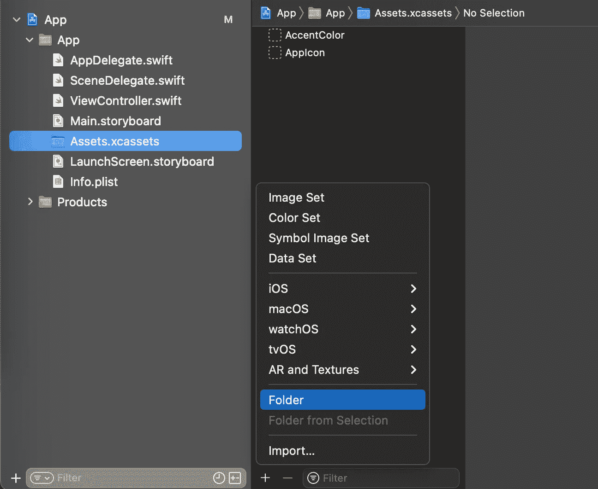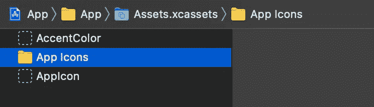

让我们将现有的“AppIcon”映像集移动到文件夹中(我们稍后将在“发布”构建配置中使用它):

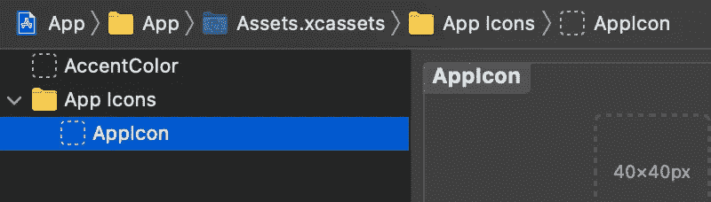

我们需要再创建两个图标，一个用于“调试”，一个用于“阿尔法”:

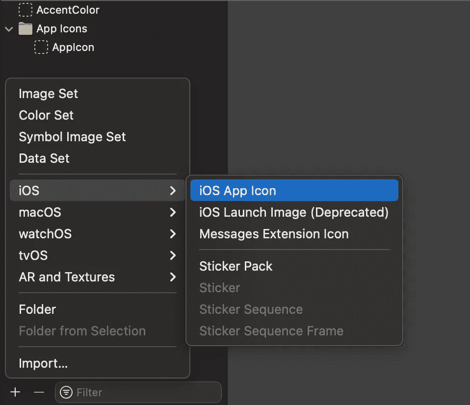

创建图标后，将它们命名为“AppIcon.dev”和“AppIcon.alpha ”,并将它们移动到“AppIcons”文件夹中，我们得到以下内容:

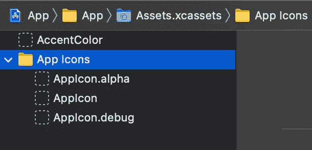

接下来，我们将具有相应分辨率的实际图像添加到每组图像中:

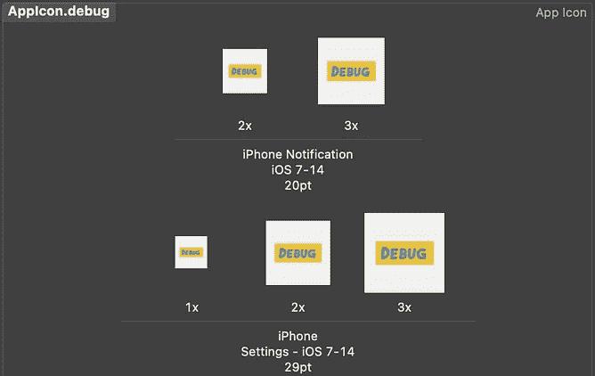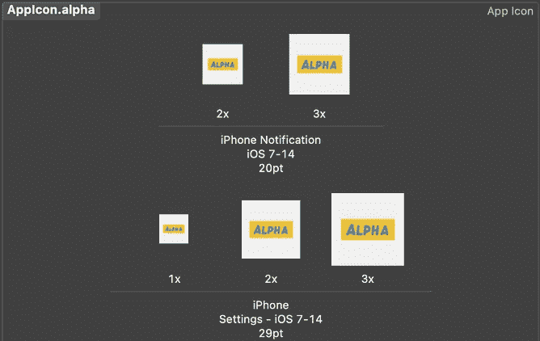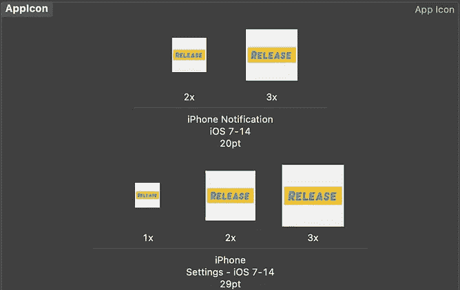

是时候学习如何为每个构建配置引用所需的图标集了。

# 引用应用程序图标

首先，我们需要点击“目标”下的“应用程序”,然后选择“构建设置”,如下所示:

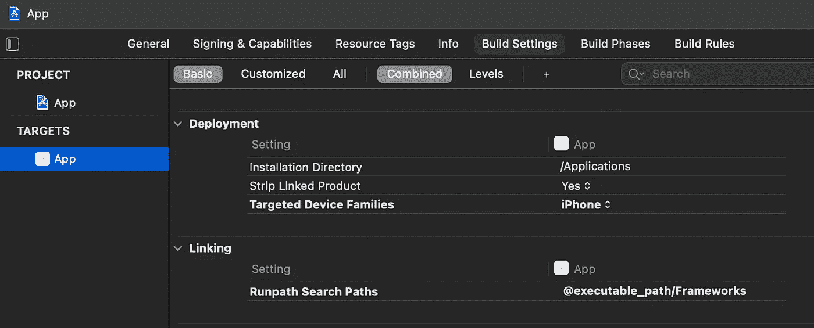

接下来，我们在搜索字段中键入“应用程序图标”,并展开找到的“资产目录应用程序图标集名称”类别:

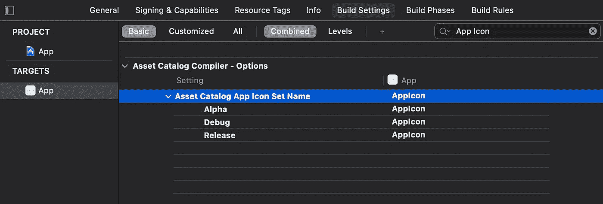

在这里，我们需要引用每个构建配置所需的图标集。让我们将名称调整如下:

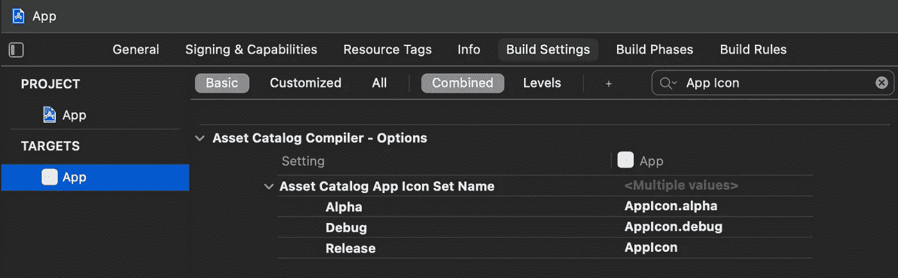

现在，如果我们构建、运行并最小化应用程序，我们将看到它使用“调试”构建配置:

现在的问题是:我们如何运行不同的构建配置？答案是调整*方案*，这样我们每次运行应用程序时，它都会使用*不同的*构建配置。

# 运行不同的生成类型

要调整方案，我们需要点击这个按钮:

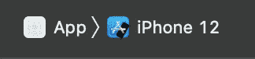

接下来，选择“编辑方案”,将出现以下弹出窗口:

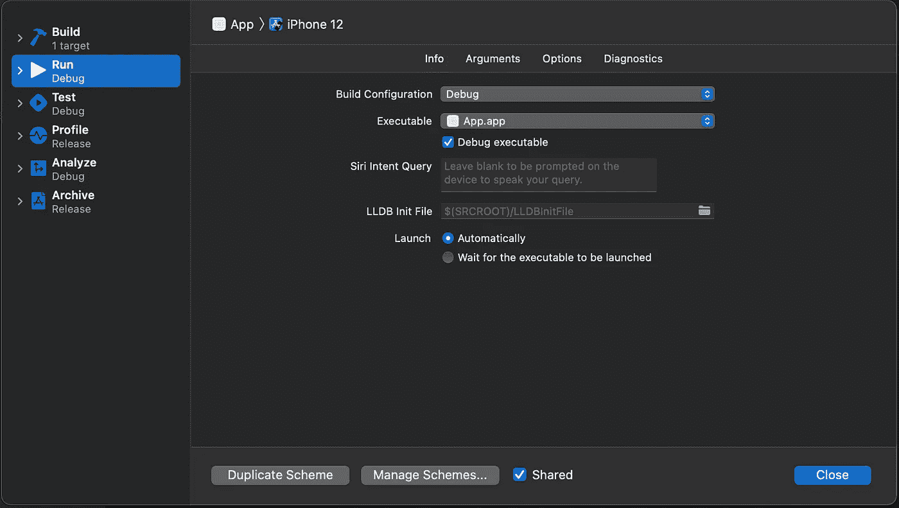

如果我们展开“构建配置”类别，我们将看到所有三个可用的构建配置:

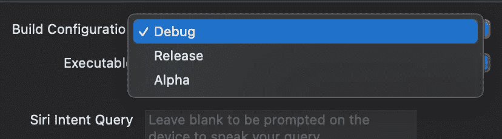

让我们选择“发布”，关闭弹出窗口并再次运行应用程序。当我们最小化应用程序时，我们会看到它正确地使用了“释放”图标集:

太好了！然而，我们希望在同一台设备上安装三个版本的应用程序。让我们接下来处理这最后一项任务。

# 安装几种生成类型

实现这一点的方法是为每个构建配置使用不同的包标识符。就像我们对应用程序图标所做的一样，让我们在目标的构建设置中搜索“包标识符”:

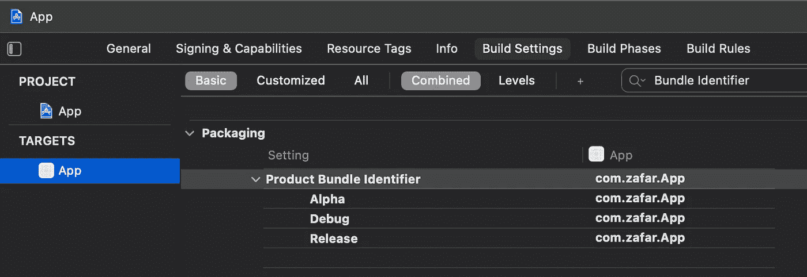

我们看到应用程序目前对每个构建类型使用相同的包 id。这就是为什么如果我们简单地改变构建类型并重新运行应用程序，它将更新现有的应用程序，而不是创建一个新的。让我们像这样更新包标识符:

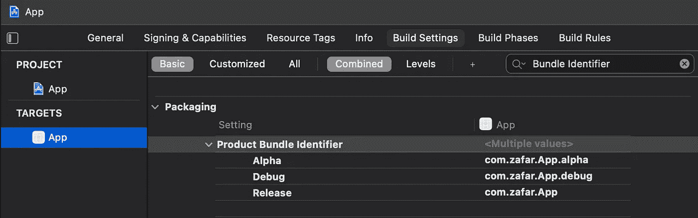

现在，让我们尝试运行该应用程序的发布版本。将构建配置更改为“Alpha”:

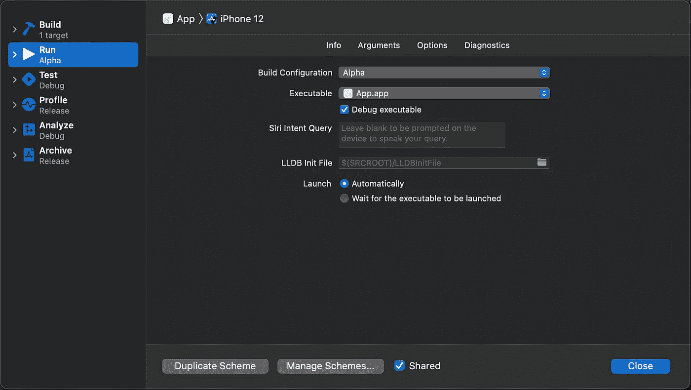

在构建、运行和最小化应用程序之后，我们看到我们实现了我们想要的:

# 资源

该示例项目可在 [GitHub](https://github.com/zafarivaev/build-configurations) 上获得。

# 包扎

希望这篇教程对你有用，感谢阅读！