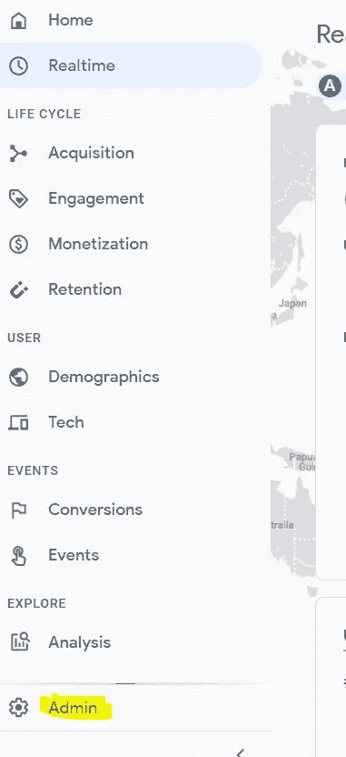
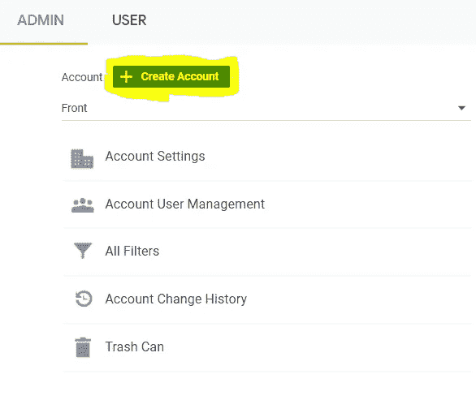
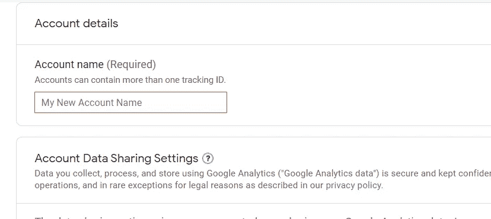
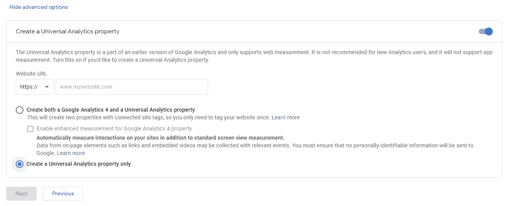
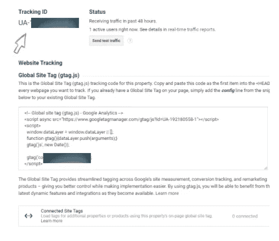
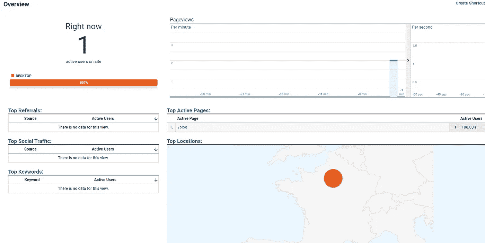

# 如何将谷歌分析账户链接到 React 应用

> 原文：<https://levelup.gitconnected.com/how-to-link-a-google-analytics-account-to-your-react-app-f0b4dd13663c>

## 只需两步！


首先，恭喜你！你已完成应用程序编码，你想添加你的 Google Analytics 帐户。太棒了。太棒了。

我知道这会多么令人兴奋。我创建了很多应用程序，每一次当它被公之于众的时候，我都有一种积极的兴奋感。

我不会唠叨很久，让我们开始精彩的部分吧。

让我们去ᕕ(ᐛ)ᕗ吧

# 第一步:创建一个谷歌分析账户(如果还没有的话)

首先，要在 React 应用程序中添加一个 Google Analytics 帐户，你显然需要一个 GA 帐户，或者更准确地说，需要一个 ***跟踪 id*** 。

*   首先，连接或创建一个帐户，并前往管理:



GA 管理

*   点击创建一个新账户。



创建帐户

⚠️:如果你已经有了另一个网站的账户，不要担心。你想创造多少就创造多少！

*   填写所需信息:



键入帐户详细信息

*   下一步超级重要: ***高级选项*** 。您需要确保您创建了一个通用 ID，并且默认情况下是禁用的，所以请确保您激活了它。否则，它不起作用:



超级重要的一步！

*   现在，你完成了。你需要保留 ***跟踪 ID*** 以后会用到。



UA-跟踪 ID

⚠️:如果你有一个以 ***G-*** 开头的测量 ID，它就不能与`ReactGA`一起使用，因为它不是一个以 ***UA-开头的通用 ID。***

# 第 2 步:检索您的跟踪 ID 并将其链接到您的 React 应用程序。

现在我们已经获得了跟踪 id，您只需要在 React 应用程序中从客户端设置正确的配置:

*   首先需要安装一个软件包，帮助我们将 React 应用程序连接到 GA。

```
npm install --save **react-ga**
```

关于这个包的更多信息:[这里是去哪儿！](https://www.npmjs.com/package/react-ga)

*   现在我们已经安装了这个包，下一步是通过添加以下内容来跟踪页面浏览量:

```
...
import ReactGA from 'react-ga';
ReactGA.initialize('UA-000000-01');**function** App() {useEffect(() **=>** {
    **ReactGA.pageview(window.location.pathname + window.location.search);**
}, []);return (
....
)
}
```

> 到目前为止，我们看到了如何跟踪页面浏览量。触发事件呢，我们也需要跟踪它们，不是吗？

事实上，我们可以用`ReactGA`做很多事情，所以请不要犹豫去查看和阅读更多关于它的内容。对于我的事件，以下是示例代码:

```
**const** useGAEventsTracker = (category = 'Event Category') **=>** {

  **const** **trackEvent** = (action = 'action', label = 'label') **=>** {
      **ReactGA.event**(category, action, label);
      return **trackEvent**;
  };
};
```

您可以将该函数外部化，以便在每次想要跟踪事件时重用它。要使用，您只需:

```
**const** eventTracker = **trackEvent**("Link triggered");
```

然后在事件触发时触发它:

```
<a href="..." onClick={e=eventTracker(actions)}>
...
</a>
```

您可以将动作添加为***event tracker***param 或者只是一个标签来查看更多细节。

# 最后，享受你的实时访客仪表板~ ᕕ(ᐛ)ᕗ



我访问我的新网站🤣🤣🤣

亲爱的读者，谢谢你❤

我希望你和你的家人无论在哪里都平安无事！坚持住。明天会更好！

**让我们联系上** [**中**](https://medium.com/@famzil/) **，** [**领英**](https://www.linkedin.com/in/fatima-amzil-9031ba95/) **，** [**脸书**](https://www.facebook.com/The-Front-End-World) **，或者** [**推特**](https://twitter.com/FatimaAMZIL9) **。**

**FAM**

