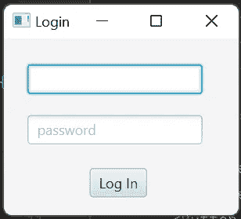

# 如何将控制器类中的 Java 函数链接到 FXML 文件中的按钮或文本字段

> 原文：<https://levelup.gitconnected.com/how-to-link-a-java-function-in-a-controller-class-to-a-button-or-textfield-in-an-fxml-file-774266c531aa>

## 当用户单击按钮或编辑 GUI 中的文本字段时，让控制器“做事情”



用 fxml 制作的登录表单示例

这假设您已经将 fxml 文件链接到控制器类文件。如果您还没有这样做，请查看我的另一个教程:[如何将. fxml 文件链接到 Java 控制器类](https://ashley-tharp.medium.com/how-to-link-a-fxml-file-to-a-java-controller-class-a92d2a9d07d1)

假设您的 fxml 类中有以下节点:

```
<Button fx:id="saveBtn" mnemonicParsing="false" text="Save" translateX="50"/>
```

在 Java 控制器类中，有这样一个函数:

```
public void savePart(ActionEvent actionEvent) throws IOException {
    System.*out*.println("savePart()");
}
```

将属性“onAction”添加到 fxml 文件中的节点，以将两者链接在一起:

```
<Button fx:id="saveBtn" mnemonicParsing="false" text="Save" **onAction="#savePart"** translateX="50"/>
```

注意上面 onAction 属性是如何设置为“#savePart”的，函数名也是完全相同的“savePart”。

它们必须完全相同，这样您的链接才能正常工作。

测试并确保当您单击按钮并设置好之后，可以看到控制台输出。

下面是上面的 screencap 中显示的简单登录表单 GUI 的完整源代码:

```
<?xml version="1.0" encoding="UTF-8"?><?import javafx.scene.control.Button?>
<?import javafx.scene.control.Label?>
<?import javafx.scene.control.TextField?>
<?import javafx.scene.layout.Pane?><Pane maxHeight="-Infinity" maxWidth="-Infinity" minHeight="-Infinity" minWidth="-Infinity" prefHeight="150.0" prefWidth="200.0"  xmlns:fx="http://javafx.com/fxml/1" **fx:controller="controller.LoginFormController"**>
    <children>
        <Label fx:id="userNameWarningLabel" layoutX="25.0" layoutY="15.0" text=""/>
        <TextField fx:id="userNameTextField" layoutX="20.0" layoutY="32.0" promptText="username" />
        <Label fx:id="passWordWarningLabel" layoutX="25.0" layoutY="58.0" text="" />
        <TextField fx:id="passWordTextField" layoutX="20.0" layoutY="75.0" promptText="password" />
        <Button **fx:id="loginButton"** layoutX="73.0" layoutY="110.0" mnemonicParsing="false" **onAction="#checkLoginInfo"** text="Log In" />
    </children>
</Pane>
```

对于控制器类，重要的是 FXML 文件在根节点中用“fx:controller”属性链接到它，并且它实现 Initializable。

```
public class LoginFormController implements Initializable  {}
```

但是，我将在这里显示，我在控制器类中有与 FXML 文件中的对象 id 相匹配的属性，如下所示:

```
public class LoginFormController implements Initializable  {public Label userNameWarningLabel;
   public TextField userNameTextField; public Label passWordWarningLabel;
   public TextField passWordTextField;
   public Button loginButton;}
```

添加您的初始化函数:

```
@Override
public void initialize(URL url, ResourceBundle resourceBundle) {
    userNameTextField.setPromptText("username");
    passWordTextField.setPromptText("password");
    System.*out*.println("Initialized");
}
```

剩下的就看你自己了，但是这里有一个模板可以作为开始:

```
public class LoginFormController implements Initializable  {public Label userNameWarningLabel;
   public TextField userNameTextField; public Label passWordWarningLabel;
   public TextField passWordTextField;
   public Button loginButton;@Override
   public void initialize(URL url, ResourceBundle resourceBundle) {
       userNameTextField.setPromptText("username");
       passWordTextField.setPromptText("password");
       System.*out*.println("Initialized");
   }}
```