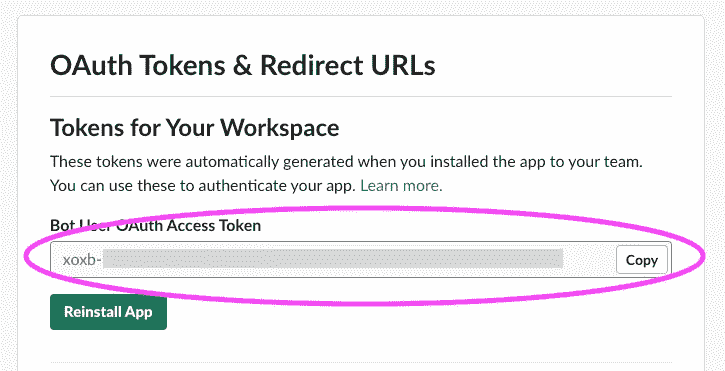

# 如何列出有节点的时差用户

> 原文：<https://levelup.gitconnected.com/how-to-list-slack-users-with-node-7121a55efde8>


## 这篇文章假设你已经安装了一个 Slack 应用程序，并且掌握了 Slack 和 Node 的工作知识。

这里的目标是能够列出特定 Slack 工作空间的所有用户。这将提供对每个用户的 id 和其他有用信息的访问。

在 [Slack](https://slack.com) 上打开你的应用。在页面左侧找到*功能*=>OAuth&权限。

在范围下，启用**用户:读取**。


保存，然后滚动到页面顶部。按下*重新安装 App* 。重新安装应用程序后，复制您的 **OAuth 令牌**。



最后，我们需要**客户端签名密码**，它可以在您的应用程序基本信息页面上找到。


将这段代码插入到您选择的编辑器中，点击 run，将会列出与附加到`OAUTH TOKEN`的工作空间相关联的用户。

```
const { App } = require('**@slack/bolt**')
const app = new App({
  token: ***OAUTH TOKEN***,
  signingSecret: ***CLIENT SIGNING SECRET***
});

(async () => {  const result = await **app.client.users.list**({
token: ***OAUTH TOKEN***
  });
  console.log(result)
})();
```

只要您拥有与工作区相关联的用户，结果将如下所示:

```
{
  ok: true,
  members: [
    {
      id: '0928309LSKJFL',
      team_id: 'LKSJDFL8769878',
      name: 'phil',
      deleted: false,
      color: '9f69e7',
      real_name: 'sam',
      tz: 'America/Indiana/Indianapolis',
      tz_label: 'Eastern Daylight Time',
      tz_offset: -14400,
      profile: [Object],
      is_admin: true,
      is_owner: true,
      is_primary_owner: true,
      is_restricted: false,
      is_ultra_restricted: false,
      is_bot: false,
      is_app_user: false,
      updated: 1504338871
    }
  ],
  cache_ts: 1590876212,
  response_metadata: {
    next_cursor: '',
    scopes: [
      'incoming-webhook',
      'chat:write',
      'files:write',
      'im:write',
      'im:read',
      'files:read',
      'users:read'
    ],
    acceptedScopes: [ 'users:read' ]
  }
}
```

完全松弛文档:[列出用户](https://api.slack.com/methods/users.list)

# 开发无服务器时，希望恢复您的控制台日志吗？签出树枝…

[](https://www.twig.im/)