# 如何从浏览器控制台加载外部 JavaScript 文件

> 原文：<https://levelup.gitconnected.com/how-to-load-external-javascript-files-from-the-browser-console-8eb97f7db778>

## WEB 开发人员控制台技巧

## 直接从控制台加载外部脚本可能会很棘手。以下是如何直接从 Firefox 或 Chrome 的开发控制台导入不带`<script>`标签的 JavaScript。


[艾莉·强森](https://unsplash.com/@lejo?utm_source=medium&utm_medium=referral)在 [Unsplash](https://unsplash.com?utm_source=medium&utm_medium=referral) 上拍照

假设你正在做一个项目，你正在考虑添加一个外部库来操作页面或者添加额外的功能。例如，您可能希望加载最新版本的 jQuery。

通常，您只需在 HTML 中添加一个`[<script>](https://developer.mozilla.org/en-US/docs/Web/HTML/Element/script)`标签，它将加载外部 JavaScript 文件。例如，要加载 jQuery，您应该添加:

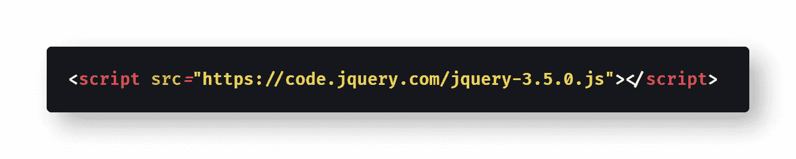

[查看原始代码](https://gist.github.com/djD-REK/d6adcd7563472203c31b895b9a73fa8f)作为 GitHub 要点

但是如果你想从 DevTools 控制台使用命令行加载外部脚本呢？这样做在构建原型或者试图修改不属于自己的页面时特别有用，比如想使用 jQuery 快速处理别人站点上的数据。

本文将解释如何从浏览器的控制台窗口直接加载外部 JavaScript 文件，作为原型工作流的一部分。

为了能够使用本文中讨论的方法，您不需要了解 jQuery 或任何其他外部库。幸运的是，JavaScript 有内置的工具可以从控制台导入外部 JavaScript 文件。

# 快速和肮脏的方式

从控制台导入外部脚本文件的最短和最直接的方法是使用`[document.write()](https://developer.mozilla.org/en-US/docs/Web/API/Document/write)`，直接将`<script>`标签写入加载的页面。下面是一个代码示例:

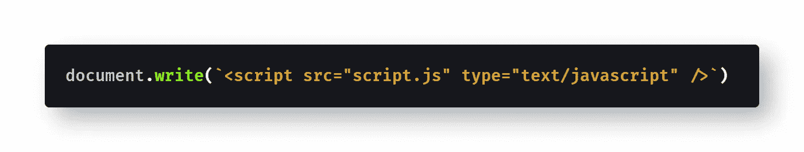

[查看原始代码](https://gist.github.com/djD-REK/b27d419d0a01e1695ef39b530fe7ac5d)作为 GitHub 要点

注意代码片段中 HTML 的[模板文字](https://thebittheories.com/the-3-advantages-of-backtick-literals-in-javascript-f6beade4a9cf)的使用。

如果您只需要脚本在控制台中工作，这种方法会很好，但是如果您想要处理当前打开的文档，这种方法就不好了——只要您运行这段代码，当前页面就会立即消失。

> **注意**:当`document.write`向**流**中写入文件时，在一个关闭(加载)的文件上调用`document.write`会自动调用`document.open`、[清除文件](https://developer.mozilla.org/en-US/docs/Web/API/document.open#Notes)。— [MDN 文档](https://developer.mozilla.org/en-US/docs/Web/API/Document/write)

让我们探索另外两个不会清除已加载文档的选项。

# 更好的方法

U sing `[appendChild()](https://developer.mozilla.org/en/docs/Web/API/Node/appendChild)`是一种更有用的加载外部脚本文件的方式。`appendChild()`不会用`document.write()`覆盖已加载的页面，而是直接给页面添加一个新的`<script>`标签。

让我们来看一个代码示例:

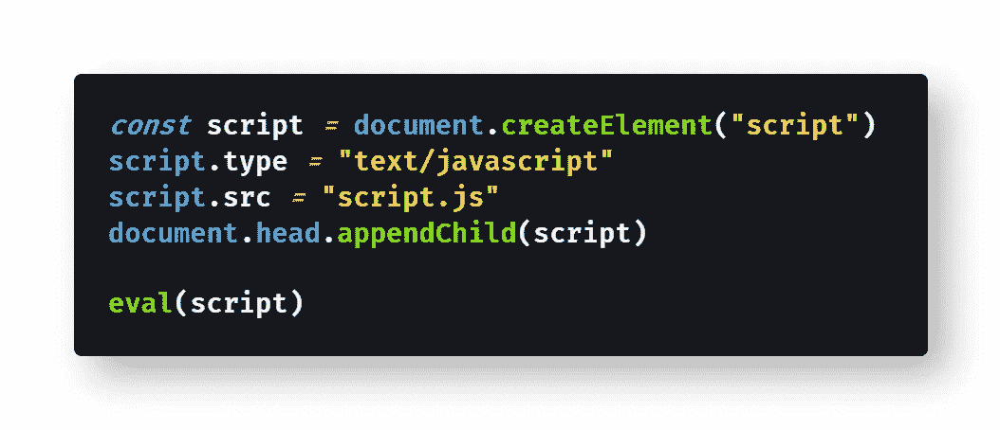

[查看原始代码](https://gist.github.com/djD-REK/c242a0136310bb9a65e1554e4f4480a0)作为 GitHub 要点

注意使用`[eval()](https://developer.mozilla.org/en-US/docs/Web/JavaScript/Reference/Global_Objects/eval)`来执行代码是**在大多数情况下不需要**。如果您的代码是一个包含`<script>`标签的字符串，您实际上只需要`eval()`，就像在`document.write()`示例中一样:

```
eval(`<script src="script.js" type="text/javascript"`>
```

如果您有一个包含加载文件的`<script>`标签的字符串，没有`eval()`该字符串实际上不会运行。但是如果你的脚本是一个外部 JavaScript 文件(就像加载 jQuery，我们后面会看到)，你就不需要`eval()`。只要调用`Node.appendChild(script)`就会为你加载脚本。

你应该知道`[eval()](https://developer.mozilla.org/en-US/docs/Web/JavaScript/Reference/Global_Objects/eval#Never_use_eval!)` [有一些安全隐患](https://developer.mozilla.org/en-US/docs/Web/JavaScript/Reference/Global_Objects/eval#Never_use_eval!)。稍后我会解释为什么你会使用`[Function()](https://developer.mozilla.org/en-US/docs/Web/JavaScript/Reference/Global_Objects/Function)`来代替，但是为了演示的目的`eval()`也可以工作得很好。使用`eval()`来计算一个字符串类似于使用`document.write()`来计算:你可以做，但是不应该做。

因为我在例子中包含了`eval()`用于比较和讨论，所以请注意在现代浏览器中这是不必要的。

# 另一种方式:取

从命令行加载外部 JavaScript 文件的另一种方式是。

下面是一个在多个`[.then()](https://developer.mozilla.org/en-US/docs/Web/JavaScript/Reference/Global_Objects/Promise/then)`调用中使用`fetch()`的例子:

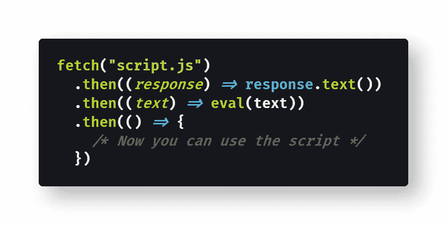

[查看原始代码](https://gist.github.com/djD-REK/b47f54acb032119cfeb43dc0c3489c87)作为 GitHub 要点

或者，您可以使用`[async](https://developer.mozilla.org/en-US/docs/Web/JavaScript/Reference/Statements/async_function)` / `[await](https://developer.mozilla.org/en-US/docs/Web/JavaScript/Reference/Operators/await)`而不是[链接](https://developer.mozilla.org/en-US/docs/Web/JavaScript/Guide/Using_promises#chaining)由`fetch()`返回的[承诺](https://developer.mozilla.org/en-US/docs/Web/JavaScript/Reference/Global_Objects/Promise)来实现相同的功能:

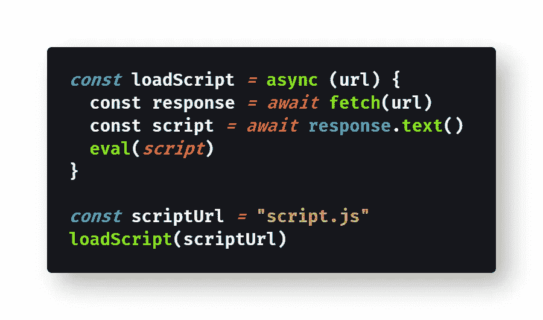

将原始代码视为 GitHub 要点

同样，如果你需要计算一个字符串，你可能想用`Function()`代替`eval()`，我将在本文后面讨论。这只适用于当你加载一个包含需要执行的`<script>`标签的字符串时；否则，这两个命令都不需要。

接下来，让我们看一个使用 jQuery 的每种方法的工作示例。

# 在控制台中加载 jQuery

本节将为上面讨论的每种方法提供代码示例。您将加载 jQuery 库，然后使用它将 [CSS 边框样式](https://developer.mozilla.org/en-US/docs/Web/CSS/border)应用到页面上的每个`[<div>](https://developer.mozilla.org/en-US/docs/Web/HTML/Element/div)`元素。

请注意，如果您同时输入所有命令，这些示例中的任何一个都可能会出现[类型错误](https://developer.mozilla.org/en-US/docs/Web/JavaScript/Reference/Global_Objects/TypeError)“`$(...).css is not a function`”。在加载脚本和实际使用它之间，您需要等待一秒钟。因此，首先输入加载外部脚本所需的命令，然后使用脚本输入命令。

发生 TypeError 是因为 JavaScript 实际上有一个[内置的美元符号方法](https://www.thoughtco.com/and-in-javascript-2037515#the-dollar--identifier) `[$()](https://www.thoughtco.com/and-in-javascript-2037515#the-dollar--identifier)`，您正试图用 jQuery 覆盖它。内置的美元符号方法没有`.css()`函数——那就是 jQuery。因此，在实际调用`$("div").css()`函数之前，您必须等待 eval()完成加载脚本。

最后，这些演示可能只在某些页面上有效:对我来说，它们在谷歌主页的浏览器控制台上有效，但在查看 GitHub Gist 时无效，因为消息是:

```
Refused to load the script '[https://code.jquery.com/jquery-3.5.0.js'](https://code.jquery.com/jquery-3.5.0.js') because it violates the following Content Security Policy directive: "script-src github.githubassets.com".
```

您的里程可能会有所不同。

## 方法一:`document.write()`

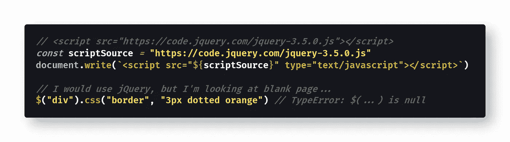

[查看原始代码](https://gist.github.com/djD-REK/4038e124798c3efa77f3f3dafb3f1a86)作为 GitHub 要点

在这种情况下，`document.write()`会覆盖加载的页面，所以没有什么可以实际应用 CSS 样式。但是，不管怎样，jQuery 将被加载到控制台窗口中。

## 方法二:`appendChild()`

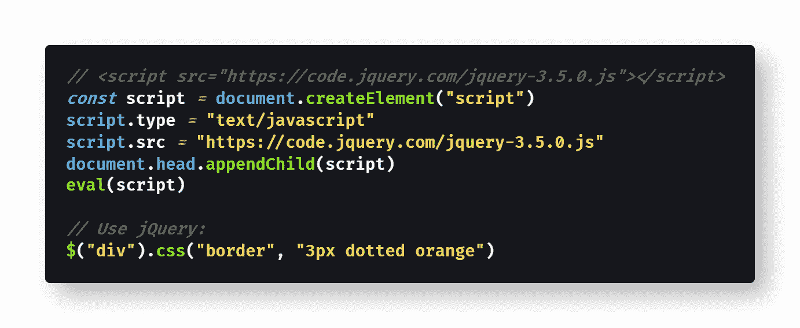

[查看原始代码](https://gist.github.com/djD-REK/8ca0121a62543a41b57dd2a5bd8d1a66)作为 GitHub 要点

这种方法非常有效，不会覆盖加载的页面。调用`document.head.appendChild(script)`将脚本加载到页面的`[<head>](https://developer.mozilla.org/en-US/docs/Web/HTML/Element/head)`元素中。

如前所述，您实际上并不需要在这里执行`eval()`——但是在 jQuery 可用之前，您需要等待`appendChild()`命令在浏览器窗口上执行。

## 方法三:`fetch()`

根据您的个人喜好，使用`fetch()`有两个等效的选项。首先是使用`fetch()`和承诺链:

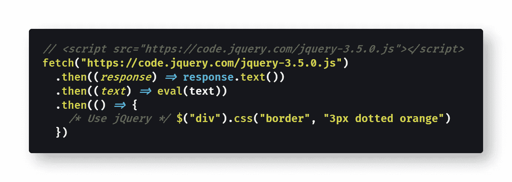

[查看原始代码](https://gist.github.com/djD-REK/888c5dedf1e5f939e7ed9f7b0506b6e7)作为 GitHub 要点

第二，可以使用`async` & `await`处理`fetch()`返回的承诺:

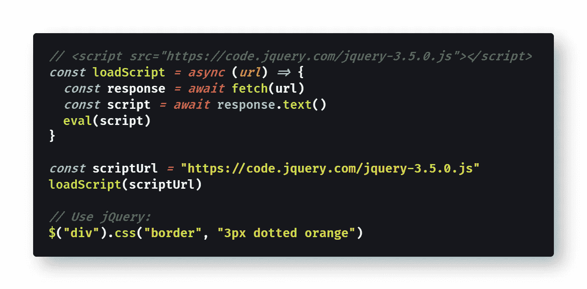

[查看原始代码](https://gist.github.com/djD-REK/bd6f70c8dc9f21fa73031a99aa83b52c)作为 GitHub 要点

这两种方法都被认为是直接从控制台窗口加载外部 JavaScript 文件的一种方式。

只要记住你不需要`eval()`，除非你正在加载一个包含`<script>`标签的字符串，就像在`document.write()`例子中一样。

# 但是等等——千万不要用`eval()`！

正如我之前顺便提到的,`eval()`存在相关的安全风险，MDN 文档对此有很好的解释:

> "`eval()`是一个危险的函数，它以调用者的权限执行它所传递的代码。如果您使用可能受到恶意方影响的字符串运行`eval()`，您可能会以您的网页/扩展的权限在用户的机器上运行恶意代码。更重要的是，第三方代码可以看到`eval()`被调用的范围，这可能导致类似`[Function](https://developer.mozilla.org/en-US/docs/Web/JavaScript/Reference/Global_Objects/Function)`不容易受到的攻击。”— [MDN 文档](https://developer.mozilla.org/en-US/docs/Web/JavaScript/Reference/Global_Objects/eval#Never_use_eval!)

简单来说，你应该用`[Function()](https://developer.mozilla.org/en-US/docs/Web/JavaScript/Reference/Global_Objects/Function)`而不是`eval()`——但`eval()`是常用的，所以如果你在周围看到它，不要感到惊讶。

使用`Function()`看起来像下面的代码示例:

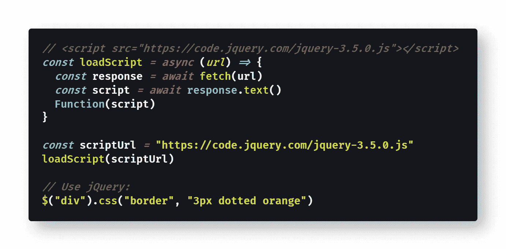

[查看原始代码](https://gist.github.com/djD-REK/07d86e495bc772133907b63317c3ea56)作为 GitHub 要点

从语法上来说，没有区别——只是把`Function()`换成了`eval()`。

但是使用`Function()`将会提高你的网站或应用程序的安全性和性能，即使只是从开发者控制台加载一个外部库。

> "`[Function()](https://developer.mozilla.org/en-US/docs/Web/JavaScript/Reference/Global_Objects/Function/Function)`创建一个新的`Function`对象。直接调用构造函数可以动态地创建函数，但是会遇到与`[eval](https://developer.mozilla.org/en-US/docs/Web/JavaScript/Reference/Global_Objects/eval)`类似的安全和性能问题(但远没有那么严重)。然而，与 eval 不同的是，`Function`构造函数创建的函数只在全局范围内执行。— [MDN 文档](https://developer.mozilla.org/en-US/docs/Web/JavaScript/Reference/Global_Objects/Function)

我应该补充一点，我发现有时候`eval()`对我有用，而`Function()`不行——例如，在某些网站上`Function()`似乎被屏蔽了，而`eval()`却没有被屏蔽，不管是什么原因。

通常，appendChild()可以很好地加载脚本，并且是首选方法——性能更好，安全风险更低。

如果您自己尝试使用 jQuery 编写代码示例，请记住 jQuery 会覆盖一个[内置的美元符号方法](https://www.thoughtco.com/and-in-javascript-2037515#the-dollar--identifier) `[$()](https://www.thoughtco.com/and-in-javascript-2037515#the-dollar--identifier)`。

# 其他选项

如果您对使用 JavaScript 加载多个外部文件或工具感兴趣，您还有许多其他选择。

例如，如果您已经在页面上加载了 jQuery，那么您可以使用 jQuery 的助手函数`[$.getScript()](https://api.jquery.com/jquery.getscript/)`:

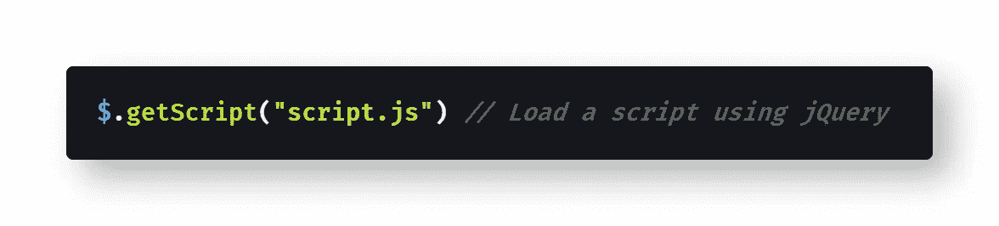

[查看原始代码](https://gist.github.com/djD-REK/8997a2bf77fce9ac12c52e4403f6f301)作为 GitHub 要点

加载外部脚本的一些其他潜在有用的选项有:

*   [系统 JS](https://github.com/systemjs/systemjs#readme)
*   [模块加载器](https://github.com/ModuleLoader/es6-module-loader#readme)
*   [jspm.io](http://jspm.io/)

其中， [jspm.io](https://jspm.io/) 尤其有趣，因为它允许您直接从控制台窗口使用简单的`[import()](https://developer.mozilla.org/en-US/docs/Web/JavaScript/Reference/Statements/import)`语句。

这里需要注意的一点是"[名称空间污染](https://www.tutorialspoint.com/what-is-global-namespace-pollution-in-javascript) " —您正在导入的脚本可能会覆盖页面上已经定义的全局变量。前面提到的[美元符号方法](https://www.thoughtco.com/and-in-javascript-2037515#the-dollar--identifier) `[$()](https://www.thoughtco.com/and-in-javascript-2037515#the-dollar--identifier)`就是与 jQuery 名称空间冲突的一个例子。如果您的 jQuery 版本与网站上已经加载的 jQuery 版本冲突，您也可能会遇到名称空间问题。

如果名称空间污染是一个问题，像 [Tampermonkey](https://www.tampermonkey.net/) 这样的工具可能会有所帮助。Tampermonkey 是一个浏览器扩展，可以轻松地处理同一页面上的多个运行脚本，而不会发生名称空间冲突。

你也可以考虑 [RunKit](https://runkit.com) ，这是一个链接到每个 npm 包([比如 jQuery](https://www.npmjs.com/package/jquery) )的网站，它允许你在浏览器中试用任何 Node.js 包，不需要任何设置。这里是 jQuery 的 RunKit。(在 RunKit 中使用 jQuery 时，我一直运气不好，但是您也许可以让它工作起来)。

类似地， [CodeSandbox](https://codesandbox.io/) 让您可以轻松地用沙箱保护任何单个 npm 包或 npm 包的组合，而无需在本地安装任何东西，就像 [CodePen via SkyPack](https://blog.codepen.io/2020/11/18/skypack-codepen/) 一样。

# 结论

开发人员可能希望使用浏览器的开发控制台测试外部库或其他 JavaScript 文件，这是很常见的。

例如，您可能希望加载 jQuery，或者是为了操作当前页面，或者只是为了在控制台中练习语法。

无论是原型制作、学习、测试还是修改现有页面，从开发人员控制台加载外部库都非常有用。

本文讨论了从控制台加载外部 JavaScript 文件的三种方法:`document.write()`、`appendChild()`和`fetch()`。

我提供了一个使用每种方法的示例，展示了如何从浏览器的控制台环境加载 jQuery。

或者，你可以尝试其他工具——比如 [SystemJS](https://github.com/systemjs/systemjs#readme) 、 [ModuleLoader](https://github.com/ModuleLoader/es6-module-loader#readme) 、 [jspm.io](http://jspm.io/) 、 [Tampermonkey](https://www.tampermonkey.net/) 、 [RunKit](https://runkit.com) 或[code sandbox](https://codesandbox.io/)——这取决于你的具体需求和个人偏好。

希望这篇文章能帮助你释放 Chrome DevTools 和 Firefox 的 Web 控制台 T21 的全部力量。

**快乐编码！**👏👍💯😄🧠️🏎

# 进一步阅读

*   [Paul Shan](https://medium.com/u/762741fd4aa8?source=post_page-----8eb97f7db778--------------------------------) 在 Void Canvas 加载 jQuery [的“无冲突”版本:](http://voidcanvas.com/how-to-insert-run-jquery-in-chrome-console/)

[](http://voidcanvas.com/how-to-insert-run-jquery-in-chrome-console/) [## 如何在 chrome 控制台中插入和运行 jQuery

### 很多时候，我们需要测试一些不属于我们的网页中的一些元素。可能是做一些…

voidcanvas.com](http://voidcanvas.com/how-to-insert-run-jquery-in-chrome-console/) 

*   [基鲁帕·钦纳坦比](https://medium.com/u/1a8acce9fbb4?source=post_page-----8eb97f7db778--------------------------------)在他的博客上谈论`<script>`、`defer`和`async`、[:](https://www.kirupa.com/html5/running_your_code_at_the_right_time.htm)

[](https://www.kirupa.com/html5/running_your_code_at_the_right_time.htm) [## 在正确的时间运行 JavaScript

### 使用 JavaScript 的一个重要部分是确保您的代码在正确的时间运行。事情没有那么简单…

www.kirupa.com](https://www.kirupa.com/html5/running_your_code_at_the_right_time.htm) 

*   网站 JavaScriptKit 有一个关于加载外部 JS 的两部分教程:

[](http://www.javascriptkit.com/javatutors/loadjavascriptcss.shtml) [## 动态加载外部 JavaScript 或 CSS 文件

### 加载外部 JavaScript 的传统方式(即:。js)和 CSS(即:。css)文件在一个页面上贴一个引用…

www.javascriptkit.com](http://www.javascriptkit.com/javatutors/loadjavascriptcss.shtml) 

*   [GeeksforGeeks](https://www.geeksforgeeks.org/how-to-load-external-js-scripts-dynamically-in-angularjs/) 解释如何在 Angular 中加载外部 JavaScript:

[](https://www.geeksforgeeks.org/how-to-load-external-js-scripts-dynamically-in-angularjs/) [## AngularJS 中如何动态加载外部 JS 脚本？- GeeksforGeeks

### 任务是在 AngularJS 运行时从存储在系统中的 CDN 或 JS 文件中动态加载 JS 代码…

www.geeksforgeeks.org](https://www.geeksforgeeks.org/how-to-load-external-js-scripts-dynamically-in-angularjs/) 

*   [Chrome 的 V8 文档](https://v8.dev/docs/d8)讨论在 D8 开发者外壳中加载外部 JS:

 [## 使用 d8

### 是 V8 自己的开发者外壳。d8 对于在本地运行一些 JavaScript 或者调试你对 V8 所做的修改很有用…

v8.dev](https://v8.dev/docs/d8) 

*   [文森特·施罗德](https://medium.com/u/2a5bc9f52fd1?source=post_page-----8eb97f7db778--------------------------------)在他的媒体博客上澄清加载`async`脚本[:](https://medium.com/@vschroeder/javascript-how-to-execute-code-from-an-asynchronously-loaded-script-although-when-it-is-not-bebcbd6da5ea)

[](https://medium.com/@vschroeder/javascript-how-to-execute-code-from-an-asynchronously-loaded-script-although-when-it-is-not-bebcbd6da5ea) [## Javascript:如何从异步加载的脚本中执行代码，尽管它不是…

### 有时，您必须在脚本完全加载到浏览器之前启动一个操作或执行代码(例如…

medium.com](https://medium.com/@vschroeder/javascript-how-to-execute-code-from-an-asynchronously-loaded-script-although-when-it-is-not-bebcbd6da5ea) 

*   网站 [Fullstack React](https://www.newline.co/fullstack-react/articles/Declaratively_loading_JS_libraries/) 有一篇关于加载外部 JavaScript 的文章:

 [## Fullstack React:声明式加载 JavaScript

### 使用 JavaScript，我们可以将我们的

www.newline.co](https://www.newline.co/fullstack-react/articles/Declaratively_loading_JS_libraries/) 

*   [尼韦达](https://medium.com/u/c1345c6163f?source=post_page-----8eb97f7db778--------------------------------)教反应头盔&反应挂钩[在更好的编程中](https://medium.com/better-programming/4-ways-of-adding-external-js-files-in-reactjs-823f85de3668):

[](https://medium.com/better-programming/4-ways-of-adding-external-js-files-in-reactjs-823f85de3668) [## 在 React 中添加外部 JavaScript 文件的 4 种方法

### 反应钩子和其他方法

medium.com](https://medium.com/better-programming/4-ways-of-adding-external-js-files-in-reactjs-823f85de3668) 

*   [React 文档](reactjs.org/docs/)有很好的关于[加载 JS 文件](https://reactjs.org/docs/integrating-with-other-libraries.html)和[代码分解](https://reactjs.org/docs/code-splitting.html)的教程:

[](https://reactjs.org/docs/integrating-with-other-libraries.html) [## 与其他库集成- React

### React 可以在任何 web 应用程序中使用。它可以嵌入到其他应用程序中，只要稍加小心，其他…

reactjs.org](https://reactjs.org/docs/integrating-with-other-libraries.html) [](https://reactjs.org/docs/code-splitting.html) [## 代码分解-反应

### 大多数 React 应用程序会使用 Webpack、Rollup 或 Browserify 等工具“捆绑”文件。捆绑是一个过程…

reactjs.org](https://reactjs.org/docs/code-splitting.html) 

[Ehimetalor Akhere Unuabona](https://unsplash.com/@theeastlondonphotographer?utm_source=unsplash&utm_medium=referral&utm_content=creditCopyText) 在 [Unsplash](https://unsplash.com/s/photos/load?utm_source=unsplash&utm_medium=referral&utm_content=creditCopyText) 拍摄的照片

[Derek Austin](https://www.linkedin.com/in/derek-austin/)博士是《职业编程:如何在 6 个月内成为一名成功的 6 位数程序员 》一书的作者，该书现已在亚马逊上架。