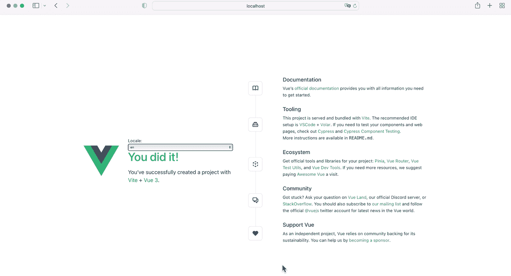
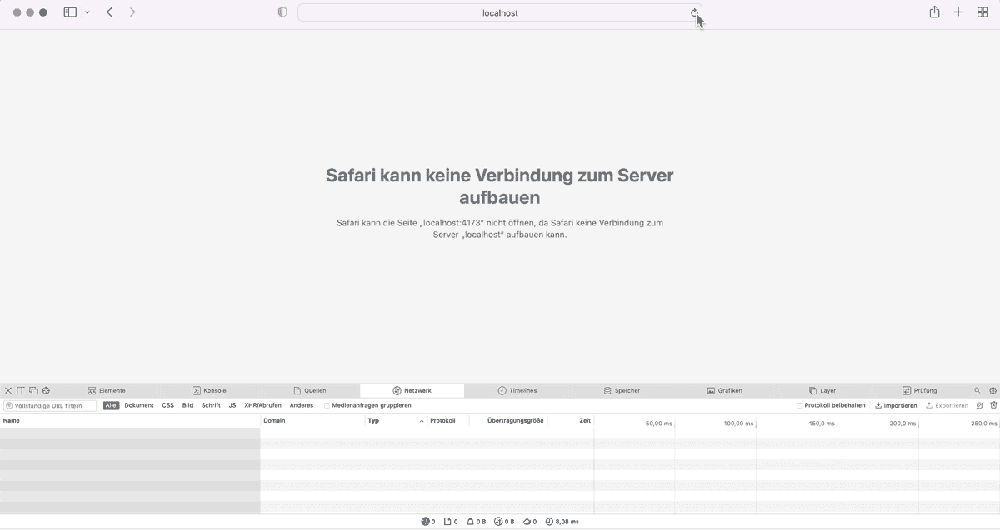

# 如何在 Vue 3 + Vite 中异步加载 i18n 语言环境

> 原文：<https://levelup.gitconnected.com/how-to-load-i18n-locales-asynchronously-in-vue-3-vite-9e7301c52f19>


照片由[尼克·费因斯](https://unsplash.com/@jannerboy62?utm_source=unsplash&utm_medium=referral&utm_content=creditCopyText)在 [Unsplash](https://unsplash.com/s/photos/flags?utm_source=unsplash&utm_medium=referral&utm_content=creditCopyText) 拍摄

# **简介**

在我之前的故事 [*如何构建多语言 Vue 3 + Vite App*](/how-to-build-a-multi-language-vue-3-vite-app-b91c34c46097) 中，我们用[*Vue I18n*](https://vue-i18n.intlify.dev)*插件构建了一个多语言 App，我们将所有的语言环境消息存储在外部 json 文件中。在构建过程中，这些文件被预编译和捆绑。这样，所有的语言环境都包含在主包中，并且在应用程序加载后立即可用。但是，您可能希望在主捆绑包中只包含少数语言环境，而在需要时异步地为其他语言环境提供服务。这可以在有许多地区的项目中减少包的大小。*

# *在本指南中*

*我们从上一个故事中扩展了 [Vue 3](https://vuejs.org/) + [Vite](https://vitejs.dev/) 应用程序，以便在主程序块中只捆绑一些语言环境，而其他语言环境在需要时异步加载。*

*有几种方法可以实现异步加载语言环境。在本指南中，没有捆绑在主块中的语言环境消息文件是作为静态 json 文件提供的。然后，客户端 Vue 3 应用程序可以在需要时通过 fetch API 加载一个语言环境资源文件。一旦加载了区域设置，就必须编译区域设置消息并将其添加到全局 *I18n* 实例中。*

*这种方法要求在两个不同的目录中托管语言环境资源文件。*

# *先决条件*

*   *您对如何使用 Vue 3 + Vite、组合 API 和`<script setup>`语法有了基本的了解*
*   *你的机器上已经安装了 node.js*
*   *你已经阅读并理解了我之前的故事，因为它是基础*

# ***基础 App***

*通过在所需的工作目录下打开您的终端并执行以下命令，用最后一个故事中的 *Vue I18n 插件*克隆 Vue 3 + Vite 应用程序:*

```
*git clone https://github.com/robinkloeckner/vue3_vite_i18n*
```

*或者你可以从 [GitHub](https://github.com/robinkloeckner/vue3_vite_i18n) 下载源代码。*

*然后导航到项目根目录，安装所有模块并启动开发服务器:*

```
*cd vue_vite_i18n
npm install
npm run dev*
```

*如果你现在浏览到`http://localhost:5173/`，你会看到这个应用程序看起来与标准 Vue 3 + Vite 安装的应用程序相似。然而，该应用程序由 *Vue I18n* 插件扩展，该插件为您提供了许多本地化应用程序的功能，以及[*unpluk in-Vue-I18n*](https://github.com/intlify/bundle-tools/tree/main/packages/unplugin-vue-i18n)插件，该插件提供了一个编译器，可在构建过程中将来自专用 json 文件的语言环境消息转换为 JavaScript 函数。此外，一个`LocaleSelect.vue`组件被添加到`HelloWorld.vue`组件中，以便更改区域设置。语言环境资源文件位于`src/locales/`中，然后在创建 *Vue I18n* 实例之前加载到`main.js`文件中。对于源代码的详细描述请阅读我的[以前的故事](/how-to-build-a-multi-language-vue-3-vite-app-b91c34c46097)。*

*基础项目具有以下文件夹结构:*

```
*public/
  favicon.ico
src/
  assets/
    ...
  components/
    icons/
      ...
    HelloWorld.vue
    LocaleSeclect.vue
    TheWelcome.vue
    WelcomeItem.vue
  locales/
    de.json
    en.json
  App.vue
  main.js
.gitignore
index.html
package.json
package-lock.json
README.md
vite.config.js*
```

*正在运行的应用程序的图示:*

**

*带有 Vue I18n 插件的基础 Vue 3 + Vite 应用程序*

# *添加新的区域设置*

*接下来，我们添加一个新的区域设置，它应该在以后异步加载。因为我们想把它作为一个静态文件，最简单的方法是把它放在`public/`目录中，因为这个文件夹在构建过程中被复制到`dist/`中。因此，在`public/`中创建一个新文件`es.json`，内容如下:*

# *Vite 配置*

*在基础应用程序的`vite.config.js`配置文件中，已经添加了`VueI18nPlugin`，它包含了在构建过程中将被捆绑的语言环境资源文件的路径。*

*除此之外，我们需要将`runtimeOnly`选项设置为 false，以便在包中包含消息编译器。消息编译器又需要将来自 JSON 文件的语言环境消息转换成 JavaScript 函数(参见文档[这里](https://github.com/intlify/bundle-tools/tree/main/packages/unplugin-vue-i18n#runtimeonly)和[这里](https://vue-i18n.intlify.dev/guide/advanced/optimization.html#optimization))。*

*最终的`vite.config.js`看起来如下:*

# *i18n 设置*

*为了让事情更有条理，我们将把所有与 *Vue I18n* 插件相关的东西放在一个单独的文件中。因此，在`src/`目录下创建一个`i18n.js`文件，内容如下:*

*我们首先通过使用 *unplugin-vue-i18n* 插件从`src/locales/`目录导入地区信息(第 2 行)。之后，我们在第 5 行定义了一个数组，包含我们想要提供的所有地区。稍后将使用该数组来创建用于更改区域设置的下拉菜单。在第 8 到 14 行，我们创建了一个 *Vue I18n* 实例。因为我们想使用带有`<script setup>`语法的组合 API，所以`legacy`变量必须设置为`false`。我们还将默认区域设置为英语。关于选项的详细解释，请参见我之前的[故事](/how-to-build-a-multi-language-vue-3-vite-app-b91c34c46097)。*

*当用户选择一个新的区域设置时，将调用`setLocale()`函数，而`locale`参数将保存所选择的区域设置。所有当前可用的语言环境都列在 *Vue I18n* 实例的`availableLocales`属性下。如果所选的语言环境不在列表中，那么必须使用`fetch()`方法从服务器中获取。这是在一个单独的返回承诺的`loadLocale()`函数中完成的。如果请求成功，语言环境消息被分配给`messages`常量。如果出现错误，`messages`将未定义。在这种情况下，我们从函数返回而不改变区域设置(第 24 行)。如果请求成功，新的语言环境将被添加到第 28 行的全局 *I18n* 实例中。在后台，语言环境被自动编译成 JavaScript。最后，在第 32 行更改了区域设置。*

# *区域开关*

*接下来，必须修改来自`LocaleSwitch.vue`组件的`<select>`元素。我们仍然希望将`<select>`元素的值与在 *Vue I18n* 实例中设置的语言环境同步。然而，与当前的实现相比，我们不想直接更改区域设置。相反，我们希望使用来自`i18n.js`文件的自定义`setLocale()`函数，因为如果语言环境不可用，我们就从那里获取语言环境。此外，`<select>`元素的选项应该根据所有可用语言环境的列表来创建，而不是那些捆绑在主块中的选项。*

*因此，修改`LocaleSelect.vue`组件如下:*

*如`i18n.js`文件中所定义的，通过遍历所有可用语言环境列表`allLocales`来用选项填充`<select>`元素，其中语言环境名称用`:value="locale"`设置为选项的值。*

*在第 8 行中，我们用`:value="$i18n.locale"`将`<select>`元素的值绑定到全局 *I18n* 实例中的区域设置。当区域设置改变时，`<select>`元素通过设置`@change="setLocale($event.target.value)"`调用`setLocale()`函数，将所选区域设置为一个参数。*

*最终的应用程序具有以下文件夹结构:*

```
*public/
  locales/
    es.json
  favicon.ico
src/
  assets/
    ...
  components/
    icons/
      ...
    HelloWorld.vue
    LocaleSeclect.vue
    TheWelcome.vue
    WelcomeItem.vue
  locales/
    de.json
    en.json
  App.vue
  i18n.js
  main.js
.gitignore
index.html
package.json
package-lock.json
README.md
vite.config.js*
```

# *运行应用程序*

*执行生产版本，并使用以下命令启动本地预览服务器:*

```
*npm run build
npm run preview*
```

*然后打开你的浏览器和它的开发者工具。导航至网络选项卡，并浏览至`[http://localhost:4173](http://localhost:4173.)` [。](http://localhost:4173.)如果您将语言从英语改为德语(`en`改为`de`，您将看不到任何网络活动，因为这两种语言环境都包含在 Vite 在构建期间创建的主块中。但是，当您选择西班牙语(`es`)时，您会看到区域设置`es.json`文件是从本地预览服务器下载的。如果您将语言改回英语或德语，然后再次选择西班牙语，则区域设置会切换到西班牙语，而不会再次从服务器获取。*

**

*延迟加载的最终应用——注意网络选项卡！*

*如果不能正确选择西班牙语区域，检查浏览器控制台的错误，并确保在`vite.config.js`配置文件中将`runtimeOnly`设置为`false`。*

# *摘要*

*在有许多地区的 Vue 项目中，在需要时异步加载它们可以减少应用程序的初始包大小。实现这一点的一种方法是将语言环境消息存储在 JSON 文件中，并在需要时从服务器获取它们。然后必须在客户端编译 JSON 文件，并添加 *Vue I18n* 实例。*

# *源代码*

*GitHub: [无懒加载的基础 app](https://github.com/robinkloeckner/vue3_vite_i18n)*

*GitHub: [延迟加载的最终应用](https://github.com/robinkloeckner/vue3-vite-i18n-lazy)*

*感谢您的阅读:-)*

# *分级编码*

*感谢您成为我们社区的一员！在你离开之前:*

*   *👏为故事鼓掌，跟着作者走👉*
*   *📰查看[级编码出版物](https://levelup.gitconnected.com/?utm_source=pub&utm_medium=post)中的更多内容*
*   *🔔关注我们:[推特](https://twitter.com/gitconnected) | [LinkedIn](https://www.linkedin.com/company/gitconnected) | [时事通讯](https://newsletter.levelup.dev)*

*🚀👉 [**加入升级人才集体，找到一份惊艳的工作**](https://jobs.levelup.dev/talent/welcome?referral=true)*