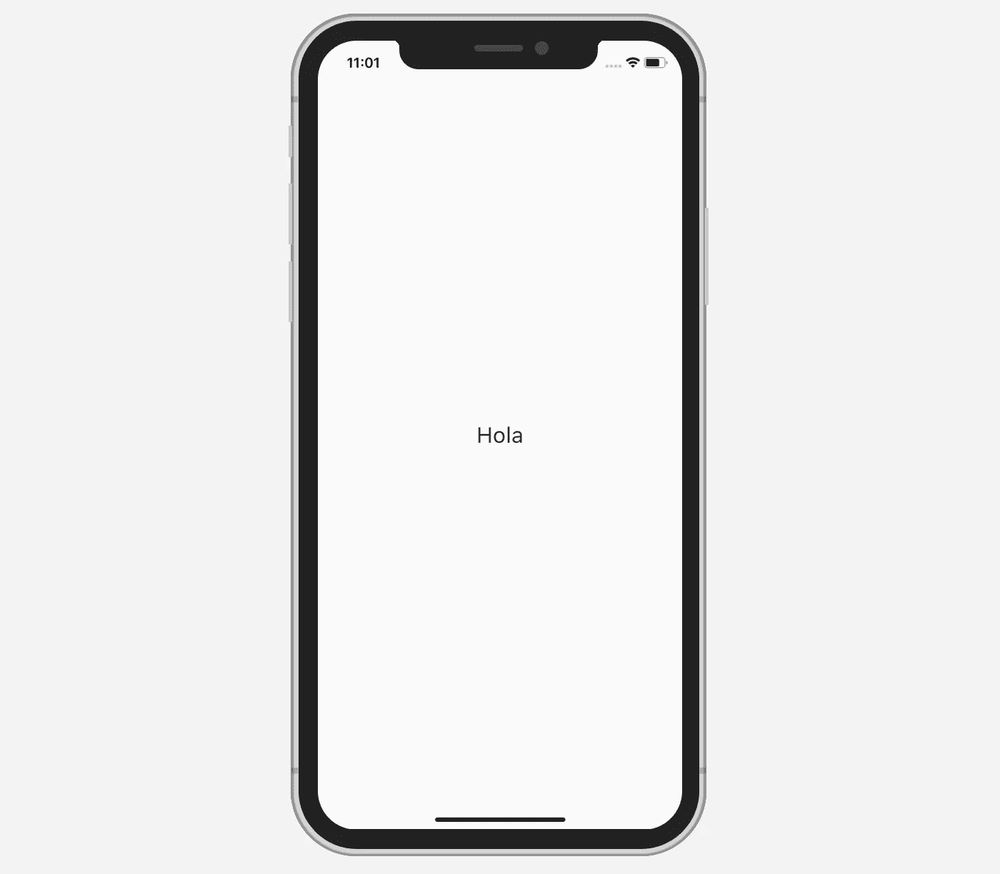

# 分三步本地化你的 Flutter 应用

> 原文：<https://levelup.gitconnected.com/how-to-localize-your-flutter-app-in-3-steps-f0e55b96f934>

## 不需要第三方软件包

今天我们将学习如何轻松地用不同的语言本地化一个 Flutter 应用程序。它包括三个步骤:

*   创建一个包含本地化值和引用它的`LocalizationsDelegate`的文件
*   将支持的语言列表添加到`MaterialApp`
*   在您的`Widget`中引用本地化值

完成的项目的源代码可以在文章的底部找到。

# 我们开始吧

在我们开始添加本地化的`String`之前，首先我们需要在`pubspec.yaml`文件中添加`flutter_localizations`:

现在，我们准备一步一步地工作，并将我们的应用程序本地化为英语和西班牙语。

# 1)创建 AppLocalizations 类和 LocalizationsDelegate

为了简单起见，在我们的应用程序中，我们只需要为一个词提供不同的语言支持:“Hello”。这就是`AppLocalizations`类和`LocalizationsDelegate`的样子(它们可以在同一个文件中创建):

我们可以看到在`AppLocalizations`文件中有一个`Map`，包含作为键的语言代码和作为值的字符串的`Map`。

我们还有一个名为`hello`的变量，它根据当前选择的语言获取值。

在实际情况下，您将有更多的`String`要本地化，所以您需要做的就是修改`_localizedValues`映射并为每个字符串创建一个变量。

# 2)向 MaterialApp 添加支持的语言

我们在这里需要做的就是引用我们之前创建的 AppLocalizationsDelegate 类，并添加一个`Locale`列表:

请注意，我们还添加了其他代表:

`GlobalMaterialLocalizations.delegate
GlobalWidgetsLocalizations.delegate
GlobalCupertinoLocalizations.delegate`

这些代理翻译内置小部件包含的。`AppLocalizationsDelegate`负责我们自定义的值。

# 3)引用小部件中的本地化值

最后，我们能够通过在`Text`小部件中显示本地化的`String`来完成这个过程:

让我们通过将`MaterialApp`的地区设置为西班牙语来测试实现:

如果我们运行该应用程序，我们将看到如预期显示的“Hola ”:

# 资源

GitHub 上提供了源代码:

 [## zafarivaev/Flutter-本地化应用程序

### 新的颤振应用。这个项目是颤振应用的起点。一些资源让你…

github.com](https://github.com/zafarivaev/Flutter-LocalizedApp) 

# 包扎

想了解更多关于旋舞镖的知识？请随意查看我的其他相关文章:

*   [在 Flutter 中创建跨平台标签式 App](https://medium.com/better-programming/create-a-cross-platform-tabbed-app-in-flutter-c728ca5e30f6)
*   [如何在 Dart](https://medium.com/better-programming/how-to-implement-the-delegation-design-pattern-in-dart-d782de77c886) 中实现委托设计模式

感谢阅读！