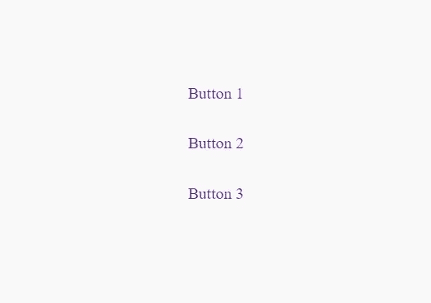
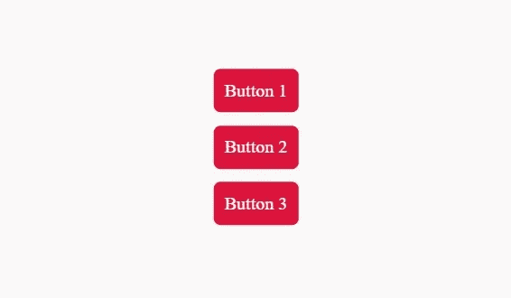

# 如何遍历 jQuery 对象？

> 原文：<https://levelup.gitconnected.com/how-to-loop-through-jquery-objects-3ace47e1f6d0>

## 学习使用*迭代 jQuery 对象。每一个()*和(this)都是任何一个前端开发者不可或缺的技能。


照片由[蒂内·伊万尼奇](https://unsplash.com/@tine999?utm_source=medium&utm_medium=referral)在 [Unsplash](https://unsplash.com?utm_source=medium&utm_medium=referral) 拍摄

作为一个以一头扎进 python 开始其编码生涯的人，我一直是干净简洁代码的崇拜者。这也是我喜欢使用 jQuery 的原因之一，因为它有简洁的一个词的函数和方法。

jQuery 对象是一个类似数组的集合，在创建新的 HTML 元素或选择现有元素时返回。根据 [jQuery 的网站](https://learn.jquery.com/using-jquery-core/jquery-object/)，

> 当创建新元素(或选择现有元素)时，jQuery 返回集合中的元素。许多不熟悉 jQuery 的开发人员认为这个集合是一个数组。毕竟，它有一个 DOM 元素的零索引序列、一些熟悉的数组函数和一个`.length`属性。

在本分步指南中，我们将了解如何使用 ***遍历现有元素的 jQuery 对象。每个()*** 和嵌套它的 ***【本】*** 选择器。**的官方语法*。each()***

```
jQueryObject.**each(function);**
```

我们将创建三个按钮，当点击时，在样式和非样式状态之间切换。要预览它，请前往下面的结果选项卡，并尝试单击按钮。

让我们首先用基本的 HTML 和 CSS 创建三个按钮:

围绕三个锚标记的 div 的基本标记。

每个按钮的基本样式。

到目前为止，我们的按钮有如下图所示的基本样式。添加类”。按钮样式”添加到每个按钮上，以便与下面第二张图片中的按钮相匹配，我们将使用 jQuery 的 ***。每个()*** 函数和 ***【本】*** 选择器。



没有任何样式的按钮。



按钮一旦我们使用**添加“按钮风格”类。**各()函数。

现在我们的工作站已经准备好了，让我们从 jQuery/Javascript 开始。

## 第一步:

使用选择器 [***$("创建一个 jQuery 对象，其中包含所有锚标记。【类名】)***](https://learn.jquery.com/using-jquery-core/selecting-elements/) ***，*** 在我们这里就变成了 ***$(”。按钮”)。*** 为了便于引用，将对象赋给一个变量， ***按钮列表*** *。*

## 第二步:

**敷*。 ***按钮列表*** 上的每个()*** 函数都会将另一个函数作为它的自变量。我们将在下一步中定义该函数。

## 第三步:

因为我们希望当我们点击每个按钮时神奇的事情发生，我们必须嵌套 ***。在我们要传递给 ***的函数里面点击()*** 方法。*每()**法。

## 第四步:

最后，加上 ***。toggleClass()* 同样，我们将使用 ***$(this)*** 选择器在 ***按钮列表*** *中循环时，将该函数应用到我们代码所在的按钮上。***

总而言之，我们创建了一个包含所有按钮的 jQuery 对象。然后，我们应用了 ***。每个()*** 方法，里面都有 ***。click()*** 方法负责仅在每个按钮被单击时应用该函数。最后，我们把函数 ***。toggleClass()*** 内部，将按钮从不样式化改为样式化，反之亦然。

我希望这篇指南能够帮助您认识到 jQuery 循环的强大之处。如果您有任何问题或顾虑，请在下面的回复部分提问，我会尽力回复。

## 资源:

1.  jQuery 关于 [*的文档。每个()*](https://api.jquery.com/each/)*[*。点击()*](https://api.jquery.com/click/)*[*。toggle class()*](https://api.jquery.com/toggleclass/)*[*$(此)*](https://api.jquery.com/jquery/) *。****