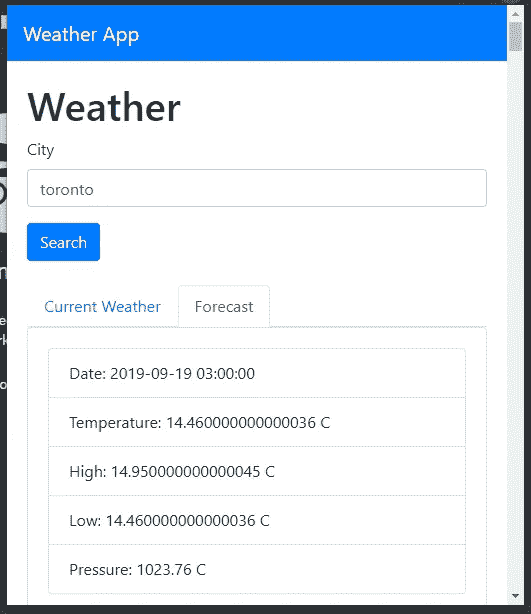

# 如何用 React 构建一个 Chrome 扩展

> 原文：<https://levelup.gitconnected.com/how-to-make-a-chrome-extension-with-react-129cdcbf1414>

## 使用 React with Hooks 构建一个 Chrome 扩展，通过调用 OpenWeaterMap API 来显示天气。


最流行的网络浏览器 Chrome 和 Firefox 都支持扩展。扩展是使用 HTML、CSS 和 JavaScript 构建的小应用程序，您可以将其添加到浏览器中，以获得默认情况下不包含的附加功能。这使得扩展你的浏览器非常容易。用户需要做的只是从在线商店添加浏览器插件，比如 Chrome 网络商店或 Firefox 商店。

浏览器扩展只是以特定方式包装的普通 HTML 应用程序。这意味着我们可以使用 HTML、CSS 和 JavaScript 来构建自己的扩展——这也意味着我们可以使用 React 或 Vue 这样的前端 JavaScript 框架来构建扩展。

Chrome 和 Firefox 扩展遵循 [Web 扩展 API 标准](https://developer.mozilla.org/en-US/docs/Mozilla/Add-ons/WebExtensions)。

在本文中，我们将构建一个 Chrome 扩展来显示来自 OpenWeatherMap API 的天气。我们将添加搜索，让用户从 API 中查找当前天气和预报，并在扩展的弹出框中显示。

OpenWeatherMap API 可在 https://openweathermap.org/api[获得，你需要注册一个 API 密钥。](https://openweathermap.org/api)

## 入门指南

我们将使用 React 来构建浏览器扩展。如果我们使用 Create React App 创建应用程序，我们可以像平常一样构建应用程序，然后修改项目中的`manifest.json`来创建有效的 Chrome 扩展。

`manifest.json`是额外的配置文件，用来告诉 Chrome 如何将我们的应用作为一个扩展来处理。我们将首先建立应用程序，然后我会告诉你在`manifest.json`需要什么才能让它工作。

为了开始构建应用程序，我们通过运行以下命令来运行 Create React App:

```
npx create-react-app weather-app
```

该命令将创建 React 项目文件夹，其中包含我们将要构建的框架代码。

接下来，我们安装一些构建扩展所需的包。我们需要 Axios 进行 HTTP 请求，需要 Bootstrap 进行样式设计，需要 Formik 进行表单值处理，需要 MobX 进行状态管理，需要 Yup 进行表单验证。

我们通过运行以下命令来安装它们:

```
npm i axios bootstrap formik mobx mobx-react react-bootstrap yup
```

## 构建应用程序

现在我们可以构建我们的天气窗口小部件 Chrome 扩展了。在`App.js`中，将现有代码替换为:

```
import React from "react";
import HomePage from "./HomePage";
import "./App.css";
import { KeywordStore } from "./store";
import Navbar from "react-bootstrap/Navbar";
const keywordStore = new KeywordStore();function App() {
  return (
    <div className="App">
      <Navbar bg="primary" expand="lg" variant="dark">
        <Navbar.Brand href="#home">Weather App</Navbar.Brand>
      </Navbar>
      <HomePage keywordStore={keywordStore} />
    </div>
  );
}export default App;
```

我们在文件中添加了反应助推器`Navbar`和我们的`HomePage`。

接下来在`App.css`中，用以下代码替换现有代码:

```
html,
body {
  min-width: 500px;
}.page {
  padding: 20px;
}
```

我们指定小部件在浏览器中显示时的最小宽度，并在页面中添加一些填充。

接下来，我们创建一个组件来显示当前天气。在`src`文件夹中创建一个名为`CurrentWeather.js`的文件，并添加:

```
import React from "react";
import { observer } from "mobx-react";
import { searchWeather } from "./request";
import ListGroup from "react-bootstrap/ListGroup";function CurrentWeather({ keywordStore }) {
  const [weather, setWeather] = React.useState({}); const getWeatherForecast = async keyword => {
    const response = await searchWeather(keyword);
    setWeather(response.data);
  }; React.useEffect(() => {
    keywordStore.keyword && getWeatherForecast(keywordStore.keyword);
  }, [keywordStore.keyword]);return (
    <div>
      {weather.main ? (
        <ListGroup>
          <ListGroup.Item>
            Current Temparature: {weather.main.temp - 273.15} C
          </ListGroup.Item>
          <ListGroup.Item>
            High: {weather.main.temp_max - 273.15} C
          </ListGroup.Item>
          <ListGroup.Item>
            Low: {weather.main.temp_min - 273.15} C
          </ListGroup.Item>
          <ListGroup.Item>Pressure: {weather.main.pressure} </ListGroup.Item>
          <ListGroup.Item>Humidity: {weather.main.humidity}</ListGroup.Item>
        </ListGroup>
      ) : null}
    </div>
  );
}
export default observer(CurrentWeather);
```

我们从`keywordStore`(我们将在本文稍后构建)中获取搜索关键字，并通过将当前天气传递给`React.useEffect`函数的第二个参数来搜索当前天气。

一旦检索到数据，我们用`setWeather`函数设置数据，并在页面底部的`ListGroup`中显示数据。

我们将最后一行中的组件用`observer`包装起来，这样我们就可以从`keywordStore`中获得最新的`keyword`值。

接下来，我们添加一个组件来显示预测，在`src`文件夹中添加`Forecast.js`并添加:

```
import React from "react";
import { observer } from "mobx-react";
import { searchForecast } from "./request";
import ListGroup from "react-bootstrap/ListGroup";
import Card from "react-bootstrap/Card";function Forecast({ keywordStore }) {
  const [forecast, setForecast] = React.useState({}); const getWeatherForecast = async keyword => {
    const response = await searchForecast(keyword);
    setForecast(response.data);
  }; React.useEffect(() => {
    keywordStore.keyword && getWeatherForecast(keywordStore.keyword);
  }, [keywordStore.keyword]); return (
    <div>
      {Array.isArray(forecast.list) ? (
        <div>
          {forecast.list.map(l => {
            return (
              <Card body>
                <ListGroup>
                  <ListGroup.Item>Date: {l.dt_txt}</ListGroup.Item>
                  <ListGroup.Item>
                    Temperature: {l.main.temp - 273.15} C
                  </ListGroup.Item>
                  <ListGroup.Item>
                    High: {l.main.temp_max - 273.15} C
                  </ListGroup.Item>
                  <ListGroup.Item>
                    Low: {l.main.temp_min - 273.15} C
                  </ListGroup.Item>
                  <ListGroup.Item>Pressure: {l.main.pressure} C</ListGroup.Item>
                </ListGroup>
              </Card>
            );
          })}
        </div>
      ) : null}
    </div>
  );
}
export default observer(Forecast);
```

除了数据在一个列表中之外，它与`CurrentWeather.js`非常相似。所以我们将`forecast.list`映射到一个由`Card`组成的数组中，而不仅仅是渲染它。

接下来，我们在`src`文件夹中创建一个`HomePage.js`文件，并添加:

```
import React from "react";
import { Formik } from "formik";
import Form from "react-bootstrap/Form";
import Col from "react-bootstrap/Col";
import Button from "react-bootstrap/Button";
import { observer } from "mobx-react";
import * as yup from "yup";
import Tabs from "react-bootstrap/Tabs";
import Tab from "react-bootstrap/Tab";
import CurrentWeather from "./CurrentWeather";
import Forecast from "./Forecast";const schema = yup.object({
  keyword: yup.string().required("Keyword is required")
});function HomePage({ keywordStore }) {
  const [initialized, setInitialized] = React.useState(false);const handleSubmit = async evt => {
    const isValid = await schema.validate(evt);
    if (!isValid) {
      return;
    }
    localStorage.setItem("keyword", evt.keyword);
    keywordStore.setKeyword(evt.keyword);
  };React.useEffect(() => {
    if (!initialized) {
      keywordStore.setKeyword(localStorage.getItem("keyword") || "");
      setInitialized(true);
    }
  });return (
    <div className="page">
      <h1>Weather</h1>
      <Formik
        validationSchema={schema}
        onSubmit={handleSubmit}
        initialValues={{ keyword: localStorage.getItem("keyword") || "" }}
      >
        {({
          handleSubmit,
          handleChange,
          handleBlur,
          values,
          touched,
          isInvalid,
          errors
        }) => (
          <Form noValidate onSubmit={handleSubmit}>
            <Form.Row>
              <Form.Group as={Col} md="12" controlId="keyword">
                <Form.Label>City</Form.Label>
                <Form.Control
                  type="text"
                  name="keyword"
                  placeholder="City"
                  value={values.keyword || ""}
                  onChange={handleChange}
                  isInvalid={touched.keyword && errors.keyword}
                />
                <Form.Control.Feedback type="invalid">
                  {errors.keyword}
                </Form.Control.Feedback>
              </Form.Group>
            </Form.Row>
            <Button type="submit" style={{ marginRight: "10px" }}>
              Search
            </Button>
          </Form>
        )}
      </Formik>
      <br />
      <Tabs defaultActiveKey="weather">
        <Tab eventKey="weather" title="Current Weather">
          <CurrentWeather keywordStore={keywordStore} />
        </Tab>
        <Tab eventKey="forecast" title="Forecast">
          <Forecast keywordStore={keywordStore} />
        </Tab>
      </Tabs>
    </div>
  );
}
export default observer(HomePage);
```

我们有一个表单，让用户在搜索框中输入他们选择的城市。提交表单时，商店中会设置`evt.keyword`值。当存储器中的`keyword`值更新时，将执行`CurrentWeather`和`Forecast`组件中的搜索功能。我们还在本地存储中设置了`keyword`。使用本地存储还允许我们根据用户设置的位置为用户保存默认值。

表单验证由 Yup 库通过为表单验证模式创建一个对象来完成。我们将`keyword`字段设为必填字段。

在`useEffect`回调中，我们从本地存储中加载`keyword`并将其设置在 MobX 存储中以触发搜索。

在组件的底部，我们有显示当前天气和预报的选项卡。

接下来在`src`文件夹中创建一个名为`request.js`的文件，并添加:

```
const APIURL = "[http://api.openweathermap.org](http://api.openweathermap.org)";
const axios = require("axios");export const searchWeather = loc =>
  axios.get(
    `${APIURL}/data/2.5/weather?q=${loc}&appid=${process.env.REACT_APP_APIKEY}`
  );export const searchForecast = loc =>
  axios.get(
    `${APIURL}/data/2.5/forecast?q=${loc}&appid=${process.env.REACT_APP_APIKEY}`
  );
```

这是搜索当前天气和预报的 HTTP 请求的代码。

`process.env.REACT_API_APIKEY`是存储在项目根文件夹的`.env`文件中的 OpenWeatherMap API key。

它存储为:

```
REACT_APP_APIKEY='OpenWeatherMap API key'
```

接下来在`src`文件夹中创建一个`store.js`，并添加:

```
import { observable, action, decorate } from "mobx";class KeywordStore {
  keyword = ""; setKeyword(keyword) {
    this.keyword = keyword;
  }
}KeywordStore = decorate(KeywordStore, {
  keyword: observable,
  setKeyword: action
});export { KeywordStore };
```

这是我们存储`keyword`的 MobX 商店，这样我们的组件就可以很容易地设置和访问它们。我们在`HomePage`中设置它，并在`CurrentWeather`和`Forecast`组件中获取它。

## 为浏览器打包应用程序

为了创建 Chrome 扩展，我们需要修改`manifest.json`。

在那里，将现有代码替换为:

```
{
  "short_name": "Weather Extension",
  "name": "Weather Extension",
  "icons": {
    "16": "favicon.ico",
    "48": "logo192.png",
    "128": "logo512.png"
  },
  "content_security_policy": "script-src 'self' 'sha256-WDhufSqZOEoWULzS4Nwz11MNyHzZClVYbQ2JSt1vfkw'; object-src 'self'",
  "permissions": [],
  "manifest_version": 2,
  "version": "0.0.1",
  "browser_action": {
    "default_popup": "index.html",
    "default_title": "Weather Widget"
  }
}
```

这些键值中的一些必须按照它们在这个文件中的方式进行设置。`manifest_version`必须设置为`2`，且`version`必须大于 0。

此外，我们需要:

```
"browser_action": {
  "default_popup": "index.html",
  "default_title": "Weather Widget"
}
```

这显示了在我们安装扩展之后，当点击扩展的图标时的弹出窗口。

## 在 Chrome 中加载应用程序

接下来，我们运行`npm run build`来构建生产文件。然后到 Chrome 里的`chrome://extensions/`。切换到开发者模式并点击“加载解压”，然后在打开文件对话框出现时选择`build`文件夹。

完成后，我们应该会在屏幕的右上角看到一个图标和一个弹出窗口，如下图所示:

