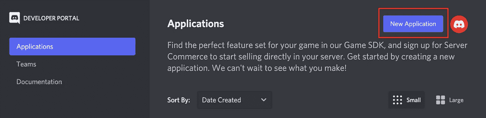
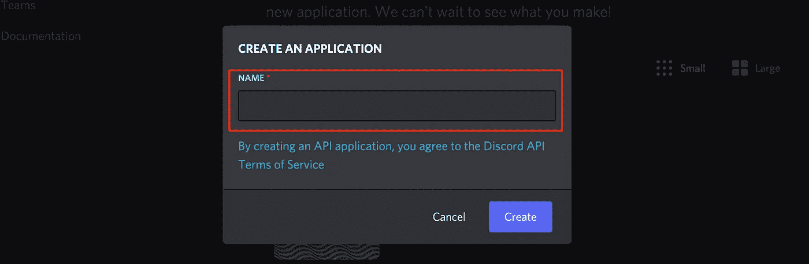
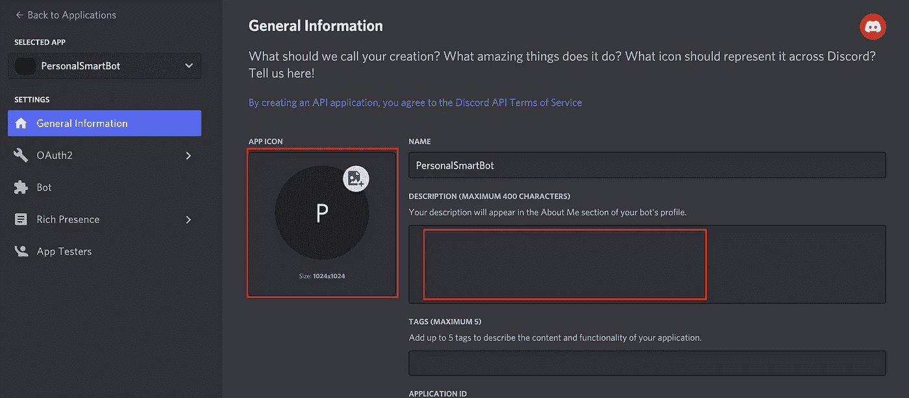
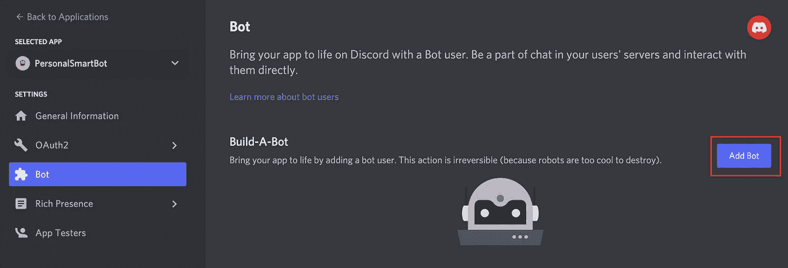
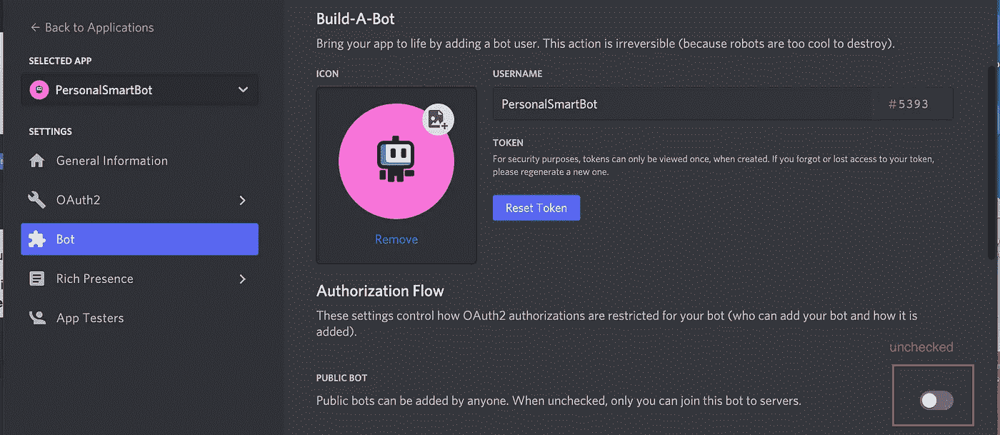
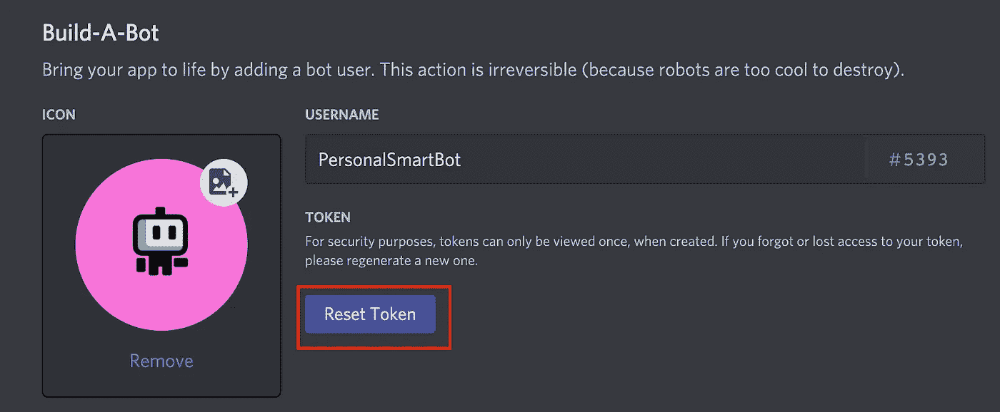
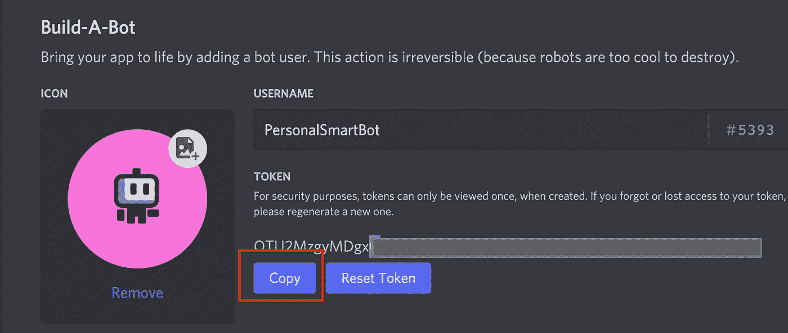
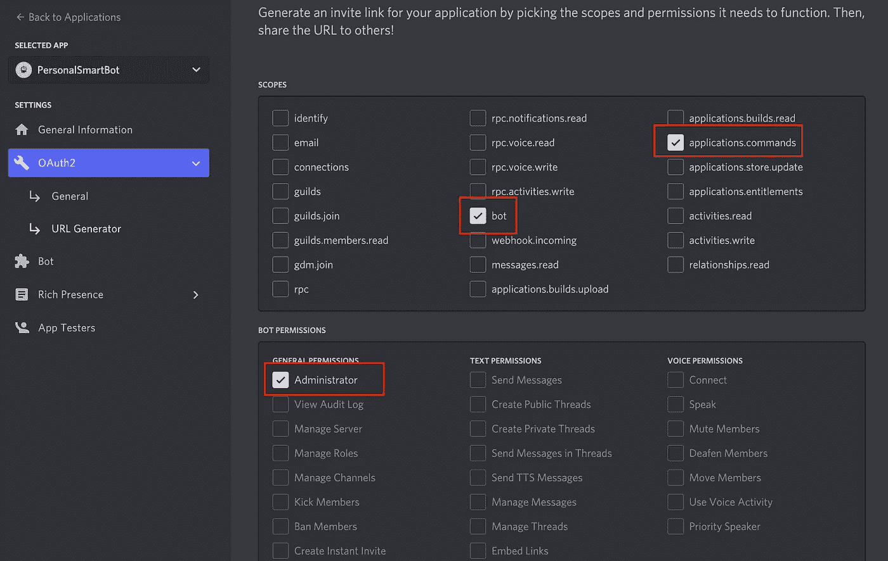
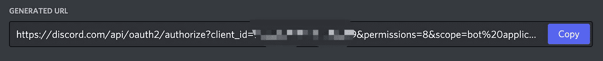
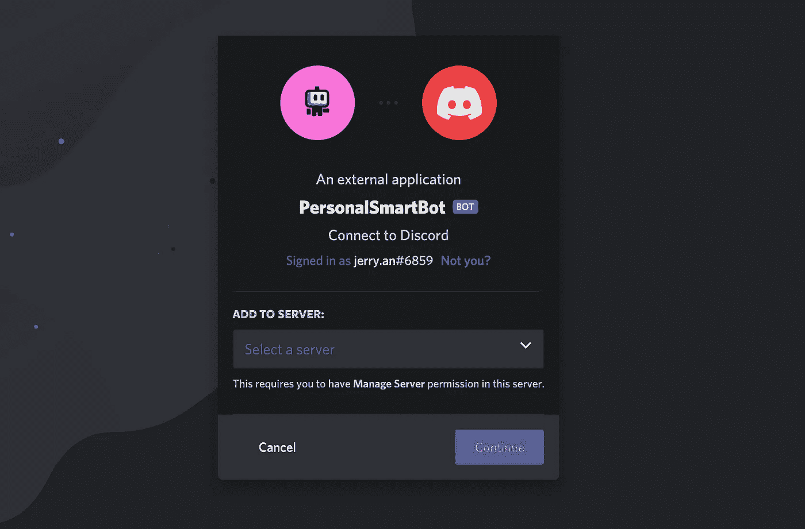

# 如何为你的服务器制作一个不和谐机器人(第 1 部分)

> 原文：<https://levelup.gitconnected.com/how-to-make-a-discord-bot-for-your-server-part-1-835650fee20a>

Discord 是一个免费的在线服务，允许你制作你的服务器，在那里你可以创建你的游戏，有你的聊天室，和其他人交谈。

它还提供了一种单独的用户帐户，称为 bot 帐户。在这一系列的文章中，我们将看看如何建立你的第一个不和谐机器人。

这篇文章是这个系列的第一部分。它包括以下内容。

*   创建一个 bot 帐户
*   邀请您的机器人

# 创建一个 bot 帐户

要使用 Discord，您必须首先创建一个 Discord bot 帐户

1.  报名[不和谐](https://discord.com/)
2.  导航到[应用页面](https://discord.com/developers/applications)
3.  点击**新增应用**按钮

4.为应用程序命名，然后单击“**创建**”

5.向应用程序提供一些一般信息。

6.**添加一个机器人**用户

> B 在与一个机器人用户不和的情况下让你的应用程序活跃起来。在用户的服务器上参与聊天，并与他们直接互动。

7.确保未选中**公共机器人**复选框，因为我们是唯一将该机器人加入服务器的人。

8.**重置令牌** & **复制**

# 邀请您的机器人

我们做了一个机器人用户；是时候邀请它加入我们的 Discord 服务器了。

1.  导航到[应用程序](https://discord.com/developers/applications)页面并点击您创建的机器人

2.转到“OAuth2”选项卡

*   检查**应用程序命令**
*   检查“范围”下的“**机器人**
*   查看**管理员**下的 bot 权限

3.**在底部复制**生成的 URL。您可以使用它将我们的机器人添加到服务器。

4.现在将 URL 粘贴到您的浏览器中，选择要邀请机器人的服务器，然后单击“**授权**”

我希望你喜欢读这篇文章。如果你愿意支持我成为一名作家，可以考虑成为一名媒体成员。你还可以无限制地访问媒体上的每个故事。