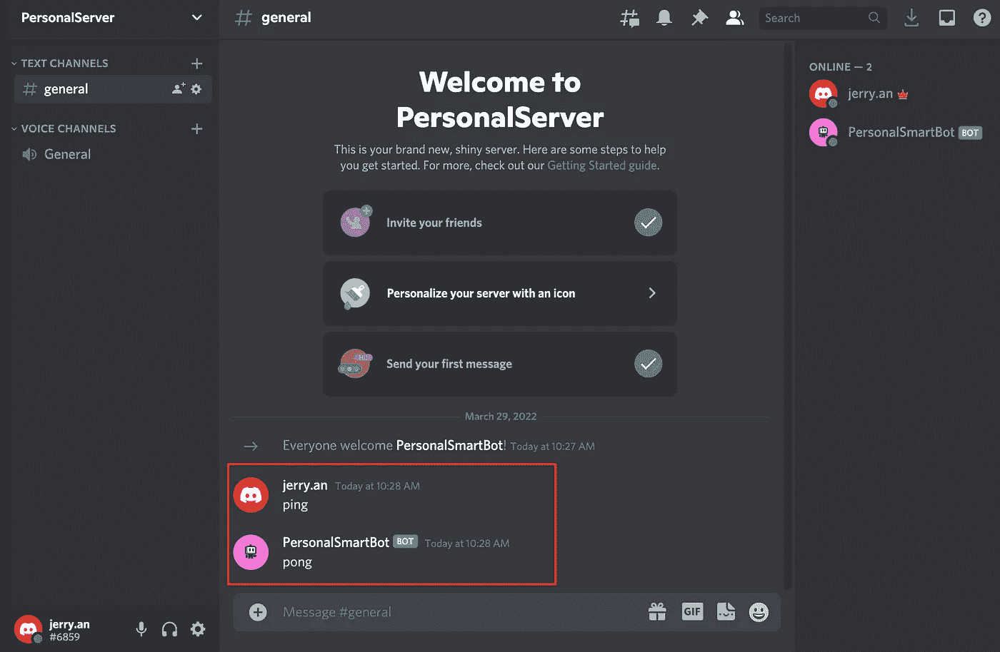
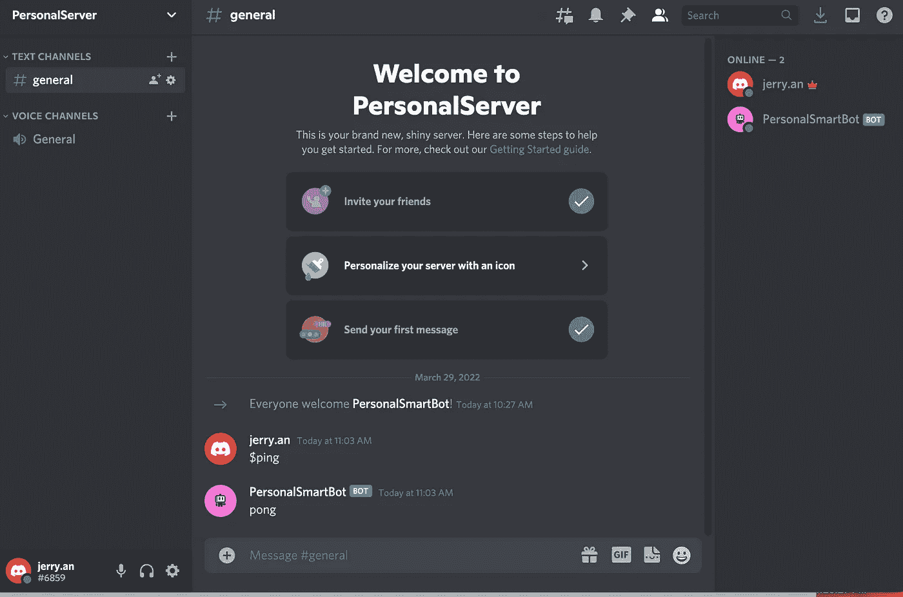
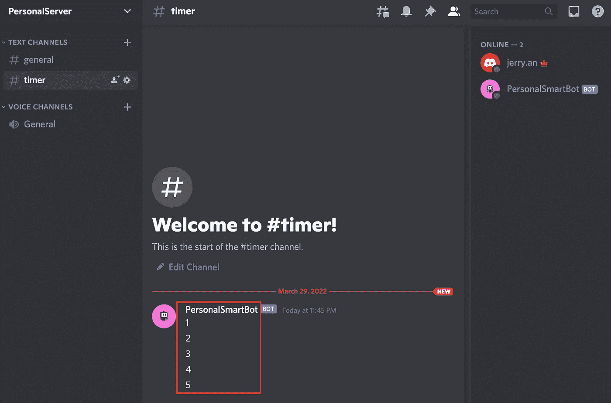

# 如何为你的服务器制作一个不和谐机器人(第 2 部分)

> 原文：<https://levelup.gitconnected.com/how-to-make-a-discord-bot-for-your-server-part-2-20fb9d741007>

Discord 是一个免费的在线服务，允许你制作你的服务器，在那里你可以创建你的游戏，有你的聊天室，和其他人交谈。

它还提供了一种特殊类型的用户帐户，称为 bot 帐户。在这一系列的文章中，我们将看看如何建立你的第一个不和谐机器人。

这篇文章是系列文章的第二部分，我们将通过一些例子。如果你想知道如何创建一个机器人帐号和邀请一个机器人，请看第一部分。

 [## 如何为你的服务器制作一个不和谐机器人(第 1 部分)

### 不和谐是一个免费的在线服务，让你可以让你的服务器，在那里你可以创建你的游戏，有你的…

levelup.gitconnected.com](/how-to-make-a-discord-bot-for-your-server-part-1-835650fee20a) 

# 快速示例

下面是一个使用 discord.py 库的机器人的快速示例。它将使用您的令牌登录，并用“pong”响应任何显示“ping”的消息。

# 命令示例

我们将最终需要创建多个命令来与使用不和谐机器人的用户进行交互。幸运的是，`discord.py`有一个内置的指挥系统，可以让我们做到这一点。

当我们调用以“ *$ping* 开头的命令时，机器人会以“ *pong* 作为响应

# 循环任务示例

制作 bot 时最常见的操作之一是让一个循环以指定的时间间隔在后台运行。

在示例中，我们创建了一个每 10 秒运行一次的后台任务，并向特定通道发送消息。

相当简单有趣？对吗？

如果你愿意支持我成为一名作家，可以考虑成为[一名灵媒](https://jerryan.medium.com/membership)。你还可以无限制地访问媒体上的每个故事。