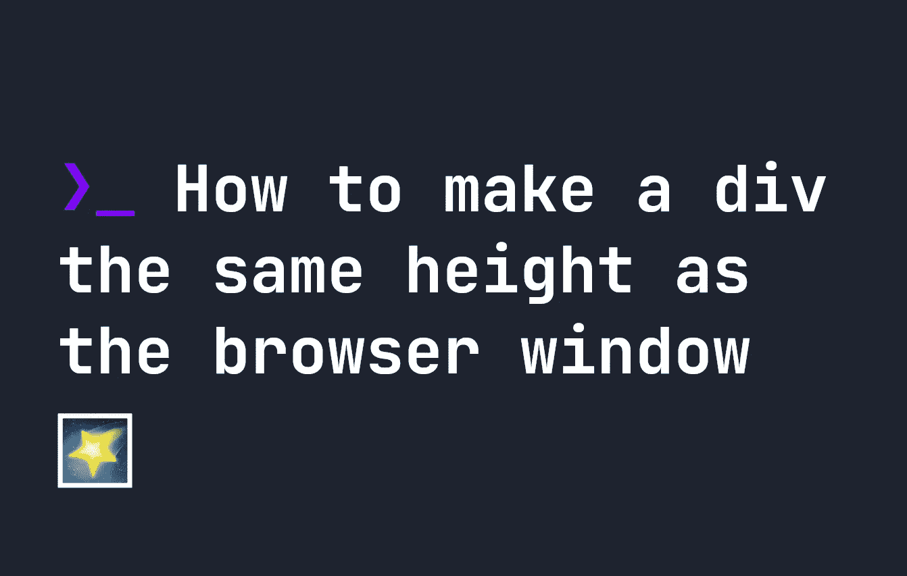

# 如何让一个 div 和浏览器窗口一样高

> 原文：<https://levelup.gitconnected.com/how-to-make-a-div-the-same-height-as-the-browser-window-1ac5f2a71128>



您可能认为让一个`div`元素与您的浏览器高度相同会像下面这样简单:

```
div {
    height: 100%;
}
```

然而，不幸的是，事实并非如此。如果你想知道为什么`height: 100%;`不能使一个元素达到屏幕的整个高度，那是因为在 CSS 中必须定义一个高度来使用百分比。由于`body`标签没有预定义的高度，CSS 不知道这里的`100%`是什么意思。所以`div`元素不会变成浏览器高度的 100%。

# 如何让一个 div 和窗口一样高

制作一个和你的浏览器窗口一样高的 div 相对来说比较简单，首先要了解一个叫做`vh`的单元。`vh`代表视口高度，是表示浏览器窗口当前高度的单位。`100vh`为全高，小于该值的数字为该高度的百分比。

不用写`height: 100%`，我们可以把`height: 100vh`应用到任何元素，让它和浏览器窗口一样大。

```
div {
    height: 100vh;
}
```

它也适用于代表浏览器窗口完整的`100vw`，`vw`代表**视窗宽度。**

# 分级编码

感谢您成为我们社区的一员！更多内容见[升级编码出版物](https://levelup.gitconnected.com/)。
跟随:[推特](https://twitter.com/gitconnected)，[领英](https://www.linkedin.com/company/gitconnected)，[通迅](https://newsletter.levelup.dev/)
**升一级正在转型理工大招聘➡️** [**加入我们的人才集体**](https://jobs.levelup.dev/talent/welcome?referral=true)