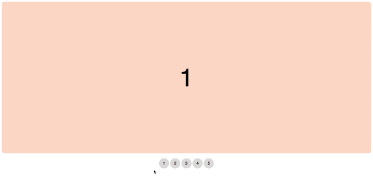
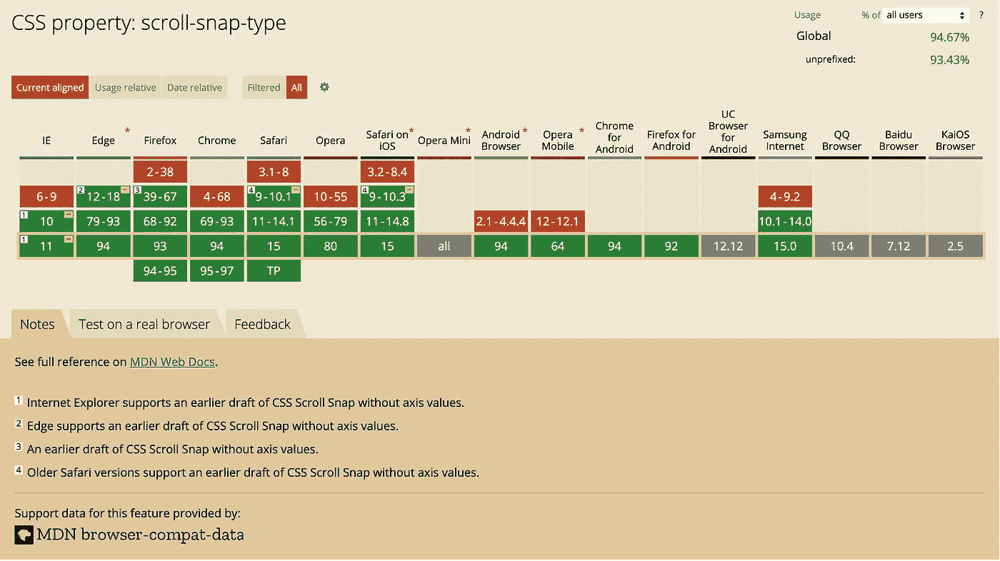

# 如何制作一个完全可访问的 CSS 专用转盘

> 原文：<https://levelup.gitconnected.com/how-to-make-a-fully-accessible-css-only-carousel-40e8bd62032b>

## 没有 JavaScript！没有 jQuery 插件！


奥尼莎·李在 [Unsplash](https://unsplash.com/s/photos/carousel?utm_source=unsplash&utm_medium=referral&utm_content=creditCopyText) 上的照片

首先，什么是旋转木马？旋转木马一个接一个地展示元素的集合。也称为“幻灯片”和“滑块”。这些通常用于容纳网站上的大量内容，否则这些内容将无法容纳。

> “尽管旋转木马没有那么有效，但我不认为它们会很快消失。”
> 
> — [布拉德·弗罗斯特](https://bradfrost.com/blog/post/carousels/)

在网上寻找不可接近的旋转木马是很常见的。互联网上超过一半的旋转木马有几个可访问性问题。很多时候，这些是不可访问的，因为人们不太重视可访问性。通常，这也是因为有太多的可访问性因素和需求，以至于错过了其中的一些。

在这篇文章中，我们将看看旋转木马中一些常见的可访问性问题。我还将展示如何构建这个旋转木马，以及如何通过几个步骤让它更容易访问。



# 旋转木马中有哪些常见的可访问性问题？

就实现和特征而言，并非所有的传送带都是相同的。但是一些常见的因素在可访问性上出了问题。旋转式传送带中一些常见的可访问性问题是:

1.  几乎每个旋转木马都有不同的结构。因此也没有帮助屏幕阅读器导航的标准化。
2.  许多屏幕阅读器用户无法分辨他们的虚拟光标何时进入或离开转盘。这导致他们甚至不知道它是否存在，也不知道如何退出。
3.  很多时候，幻灯片上的控件与它们覆盖的内容相比，对比度太低或者太小。这使得用户很难使用它们。
4.  如果转盘幻灯片在旋转，屏幕和键盘用户可能会感到困惑。他们很难理解前面不断变化的内容。自动旋转也会给有认知障碍的用户带来问题。

# 外面已经有什么了？

为了研究，我在三个现成的滑块上制作了一些原型:

1.  [**UiKit 滑块或幻灯片**](https://getuikit.com/docs/slideshow)**——**捆绑在一起，很轻便。但是，在那之前，我只用过 UiKit 的较小的东西，比如砖石布局或手风琴。旋转木马已经是更大的东西了。除此之外，没有提供键盘导航和通过 tab 的可访问性。
2.  [**Swiper Slider**](https://swiperjs.com/demos)**—**这个 carousel 可以做很多事情，只允许你导入 Swiper 的核心和你需要的实际组件。这个旋转木马是完全无障碍的。
3.  [**a11y-slider**](https://a11yslider.js.org/#examples)**——**a11y-slider 完全用 JavaScript 构建，很难定制。但是激发我灵感的是完全跳过旋转木马的可能性。

我很快感觉到我们不需要这些，我是对的。我设法通过 CSS scroll-snap 完整地安装了 carousel。这样，我就不依赖于任何现成的 JavaScript 解决方案。

# 让我们开始建造吧

## 步骤 1 —设置基本的 HTML/CSS 结构

设置基本的 HTML/CSS 结构

## 步骤 2-添加滚动捕捉

使用 CSS 滚动捕捉，你可以在滚动时将元素固定在某个位置。这在与您的转盘交互时带来了出色的用户体验。

Scroll-snap 已经有了很好的浏览器分布。



[caniuse.com](https://caniuse.com/?search=scroll-snap-type)

## 一个运转良好的旋转木马所需要的一切都已经在这里发生了:

```
.slides {
  **overflow-x: scroll;
  scroll-snap-type: x mandatory;
  scroll-behavior: smooth;**
}
```

## 让我们详细看看他们是怎么做的:

```
overflow-x: scroll;
```

**滚动** 内容被水平裁剪以适合填充框。浏览器决定元素的内容是否显示滚动条。

```
scroll-snap-type: x mandatory;
```

**x** 当在布局中的某些点上滚动时，可以捕捉到这些点。

**强制** 当与强制值结合使用时，会导致浏览器在滚动动作完成时总是自动滚动到最近的项目。

## 将以下内容添加到您的幻灯片项目中:

```
.slides-item {
  **scroll-snap-align: start;** }
```

## 让我们来看看它的详细功能:

```
scroll-snap-align: start;
```

**开始** 以此，我们确定每张幻灯片的开头标记了滚动时停止的点。

添加滚动捕捉

## 步骤 3 —用 CSS 移除滚动条

如果你想隐藏滚动条，你可以添加以下内容。这个解决方案非常有效。保持滚动条可见是有好处的，就我个人而言，我不觉得它很漂亮。

```
**// Hides scrollbar in firefox**
.slides {
  scrollbar-width: none;
}**// Hides scrollbar in webkit and blink powered browsers**
.slides::-webkit-scrollbar {
  display: none;
}
```

用 CSS 移除滚动条

## 第 4 步-使转盘无障碍

发展的一个重要方面是无障碍。从可用性的角度来看，传送带是有争议的，因为它们的内容可能很难访问。因此，您可以通过确保一定程度的可访问性来提高总体可用性。

为了使旋转木马更加有效，需要记住的一些重要事项是:

1.  **Tabindex**
    所有功能，包括轮播元素之间的导航，都可以通过键盘上的“焦点”进行操作。
    将值 0 添加到 tabindex，这将元素放置在默认导航顺序中。这允许通常不可聚焦的元素(如`<div>`、`<span>`、`<p>`和`<a>`，没有`href`)获得键盘焦点。
2.  **Aria-Label**
    如果没有设置 aria-label，HTML 元素将使用其文本内容来更详细地描述它。
3.  **跳过内容** 我们还允许屏幕阅读器在键盘焦点处通过隐藏的“跳过”链接跳过轮播。在这种情况下，一个小的覆盖图会覆盖在传送带上，并提供跳到下一个元素的选项。
4.  **请勿使用自动播放** 如果转盘旋转，用户可能很难在每张幻灯片改变前阅读其内容。结果，键盘访问转盘及其内容可能变得困难或不可能。更改内容通常不会传达给屏幕阅读器用户。
5.  [**颜色对比**](https://contrast-ratio.com/)
    经常检查幻灯片内容上显示的文本的颜色对比和大小。此外，允许用户与控件连接，在焦点或鼠标悬停期间向用户显示状态。

完全无障碍旋转木马的最终版本

# 结论

感谢像 scroll-snap 这样的现代功能，当我们想要为我们的网站创建一个简单的旋转木马时，我们不必求助于一个庞大的库。即使加载或运行 JavaScript 由于某种原因失败，这种解决方案也能工作。此外，这甚至在不支持滚动捕捉的旧浏览器中也能工作。当然，该解决方案在这些浏览器中并不完美，但它是可用的。