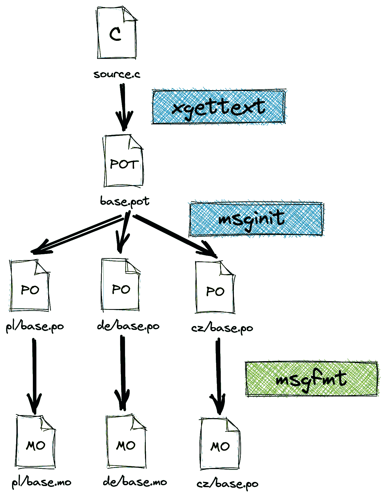
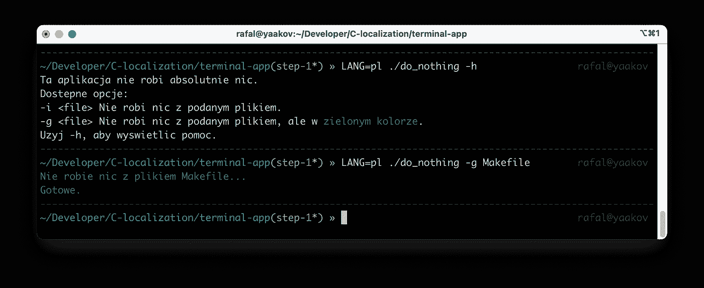
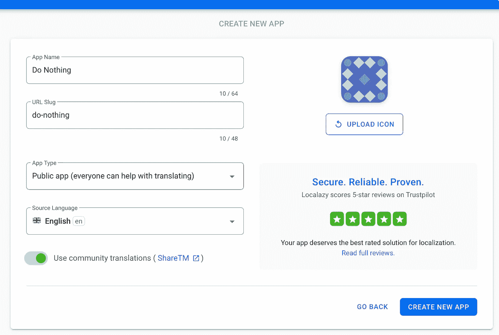
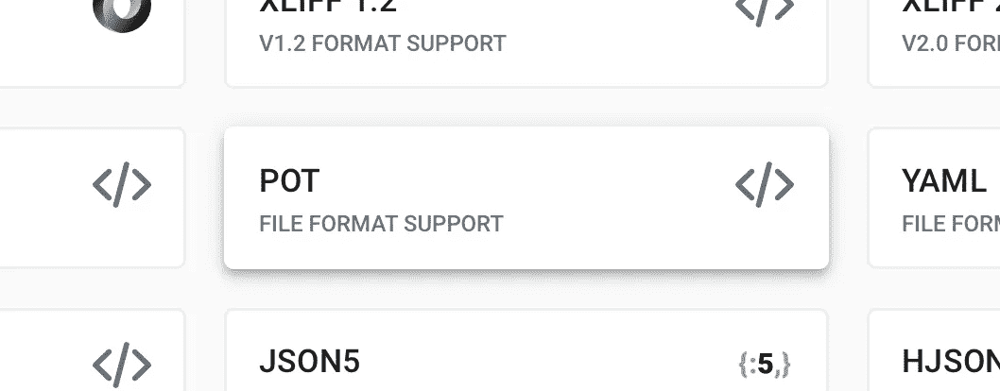
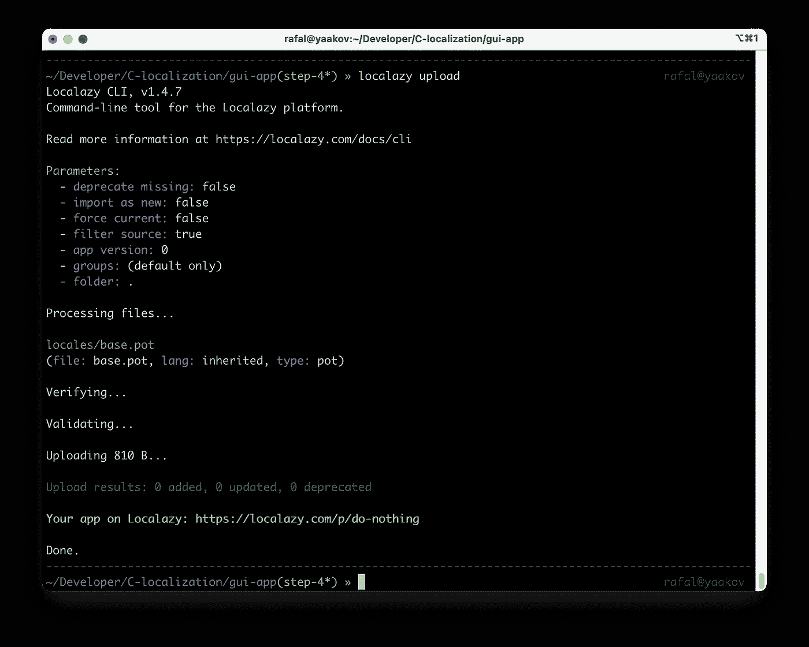
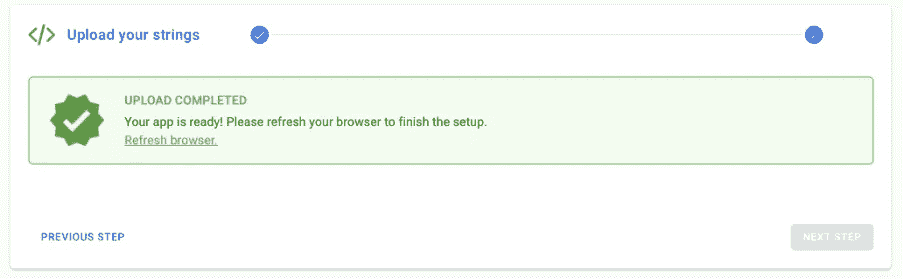
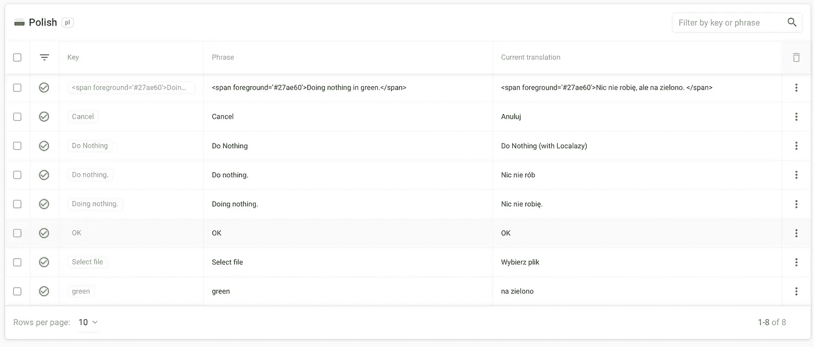
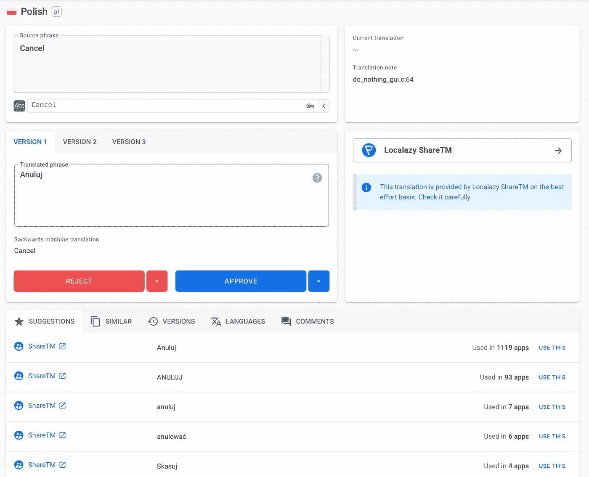
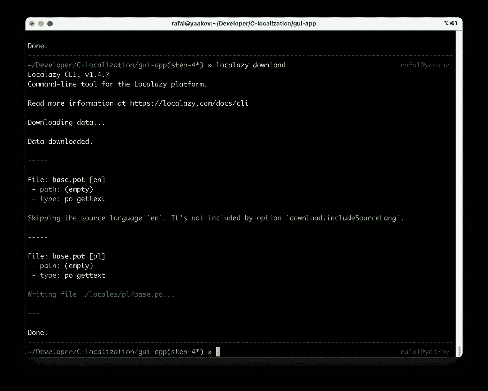
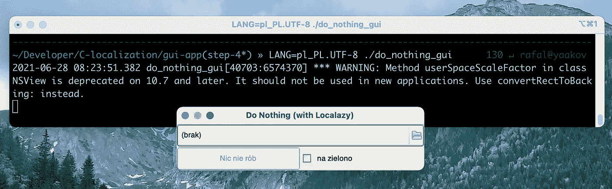

# 如何用 C 语言制作多语言应用程序

> 原文：<https://levelup.gitconnected.com/how-to-make-a-multi-language-localized-application-in-c-8862e1d1f64f>

## 使用 Gettext 和 Localazy 翻译 GTK 应用程序

通常，当你开始开发一个新的应用程序时，它的界面是用一种特定的语言编写的，如果你想接触到国际观众，可能是英语。通过将你的应用翻译成其他人类语言，你可以增加安装、使用和推荐它的人数。

几周前，我开始学习 C 编程语言。改变 C 对软件工程的思考方式是相当具有挑战性的。在学习如何处理字符串时，我想知道如何解决多语言应用程序的问题。


除非另有说明，文中所有图片均为作者。

在这篇文章中，我将向你展示如何使用 Gettext 函数来翻译一个终端应用程序和一个 GUI(使用 GTK 制作)。我将向您展示如何使用环境变量测试这个解决方案。最后，我将向您展示如何管理多种翻译，甚至如何使用 [Localazy](https://localazy.com/) 来帮助自己进行机器翻译。

要理解这篇文章，你需要的只是 C 语言的基础知识，可能还需要熟悉一些 make 工具。

[🔔想要更多这样的文章？在这里签名。](https://fischerbach.medium.com/membership)

# 源代码

为文章准备的知识库:

[https://github.com/fischerbach/C-localization](https://github.com/fischerbach/C-localization)

每个部分都有自己的分支。`master`分支包含最终源代码。

# 终端应用

让我们首先处理一个简单的终端应用程序。

[https://github . com/fischer Bach/C-localization/blob/step-0/terminal-app/do _ nothing . C](https://github.com/fischerbach/C-localization/blob/step-0/terminal-app/do_nothing.c)

源代码中散布着几个包含消息的字符串。第一个想法是将它们收集到一个数组中。

现在，它们可以很容易地被翻译并存储在单独的变量中。然后我们可以使用条件编译并将适当的语言传递给构建工具:

这种解决方案有几个缺点。

首先，在编译阶段，你必须选择语言版本。生成的二进制文件将只包含一种语言。在资源有限的环境中，例如嵌入式，这可能是有意义的。但是最终用户必须下载适合他们的版本。

其次，只要只有几个固定的字符串，这很容易管理。但是如果软件继续被开发，这个数字可能会迅速增加。此外，一些标签可能会停止使用。那么它们会不必要地占用内存。

最后，第三，它降低了代码的可读性。什么可读性更强？

您可以尝试通过使用哈希表来解决这个问题，但是这有点重复劳动，并且不能解决前面提到的限制。幸运的是，有一个现成的解决方案——`Gettext`库和工具。

# Gettext

GNU gettext 是一个通用的工具集，用于生成多语言消息。它提供了一个框架，以最小的努力支持翻译的消息字符串。它支持多种语言。

在上一篇文章中，我描述了如何在 Python 中使用它:

[](https://blog.devgenius.io/how-to-build-a-multi-language-dashboard-with-streamlit-9bc087dd4243) [## 如何使用 Streamlit 构建多语言仪表板

### Streamlit + Gettext + Localazy

blog.devgenius.io](https://blog.devgenius.io/how-to-build-a-multi-language-dashboard-with-streamlit-9bc087dd4243) 

使用模式非常简单。



首先，我们需要修改源代码并标记要翻译的字符串。

[https://github . com/fischer Bach/C-localization/blob/step-1/GUI-app/do _ nothing _ GUI . C](https://github.com/fischerbach/C-localization/blob/step-1/gui-app/do_nothing_gui.c)

注意，我们添加了一个预处理宏来将`gettext`函数缩短为`_`。这是标记本地化字符串的常用方法。接下来，我们从应用程序源代码生成一个文件，其中包含标记为要翻译的字符串。

```
xgettext -k_ -o locales/base.pot — language=C do_nothing.c
```

通常`xgettext`会寻找文本周围的`gettext`功能，所以我们需要使用`-k_`选项来确定一个新的名称。输出是模板 POT(可移植对象模板)文件。

它包含每一个本地化的文本。我们用它来创建包含其他语言版本的文件。

```
msginit --input=locales/base.pot --locale=pl --output=locales/pl/base.po
```

这些是 PO(可移植对象)文件，包含翻译文本。

最后，为了在我们的应用程序中使用翻译，这些 PO 文件被转换成 MO(机器对象)文件。

```
msgfmt --output-file=locales/pl/LC_MESSAGES/base.mo locales/pl/base.po
```

这听起来可能很复杂，但基本上可以归结为使用几个基本命令，然后可以将其内置到`Makefile`中。

注意目录结构的保存(尤其是`LC_MESSAGES`):

**本节的源代码在** `**step-1**` **分支中。**

作为一个练习，fork repository，尝试创建到您的母语的翻译(也许创建拉请求😉).

# 测试

为了在终端中测试我们的解决方案，我们需要设置“locale”变量。UNIX 平台使用环境变量:

*   `LANG`
*   `LANGUAGE`
*   `LC_COLLATE`、`LC_CTYPE`、`LC_MESSAGES`、`LC_MONETARY`、`LC_NUMERIC`、`LC_TIME`

以确定要使用哪个区域设置。

当应用程序启动时，它会查看 LANG 环境变量的值。通过在输出可执行文件的名称前设置 LANG 变量，可以临时更改终端会话中的语言环境:

```
LANG=pl ./do_nothing
```



如您所见，我们的应用程序现在尊重用户的地区设置。

# GTK 2.0

我们要看的下一个应用程序有一个使用 GTK+2.0 库实现的 GUI。请注意，这是一个相当古老的 GTK 版本。然而，我们的应用程序非常简单，甚至可以使用更新的 3.0 版本进行编译。此外，就翻译而言，无论使用什么库和版本，过程都是相似的。

[https://github . com/fischer Bach/C-localization/blob/step-1/GUI-app/do _ nothing _ GUI . C](https://github.com/fischerbach/C-localization/blob/step-1/gui-app/do_nothing_gui.c)

该应用程序与以前的终端应用程序具有类似的“功能”，但具有一些图形界面。

有些行可能会造成困难，例如 HTML 格式的标签。

用`Gettext`和`GTK`没多大区别。

Glib 提供了一个`gi18n`头文件，我们包含了这个头文件。本地化文本的标记与上一个示例完全相同。

结果:

奇妙的是，GTK 还自动翻译内置对话窗口标签的标签！

**本节的源代码在** `**step-2**` **分支中。**

# 可能的问题

在工作过程中，我遇到了一些棘手的问题。

## 字符集编码

如果您的语言使用扩展字符集，请记住在 PO 文件头中设置 UTF-8(或另一个合适的字符集)。

[https://gist . github . com/fischer Bach/E4 cbe6b 4531 CB 174 f 192 a 7 df 71 b 83488](https://gist.github.com/fischerbach/e4cbe6b4531cb174f192a7df71b83488)

## 正确的区域目录结构

保持目录结构能够被`Gettext`理解是很重要的。

尤其是`LC_MESSAGES`子目录。

## 复杂的工作流程

记住所有生成翻译文件的命令可能会很繁琐，所以在`step-3`分支中，您会发现简单的 bash 脚本和`Makefile`修改来自动化这个过程。

## 每次都需要重新生成采购订单文件

重新生成 PO 文件时要小心，因为您可能会丢失已经翻译的部分。合并新标签和它们的翻译可能具有挑战性。因此，在下一段中，您将了解一个 web 应用程序，它使创建新的语言版本变得尽可能容易。

# Localazy

[Localazy](https://localazy.com/) 是一款非常棒的软件，它让通常糟糕的翻译体验变得可以忍受，甚至近乎愉悦。它支持许多框架和本地化文件格式，并为构建自动化提供 CLI 工具。我最喜欢的功能是机器建议翻译和自动管理翻译文件的变化。

因此，让我们将我们的报告与 Localazy 结合起来。首先，创建一个 Localazy 帐户并[安装 Localazy CLI。](https://localazy.com/docs/cli/installation)然后，创建一个新应用程序。



确保将应用程序类型设置为私人应用程序。如果您的应用程序不包含敏感数据，您可以放心地将其公开。然后，从可用文件格式中选择 POT 文件。



您将看到一个模板配置文件`localazy.json`。将其复制到`gui-app`主文件夹。请记住修改语言环境文件夹路径。现在，您可以将 POT 文件上传到 Localazy:

```
localazy upload
```



然后，转到 Localazy 中的应用程序，添加一些新语言。过一会儿，你会看到一个列表，列出了应用程序中每种语言需要翻译的短语。



顶部的樱桃，每个短语都有机器翻译建议和以前用过的建议。



接受或创建所有翻译后，您可以将它们下载到您的应用程序中，并重新生成二进制 MO 文件:

```
localazy downloadmake locales -B
```



结果:



我得说这是完全可以接受的。

# 外卖食品

为您的应用程序提供更多语言版本不仅会增加潜在的用户群，还会有助于可访问性和平等性。同时，随着应用程序的发展，翻译每个标签并跟踪变化是非常困难的。

Gettext 和 Localazy 是本地化问题的灵活解决方案。每一个都解决了不同的工作负载来源，它们互为补充。

对于 C 语言，字符串本地化的主题非常广泛，所以我建议看看下面的参考资料。


# 参考

GNU Gettext:
[https://www.gnu.org/software/gettext/](https://www.gnu.org/software/gettext/)

当地:
[https://localazy.com/](https://localazy.com/)

[https://www . GNU . org/prep/standards/html _ node/国际化. html](https://www.gnu.org/prep/standards/html_node/Internationalization.html)

[https://ptomato . github . io/advanced-GTK-techniques/html/gettext-project . html](https://ptomato.github.io/advanced-gtk-techniques/html/gettext-project.html)

[https://Barr group . com/embedded-systems/how-to/firmware-国际化](https://barrgroup.com/embedded-systems/how-to/firmware-internationalization)

【https://docs.oracle.com/cd/E23824_01/html/E26033/glmha.html 

[https://www . labri . fr/perso/fleury/posts/programming/a-quick-gettext-tutorial . html](https://www.labri.fr/perso/fleury/posts/programming/a-quick-gettext-tutorial.html)

[https://developer.gnome.org/glib/stable/glib-I18N.html](https://developer.gnome.org/glib/stable/glib-I18N.html)