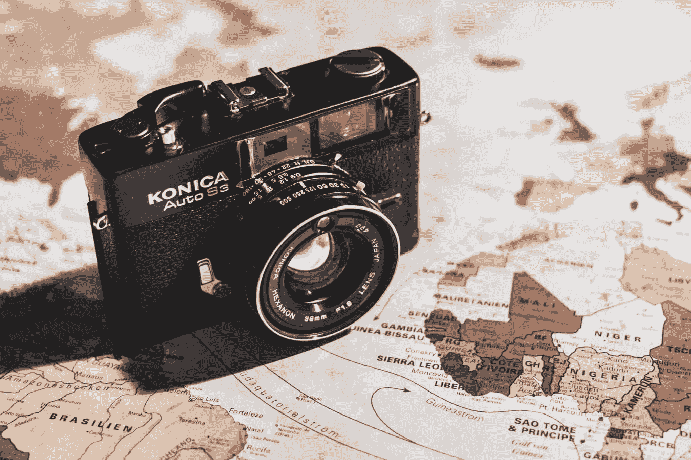
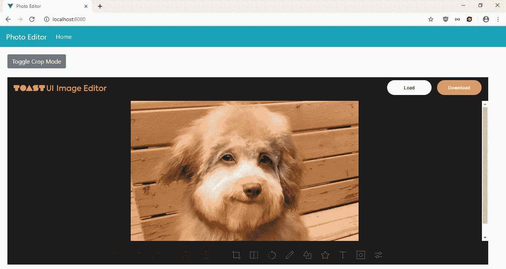

# 如何用 Vue.js 制作照片编辑器

> 原文：<https://levelup.gitconnected.com/how-to-make-a-photo-editor-with-vue-js-fc465bdf50de>



随着 HTML5 canvas API 等 web 技术的进步，向 web 应用程序添加图形比以往任何时候都更容易。用户也期待网络应用程序提供更多的图形处理功能。因此，像照片编辑器这样的东西在 web 应用程序中变得越来越普遍。

独自添加照片编辑器仍然是一项艰巨的任务。幸运的是，开发人员已经开始帮助我们构建照片编辑器组件。对于 Vue.js 应用，我们可以使用 TUI 图像编辑器包的 Vue.js 版本。该文件位于[https://github.com/nhn/toast-ui.vue-image-editor](https://github.com/nhn/toast-ui.vue-image-editor)。

在本文中，我们将使用这个照片编辑器制作一个简单的照片编辑器应用程序。首先，我们通过运行以下命令来运行 Vue CLI:

```
npx @vue/cli create photo-editor
```

我们在运行向导时保留默认选项，因此我们按 Enter 键通过默认选项。接下来，我们安装我们需要的包。我们将使用 BootstrapVue 进行样式设计，并使用 TUI 图像编辑器。要安装它们，请运行:

```
npm i @toast-ui/vue-image-editor bootstrap-vue
```

接下来，我们制作应用程序。我们从用以下代码替换现有的代码`Home.vue`开始:

```
<template>
  <div class="page">
    <div class="imageEditorApp">
      <b-button-toolbar>
        <b-button [@click](http://twitter.com/click)="cropMode()">Toggle Crop Mode</b-button>
      </b-button-toolbar>
      <br />
      <tui-image-editor ref="editor" :include-ui="useDefaultUI" :options="options"></tui-image-editor>
    </div>
  </div>
</template><script>
import { ImageEditor } from "[@toast](http://twitter.com/toast)-ui/vue-image-editor";
const icona = require("tui-image-editor/dist/svg/icon-a.svg");
const iconb = require("tui-image-editor/dist/svg/icon-b.svg");
const iconc = require("tui-image-editor/dist/svg/icon-c.svg");
const icond = require("tui-image-editor/dist/svg/icon-d.svg");
const blackTheme = {
  "menu.normalIcon.path": icond,
  "menu.activeIcon.path": iconb,
  "menu.disabledIcon.path": icona,
  "menu.hoverIcon.path": iconc
};export default {
  name: "home",
  components: {
    "tui-image-editor": ImageEditor
  },
  data() {
    return {
      useDefaultUI: true,
      options: {
        cssMaxWidth: window.innerWidth,
        cssHeight: 800,
        includeUI: {
          theme: blackTheme
        },
        initMenu: "filter"
      }
    };
  },
  methods: {
    cropMode() {
      const drawingMode = this.$refs.editor.invoke("getDrawingMode");
      if (drawingMode == "CROPPER") {
        this.$refs.editor.invoke("startDrawingMode", "FREE_DRAWING");
      } else {
        this.$refs.editor.invoke("startDrawingMode", "CROPPER");
      }
    },
  }
};
</script><style scoped>
.imageEditorApp {
  width: 95vw;
  height: calc(100vh - 150px);
}
</style>
```

我们在这里添加了照片编辑器，并在顶部添加了一个在裁剪模式和自由绘制模式之间切换的按钮。照片编辑器有很多功能。我们可以自由画画。照片可以裁剪。添加文本也很容易。亮度和对比度选项可用。您还可以添加箭头、星星、气泡、心形和多边形等图标。它还允许用户通过选择填充和笔画来添加矩形、圆形和三角形等形状。用户还可以添加不同的效果，如改变亮度，创建噪声，改变图片灰度，添加模糊效果等。

在这个文件中，我们在`script`部分的顶部导入了图标，并将它们设置在`blackTheme`对象中，这样我们就可以看到图标了。在`components`对象中，我们添加了`ImageEditor`组件，这样我们就可以在`templates`部分使用它。在`data`部分，我们有`options`。我们需要设置`theme`部分，以便我们可以看到图标。`imageEditorApp`类是我们设置图像编辑器的高度和宽度的地方。我们将其设置为填充页面的大部分。

在`methods`部分，我们有`cropMode`方法在自由绘制和裁剪模式之间切换。我们有:

```
const drawingMode = this.$refs.editor.invoke(“getDrawingMode”);
```

获取当前的绘图模式，这样我们可以在两种模式之间切换。

接下来在`App.vue`中，我们将现有代码替换为:

```
<template>
  <div id="app">
    <b-navbar toggleable="lg" type="dark" variant="info">
      <b-navbar-brand to="/">Photo Editor</b-navbar-brand><b-navbar-toggle target="nav-collapse"></b-navbar-toggle><b-collapse id="nav-collapse" is-nav>
        <b-navbar-nav>
          <b-nav-item to="/" :active="path  == '/'">Home</b-nav-item>
        </b-navbar-nav>
      </b-collapse>
    </b-navbar>
    <router-view />
  </div>
</template><script>
export default {
  data() {
    return {
      path: this.$route && this.$route.path
    };
  },
  watch: {
    $route(route) {
      this.path = route.path;
    }
  }
};
</script><style lang="scss">
.page {
  padding: 20px;
}button,
.btn.btn-primary {
  margin-right: 10px !important;
}.button-toolbar {
  margin-bottom: 10px;
}
</style>
```

在页面顶部添加一个引导导航条，并添加一个`router-view`来显示我们定义的路线。这个`style`部分没有限定范围，所以样式将全局应用。在`.page`选择器中，我们给页面添加一些填充。我们在剩余的`style`代码中给按钮添加一些填充。

然后在`main.js`中，将现有代码替换为:

```
import Vue from "vue";
import App from "./App.vue";
import router from "./router";
import store from "./store";
import BootstrapVue from "bootstrap-vue";
import "bootstrap/dist/css/bootstrap.css";
import "bootstrap-vue/dist/bootstrap-vue.css";
import "tui-image-editor/dist/tui-image-editor.css";Vue.use(BootstrapVue);Vue.config.productionTip = false;new Vue({
  router,
  store,
  render: h => h(App)
}).$mount("#app");
```

我们在这里添加了我们需要的所有库，包括 BootstrapVue JavaScript 和 CSS，以及 TUI 图像编辑器的 CSS。

在`router.js`中，我们将现有代码替换为:

```
import Vue from "vue";
import Router from "vue-router";
import Home from "./views/Home.vue";Vue.use(Router);export default new Router({
  mode: "history",
  base: process.env.BASE_URL,
  routes: [
    {
      path: "/",
      name: "home",
      component: Home
    }
  ]
});
```

将主页包含在我们的路线中，以便用户可以看到该页面。

最后，在`index.html`中，我们将现有代码替换为:

```
<!DOCTYPE html>
<html lang="en">
  <head>
    <meta charset="utf-8" />
    <meta http-equiv="X-UA-Compatible" content="IE=edge" />
    <meta name="viewport" content="width=device-width,initial-scale=1.0" />
    <link rel="icon" href="<%= BASE_URL %>favicon.ico" />
    <title>Photo Editor</title>
  </head>
  <body>
    <noscript>
      <strong
        >We're sorry but vue-photo-editor-tutorial-app doesn't work properly
        without JavaScript enabled. Please enable it to continue.</strong
      >
    </noscript>
    <div id="app"></div>
    <!-- built files will be auto injected -->
  </body>
</html>
```

更改我们应用程序的标题。

经过所有的努力，我们可以通过运行`npm run serve`来启动我们的应用程序。

