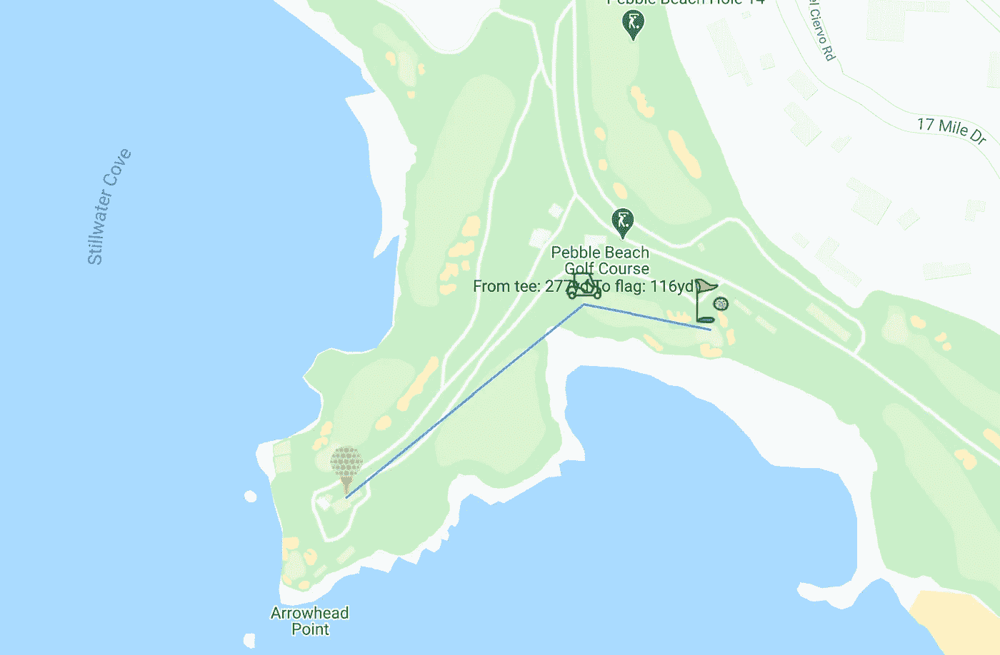
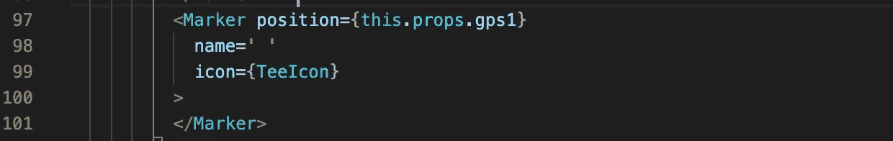
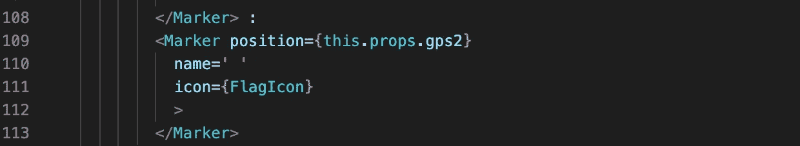
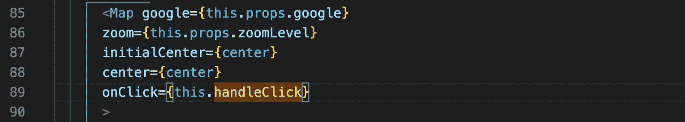
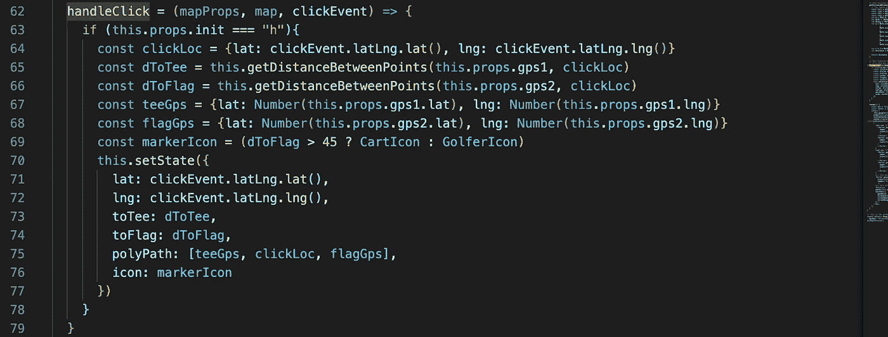
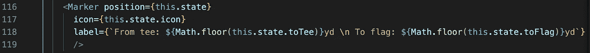
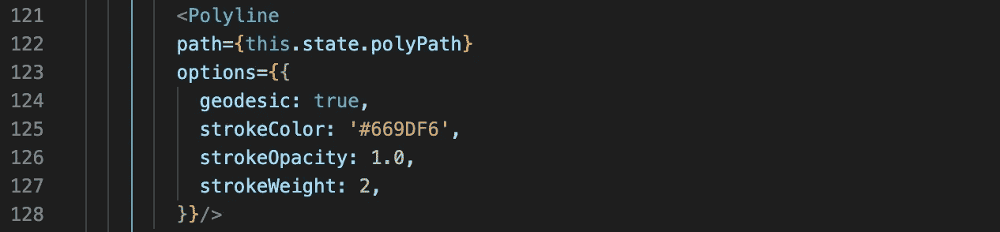

# 如何在 React 谷歌地图上制作多标记折线

> 原文：<https://levelup.gitconnected.com/how-to-make-a-polyline-with-multiple-markers-on-react-google-maps-3c1cdb64de76>

我是一名高尔夫球手，但由于我的技术非常业余，我自然会使用我能找到的任何应用程序来帮助我的比赛，无论是练习还是打球。我一直被吸引的一点是在地图上看到路径和距离的能力，就像这样。

圆石滩第 8 洞

在上面的例子中，我想看看我需要击打开球的路径和我需要携带的距离。如果我不确定我能打我的司机超过 270 码来完成这个海湾，我最好放弃。

地图上有三个点——球座、旗帜和我希望我的发球落点。您可以考虑前两个固定位置，但最后一个位置会根据您在地图上单击的位置而变化。假设您已经在应用程序中实现了 React Google Maps，定位前两个点只需在地图组件中放置两个标记组件。

球座标记组件

标志标记组件

位置属性通过包含纬度和经度的对象获取 GPS 坐标— {lat: 99.999999，lng: 99.999999}。我通过父组件的道具传递两个 GPS。

然而，第三个标记只会在我点击地图上的任何地方时显示，显然 GPS 坐标会根据点击的位置而变化。这使得基于状态改变的位置属性值改变以及新标记在地图上的重新呈现成为必要。这意味着我需要地图组件上的一个点击事件。

地图组件

每当我点击地图上的任何地方，handleClick 代码就会触发。

单击地图时触发的代码

这里的关键是获取地图上被点击点的 GPS 坐标。谷歌地图提供了两个功能，给我经度和纬度的数字。通过调用 clickEvent.latLng.lat()和 clickEvent.latLng.lng()，我得到了该点击事件的 lat 和 Lng 编号。现在，我可以使用这些数字来设置状态，并在我的 lat 和 lng 键中提供坐标值。只要我的状态中有这些键/值，我就可以像点击点的标记组件那样使用状态。

单击点的标记组件

现在我们有了地图上的所有三个标记，我们可以继续折线。您可能已经注意到了我在 handleClick 事件代码的状态中设置的多路径键。为了创建折线路径，您需要一个 GPS 坐标数组，Google maps 将根据数组中的顺序从中创建一条直线路径。在我的例子中，它是球座-地图-点-旗帜。然后像这样在地图组件中添加折线组件。

折线组件

现在我有了一条路径，它将球座连接到地图上被点击的点，然后连接到旗帜。单击的点标记标签还会显示与其他点的距离。有很多代码可以计算两个 GPS 点之间的距离。我选择一个基于地球半径进行数学计算的。我不打算解释如何做，因为我真的不明白背后的数学原理。我创建了一个函数，它接收两个 GPS 点并返回以码为单位的距离。因为我提供了以英里为单位的地球半径，返回的距离也是以英里为单位的，所以我需要将结果乘以 1760 以获得码数。现在你有了一条从球座到旗杆的三点多段线路径，从球座到旗杆的距离为。