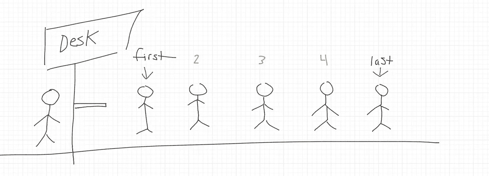
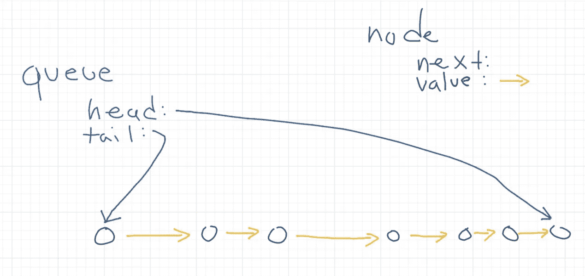
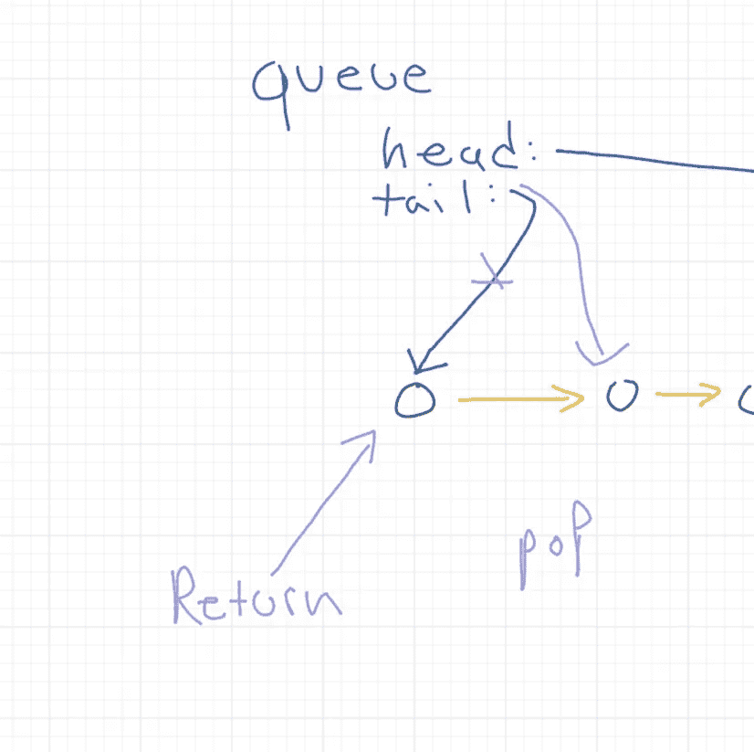
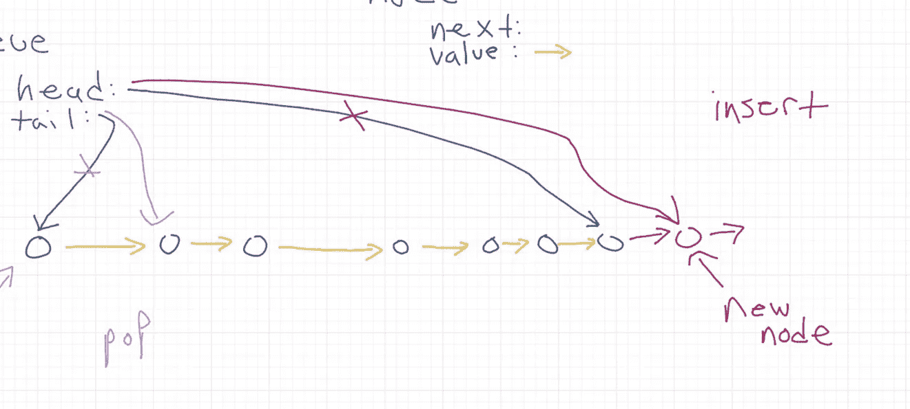
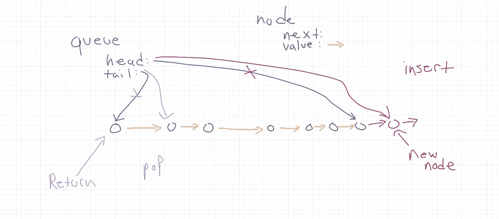

# 如何制作队列—类型脚本

> 原文：<https://levelup.gitconnected.com/how-to-make-a-queue-typescript-853fa1e03302>

## 还有，这对什么有好处


队列是一种低级数据结构。它是如此普遍，以至于我们每天都可以在周围的世界中看到它。因此，如果你想用计算机建模，这是最重要的结构之一。

这是编码面试的一个常见主题，如果你知道要寻找什么，它将帮助你在日常基础上构建好的程序。

# 它是如何工作的？

简而言之，队列是**任何**结构或现象，它将对象按照它们进入该结构的相关顺序进行排序。否则称为**先进先出。**

最常见的例子可能是你在车管所看到的。你走进设施，你拿一张票，然后你在柜台被看到，按照你到达设施的顺序。

如果你在一个队列中，在你前面的每个人都被看到之前，你不会离开队列。

当你到达队列时，你将从后面进入队列，当人们离开队列时，你将更靠近队列的前面。

当人们在你之后进入队列时，他们将按顺序集合，在你后面。



但是，你们不是来这里学习车管所如何工作的，而是来这里学习如何用电脑模拟。

队列的应用比这篇博客所能列举的要多，但是举几个例子来说，票务网站每天都使用队列来确定他们什么时候卖光了票。

任何电子商务网站都可以使用队列来确定产品何时售罄。

像 A*这样的路径算法使用队列按照值的顺序来排序执行。

许多优先排序系统使用队列来确定什么时候需要处理事情。(任务管理)

广度优先搜索使用队列来确保搜索一次执行一个深度。

这样的例子不胜枚举。

# 我们如何制造一个？

有很多不同的方法。如果你很着急，你可以只做一个数组，并且总是分别使用 unshift 方法和 pop 方法。它的功能类似于队列，并且满足创建使用队列的系统所需的逻辑。

但是，数组对于这个应用程序来说并不理想，也不应该过于依赖，因为数组是严格有序的列表。它们被设计成对列表中的每一项进行数字查找。为了保持这种行为，每次在列表中添加或删除项目时，他们都需要移动整个列表。

这严重破坏了你的时间复杂度。如果你有一个 100 万项长的队列，从列表中插入或弹出一些项可能需要 20 秒，但是如果你用引用逻辑(或者如果你选择的语言有一个内置的队列)来创建队列，删除和插入应该只需要 O(3)操作或少于**。**

在一天结束的时候，你应该用参考逻辑或者其他一些时间有效的等价物来创建你的队列，除非你有一些特殊的理由不这样做。

# 我们是这样做的

```
class qNode {constructor(public value:number,public next?:qNode){}}class queue{constructor(public head?:qNode,public tail?:qNode){}public pop = ():number|void =>{if(this.head){let tempOut:qNode|undefined = this.tailthis.tail = this.tail?.nextreturn tempOut?.value} else {console.log("queue is empty")}}public insert = (node:qNode):void =>{if(this.head){this.head.next = nodethis.head = node} else {this.head = nodethis.tail = node}}}
```

在编程中，我们经常需要对比字符串或数字稍微复杂一点的东西建模。

大多数时候，我们用一个对象或对象的组合来建模这些更复杂的东西。

这就是我在这里所做的。我将对象分为两种类型，称为 qNode 和 queue。

qNodes 只是引用另一个对象和一个值的对象。

队列是对象的另一种分类，这些对象有一个头和一个尾，还有两个处理弹出和插入功能的类函数。

一旦我实例化了一个队列并将 7 个节点放入其中，它就变成了一组对象，结构如下:



在我开始之前，我想描述一下我的队列是如何建立起来的。

秘密在于我的 pop 和 insert 函数。

```
public pop = ():number|void =>{if(this.head){let tempOut:qNode|undefined = this.tailthis.tail = this.tail?.nextreturn tempOut?.value} else {console.log("queue is empty")}}
```

我的 pop first 检查头部是否有效。如果头有效，则队列不为空，阻塞可以继续进行。

然后，它将尾部分配给临时变量，将尾部在队列中下移，并返回临时变量。

这将从队列内部的引用中删除 temp，新的尾部现在被分配给该行前面的节点。这是可视化操作的另一种方式:



# 在我们的插页上

```
public insert = (node:qNode):void =>{if(this.head){this.head.next = nodethis.head = node} else {this.head = nodethis.tail = node}}
```

插页与我们的 pop 相似，只是我们看的是头部。

它首先验证头部的存在。然后，它让旧的头部查看插入的节点，并将头部引用设置为新的节点。

想象成这样:



# 就这些了。就是这么简单，伙计们

现在我们有了。我们有一个在固定时间弹出和插入的工作队列。我们可以将它扩展到数百万个条目，它可以同样高效地弹出和插入。

而且，我们都用类型定义在 typescript 中做过。我鼓励你亲自尝试一下，因为这肯定会在一些面试中出现，并且可以用来解决无数的工程问题。

