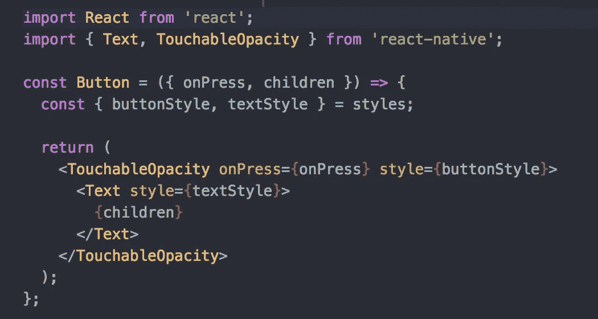
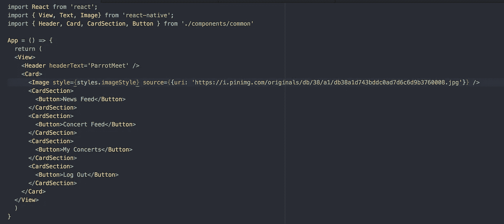

# 如何在 React Native 中制作一个非常酷的按钮

> 原文：<https://levelup.gitconnected.com/how-to-make-a-really-cool-button-in-react-native-4cb848b88834>

有时候你会有几个星期像这样“哦，该死的耶！我势如破竹，我创造了所有这些东西，我在游戏中杀人。”有时你有几个星期的生活发生，你必须处理它。对我来说，我认为在那些时候做一些有创造性的事情仍然很重要。我说的东西，是指哪怕是最微小的东西。这个星期，不，更确切地说是今天，我做了一些钮扣。

我有一个预制的按钮组件，我在我所有的 React 本机应用程序中循环使用。它看起来有点像这样:

你可能正在看这段代码，并且在想什么是他妈的可触摸的不透明度？我也是这么想的。老实说，这听起来很蠢。这就像那些有一个花哨名字的东西，可能只是为了让人们看起来很重要或什么的。意思是按钮。更具体地说，它是一种当你点击它时会褪色的按钮，这样用户就知道他们点击了它。

更深入地研究这段代码，我们在按钮中有一些文本，这些文本从我们使用按钮的实例中传递的子元素中继承它的值。onPress 的定义是这样的，当按钮被按下时，我们传递给按钮的 onPress 函数就会发生，显而易见。

因此，如果我们不向这个按钮传递任何 onPress，当我们点击它时，将会发生的是按钮将不透明淡入，然后返回到纯色。如果我们给它传递一个函数，我们可以让它做任何事情。它可以把我们带到应用程序的另一个页面，一个外部网站，它甚至可以打开你家的灯，或者发射一枚核导弹，如果我们对它进行了装配的话。

所以今天，我把应用程序上的一些文本变成了按钮。它们不是按钮的最终形式，但最终它们会是某种形式的按钮。目前，我的应用程序看起来像这样:

我添加完全选择 parrothead 只是为了页面上的一些味道。他最终会离开的。但是他不是很棒吗？你继续做你的，先生…

我的按钮代码相当简单。我将按钮导入到我的主 App.js 文件中，然后像在页面上创建任何元素一样制作按钮。

我在卡片部分包含了所有的按钮，所以如果我想的话，我可以在按钮上面添加更多的内容，比如图像或者一些文本。真的无所谓。

你可能会看着这些按钮，“该死的，这些按钮真漂亮！”我知道，他们真的很棒。如果你想像我一样设计你的按钮，这里是代码:

记住，React 本地组件的所有样式都是在组件本身内部完成的。此外，有像这个按钮回收的共同组成部分的好处是，造型已经开始为我。我可能不希望它在每个应用程序中都是这个样子，但至少我不是从一张空白的画布开始。我可以修改这个起始代码，让它在不同的应用程序之间看起来都是全新的。

好吧，让我们来分解一下如何制作一些按钮:

*   编写并导出制作按钮的代码，并将其放入可重用的组件中
*   将该组件导入应用程序。JS 文件
*   将该按钮像任何其他组件一样放入文件中
*   在按钮文件中添加样式
*   有一个按钮