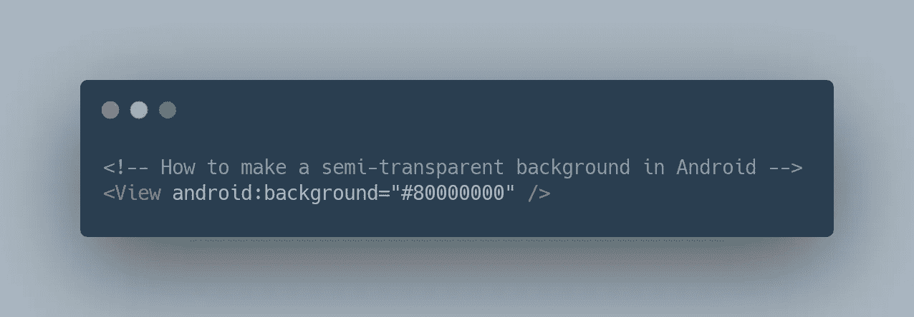

# 如何在 Android 中制作半透明背景

> 原文：<https://levelup.gitconnected.com/how-to-make-a-semi-transparent-background-in-android-41a68ae578f7>



作为一名 Android 开发人员，在 Android 应用程序中创建半透明背景色对我来说绝对不是一件简单的事情。我想其他有抱负的 Android 开发者也会有类似的困惑，所以我决定在这里记录最简单的方法。希望有帮助！

下面的例子是一个 50%透明的黑色背景(`#000000`的十六进制值)。

```
<View android:background="#80000000" />
```

上面提供的值结合了“不透明度代码”`80`和十六进制值代码`000000`。不透明度代码不是很清楚，所以我在下面提供了一些更受欢迎的代码供你使用。

```
100% — FF
95% — F2
90% — E6
85% — D9
80% — CC
75% — BF
70% — B3
65% — A6
60% — 99
55% — 8C
50% — 80
45% — 73
40% — 66
35% — 59
30% — 4D
25% — 40
20% — 33
15% — 26
10% — 1A
5% — 0D
0% — 00
```

如果你觉得这有帮助，请提供一些掌声。谢谢大家！