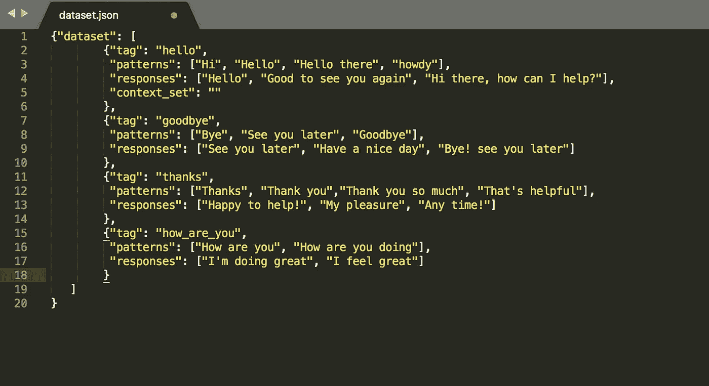
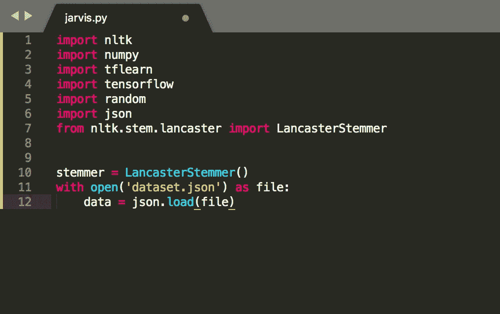
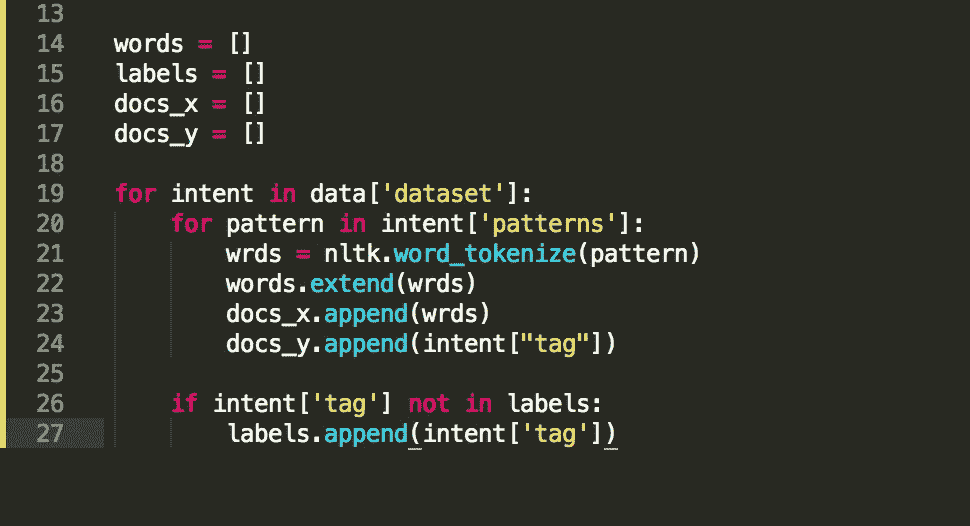
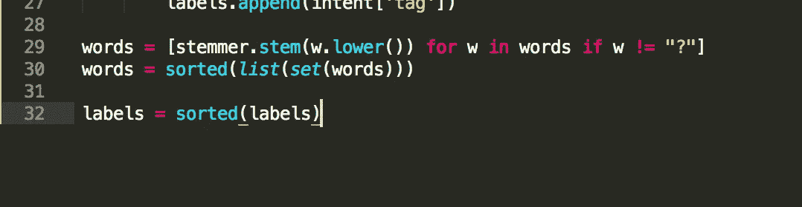
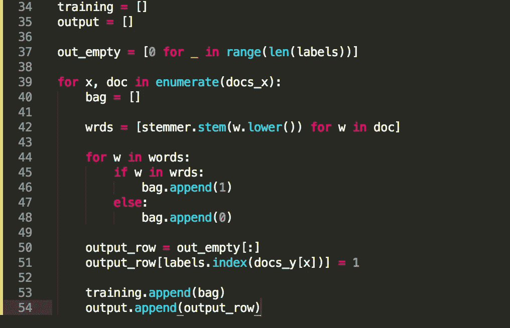
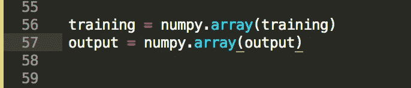
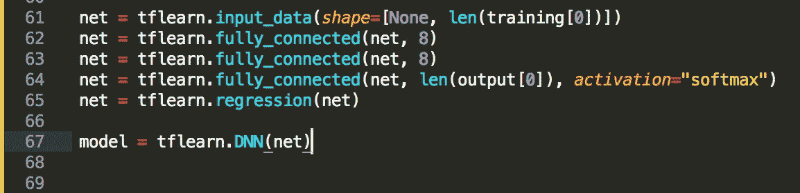
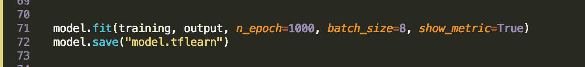
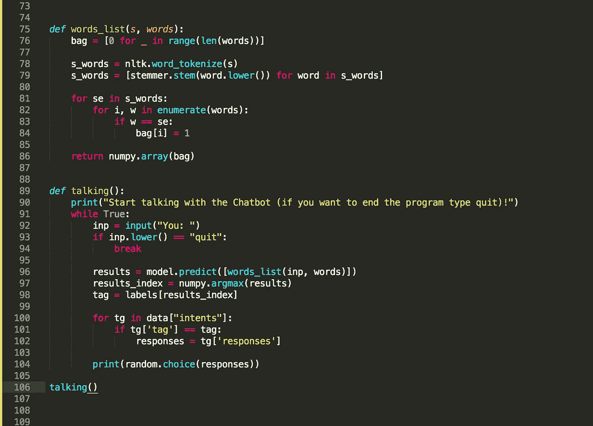

# 如何制作一个简单的深度学习聊天机器人

> 原文：<https://levelup.gitconnected.com/how-to-make-a-simple-deep-learning-chatbot-4562c99938f7>

在这篇文章中，我将从头到尾解释如何制作一个简单的深度学习聊天机器人，它具有极强的可定制性。这是用 Python 编程的(我用的是 Python 3.6)，所有的代码如下。

在我们开始编程之前，我们需要下载一些这个项目运行所需的包。要安装，请转到您的命令，然后“pip install”软件包名称，它将开始下载软件包。安装以下软件包:

*   张量流
*   tflearn
*   nltk
*   numpy

现在是开始编程的时候了。让我们从为聊天机器人制作数据开始。因为这是一个简单的聊天机器人，我们不需要任何大规模的数据，所以我们将自己编程。这需要一个**。json** 文件，需要和下面的格式一样。我将我的文件命名为“dataset.json

我将解释这是如何工作的，这样你就知道如何自己制作了。所以做一个像这样的，如果你想做一个新的分类，如果用户说了什么，标签就是意思，模式就是用户会说什么。你可以想象，这个回答是聊天机器人会说的，并且会选择其中一个回答。你给它的数据越多，它的反应就越好。

现在创建一个新项目，这个程序将运行你的聊天机器人，所以你可以给它取任何名字。对于本例，我将把我的项目命名为 jarvis.py。我们需要创建一个代码，让项目连接到您的数据集。复制下面的代码，下面我会解释更多。

如果你的数据集和我的名字不同，把它改成你在第 11 行的名字，并确保它和代码连接。运行程序，如果没有错误，那么它正在工作。

现在是时候让列表有价值了，也让 json 数据提取数据到我们的程序中。

现在是时候添加一个叫做词干的东西了。例如，如果用户输入“waited”、“waiting”或“waities ”,那么它会出现在 wait 下。下面的代码完成了所有的词干提取

既然我们已经找到了所有数据所在的位置，我们需要创建一个叫做单词列表的词汇表。下面是单词列表的代码。

现在我们将把数据放入输出和数组中

现在终于到了开始训练聊天机器人的时候了。因此，我们将制作一个具有两个隐藏层的标准神经网络。

现在，我们已经完成了神经网络，是时候对模型进行训练，并在训练后保存它。在下面的照片中，你看到数字 1000，这意味着你告诉它训练并检查数据 1000 次。

现在是聊天机器人在你输入信息时做出预测的时候了。

恭喜你，你已经制作了一个深度学习聊天机器人！花更多的时间把数据放入其中，并不断训练它，你就会拥有一个完美的聊天机器人来满足你的需求。谢谢你一路跟随指示，祝你项目好运！

作者泰特斯·彼得森

贷记:techwithtim