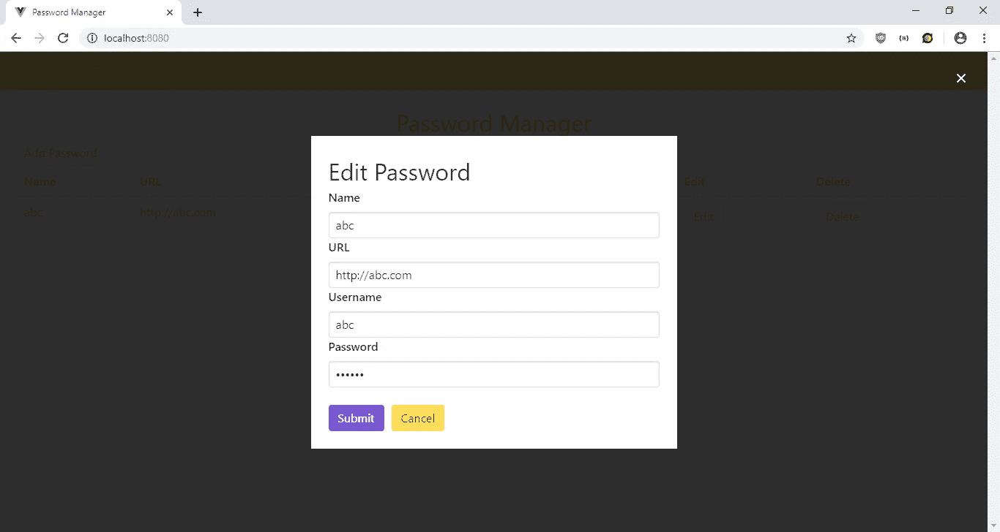

# 如何用 Buefy Widget 库制作 Vue.js App

> 原文：<https://levelup.gitconnected.com/how-to-make-a-vue-js-app-with-buefy-widget-library-57ff44b99415>


照片由 [Mael BALLAND](https://unsplash.com/@mael_bld?utm_source=medium&utm_medium=referral) 在 [Unsplash](https://unsplash.com?utm_source=medium&utm_medium=referral) 上拍摄

Buefy 是 Vue.js 的轻量级 UI 组件库，它基于布尔玛 CSS 框架，这是一个类似于 Vuetify 和 Vue Material 这样的 Bootstrap 和 Material 设计库的框架。它提供了表单输入、表格、模态、警告等组件，这些是 Web 应用程序最常用的组件。组件的完整列表位于[https://buefy.org/documentation](https://buefy.org/documentation)。

在本文中，我们将使用 Buefy 和 Vue.js 构建一个密码管理器。这是一个简单的应用程序，可以输入名称、URL、用户名和密码。用户可以编辑或删除他们输入的任何条目。

## 入门指南

为了开始构建应用程序，我们运行 Vue CLI 来搭建项目。我们运行`npx @vue/cli create password-manager`来生成应用程序。在向导中，我们选择“手动选择功能”，并选择 Babel、Vuex 和 Vue 路由器。

接下来，我们安装一些我们使用的库。我们需要 Axios 进行 HTTP 请求，需要 Buefy 库，需要 Vee-Validate 进行表单验证。要安装它们，我们运行:

```
npm i axios buefy vee-validate
```

## 构建应用程序

安装完库之后，我们就可以开始构建我们的应用程序了。首先，在`components`文件夹中，创建一个名为`PasswordForm.vue`的文件，并添加:

```
<template>
  <ValidationObserver ref="observer" v-slot="{ invalid }">
    <form [@submit](http://twitter.com/submit).prevent="onSubmit" novalidate>
      <ValidationProvider name="name" rules="required" v-slot="{ errors }">
        <b-field
          label="Name"
          :type="errors.length > 0 ? 'is-danger': '' "
          :message="errors.length > 0 ? 'Name is required': ''"
        >
          <b-input type="text" name="name" v-model="form.name"></b-input>
        </b-field>
      </ValidationProvider> <ValidationProvider name="url" rules="required|url" v-slot="{ errors }">
        <b-field
          label="URL"
          :type="errors.length > 0 ? 'is-danger': '' "
          :message="errors.join('. ')"
        >
          <b-input type="text" name="url" v-model="form.url"></b-input>
        </b-field>
      </ValidationProvider> <ValidationProvider name="username" rules="required" v-slot="{ errors }">
        <b-field
          label="Username"
          :type="errors.length > 0 ? 'is-danger': '' "
          :message="errors.length > 0 ? 'Username is required': ''"
        >
          <b-input type="text" name="username" v-model="form.username"></b-input>
        </b-field>
      </ValidationProvider> <ValidationProvider name="password" rules="required" v-slot="{ errors }">
        <b-field
          label="Password"
          :type="errors.length > 0 ? 'is-danger': '' "
          :message="errors.length > 0 ? 'Password is required': ''"
        >
          <b-input type="password" name="password" v-model="form.password"></b-input>
        </b-field>
      </ValidationProvider> <br /> <b-button type="is-primary" native-type="submit" style="margin-right: 10px">Submit</b-button> <b-button type="is-warning" native-type="button" [@click](http://twitter.com/click)="cancel()">Cancel</b-button>
    </form>
  </ValidationObserver>
</template><script>
import { requestsMixin } from "@/mixins/requestsMixin";export default {
  name: "PasswordForm",
  mixins: [requestsMixin],
  props: {
    edit: Boolean,
    password: Object
  },
  methods: {
    async onSubmit() {
      const isValid = await this.$refs.observer.validate();
      if (!isValid) {
        return;
      }if (this.edit) {
        await this.editPassword(this.form);
      } else {
        await this.addPassword(this.form);
      }
      const response = await this.getPasswords();
      this.$store.commit("setPasswords", response.data);
      this.$emit("saved");
    },
    cancel() {
      this.$emit("cancelled");
    }
  },
  data() {
    return {
      form: {}
    };
  },
  watch: {
    password: {
      handler(p) {
        this.form = JSON.parse(JSON.stringify(p || {}));
      },
      deep: true,
      immediate: true
    }
  }
};
</script><!-- Add "scoped" attribute to limit CSS to this component only -->
<style scoped lang="scss">
</style>
```

该组件具有供用户输入密码条目的表单。我们使用`ValidationObserver`组件来监视组件内部表单的有效性，使用`ValidationProvider`来检查组件内部输入值的有效性规则。

在`ValidationProvider`内部，我们有我们的 Buefy `b-field`输入。我们从`ValidationProvider`的插槽中获取`errors`数组，并检查`type`和`message`道具中是否存在任何错误。`label`属性对应于输入的标签标记。`b-input`是实际输入字段。我们在这里绑定到我们的`form`模型。

在输入下面，我们有`b-button`组件，它们被呈现为按钮。我们使用`native-type`道具来指定按钮的类型，`type`道具用于指定按钮的样式。

一旦用户点击保存，就会调用`onSubmit`函数。在函数内部，`this.$refs.observer.validate();`被调用来检查表单的有效性。`observer`是`ValidationObserver`的 ref。有效值的观察形式在这里。如果它解析为`true`，那么我们调用`editPassword`或`addPassword`，这取决于`edit`道具是否为`true`。这两个函数来自我们稍后将创建的`requestsMixin`。如果成功，那么我们调用同样来自 mixin 的`getPasswords`，然后调用`this.$store.commit`在我们的 Vuex 存储中存储最新的密码条目。之后，我们发出`saved`事件来关闭表单所在的模态。

接下来，我们在`src`文件夹中创建一个`mixins`文件夹，然后在`mixins`文件夹中创建`requestsMixin.js`。然后我们加上:

```
const APIURL = "[http://localhost:3000](http://localhost:3000)";
const axios = require("axios");export const requestsMixin = {
  methods: {
    getPasswords() {
      return axios.get(`${APIURL}/passwords`);
    }, addPassword(data) {
      return axios.post(`${APIURL}/passwords`, data);
    }, editPassword(data) {
      return axios.put(`${APIURL}/passwords/${data.id}`, data);
    }, deletePassword(id) {
      return axios.delete(`${APIURL}/passwords/${id}`);
    }
  }
};
```

这增加了请求后端保存密码数据的代码。

接下来在`Home.vue`中，我们将现有代码替换为:

```
<template>
  <div class="page">
    <h1 class="center">Password Manager</h1>
    <b-button [@click](http://twitter.com/click)="openAddModal()">Add Password</b-button> <b-table :data="passwords">
      <template scope="props">
        <b-table-column field="name" label="Name">{{props.row.name}}</b-table-column>
        <b-table-column field="url" label="URL">{{props.row.url}}</b-table-column>
        <b-table-column field="username" label="Username">{{props.row.username}}</b-table-column>
        <b-table-column field="password" label="Password">******</b-table-column>
        <b-table-column field="edit" label="Edit">
          <b-button [@click](http://twitter.com/click)="openEditModal(props.row)">Edit</b-button>
        </b-table-column>
        <b-table-column field="delete" label="Delete">
          <b-button [@click](http://twitter.com/click)="deleteOnePassword(props.row.id)">Delete</b-button>
        </b-table-column>
      </template>
    </b-table> <b-modal :active.sync="showAddModal" :width="500" scroll="keep">
      <div class="card">
        <div class="card-content">
          <h1>Add Password</h1>
          <PasswordForm [@saved](http://twitter.com/saved)="closeModal()" [@cancelled](http://twitter.com/cancelled)="closeModal()" :edit="false"></PasswordForm>
        </div>
      </div>
    </b-modal> <b-modal :active.sync="showEditModal" :width="500" scroll="keep">
      <div class="card">
        <div class="card-content">
          <h1>Edit Password</h1>
          <PasswordForm
            [@saved](http://twitter.com/saved)="closeModal()"
            [@cancelled](http://twitter.com/cancelled)="closeModal()"
            :edit="true"
            :password="selectedPassword"
          ></PasswordForm>
        </div>
      </div>
    </b-modal>
  </div>
</template><script>
// @ is an alias to /src
import { requestsMixin } from "@/mixins/requestsMixin";
import PasswordForm from "@/components/PasswordForm";export default {
  name: "home",
  data() {
    return {
      selectedPassword: {},
      showAddModal: false,
      showEditModal: false
    };
  },
  components: {
    PasswordForm
  },
  mixins: [requestsMixin],
  computed: {
    passwords() {
      return this.$store.state.passwords;
    }
  },
  beforeMount() {
    this.getAllPasswords();
  },
  methods: {
    openAddModal() {
      this.showAddModal = true;
    },
    openEditModal(password) {
      this.showEditModal = true;
      this.selectedPassword = password;
    },
    closeModal() {
      this.showAddModal = false;
      this.showEditModal = false;
      this.selectedPassword = {};
    },
    async deleteOnePassword(id) {
      await this.deletePassword(id);
      this.getAllPasswords();
    },
    async getAllPasswords() {
      const response = await this.getPasswords();
      this.$store.commit("setPasswords", response.data);
    }
  }
};
</script>
```

我们通过使用`b-table`组件添加一个表来显示密码条目，并在`b-table`中添加`b-table-column`列来显示定制列。`b-table`组件获取一个包含一组密码的`data` prop，然后通过从作用域槽获取`props`来公开数据供`b-table-column`组件使用。然后我们通过使用`prop.row`属性来显示这些字段。在最后两列中，我们添加了两个按钮，分别让用户打开编辑模式和删除条目。当页面加载时，通过调用`beforeMount`钩子中的`getAllPasswords`来加载条目。

该页面还有两个模态，一个用于添加视图，一个用于编辑条目。在每个模态中，我们嵌套了前面创建的`PasswordForm`组件。我们调用`openEditModal`来打开编辑模式。在该函数中，我们设置了`selectedPassword`字段，将其传递给`PasswordForm`，以便用户可以编辑它并将`this.showEditModal`设置为`true`。`openAddModal`功能通过将`this.showAddModal`更改为`true`来打开添加密码模式。

接下来在`App.vue`中，我们将现有代码替换为:

```
<template>
  <div>
    <b-navbar type="is-warning">
      <template slot="brand">
        <b-navbar-item tag="router-link" :to="{ path: '/' }">Password Manager</b-navbar-item>
      </template>
      <template slot="start">
        <b-navbar-item :to="{ path: '/' }" :active="path  == '/'">Home</b-navbar-item>
      </template>
    </b-navbar>
    <router-view />
  </div>
</template><script>
export default {
  data() {
    return {
      path: this.$route && this.$route.path
    };
  },
  watch: {
    $route(route) {
      this.path = route.path;
    }
  }
};
</script><style lang="scss">
.page {
  padding: 20px;
}button {
  margin-right: 10px;
}.center {
  text-align: center;
}h1 {
  font-size: 32px !important;
}
</style>
```

这增加了 Buefy `b-navbar`组件，它是 Buefy 提供的顶部导航栏组件。`b-navbar`包含不同的插槽，用于将项目添加到左栏的不同部分。`brand`槽折叠左上方的 app 名称，`start`槽有左上方的链接。

我们还有显示路线的`router-view`。在`scripts`部分中，我们观察`$route`变量以获取用户导航的当前路径，从而设置`b-navbar-item`的`active`属性，如果用户当前导航到引用了 URL 的页面，则该属性会突出显示该链接。

在`styles`部分，我们为页面和按钮添加了一些填充，还将一些文本居中并改变了标题大小。

接下来在`main.js`中，我们将现有代码替换为:

```
import Vue from "vue";
import App from "./App.vue";
import router from "./router";
import store from "./store";
import Buefy from "buefy";
import { ValidationProvider, extend, ValidationObserver } from "vee-validate";
import { required } from "vee-validate/dist/rules";
import "buefy/dist/buefy.css";extend("required", required);
extend("url", {
  validate: value => {
    return /^(http:\/\/www\.|https:\/\/www\.|http:\/\/|https:\/\/)?[a-z0-9]+([\-\.]{1}[a-z0-9]+)*\.[a-z]{2,5}(:[0-9]{1,5})?(\/.*)?$/.test(
      value
    );
  },
  message: "URL is invalid."
});
Vue.use(Buefy);
Vue.component("ValidationProvider", ValidationProvider);
Vue.component("ValidationObserver", ValidationObserver);Vue.config.productionTip = false;new Vue({
  router,
  store,
  render: h => h(App)
}).$mount("#app");
```

这将 Buefy 库和样式添加到我们的应用程序中，并添加了我们需要的验证规则。此外，我们将`ValidationProvider`和`ValidationObserver`添加到我们的应用程序中，这样我们就可以在`PasswordForm`中使用它。

接下来在`router.js`中，我们将现有代码替换为:

```
import Vue from 'vue'
import Router from 'vue-router'
import Home from './views/Home.vue'Vue.use(Router)export default new Router({
  mode: 'history',
  base: process.env.BASE_URL,
  routes: [
    {
      path: '/',
      name: 'home',
      component: Home
    }
  ]
})
```

这包括主页路由。

然后在`store.js`中，我们将现有代码替换为:

```
import Vue from "vue";
import Vuex from "vuex";Vue.use(Vuex);export default new Vuex.Store({
  state: {
    passwords: []
  },
  mutations: {
    setPasswords(state, payload) {
      state.passwords = payload;
    }
  },
  actions: {}
});
```

这将我们的`passwords`状态添加到存储中，因此我们可以在`PasswordForm`和`HomePage`组件的`computed`块中观察它。我们有`setPasswords`函数来更新`passwords`状态，我们通过调用`this.$store.commit(“setPasswords”, response.data);`在组件中使用它，就像我们在`PasswordForm`中做的那样。此外，我们在这个文件中导入了引导 CSS 来获取样式。

在所有的努力之后，我们可以通过运行`npm start`来启动我们的 app。

## 假冒的应用后端

为了启动后端，我们首先通过运行`npm i json-server`来安装`json-server`包。然后，转到我们的项目文件夹并运行:

```
json-server --watch db.json
```

在`db.json`中，将文本改为:

```
{
  "passwords": [
  ]
}
```

所以我们有了在可用的`requests.js`中定义的`passwords`端点。

经过所有的努力，我们得到了:

