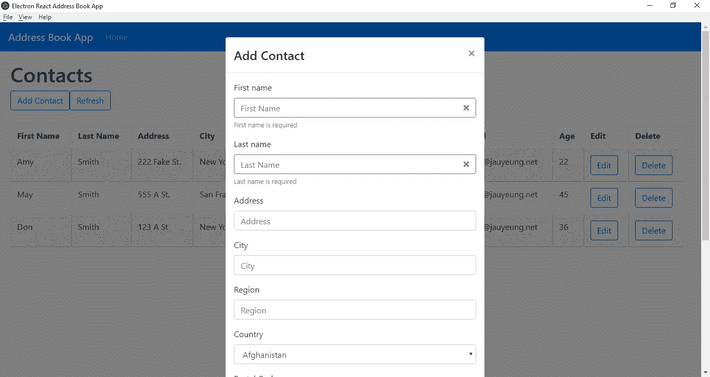
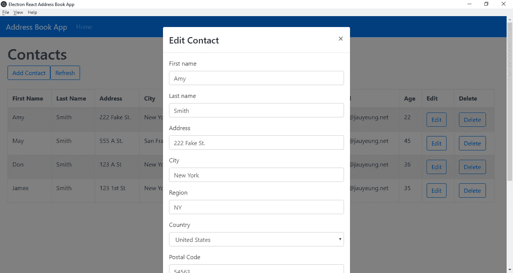
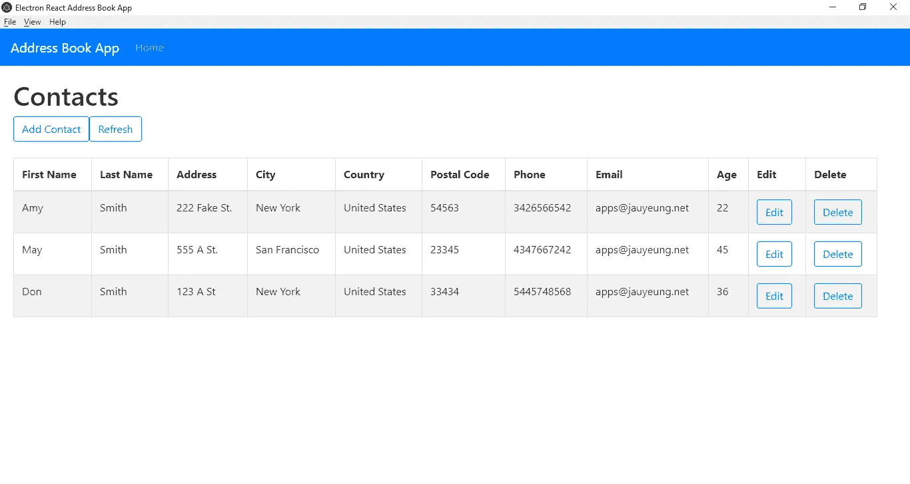

# 用 React 和 Electron 构建原生桌面应用

> 原文：<https://levelup.gitconnected.com/how-to-make-a-windows-app-with-react-and-electron-fad5294fae5c>

## 使用 React 和 Electron 为 Windows、Linux 和 Mac 构建本地应用程序



对于网络开发人员来说，制作一个 Windows 应用程序需要相当长的学习曲线。不过现在有了一个解决方案，用 Electron 把一个 JavaScript web app 转换成 Windows(或者 Max/Linux) app，不需要太多的工作。React 可以很容易地与 Electron 结合，构建一个原生的 Windows 应用程序。

一些开发人员已经为用 React 构建电子应用程序制作了样板文件。其中最容易开始的是[https://github . com/electron-react-boilerplate/electron-react-boilerplate](https://github.com/electron-react-boilerplate/electron-react-boilerplate)。

在这个故事中，我们将构建一个与后端通信的地址簿应用程序，以将数据保存到后端。我们将使用 React Boostrap 进行样式设计，使用 Formik 和 Yup 进行表单验证和更新，使用 Axios 作为我们的 HTTP 客户端。它将有一个主页，其中有一个显示联系人列表的表格，每行有编辑或删除联系人的按钮，还有一个添加和编辑联系人的表单。我们将使用 Redux 在客户端存储联系人的状态。

首先，我们检查一下[样板代码](https://github.com/electron-react-boilerplate/electron-react-boilerplate)。我们将代码复制到我们自己的文件夹中，然后我们可以添加我们的库。要添加库，我们将使用 Yarn。按照[官方说明](https://yarnpkg.com/lang/en/docs/install/#windows-stable)安装。我们需要安装最新版本的 Node.js LTS。

接下来我们运行`yarn add axios formik yup bootstrap jquery react-bootstrap redux react-redux`。安装完软件包后。我们可以开始写代码了。我们将修改代码的文件夹结构。

我们将用我们的文件替换`app`文件夹中的文件。首先，我们移除`actions`、`components`、`constants`、`containers`、`reducers`、`store`和`util`文件夹。然后，我们将把所有文件添加到这个文件夹中。我们从创建`actionCreator.js`开始，并添加:

```
import { SET_CONTACTS } from './actions';const setContacts = contacts => {
  return {
    type: SET_CONTACTS,
    payload: contacts
  };
};export { setContacts };
```

这将创建 Redux store 的操作来设置我们的联系人。接下来，我们创建`actions.js`并添加:

```
const SET_CONTACTS = 'SET_CONTACTS';export { SET_CONTACTS };
```

这是我们之前为动作创建器使用的常量。

接下来，我们创建一个名为`App.js`的文件，并添加:

```
import React from 'react';
import { Router, Route, Link, HashRouter } from 'react-router-dom';
import HomePage from './HomePage';
import { createBrowserHistory as createHistory } from 'history';
import Navbar from 'react-bootstrap/Navbar';
import Nav from 'react-bootstrap/Nav';
import './App.css';
const history = createHistory();function App() {
  return (
    <div className="App">
      <HashRouter history={history}>
        <Navbar bg="primary" expand="lg" variant="dark">
          <Navbar.Brand href="#/">Address Book App</Navbar.Brand>
          <Navbar.Toggle aria-controls="basic-navbar-nav" />
          <Navbar.Collapse id="basic-navbar-nav">
            <Nav className="mr-auto">
              <Nav.Link href="#/">Home</Nav.Link>
            </Nav>
          </Navbar.Collapse>
        </Navbar>
        <Route path="/" exact component={HomePage} />
      </HashRouter>
    </div>
  );
}export default App;
```

这是一个文件，包括引导导航栏和我们唯一的路线，这是主页。请注意，我们在路由之前有一个散列，我们使用的是`HashRouter`而不是`Router`。这是因为电子不能与常规的`Router`一起使用。接下来，我们创建`App.css`并添加:

```
.App {
  text-align: center;
}
```

在`app.html`中，我们将现有代码替换为:

```
<!DOCTYPE html>
<html><head>
  <meta charset="utf-8" />
  <title>Electron React Address Book App</title>
  <script>
    (function () {
      if (!process.env.HOT) {
        const link = document.createElement('link');
        link.rel = 'stylesheet';
        link.href = './dist/style.css';
        // HACK: Writing the script path should be done with webpack
        document.getElementsByTagName('head')[0].appendChild(link);
      }
    })();
  </script>
  <link rel="stylesheet" href="[https://maxcdn.bootstrapcdn.com/bootstrap/4.3.1/css/bootstrap.min.css](https://maxcdn.bootstrapcdn.com/bootstrap/4.3.1/css/bootstrap.min.css)"
    integrity="sha384-ggOyR0iXCbMQv3Xipma34MD+dH/1fQ784/j6cY/iJTQUOhcWr7x9JvoRxT2MZw1T" crossorigin="anonymous" />
</head><body>
  <div id="root"></div>
  <script>
    {
      const scripts = [];// Dynamically insert the DLL script in development env in the
      // renderer process
      if (process.env.NODE_ENV === 'development') {
        scripts.push('../dll/renderer.dev.dll.js');
      }// Dynamically insert the bundled app script in the renderer process
      const port = process.env.PORT || 1212;
      scripts.push(
        process.env.HOT
          ? '[http://localhost:'](http://localhost:') + port + '/dist/renderer.dev.js'
          : './dist/renderer.prod.js'
      );document.write(
        scripts
          .map(script => `<script defer src="${script}"><\/script>`)
          .join('')
      );
    }
  </script>
</body></html>
```

我们修改了标题，保留了代码的其余部分，并添加了`head`标签来添加引导样式:

```
<link rel="stylesheet" href="https://maxcdn.bootstrapcdn.com/bootstrap/4.3.1/css/bootstrap.min.css" integrity="sha384-ggOyR0iXCbMQv3Xipma34MD+dH/1fQ784/j6cY/iJTQUOhcWr7x9JvoRxT2MZw1T" crossorigin="anonymous" />
```

接下来，我们创建`ContactForm.js`并添加:

```
import React from 'react';
import { Formik } from 'formik';
import Form from 'react-bootstrap/Form';
import Col from 'react-bootstrap/Col';
import InputGroup from 'react-bootstrap/InputGroup';
import Button from 'react-bootstrap/Button';
import * as yup from 'yup';
import { COUNTRIES } from './exports';
import PropTypes from 'prop-types';
import { addContact, editContact, getContacts } from './requests';
import { connect } from 'react-redux';
import { setContacts } from './actionCreators';const schema = yup.object({
  firstName: yup.string().required('First name is required'),
  lastName: yup.string().required('Last name is required'),
  address: yup.string().required('Address is required'),
  city: yup.string().required('City is required'),
  region: yup.string().required('Region is required'),
  country: yup.string().required('Country is required').default('Afghanistan'),
  postalCode: yup
    .string()
    .when('country', {
      is: 'United States',
      then: yup.string().matches(/^[0-9]{5}(?:-[0-9]{4})?$/, 'Invalid postal code'),
    })
    .when('country', {
      is: 'Canada',
      then: yup.string().matches(/^[A-Za-z]\d[A-Za-z][ -]?\d[A-Za-z]\d$/, 'Invalid postal code'),
    })
    .required(),
  phone: yup
    .string()
    .when('country', {
      is: country => ["United States", "Canada"].includes(country),
      then: yup.string().matches(/^[2-9]\d{2}[2-9]\d{2}\d{4}$/, 'Invalid phone nunber')
    })
    .required(),
  email: yup.string().email('Invalid email').required('Email is required'),
  age: yup.number()
    .required('Age is required')
    .min(0, 'Minimum age is 0')
    .max(200, 'Maximum age is 200'),
});function ContactForm({
  edit,
  onSave,
  setContacts,
  contact,
  onCancelAdd,
  onCancelEdit,
}) {
  const handleSubmit = async (evt) => {
    const isValid = await schema.validate(evt);
    if (!isValid) {
      return;
    }
    if (!edit) {
      await addContact(evt);
    }
    else {
      await editContact(evt);
    }
    const response = await getContacts();
    setContacts(response.data);
    onSave();
  }return (
    <div className="form">
      <Formik
        validationSchema={schema}
        onSubmit={handleSubmit}
        initialValues={contact || {}}
      >
        {({
          handleSubmit,
          handleChange,
          handleBlur,
          values,
          touched,
          isInvalid,
          errors,
        }) => (
            <Form noValidate onSubmit={handleSubmit}>
              <Form.Row>
                <Form.Group as={Col} md="12" controlId="firstName">
                  <Form.Label>First name</Form.Label>
                  <Form.Control
                    type="text"
                    name="firstName"
                    placeholder="First Name"
                    value={values.firstName || ''}
                    onChange={handleChange}
                    isInvalid={touched.firstName && errors.firstName}
                  />
                  <Form.Control.Feedback type="invalid">
                    {errors.firstName}
                  </Form.Control.Feedback>
                </Form.Group>
                <Form.Group as={Col} md="12" controlId="lastName">
                  <Form.Label>Last name</Form.Label>
                  <Form.Control
                    type="text"
                    name="lastName"
                    placeholder="Last Name"
                    value={values.lastName || ''}
                    onChange={handleChange}
                    isInvalid={touched.firstName && errors.lastName}
                  /><Form.Control.Feedback type="invalid">
                    {errors.lastName}
                  </Form.Control.Feedback>
                </Form.Group>
                <Form.Group as={Col} md="12" controlId="address">
                  <Form.Label>Address</Form.Label>
                  <InputGroup>
                    <Form.Control
                      type="text"
                      placeholder="Address"
                      aria-describedby="inputGroupPrepend"
                      name="address"
                      value={values.address || ''}
                      onChange={handleChange}
                      isInvalid={touched.address && errors.address}
                    />
                    <Form.Control.Feedback type="invalid">
                      {errors.address}
                    </Form.Control.Feedback>
                  </InputGroup>
                </Form.Group>
              </Form.Row>
              <Form.Row>
                <Form.Group as={Col} md="12" controlId="city">
                  <Form.Label>City</Form.Label>
                  <Form.Control
                    type="text"
                    placeholder="City"
                    name="city"
                    value={values.city || ''}
                    onChange={handleChange}
                    isInvalid={touched.city && errors.city}
                  /><Form.Control.Feedback type="invalid">
                    {errors.city}
                  </Form.Control.Feedback>
                </Form.Group>
                <Form.Group as={Col} md="12" controlId="region">
                  <Form.Label>Region</Form.Label>
                  <Form.Control
                    type="text"
                    placeholder="Region"
                    name="region"
                    value={values.region || ''}
                    onChange={handleChange}
                    isInvalid={touched.region && errors.region}
                  />
                  <Form.Control.Feedback type="invalid">
                    {errors.region}
                  </Form.Control.Feedback>
                </Form.Group><Form.Group as={Col} md="12" controlId="country">
                  <Form.Label>Country</Form.Label>
                  <Form.Control
                    as="select"
                    placeholder="Country"
                    name="country"
                    onChange={handleChange}
                    value={values.country || ''}
                    isInvalid={touched.region && errors.country}>
                    {COUNTRIES.map(c => <option key={c} value={c}>{c}</option>)}
                  </Form.Control>
                  <Form.Control.Feedback type="invalid">
                    {errors.country}
                  </Form.Control.Feedback>
                </Form.Group><Form.Group as={Col} md="12" controlId="postalCode">
                  <Form.Label>Postal Code</Form.Label>
                  <Form.Control
                    type="text"
                    placeholder="Postal Code"
                    name="postalCode"
                    value={values.postalCode || ''}
                    onChange={handleChange}
                    isInvalid={touched.postalCode && errors.postalCode}
                  /><Form.Control.Feedback type="invalid">
                    {errors.postalCode}
                  </Form.Control.Feedback>
                </Form.Group><Form.Group as={Col} md="12" controlId="phone">
                  <Form.Label>Phone</Form.Label>
                  <Form.Control
                    type="text"
                    placeholder="Phone"
                    name="phone"
                    value={values.phone || ''}
                    onChange={handleChange}
                    isInvalid={touched.phone && errors.phone}
                  /><Form.Control.Feedback type="invalid">
                    {errors.phone}
                  </Form.Control.Feedback>
                </Form.Group><Form.Group as={Col} md="12" controlId="email">
                  <Form.Label>Email</Form.Label>
                  <Form.Control
                    type="text"
                    placeholder="Email"
                    name="email"
                    value={values.email || ''}
                    onChange={handleChange}
                    isInvalid={touched.email && errors.email}
                  /><Form.Control.Feedback type="invalid">
                    {errors.email}
                  </Form.Control.Feedback>
                </Form.Group><Form.Group as={Col} md="12" controlId="age">
                  <Form.Label>Age</Form.Label>
                  <Form.Control
                    type="text"
                    placeholder="Age"
                    name="age"
                    value={values.age || ''}
                    onChange={handleChange}
                    isInvalid={touched.age && errors.age}
                  /><Form.Control.Feedback type="invalid">
                    {errors.age}
                  </Form.Control.Feedback>
                </Form.Group>
              </Form.Row>
              <Button type="submit" style={{ 'marginRight': '10px' }}>Save</Button>
              <Button type="button" onClick={edit ? onCancelEdit : onCancelAdd}>Cancel</Button>
            </Form>
          )}
      </Formik>
    </div>
  );
}ContactForm.propTypes = {
  edit: PropTypes.bool,
  onSave: PropTypes.func,
  onCancelAdd: PropTypes.func,
  onCancelEdit: PropTypes.func,
  contact: PropTypes.object
}const mapStateToProps = state => {
  return {
    contacts: state.contacts,
  }
}const mapDispatchToProps = dispatch => ({
  setContacts: contacts => dispatch(setContacts(contacts))
})export default connect(
  mapStateToProps,
  mapDispatchToProps
)(ContactForm);
```

我们在这里使用 Formik 来帮助构建我们的联系表单，我们的 Boostrap `Form`组件嵌套在`Formik`组件中，因此我们可以使用 Formik 的`handleChange`、`handleSubmit`、`values`、`touched`和`errors`参数。

`handleChange`是一个函数，让我们不用自己写代码就可以从输入中更新表单域数据。`handleSubmit`是我们传递给`Formik`组件的`onSubmit`处理程序的函数。

函数中的参数是我们输入的数据，字段名作为键，由每个字段的`name`属性定义，每个字段的值作为那些键的值。

注意，在每个`value`属性中，我们有`||''`，这样我们就不会得到未定义的值，并防止触发不受控制的表单警告。

为了显示表单验证消息，我们必须将`isInvalid`属性传递给每个`Form.Control`组件。`schema`对象是`Formik`将检查表单验证的对象。

`required`函数中的参数是验证错误消息。`matches`、`min`和`max`功能的第二个参数也是验证消息。

`ContactForm`函数的参数是道具，我们将从稍后构建的`HomePage`组件传入。

`handleSubmit`功能检查数据是否有效，如果有效，将根据是添加还是编辑联系人进行保存。

当保存成功时，我们在存储中设置联系人并调用`onSave` prop，这是一个关闭表单所在模态的函数。模式将在主页上定义。

`mapStateToProps`是 React Redux 提供的一个函数，因此我们可以将状态直接映射到组件的道具，正如函数名所示。

`mapDispatchToProps`允许我们在组件的道具中调用一个名为`setContacts`的函数来调度动作，正如我们在`actionCreators.js`中定义的那样。

然后我们创建`exports.js`并添加:

```
export const COUNTRIES = [
  'Afghanistan',
  'Albania',
  'Algeria',
  'Andorra',
  'Angola',
  'Anguilla',
  'Antigua &amp; Barbuda',
  'Argentina',
  'Armenia',
  'Aruba',
  'Australia',
  'Austria',
  'Azerbaijan',
  'Bahamas',
  'Bahrain',
  'Bangladesh',
  'Barbados',
  'Belarus',
  'Belgium',
  'Belize',
  'Benin',
  'Bermuda',
  'Bhutan',
  'Bolivia',
  'Bosnia &amp; Herzegovina',
  'Botswana',
  'Brazil',
  'British Virgin Islands',
  'Brunei',
  'Bulgaria',
  'Burkina Faso',
  'Burundi',
  'Cambodia',
  'Cameroon',
  'Canada',
  'Cape Verde',
  'Cayman Islands',
  'Chad',
  'Chile',
  'China',
  'Colombia',
  'Congo',
  'Cook Islands',
  'Costa Rica',
  'Cote D Ivoire',
  'Croatia',
  'Cruise Ship',
  'Cuba',
  'Cyprus',
  'Czech Republic',
  'Denmark',
  'Djibouti',
  'Dominica',
  'Dominican Republic',
  'Ecuador',
  'Egypt',
  'El Salvador',
  'Equatorial Guinea',
  'Estonia',
  'Ethiopia',
  'Falkland Islands',
  'Faroe Islands',
  'Fiji',
  'Finland',
  'France',
  'French Polynesia',
  'French West Indies',
  'Gabon',
  'Gambia',
  'Georgia',
  'Germany',
  'Ghana',
  'Gibraltar',
  'Greece',
  'Greenland',
  'Grenada',
  'Guam',
  'Guatemala',
  'Guernsey',
  'Guinea',
  'Guinea Bissau',
  'Guyana',
  'Haiti',
  'Honduras',
  'Hong Kong',
  'Hungary',
  'Iceland',
  'India',
  'Indonesia',
  'Iran',
  'Iraq',
  'Ireland',
  'Isle of Man',
  'Israel',
  'Italy',
  'Jamaica',
  'Japan',
  'Jersey',
  'Jordan',
  'Kazakhstan',
  'Kenya',
  'Kuwait',
  'Kyrgyz Republic',
  'Laos',
  'Latvia',
  'Lebanon',
  'Lesotho',
  'Liberia',
  'Libya',
  'Liechtenstein',
  'Lithuania',
  'Luxembourg',
  'Macau',
  'Macedonia',
  'Madagascar',
  'Malawi',
  'Malaysia',
  'Maldives',
  'Mali',
  'Malta',
  'Mauritania',
  'Mauritius',
  'Mexico',
  'Moldova',
  'Monaco',
  'Mongolia',
  'Montenegro',
  'Montserrat',
  'Morocco',
  'Mozambique',
  'Namibia',
  'Nepal',
  'Netherlands',
  'Netherlands Antilles',
  'New Caledonia',
  'New Zealand',
  'Nicaragua',
  'Niger',
  'Nigeria',
  'Norway',
  'Oman',
  'Pakistan',
  'Palestine',
  'Panama',
  'Papua New Guinea',
  'Paraguay',
  'Peru',
  'Philippines',
  'Poland',
  'Portugal',
  'Puerto Rico',
  'Qatar',
  'Reunion',
  'Romania',
  'Russia',
  'Rwanda',
  'Saint Pierre &amp; Miquelon',
  'Samoa',
  'San Marino',
  'Satellite',
  'Saudi Arabia',
  'Senegal',
  'Serbia',
  'Seychelles',
  'Sierra Leone',
  'Singapore',
  'Slovakia',
  'Slovenia',
  'South Africa',
  'South Korea',
  'Spain',
  'Sri Lanka',
  'St Kitts &amp; Nevis',
  'St Lucia',
  'St Vincent',
  'St. Lucia',
  'Sudan',
  'Suriname',
  'Swaziland',
  'Sweden',
  'Switzerland',
  'Syria',
  'Taiwan',
  'Tajikistan',
  'Tanzania',
  'Thailand',
  "Timor L'Este",
  'Togo',
  'Tonga',
  'Trinidad &amp; Tobago',
  'Tunisia',
  'Turkey',
  'Turkmenistan',
  'Turks &amp; Caicos',
  'Uganda',
  'Ukraine',
  'United Arab Emirates',
  'United Kingdom',
  'United States',
  'United States Minor Outlying Islands',
  'Uruguay',
  'Uzbekistan',
  'Venezuela',
  'Vietnam',
  'Virgin Islands (US)',
  'Yemen',
  'Zambia',
  'Zimbabwe'
];
```

在`ContactForm`组件的国家下拉列表中添加我们需要的国家。

然后我们创建`HomePage.js`并添加:

```
import React from 'react';
import { useState, useEffect } from 'react';
import Table from 'react-bootstrap/Table';
import ButtonToolbar from 'react-bootstrap/ButtonToolbar';
import Button from 'react-bootstrap/Button';
import Modal from 'react-bootstrap/Modal';
import ContactForm from './ContactForm';
import './HomePage.css';
import { connect } from 'react-redux';
import { getContacts, deleteContact } from './requests';function HomePage() {
  const [openAddModal, setOpenAddModal] = useState(false);
  const [openEditModal, setOpenEditModal] = useState(false);
  const [initialized, setInitialized] = useState(false);
  const [selectedId, setSelectedId] = useState(0);
  const [selectedContact, setSelectedContact] = useState({});
  const [contacts, setContacts] = useState([]);const openModal = () => {
    setOpenAddModal(true);
  };const closeModal = () => {
    setOpenAddModal(false);
    setOpenEditModal(false);
    getData();
  };const cancelAddModal = () => {
    setOpenAddModal(false);
  };const editContact = contact => {
    setSelectedContact(contact);
    setOpenEditModal(true);
  };const cancelEditModal = () => {
    setOpenEditModal(false);
  };const getData = async () => {
    const response = await getContacts();
    setContacts(response.data);
    setInitialized(true);
  };const deleteSelectedContact = async id => {
    await deleteContact(id);
    getData();
  };const refresh = () => {
    getData();
  };useEffect(() => {
    if (!initialized) {
      getData();
    }
  });return (
    <div className="home-page" style={{ padding: '20px' }}>
      <h1>Contacts</h1>
      <Modal show={openAddModal} onHide={closeModal}>
        <Modal.Header closeButton>
          <Modal.Title>Add Contact</Modal.Title>
        </Modal.Header>
        <Modal.Body>
          <ContactForm
            edit={false}
            onSave={closeModal.bind(this)}
            onCancelAdd={cancelAddModal}
          />
        </Modal.Body>
      </Modal><Modal show={openEditModal} onHide={closeModal}>
        <Modal.Header closeButton>
          <Modal.Title>Edit Contact</Modal.Title>
        </Modal.Header>
        <Modal.Body>
          <ContactForm
            edit={true}
            onSave={closeModal.bind(this)}
            contact={selectedContact}
            onCancelEdit={cancelEditModal}
          />
        </Modal.Body>
      </Modal>
      <ButtonToolbar>
        <Button variant="outline-primary" onClick={openModal}>
          Add Contact
        </Button>
        <Button variant="outline-primary" onClick={refresh}>
          Refresh
        </Button>
      </ButtonToolbar>
      <br />
      <div className="table-responsive" style={{ width: '95vw' }}>
        <Table striped bordered hover>
          <thead>
            <tr>
              <th>First Name</th>
              <th>Last Name</th>
              <th>Address</th>
              <th>City</th>
              <th>Country</th>
              <th>Postal Code</th>
              <th>Phone</th>
              <th>Email</th>
              <th>Age</th>
              <th>Edit</th>
              <th>Delete</th>
            </tr>
          </thead>
          <tbody>
            {contacts.map(c => (
              <tr key={c.id}>
                <td>{c.firstName}</td>
                <td>{c.lastName}</td>
                <td>{c.address}</td>
                <td>{c.city}</td>
                <td>{c.country}</td>
                <td>{c.postalCode}</td>
                <td>{c.phone}</td>
                <td>{c.email}</td>
                <td>{c.age}</td>
                <td>
                  <Button
                    variant="outline-primary"
                    onClick={editContact.bind(this, c)}
                  >
                    Edit
                  </Button>
                </td>
                <td>
                  <Button
                    variant="outline-primary"
                    onClick={deleteSelectedContact.bind(this, c.id)}
                  >
                    Delete
                  </Button>
                </td>
              </tr>
            ))}
          </tbody>
        </Table>
      </div>
    </div>
  );
}const mapStateToProps = state => {
  return {
    contacts: state.contacts
  };
};export default connect(
  mapStateToProps,
  null
)(HomePage);
```

它有显示联系人的表格和添加、编辑和删除联系人的按钮。它在第一次加载时用`useEffect`的回调函数中的`getData`函数调用获取一次数据。

每次渲染都会调用`useEffect`的回调，所以我们想设置一个`initialized`标志，并检查它是否只在`true`时才加载。

注意，我们将这个组件中的所有道具传递给了`ContactForm`组件。

要将参数传递给`onClick`处理函数，我们必须调用函数上的`bind`，并将函数的参数作为第二个参数传递给`bind`。

例如，在这个文件中，我们有`editContact.bind(this, c)`，其中`c`是联系对象。`editContact`功能定义如下:

```
const editContact = (contact) => {
    setSelectedContact(contact);
    setOpenEditModal(true);
  }
```

`c`是我们传入的`contact`参数。然后，为了设计页面样式，我们创建了`HomePage.css`并添加了:

```
.home-page {
  padding: 20px !important;
}
```

向页面添加一些填充。

我们还添加了一个刷新按钮，因为你通常不能像在生产应用程序的浏览器中那样刷新页面。

在`index.js`中，我们将现有代码替换为:

```
import React from 'react';
import ReactDOM from 'react-dom';
import './index.css';
import App from './App';
import { contactsReducer } from './reducers';
import { Provider } from 'react-redux';
import { createStore, combineReducers } from 'redux';const addressBookApp = combineReducers({
  contacts: contactsReducer
});const store = createStore(addressBookApp);ReactDOM.render(
  <Provider store={store}>
    <App />
  </Provider>,
  document.getElementById('root')
);
```

这样我们就可以在应用的所有部分使用 Redux 商店。

然后，我们通过添加`reducers.js`来完成 Redux 商店的构建，并添加:

```
import { SET_CONTACTS } from './actions';function contactsReducer(state = {}, action) {
  switch (action.type) {
    case SET_CONTACTS:
      state = JSON.parse(JSON.stringify(action.payload));
      return state;
    default:
      return state;
  }
}export { contactsReducer };
```

这是一个缩减器，我们通过调用组件中的`mapDispatchToProps`函数提供的 prop 来存储我们发送的联系人。

我们创建一个名为`requests.js`的文件，并添加:

```
const APIURL = '[http://localhost:3000'](http://localhost:3000'/);
const axios = require('axios');
export const getContacts = () => axios.get(`${APIURL}/contacts`);
export const addContact = (data) => axios.post(`${APIURL}/contacts`, data);
export const editContact = (data) => axios.put(`${APIURL}/contacts/${data.id}`, data);
export const deleteContact = (id) => axios.delete(`${APIURL}/contacts/${id}`);
```

这些功能向后端发出 HTTP 请求，以保存和删除联系人。

现在我们可以运行`yarn dev`来运行应用程序。

为了启动后端，我们首先通过运行`npm i json-server`来安装`json-server`包。然后，转到我们的项目文件夹并运行:

```
json-server --watch db.json
```

在`db.json`中，将文本更改为:

```
{
  "contacts": [
  ]
}
```

所以我们有了在可用的`requests.js`中定义的`contacts`端点。

最终，我们得到了以下结果:

