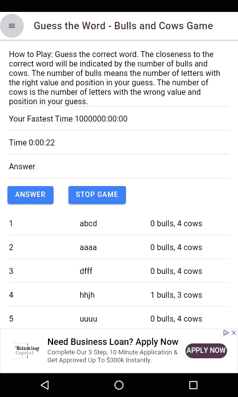

# 如何用 Angular 和 Ionic 做一个文字游戏

> 原文：<https://levelup.gitconnected.com/how-to-make-a-word-game-with-angular-and-ionic-623e667fc73f>

Ionic 是一个混合应用程序框架，可以将 web 应用程序转换为 Android 或 iOS 应用程序。它可以方便地快速构建移动应用程序，并具有不错的性能。它可以很容易地扩展到创建简单的娱乐文本游戏。

如果你不知道如何用 Angular 和 Ionic 创建应用，请参见[https://medium . com/better-programming/how-to-build-Android-apps-with-Ionic-framework-5 E3 C2 fdf 2 a 1](https://medium.com/better-programming/how-to-build-android-apps-with-ionic-framework-5e3c2fdf2a1)

在这个故事中，我们将构建一个游戏，让你猜单词直到你猜对为止，类似于[公牛和母牛游戏](https://en.wikipedia.org/wiki/Bulls_and_Cows)或[智多星游戏](https://en.wikipedia.org/wiki/Mastermind_(board_game))。该游戏为您提供了一个数字猜测游戏，您可以更改您正在猜测的数字的字母数的设置。它也将能够节省最快的时间。

# 构建游戏

像往常一样，我们从样板代码开始。

要开始构建，我们可以使用 Ionic 的 CLI。如果你用过 Angular CLI，那么你应该很熟悉它。要安装 Ionic CLI，请运行`npm install -g ionic`。

然后运行`ionic start guess-the-number-game sidemenu`，为我们的应用程序生成框架代码。`guess-the-word-game`是我们的应用程序的名称，`sidemenu`指定我们希望在我们的应用程序中有一个侧菜单。

我们需要安装一些库。我们可以通过运行`npm i moment random-js words`来做到这一点。这个`words`包里有我们在游戏中使用的英语单词列表。

现在我们可以构建游戏了。我们通过运行`ionic g component HomePage`和`ionic g SettingsPage`生成 2 页。之后，我们得到 2 个空白页面。

在`home-page.component.ts`中，我们用以下代码替换默认代码:

```
import { Component, OnInit } from '[@angular/core](http://twitter.com/angular/core)';
import { Random, browserCrypto } from "random-js";
import * as moment from 'moment';
import { NgForm } from '[@angular/forms](http://twitter.com/angular/forms)';
declare const require: any;
const words = require('an-array-of-english-words');[@Component](http://twitter.com/Component)({
  selector: 'app-home-page',
  templateUrl: './home-page.component.html',
  styleUrls: ['./home-page.component.scss'],
})
export class HomePageComponent implements OnInit {
  question: any = <any>{};
  answer: string;
  timer;
  started: boolean;
  rightWord: string;
  inputtedAnswers: string[] = [];
  elapsedTime;
  message: string;
  numLetters: number; constructor() { } ngOnInit() {
    if (!localStorage.getItem('numLetters')) {
      localStorage.setItem('numLetters', '4');
    }
  } ngOnDestroy() {
    this.stop();
  } start() {
    this.message = '';
    this.started = true;
    const random = new Random(browserCrypto);
    this.numLetters = +localStorage.getItem('numLetters');
    const filteredWords = words.filter(w => w.length == this.numLetters);
    const index = random.integer(0, filteredWords.length - 1);
    this.rightWord = filteredWords[index];
    console.log(this.rightWord);
    let numSeconds = 0;
    this.timer = setInterval(() => {
      numSeconds++;
      this.elapsedTime = moment.utc(numSeconds * 1000).format('H:mm:ss');
    }, 1000)
  }recordFastestTime() {
    const currentFastTime = moment(this.getFastestTime(), 'H:mm:ss');
    const newFastestTime = moment(this.elapsedTime, 'H:mm:ss')
    if (currentFastTime > newFastestTime) {
      localStorage.setItem(
        'fastestTime',
        this.elapsedTime
      );
    }
  } stop() {
    this.started = false;
    this.inputtedAnswers = [];
    clearInterval(this.timer);
  } checkAnswer(answerForm: NgForm) {
    if (answerForm.invalid) {
      return;
    }
    this.inputtedAnswers.push(this.answer);
    if (this.answer == this.rightWord) {
      this.stop();
      this.recordFastestTime();
      this.message = `You win! The correct word is ${this.rightWord}`;
    }
    this.answer = '';
  } getFastestTime() {
    return localStorage.getItem('fastestTime') || '1000000:00:00';
  } getNumBullsandCows(answer: number) {
    const rightAnsStr = this.rightWord.toString().split('');
    const answerStr = answer.toString().split('');
    const numBulls = rightAnsStr.filter((r, i) => rightAnsStr[i] == answer[i]).length;
    const numCows = answerStr.length - numBulls;
    return `${numBulls} bulls, ${numCows} cows`;
  }
}
```

上面的代码会根据本地存储中存储的`numLetters`设置生成你猜测的数字。默认情况下，这个单词有 4 个字母。数字生成后，它会启动一个定时器开始计算时间。两者都在`start`功能中。

`inputtedAnswers`储存您输入的答案。`checkAnswer`函数检查您是否输入了任何东西，然后调用`stop`函数，如果您的答案是正确的，该函数将调用`setInterval`函数返回的定时器对象上的`clearInterval`。`getNumBullsandCows`函数检查哪个字母是正确的，哪个是错误的。`numBulls`是猜对的字母数，`numCows`是猜错的字母数。当猜测正确时，将通过与上一次最快时间的比较来计算最快时间，上一次最快时间通过调用`recordFastestTime`函数存储在本地存储器中，如果当前经过的时间短于保存的时间，则将较短的时间保存到本地存储器中。

然后在`home-page.component.html`中，用以下内容替换现有内容:

```
<form #answerForm='ngForm' (ngSubmit)='checkAnswer(answerForm)'>
  <ion-list>
    <ion-item no-padding *ngIf='started' id='instruction'>
      How to Play: Guess the correct word. The closeness to the correct word will be indicated by the number of
      bulls and cows. The number of bulls means the number of letters with the right value and position in your guess.
      The number of cows is the
      number of letters with the wrong value and position in your guess.
    </ion-item>
    <ion-item no-padding *ngIf='started && getFastestTime()'>
      <ion-label class="ion-float-left">
        <h2>Your Fastest Time {{getFastestTime()}}</h2>
      </ion-label>
    </ion-item>
    <ion-item no-padding *ngIf='started'>
      <ion-label class="ion-float-left">
        <h2>Time {{elapsedTime}}</h2>
      </ion-label>
    </ion-item>
    <ion-item no-padding *ngIf='started'>
      <ion-label>Answer</ion-label>
      <ion-input [(ngModel)]='answer' #ans='ngModel' name='ans' required type="text" [minlength]='numLetters'
        [maxlength]='numLetters'></ion-input>
    </ion-item>
  </ion-list>
  <ion-button type='submit' *ngIf='started'>Answer</ion-button>
  <ion-button (click)='start();' *ngIf='!started'>Start Game</ion-button>
  <ion-button (click)='stop(); started = false' *ngIf='started'>Stop Game</ion-button>
</form>
<ion-content [scrollEvents]="false">
  <ion-list *ngIf='started'>
    <ion-item no-padding *ngFor='let a of inputtedAnswers; let i = index'>
      <ion-label>
        {{i+1}}
      </ion-label>
      <ion-label>
        {{a}}
      </ion-label>
      <ion-label>
        {{getNumBullsandCows(a)}}
      </ion-label>
    </ion-item>
  </ion-list>
  <ion-list *ngIf='message'>
    <ion-item no-padding>
      {{message}}
    </ion-item>
  </ion-list>
</ion-content>
```

这将为您创建一个表单，输入您的数字猜测并列出您的猜测，以及每个猜测的正确和错误字母的数量。

接下来，我们构建设置页面。为此，将以下内容添加到`settings-page.component.ts`:

```
import { Component, OnInit } from '[@angular/core](http://twitter.com/angular/core)';
import { NgForm } from '[@angular/forms](http://twitter.com/angular/forms)';
import { ToastController } from '[@ionic/angular](http://twitter.com/ionic/angular)';[@Component](http://twitter.com/Component)({
  selector: 'app-settings-page',
  templateUrl: './settings-page.component.html',
  styleUrls: ['./settings-page.component.scss'],
})
export class SettingsPageComponent implements OnInit {
  settings: any = <any>{};
  fastestTime: string;constructor(
    public toastController: ToastController
  ) { }ngOnInit() {
    if (!localStorage.getItem('numLetters')) {
      localStorage.setItem('numLetters', '4');
    }
    this.settings.numLetters = +localStorage.getItem('numLetters');
    this.fastestTime = localStorage.getItem('fastestTime');
  } save(settingsForm: NgForm) {
    if (settingsForm.invalid) {
      return;
    }
    localStorage.setItem('numLetters', this.settings.numLetters || 4);
    this.presentToast();
  } clear() {
    localStorage.removeItem('fastestTime');
    this.fastestTime = localStorage.getItem('fastestTime');
  } async presentToast() {
    const toast = await this.toastController.create({
      message: 'Your settings have been saved.',
      duration: 2000
    });
    toast.present();
  }
}
```

在`settings-page.component.html`中，我们将那里的内容替换为:

```
<ion-content [scrollEvents]="true">
  <form #settingsForm='ngForm' (ngSubmit)='save(settingsForm)'>
    <ion-list>
      <ion-item no-padding>
        <ion-label>Number of Letters</ion-label>
        <ion-range min="4" max="8" [(ngModel)]='settings.numLetters' #numLetters='ngModel' name='numLetters'>
          <ion-label slot="start">4</ion-label>
          <ion-label slot="end">8</ion-label>
        </ion-range>
      </ion-item>
      <ion-item no-padding>
        <ion-label>Fastest Time</ion-label>
        <ion-label>{{fastestTime}}</ion-label>
        <ion-button (click)='clear()'>Clear Score</ion-button>
      </ion-item>
    </ion-list>
    <ion-button type='submit'>Save</ion-button>
  </form>
</ion-content>
```

您可以从设置表单中清除本地存储，并在此页面中设置您猜测的单词的字母数。`numLetters`控件是一个滑块。

在`app-routing.module.ts`中，添加:

```
import { NgModule } from '[@angular/core](http://twitter.com/angular/core)';
import { PreloadAllModules, RouterModule, Routes } from '[@angular/router](http://twitter.com/angular/router)';
import { HomePageComponent } from './home-page/home-page.component';
import { SettingsPageComponent } from './settings-page/settings-page.component';const routes: Routes = [
  {
    path: '',
    redirectTo: 'home',
    pathMatch: 'full'
  },
  {
    path: 'home',
    component: HomePageComponent
  },
  {
    path: 'settings',
    component: SettingsPageComponent
  }
];[@NgModule](http://twitter.com/NgModule)({
  imports: [
    RouterModule.forRoot(routes, { preloadingStrategy: PreloadAllModules })
  ],
  exports: [RouterModule]
})
export class AppRoutingModule {}
```

在`app.component.ts`中，添加:

```
import { Component } from '[@angular/core](http://twitter.com/angular/core)';import { Platform } from '[@ionic/angular](http://twitter.com/ionic/angular)';
import { SplashScreen } from '[@ionic](http://twitter.com/ionic)-native/splash-screen/ngx';
import { StatusBar } from '[@ionic](http://twitter.com/ionic)-native/status-bar/ngx';
import { AdMobFree, AdMobFreeBannerConfig } from '[@ionic](http://twitter.com/ionic)-native/admob-free/ngx';const bannerConfig: AdMobFreeBannerConfig = {
  isTesting: false,
  autoShow: true,
  id: 'ca-app-pub-9346223375875688/3611743731'
};[@Component](http://twitter.com/Component)({
  selector: 'app-root',
  templateUrl: 'app.component.html'
})
export class AppComponent {
  public appPages = [
    {
      title: 'Home',
      url: '/home',
      icon: 'home'
    },
    {
      title: 'Settings',
      url: '/settings',
      icon: 'settings'
    }
  ]; constructor(
    private platform: Platform,
    private splashScreen: SplashScreen,
    private statusBar: StatusBar,
    private admobFree: AdMobFree
  ) {
    this.initializeApp();
  } initializeApp() {
    this.platform.ready().then(() => {
      this.statusBar.styleDefault();
      this.splashScreen.hide();
      this.admobFree.banner.config(bannerConfig);
      this.admobFree.banner.prepare()
        .then(() => {
          // banner Ad is ready
          // if we set autoShow to false, then we will need to call the show method here
        })
        .catch(e => console.log(e));
    });
  }
}
```

最后两个文件将添加侧菜单的菜单项，并允许我们访问我们创建的页面。

在`app.module.ts`中，写下:

```
import { NgModule } from '[@angular/core](http://twitter.com/angular/core)';
import { BrowserModule } from '[@angular/platform-browser](http://twitter.com/angular/platform-browser)';
import { RouteReuseStrategy } from '[@angular/router](http://twitter.com/angular/router)';import { IonicModule, IonicRouteStrategy } from '[@ionic/angular](http://twitter.com/ionic/angular)';
import { SplashScreen } from '[@ionic](http://twitter.com/ionic)-native/splash-screen/ngx';
import { StatusBar } from '[@ionic](http://twitter.com/ionic)-native/status-bar/ngx';import { AppComponent } from './app.component';
import { AppRoutingModule } from './app-routing.module';
import { HomePageComponent } from './home-page/home-page.component';
import { SettingsPageComponent } from './settings-page/settings-page.component';
import { FormsModule } from '[@angular/forms](http://twitter.com/angular/forms)';[@NgModule](http://twitter.com/NgModule)({
  declarations: [
    AppComponent,
    HomePageComponent,
    SettingsPageComponent
  ],
  entryComponents: [],
  imports: [
    BrowserModule,
    IonicModule.forRoot(),
    AppRoutingModule,
    FormsModule
  ],
  providers: [
    StatusBar,
    SplashScreen,
    { provide: RouteReuseStrategy, useClass: IonicRouteStrategy },
  ],
  bootstrap: [AppComponent]
})
export class AppModule { }
```

这是允许所有页面被看到的最终布线。

最后，我们得到:



**现在在**[**http://jauyeung.net/subscribe/**](http://jauyeung.net/subscribe/)**订阅我的邮件列表。**

**在推特上关注我**[**https://twitter.com/AuMayeung**](https://twitter.com/AuMayeung)