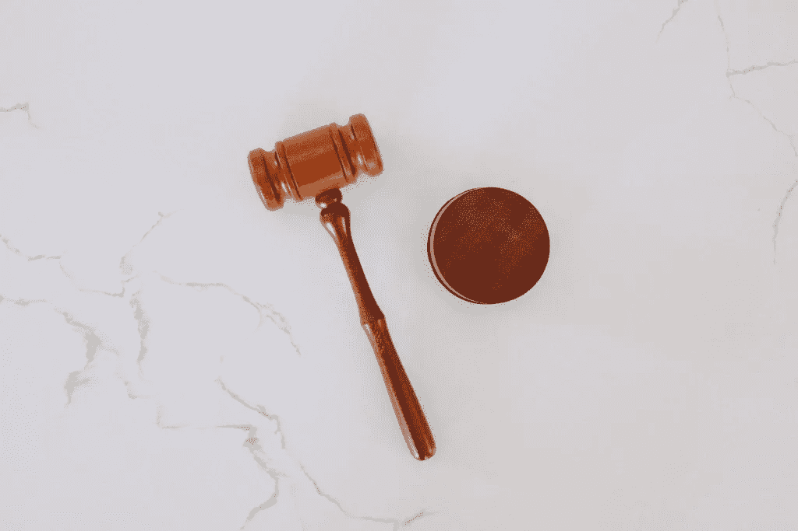
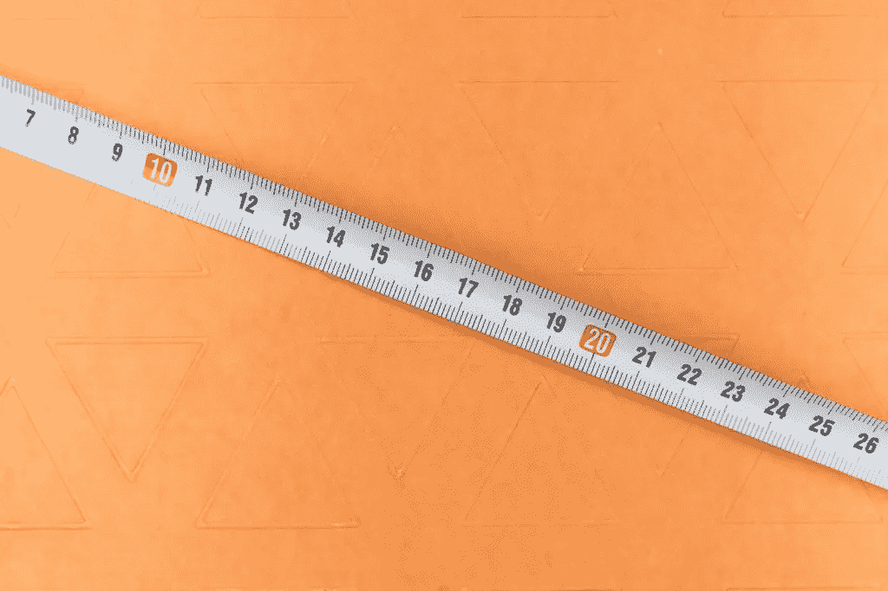

# 如何创建无障碍网站——终极指南

> 原文：<https://levelup.gitconnected.com/how-to-make-accessible-websites-the-ultimate-guide-a9792eeeaa09>


照片由[西格蒙德](https://unsplash.com/@sigmund?utm_source=medium&utm_medium=referral)在 [Unsplash](https://unsplash.com?utm_source=medium&utm_medium=referral) 上拍摄

*关于可访问性你需要知道的一切，请查看* [*网页可访问性——你需要知道的一切，在编程鸭*](https://programmingduck.com/articles/accessibility/) *上。*

**免责声明:我不是律师。本文仅代表个人观点和目前的理解。这不是法律意见。关于无障碍的法律方面的信息，请咨询律师。**

确保你的网站是可访问的应该不难。一点点努力可以让你在日常工作中走很长的路。

首先，如果你对可访问性完全陌生，学习一些基础知识会很有帮助。请参见[如何学习可访问性](https://programmingduck.com/articles/learn-accessibility)获取一些有用的资源。

之后，您可以使用以下简单过程在工作时应用辅助功能:

*   了解您的法律可访问性要求
*   使用语义 HTML
*   经常检查可访问性清单，以确保您在工作中正确应用了可访问性
*   测试你的网站的可访问性，以确保你做得正确

或者，您还可以:

*   使可访问性成为标准和开发过程的一部分
*   对人们进行无障碍教育
*   如果你需要更多的帮助，请聘请专家

以下是该过程每个部分的更多细节。



# 法律要求

开始之前，你应该知道你的法律要求。

一般来说，对于大多数公司来说，您应该满足 WCAG 2.1(或者更可能是最新发布的版本)AA 级可访问性标准。A 级大概是不够的。AA 级是标准。AAA 级是“有抱负的”。一般来说，这并不是法律要求，但是如果你能做到，那就太好了。

此外，根据您所在国家的法律，您**可能**需要一份可访问性声明。即使你没有， [WCAG 提到有很多很好的理由拥有一个。有关可访问性声明的信息，请参见](https://www.w3.org/WAI/planning/statements/) [WCAG 关于制定可访问性声明的文章](https://www.w3.org/WAI/planning/statements/)。

# 使用语义 HTML

使用语义 HTML 是你能为可访问性做的最重要的事情。一个简单的方法是扫描 MDN 上的 [HTML 元素引用。它列出了所有的 HTML 元素，并说明了它们的用途。您还可以访问每个元素的专用页面，了解更多相关信息。](https://developer.mozilla.org/en-US/docs/Web/HTML/Element)

# 使用有用的清单

工作时，请参考这些有用的清单:

*   [WCAG 网络目标清单](https://webaim.org/standards/wcag/checklist)
*   [WAI-ARIA 创作实践](https://www.w3.org/TR/wai-aria-practices-1.1/)
*   [WCAG 文件](https://www.w3.org/WAI/standards-guidelines/wcag/)
*   [-如何认识 WCAG(快速参考)](https://www.w3.org/WAI/WCAG21/quickref/)
*   [-WCAG 的技术](https://www.w3.org/WAI/WCAG21/Techniques/)

## 网络目标 WCAG 清单

WebAIM WCAG 清单提供了关于可访问性的最重要的事情的很好的建议。这是本节中最简单的清单之一。因此，对于你的大部分工作来说，经常参考是很好的。

## WAI-ARIA 创作实践

WAI-ARIA 创作实践为用 JavaScript 创建的定制小部件(如手风琴、定制下拉菜单等)提供了指南。).遵循这些准则对于这些小部件的可访问性非常重要。因此，我建议当你在做类似的事情时，总是参考这个资源。

此外，该资源还为特定元素的命名提供了指导。有些元素需要一个名称，而对于其他元素，建议使用名称，但不是必需的。幸运的是，如果您使用语义 HTLM，大多数(如果不是全部)需要名称的元素将自动从它们的内容中获得一个与之相关联的名称。换句话说，你不需要经常检查这个部分。

但是，命名部分提供了命名元素的附加建议。如果您想进一步改善屏幕阅读器用户的体验，请随时查看本节并应用其中的一些建议。

## WCAG

WCAG 包括法律要求中提到的官方规范。要做到 100%合规，你必须检查这一点。

然而，这个资源似乎比其他资源更难处理。因此，您可能会发现在日常工作中使用 WebAIM 资源更容易。然后，当您想要进行更全面的可访问性审计时，可以检查这个资源。

## 使用清单的频率

至于使用这些清单的频率，您有不同的选择。您可以:

*   每当你在做一些相关的事情并且想要额外的信息时，可以参考它们
*   偶尔浏览一下文件，也许一周左右一次。这样，您可以回忆起那一周您所做的工作，并确保您没有错过任何可访问性需求。



# 试验

要真正确定你的网站是可访问的，你需要测试它。

您可以进行不同种类的可访问性测试。它们的复杂程度和所需时间各不相同。它们也可以是手动或自动的。

# 手动测试

这里有一些你应该考虑手动测试的东西。

## 一款云视频会议软件

测试您的网站在使用浏览器缩放时的外观。WCAG 标准目前要求你的页面在 200%的缩放比例下是可读和有效的。但是，可以测试更高的值。

还可以考虑用操作系统级别的缩放(在操作系统设置中应用的缩放设置)来测试您的网站。

考虑用一个应用程序来测试你的网站，比如 ZoomText。

## 屏幕阅读器

用屏幕阅读器测试你的网站。

要进行更彻底的测试，请考虑使用操作系统、屏幕阅读器和浏览器的不同常见组合来测试您的网站:

*   带有 Voiceover 和 Safari 的 Mac 或 iOS
*   有颚或 NVDA 的窗户
*   带有 ChromeVox 和 Chrome 的 ChromeOS
*   启用了辅助功能选项和 Chrome 的 Android
*   带有 Orca 的 Linux

## 键盘导航和交互性

测试网站的键盘导航和交互性。要特别注意与 JavaScript 一起工作的东西，比如定制小部件、模态等。

确保键盘导航是明智的、简单的和清晰的。用户每次都应该知道焦点在哪里。

还要确保整个网站可以只用键盘操作。这个规则的唯一例外是，如果这实际上是不可能的，例如，如果你有手绘的功能。

## 视力缺陷

一些浏览器有视力缺陷模拟器。如果你正在使用 Chrome，这里有[安迪·奥斯马尼关于 Chrome](https://addyosmani.com/blog/emulate-vision-deficiencies-devtools/) 中视觉缺陷模拟器的教程。这里有一篇关于在 Firefox 中使用色觉模拟器的[文章。](https://developer.mozilla.org/en-US/docs/Tools/Accessibility_inspector/Simulation)

或者，你可以使用浏览器扩展，如 [NoCoffee 视觉模拟器](https://chrome.google.com/webstore/detail/nocoffee/jjeeggmbnhckmgdhmgdckeigabjfbddl)。

## 文档大纲

文档大纲是指网页的标题。具体来说，它指的是它们的标题级别和顺序。

标题级别应该按顺序下降，不要跳跃。

例如，这很好:

```
<h1>h1</h1>
<h2>h2</h2>
<h2>h2</h2>
<h3>h3</h3>
```

然而，下面的情况并不好，因为它从 h2 跳到了 h4:

```
<h1>h1</h1>
<h2>h2</h2>
<h4>h4</h4>
<h2>h2</h4>
```

测试这些的一个简单方法是安装一个浏览器扩展，比如 [WAVE](https://wave.webaim.org/) 或者 [Outliner](https://chrome.google.com/webstore/detail/outliner-a-chrome-extensi/eegpjjnajnplmkigmoglgbgpibgkkepo) 。它们可以非常清晰地向您展示文档大纲，而无需您查看页面的源代码。

# 易访问性测试工具

这里有一些工具，你可以考虑用于可访问性测试。

第三方服务/分析仪:

*   [榫](https://tenon.io/)

页面测试工具:

*   Chrome 开发工具:
*   -可访问性选项卡
*   -渲染选项卡->视觉缺陷模拟器
*   -灯塔
*   浏览器扩展:
*   [-波](https://wave.webaim.org/)
*   [-大纲视图](https://chrome.google.com/webstore/detail/outliner-a-chrome-extensi/eegpjjnajnplmkigmoglgbgpibgkkepo)
*   [-斧头](https://www.deque.com/axe/)
*   [-总计](https://khan.github.io/tota11y/)

构建工具:

*   [灯塔](https://github.com/GoogleChrome/lighthouse)
*   [斧芯](https://github.com/dequelabs/axe-core)
*   [柏斧](https://www.npmjs.com/package/cypress-axe)
*   [无障碍 js](https://github.com/github/accessibilityjs)

还要考虑您所使用的技术的可访问性代码。一个例子是 jsx 的 eslint-plugin-jsx-a11y。

# 可访问性的单元、集成和端到端测试

在极少数情况下，您可能想要为可访问性编写单元、集成或端到端测试。

例如，假设您已经创建了一个自定义小部件。您可能希望对它进行端到端的测试，以确保当用户在键盘上按下`TAB`时，小部件可以接收焦点。

# 关于开始可访问性测试的建议

当谈到可访问性测试时，有许多东西可以测试，有许多工具可以使用。

为了简单起见，请考虑从以下几点开始:

1.  使用 lighthouse 对您网站上的页面进行审计。然后修复它提到的任何错误。
2.  对键盘导航、屏幕阅读器、文档轮廓和缩放进行一些手动测试。

随着您越来越熟悉，您可以尝试其他工具。例如:

*   请尝试安装 WAVE 浏览器扩展或其他替代产品。
*   尝试用 Lighthouse、axe-core 或其他工具设置一些自动化的可访问性测试。
*   试着安装一些相关的代码 linters，比如 eslint-plugin-jsx-a11y。
*   诸如此类。

或者，如果你有预算，你也可以使用 Tenon 这样的服务，甚至雇佣一个可访问性顾问。

# 让可访问性成为标准和开发过程的一部分

让可访问性成为你的标准和开发过程的正式部分是很有用的。这样就不会被忽视了。

这类似于你如何在你的代码库中建立一个标准。

您可以在您的标准文档中声明可访问性很重要，并且所有的工作都应该符合 WCAG 2.1 AA 规范，或者至少符合 WebAIM 建议和 ARIA 创作实践建议。

你也可以让它成为你发展过程的一部分:

*   您可以设置自动化的可访问性测试，在每个故事的 pull 请求上运行。
*   您可以要求开发人员在提交新功能之前测试他们工作的可访问性。
*   您可以每月进行一次小型的可访问性审计，或者每年进行一次全面的审计。
*   诸如此类。


# 教育那些工作在前端的人

正如[可访问性——你需要知道的一切](https://programmingduck.com/articles/accessibility)中所解释的，前端开发人员需要比任何人都更了解可访问性。

然而，所有在前端完成的工作都会影响可访问性。这包括设计师、内容创作者和其他工作角色所做的工作。因此，让他们了解可访问性也是很有用的。

出于这个原因，对前端开发人员进行教育可能是有好处的。

此外，开发人员可以与他们合作，或建议他们创建标准，以确保他们的工作是可访问的。例如，他们可能会建议文案(在网站上写文字的人)他们的工作需要遵循合理的文档大纲。

# 雇用第三方可访问性顾问

即使公司的开发人员了解可访问性，他们也不是专家。他们可能会遗漏一些只有专家才知道的东西。即使他们没有遗漏任何法律要求，专家也可能能够以开发人员可能想不到的方式增强可访问性。

所以，如果你想彻底了解可访问性，你可能需要聘请第三方的可访问性顾问或专家。

# 摘要

无障碍工作不一定很难。

这里有一个你可以使用的简单过程:

*   了解您的法律可访问性要求
*   使用语义 HTML
*   经常检查可访问性清单，以确保您在工作中正确应用了可访问性
*   测试你的网站的可访问性，以确保你做得正确

或者，您还可以:

*   使可访问性成为标准和开发过程的一部分
*   对人们进行无障碍教育和建议
*   如果你需要更多的帮助，请聘请专家

# 最终注释

本文到此为止。

如果你有任何反馈，甚至反驳，请在评论中告诉我。

接下来，如果你想知道更多关于可访问性的信息，请参阅文章[网页可访问性——你需要知道的一切](https://programmingduck.com/articles/accessibility)。

*原载于 2020 年 12 月 6 日*[*【https://programmingduck.com】*](https://programmingduck.com/articles/apply-accessibility)*。*