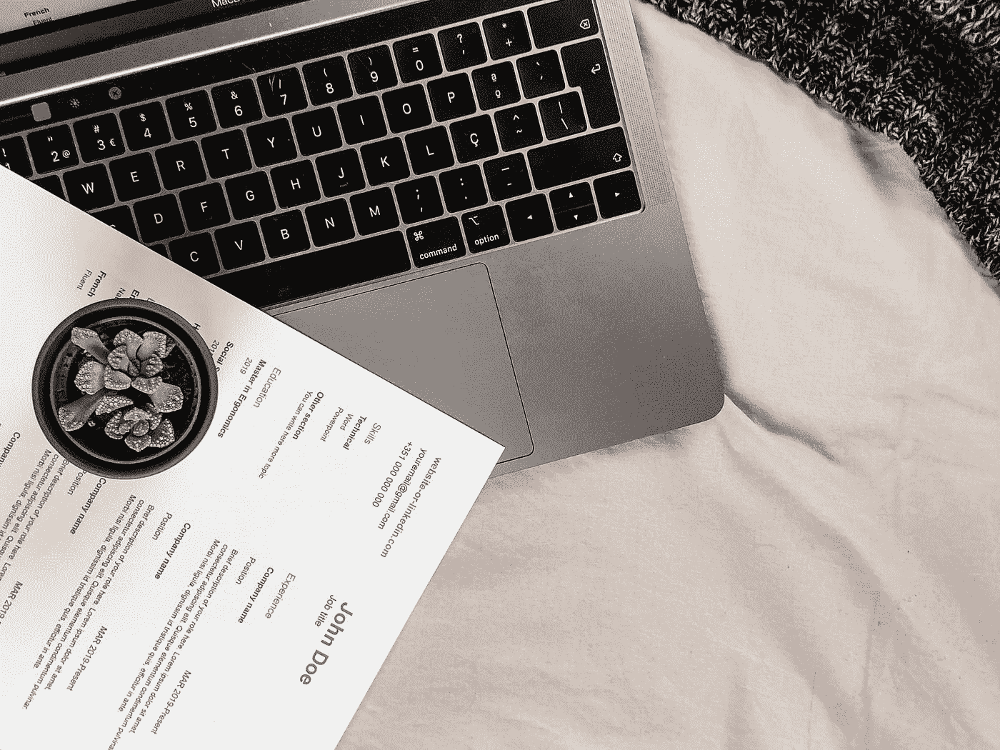

# 如何制作一份惊艳的编程简历

> 原文：<https://levelup.gitconnected.com/how-to-make-an-amazing-programming-resume-56f81d510d83>

## 面试官在你的简历中寻找什么。

[若昂·费罗](https://unsplash.com/@joaoscferrao?utm_source=medium&utm_medium=referral)在 [Unsplash](https://unsplash.com?utm_source=medium&utm_medium=referral) 上拍摄的照片

大学毕业的时候，同学们最关心的一件事就是简历。他们认为这是获得梦想中的工作或职业的门票，一份好的或坏的简历可以成就或毁掉他们的生活。事实上，虽然简历很重要，但并不是包罗万象的。从我的经验来看，他们只占面试过程的一小部分。此外，我的简历在我的一些面试中几乎没有被提及。

在一次面试中，我被要求描述我在一个我和同事们创建的项目中的角色。这是我简历中提到最多的一次。在其他职业领域，简历可能会发挥更大的作用。然而，在我的编程面试中，它只是被用作一个检查清单，以确定我是否具备他们所寻求的必要技能，并询问我有关我所从事的项目的问题。在面试的百分之九十的时间里，我必须告诉他们并描述我所知道的。在创建你的简历时，这是你应该采取的心态:你的简历是标题，你必须填写文章或那个标题的肉。你的简历上说了，但这取决于你在面试中证明这一点。

## 你应该把精力放在哪里

有鉴于此，我认为最好将 90%的时间和精力投入到学习和研究你所使用的技术上，然后用你从学习中获得的经验和信心来回顾你的简历。你会看到，当你对自己所知道的东西有信心时，简历会自动生成。这是我曾经在美国运通工作过的简历的一个例子。

它的简单和无趣正是它吸引人的地方。你可能已经听过很多次了，面试官只花几秒钟来看你的简历。例如，在[Mercy College 的这项](https://career.mercy.edu/blog/2019/11/08/eye-tracking-study-shows-recruiters-look-at-resumes-for-7-seconds/#:~:text=In%20addition%2C%20a%20well%20organized,impression%20you%20make%20is%20critical.)研究中称，“*招聘人员只花 7 秒钟审查一份简历*”因此，如果你知道招聘人员在寻找什么，尽快向他们提供他们需要的信息对你最有利。例如，考虑到我在美国运通的工作，他们寻找一个在 SpringBoot、Java 和前端技术方面有专长的候选人。他们所要做的就是查看技能部分，不到 5 秒钟，他们就可以看到我是否有他们想要的东西。

## 简历的细分

格伦·卡斯滕斯-彼得斯在 [Unsplash](https://unsplash.com?utm_source=medium&utm_medium=referral) 上拍摄的照片

## 1.教育

几乎所有的工作都会宣传他们只雇佣符合他们教育标准的人，不管是学士、硕士还是高中文凭。所以如果你满足了这个要求，确保这是他们看到的第一件东西。如果他们不这样做，他们可能会把它扔在没有桩，因为你不符合基本要求。

## 2.技能

如果他们看到你满足基本要求，你希望他们知道你了解他们需要的技术。然而，如果你的项目都与他们想要的职位不相关，他们就不会想看。

## 3.项目

一旦他们确定你符合所有要求，你就需要证明你可以支持你的主张。这就是你的项目部分发挥作用的地方。你的项目部分有两个主要目的:向雇主证明你已经成功利用了你宣传的技术。这也表明你已经主动确保自己是一名熟练工人。此外，项目完成的时间越近越好，表明信息仍然是新的。

## 4.工作经历

你在哪里列出工作经验将取决于你的经验水平。例如，当我创建这份简历时，我没有太多的工作经验。所以，我确保我的工作经历是他们用来淡化我弱点的最后一篇文章。然而，如果我有两三年的相关经验，这将是我简历上的第二个标题。所以，在制作你的简历时，你应该总是发挥你的优势，强调你最好的品质，同时淡化你的弱点。

## 5.不要撒谎！

不言而喻，永远不要在简历上撒谎，但省略不是撒谎。如果他们问你是否熟悉某项技术，你说不熟悉是可以接受的，但是不要宣传你有多不了解或者欠缺。这样做会让你看起来像一个不自信的员工，没有雇主希望这样。

希望这对你们有所帮助。我知道对一些人来说，写简历可能是面试中最大的压力之一，但我希望这篇文章能给你信心，让你不再担心面试过程中的这一部分。如果你有任何问题，请留下评论，我会尽快回复。

祝您愉快！

> 资源
> 
> [眼球追踪研究显示招聘人员看简历的时间为 7 秒](https://career.mercy.edu/blog/2019/11/08/eye-tracking-study-shows-recruiters-look-at-resumes-for-7-seconds/#:~:text=In%20addition,%20a%20well%20organized,impression%20you%20make%20is%20critical.)

# 分级编码

感谢您成为我们社区的一员！更多内容请参见[升级编码出版物](https://levelup.gitconnected.com/)。
跟随:[推特](https://twitter.com/gitconnected)，[领英](https://www.linkedin.com/company/gitconnected)，[通迅](https://newsletter.levelup.dev/)
**升一级正在改造理工大招聘➡️** [**加入我们的人才集体**](https://jobs.levelup.dev/talent/welcome?referral=true)