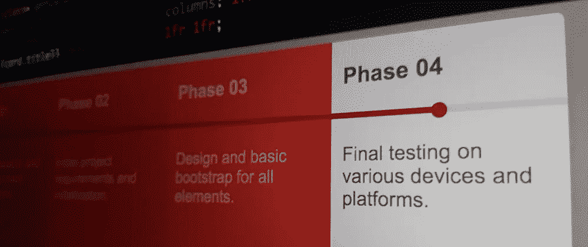
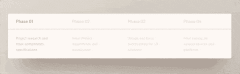
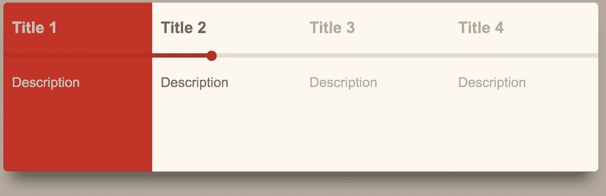
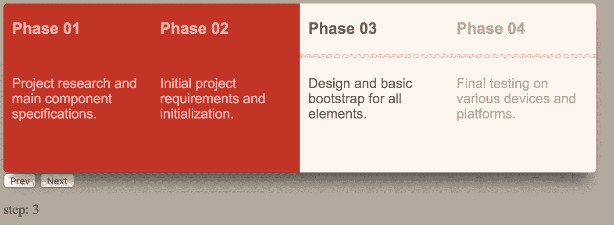

# 如何制作一个动画“向导”组件——WotW

> 原文：<https://levelup.gitconnected.com/how-to-make-an-animated-wizard-component-wotw-9af9ac7a87a4>



欢迎来到“每周小部件”系列，在这里我拍摄了令人敬畏的 UI/UX 组件的 gif 或视频，并用代码将它们赋予生命。

> 查看本周所有的 [Widget 文章](https://levelup.gitconnected.com/wotw/home)并关注 gitconnected，确保你不会错过任何一个 Widget 教程。

本周轮到一个进度指示器或“向导”组件，它可以帮助你完成应用程序的启动过程。灵感来自[这个 uimovement 提交的](https://uimovement.com/ui/5466/progress-bar/)看起来是这样的:



## 准备

对于这个小部件，我将使用 [Vue.js](https://vuejs.org/) 进行交互，使用 [Sass](https://sass-lang.com/) 进行样式设计。

## 基本标记

像往常一样，我喜欢从组件需要的标记开始。我们需要一个带有`id="app"`的根 div，这样我们可以稍后安装我们的 Vue 应用程序。

在它里面应该有一个包含进度元素(背景、条和球)的容器，以及包含要遵循的步骤的卡片。

你会注意到在下面的代码中，卡片有三种状态:完成、活动和正常，这些类将在下一步帮助我们进行样式设计。

```
<div id="app">
  <div class="container">
    <div class="progress-bg"></div>
    <div class="progress-bar"></div>
    <div class="progress-ball"></div>

    <div class="card done">
      <h3>Title 1</h3>
      <p>Description</p>
    </div>

    <div class="card active">
      <h3>Title 2</h3>
      <p>Description</p>
    </div>

    <div class="card">
      <h3>Title 3</h3>
      <p>Description</p>
    </div>

    <div class="card">
      <h3>Title 4</h3>
      <p>Description</p>
    </div>
  </div>
</div>
```

## 式样

我们将开始匹配背景色和主容器。我使用了网格显示属性来更好地控制布局和项目，如果你想了解更多，你可以查看本指南。
为了更好地理解，我添加了内联注释来阐明关键决策:

```
body {
  background-color: #B5AB9E;
}
.container {
  position: relative; // used to contain absolute positioned elements
  display: grid; 
  overflow: hidden; // helps hiding inner elements that exceed size
  border-radius: 5px; // rounded corners
  grid-template-columns: 1fr 1fr 1fr 1fr; // here are declared the 4 columns for the 4 cards
  width: 700px;
  box-shadow:0px 20px 26px -10px rgba(0, 0, 0, 0.5);
}
```

现在我们需要设计进度元素的样式，它们将被绝对定位，这样它们就不会妨碍卡片。我还将为进度元素的颜色和高度声明几个 scss 变量。

```
$bar-height: 60px; // aligns all progress elements
$bar-color: #B52A1C; // dark red color

.progress-bg {
  position: absolute;
  top: $bar-height;
  width: 100%;
  height: 5px;
  background-color: rgba(0,0,0,.1); // black with 10% opacity
}
.progress-bar {
  position: absolute;
  top: $bar-height;
  width: 35%;
  height: 5px;
  background-color: $bar-color;
  transition: width 0.3s; // we will animate the width property
}
.progress-ball {
  position: absolute;
  top: $bar-height - 3; // subtracting half of the ball radius 
  left: calc(35% - 6px);// and the ball radius, to center it
  border-radius: 50%; // makes the circle
  background-color: $bar-color;
  width: 12px;
  height: 12px;
  transition: left 0.3s, opacity 0.3s; // we will animate the left and opacity property
}
```

之后，为了设计卡片样式，我们将为*完成的*和*活动的*卡片制定一般卡片规则和特殊规则:

```
.card {
  padding: 0 10px;
  background-color: #FCF6EE; // beige color
  color: rgba(0,0,0,.3); // Text color is black with 30% opacity
  font-family: Arial, Helvetica, sans-serif;
  height: 200px;
  transition: background-color 0.3s, color 0.3s; // We will animate its bgColor and color props
  p {
    margin-top: 45px;  
  }
}
.card.done { 
  background-color: #C13326; // change bgColor to dark red
  color: rgba(255, 255, 255, .6); // the text color will change to white with 60% opacity
}

.card.active {
  color: rgba(0, 0, 0, .6); // the active card only has a darker text (more opacity)
}
```

现在我们有了这样的东西:



## 互动

我们有一个漂亮的组件，但它没有任何动作，让我们从初始化我们的`#app`中的 Vue 开始，并为我们的卡添加一些基本数据:

```
const cards = [
  {
    title: 'Phase 01', 
    description: 'Project research and main component specifications.'
  },
  {
    title: 'Phase 02', 
    description: 'Initial project requirements and initialization.'
  },
  {
    title: 'Phase 03', 
    description: 'Design and basic bootstrap for all elements.'
  },
  {
    title: 'Phase 04', 
    description: 'Final testing on various devices and platforms.'
  }
]

new Vue({
  el: '#app',
  data: {
    currentStep: 0, // here we will track the current card
    cards: cards
  }
})
```

在将数据绑定到我们的 HTML 卡片之前，首先我们需要一种方法来生成类`.done`和`.active`。让我们做一个方法来比较每个卡片的`currentStep`并返回相应的类:

```
// ... 
  methods: {
    getCardClass(cardIndex) {
      if(cardIndex===this.currentStep) {
        return 'active'
      }
      if(cardIndex<this.currentStep) {
        return 'done'
      }

      return ''
    }
  }
```

现在我们可以用下一个代码片段替换卡片，该代码片段使用`v-for`来迭代我们的数据，并将为每一个卡片设置相应的类:

```
...
    <div v-for="(card, index) in cards" 
         :key="index"
         class="card"
         :class="getCardClass(index + 1)">
      <h3>{{card.title}}</h3>
      <p>{{card.description}}</p>
    </div>
...
```

您可以手动更改`currentStep`数据以查看卡片如何变化，但最好有一种更快的方法来更改它，在 JS 中，我将添加一个计算属性和这两个方法:

```
computed: {
    totalSteps () {
      return this.cards.length
    }
  },

  // ... methods
    goPrev() {
      if(this.currentStep>0){
        this.currentStep--
      }
    },
    goNext() {
      if(this.currentStep<=this.totalSteps){
        this.currentStep++
      }
    }
```

然后在我们的 HTML(容器外)中，我们可以添加几个按钮和一个段落来显示`currentStep`:

```
...
  <div class="buttons">
    <button @click="goPrev">Prev</button>
    <button @click="goNext">Next</button>
    <p>step: {{currentStep}}</p>
  </div>
```



看起来快完成了，但是进度条还没有移动。

我们实际上不需要对*进度背景*做什么，但是*进度条*需要改变它的宽度，球需要改变它的左边位置。

这些只是样式上的变化，所以这只是几个绑定的问题，就像这样:

```
<div :style="barStyle" class="progress-bar"></div>
    <div :style="ballStyle" class="progress-ball"></div>
```

`barStyle`和`ballStyle`将是计算属性，因为它们将根据`currentStep`和卡片数量而变化。

我们将从`barStyle`开始，它只需要返回一个带有`width`属性的对象，这要归功于将改变内联样式的绑定。

这里棘手的部分是如何计算这个宽度，因为它取决于卡片的数量:

```
// computed
    barStyle () {
      return {
        width: this.barWidth
      }
    },
    barWidth () {
      const step = (100 / this.totalSteps)
      const stepHalf = step / 2

      // sets width to match the center of the card
      const target = (step * this.currentStep) - stepHalf
      // keep width between 0 - 100
      const width = Math.max(Math.min(target, 100), 0)
      return `${width}%`
    }
```

在我们分配`target`值的那一行，如果我们不减去`stepHalf`，它会在卡片的末端而不是中间设置横条。

现在对于球的样式，我们可以重用`barWidth`属性，就像我们之前在 CSS 中做的那样将圆居中。

```
// computed
    ballStyle () {
      const isVisible = this.currentStep && !this.allStepsDone
      const opacity = isVisible ? 1 : 0
      return {
        left: `calc(${this.barWidth} - 6px)`,
        opacity: opacity,
      }
    },
    allStepsDone() {
      return this.currentStep>this.totalSteps
    }
```

请注意，当`currentStep`是`0`或最后一步`allStepsDone`时，我们只需将其不透明度设置为 0 即可使圆圈消失。

进度条现在应该可以工作了，但是我们的工作还没有完成，如果我们靠近原始动画看，每个“完成”卡片都有不同的颜色。使用一个包含一张卡能得到的所有可能的颜色深浅的数组是不实际的，相反我使用了 HSL 颜色。

HSL 代表色调、饱和度和明度。这种格式的颜色可以这样声明`hsl(0, 100%, 50%) // red`。

让我们在`js`开始时声明基色:

```
const hslColorRed = {
  h: 5, 
  s: 67, 
  l: 45
}
```

现在类似于`getCardClass`方法，我们将创建一个`getCardColor`方法。在那里，我们将首先检查该步骤是否完成，然后根据它与`currentStep`的接近程度，我们将增加基色的亮度:

```
// methods
    getCardColor(cardIndex) {
      // step not done yet
      if(cardIndex>=this.currentStep) {
        return
      }

      const {h,s,l} = hslColorRed
      if(this.allStepsDone){
        // return the base color when all steps are done
        return {
          backgroundColor: `hsl(${h}, ${s}%, ${l}%)`
        }
      }

      const lightnessRange = 15
      const step = (lightnessRange / this.currentStep) * cardIndex
      const newL = l + step
      return {
        backgroundColor: `hsl(${h}, ${s}%, ${newL}%)`
      }
    },
```

而现在最后的结果！

今天的本周小工具到此结束。

如果你渴望更多，你可以检查其他 WotW:
[动画卡滑块](http://ederdiaz.com/blog/2018/04/18/animated-card-slider-with-vue-gsap/)
[提交按钮与加载器](http://ederdiaz.com/blog/2018/04/11/making-a-submit-button-with-loader-wotw/)
[笑脸切换控件](http://ederdiaz.com/blog/2018/04/04/smiley-toggle-wotw/)

另外，如果你想看下周的某个小部件，可以在评论区发表。

下周见，关注 [gitconnected](https://levelup.gitconnected.com) 获取每周小工具！

*最初发表于*[*Eder díaz*](http://ederdiaz.com/blog/2018/04/25/how-to-make-an-animated-wizard-component-wotw/)*。*