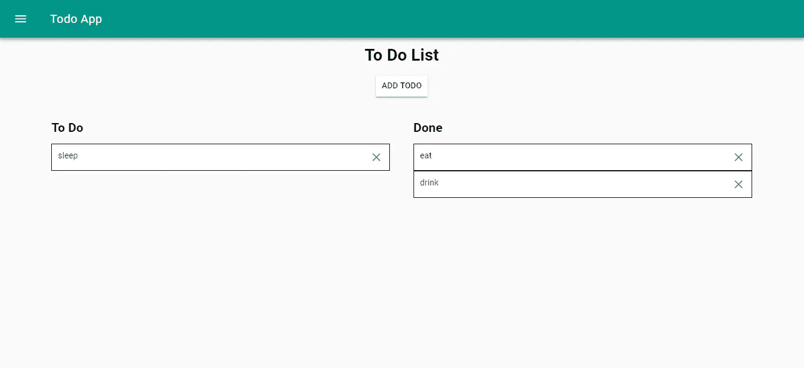
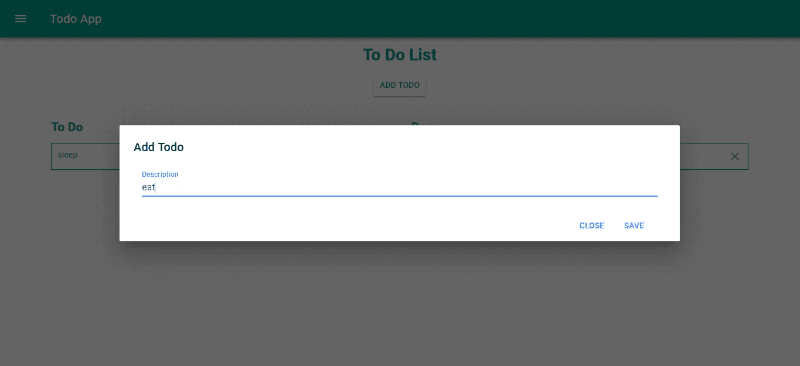

# 用 Vue.js 构建一个拖放应用程序

> 原文：<https://levelup.gitconnected.com/how-to-make-an-app-with-drag-and-drop-with-vue-js-35f7a3739ae1>



**现在在**[**http://jauyeung.net/subscribe/**](http://jauyeung.net/subscribe/)**订阅我的邮件列表。**

**在推特上关注我**[**https://twitter.com/AuMayeung**](https://twitter.com/AuMayeung)

拖放是许多交互式 web 应用程序的一项功能。它为用户操作数据提供了一种直观的方式。添加拖放功能很容易添加到 Vue.js 应用程序中。

## 我们正在构建的应用程序

我们将创建一个 todo 应用程序，它有两列——一个 To Do 列和一个 Done 列。您可以在两者之间拖放，将状态从待办事项更改为已完成，反之亦然。为了构建应用程序，我们使用 Vue 素材库和 [Vue 可拖动包](https://github.com/SortableJS/Vue.Draggable)来使应用程序看起来更好，并提供简单的拖放功能。它也将有一个导航菜单和一个顶栏。

## 入门指南

要开始构建应用程序，我们首先要安装 Vue CLI。我们通过运行`npm i -g @vue/cli`来安装它。之后，我们可以创建项目。为此，我们运行`vue create todo-app`。我们没有选择默认值，而是通过选择替代选项来定制应用程序的脚手架，并选择 Vue 路由器、Babel 和 CSS 预处理器。按照说明完成搭建后，我们就可以添加一些库了。

我们需要添加 Axios 来进行 HTTP 请求，并添加 Vue 素材库和我们之前提到的 Vue 可拖动包，以使我们的应用程序更漂亮，并分别提供我们想要的拖放功能。此外，我们需要 Vee Validate 包来让我们在应用程序中进行表单验证。为了安装这些包，我们运行`npm i axios vuedraggable vue-material vee-validate@2.2.14`。

## 构建应用程序

现在我们可以写一些代码了。首先，我们添加一个 mixin 来让我们提出请求。为此，我们创建了一个`mixins`文件夹并添加了一个名为`todoMixin.js`的文件，然后我们将以下内容放入我们的文件:

```
const axios = require('axios');
const apiUrl = '[http://localhost:3000'](http://localhost:3000');export const todoMixin = {
    methods: {
        getTodos() {
            return axios.get(`${apiUrl}/todos`);
        }, addTodo(data) {
            return axios.post(`${apiUrl}/todos`, data);
        }, editTodo(data) {
            return axios.put(`${apiUrl}/todos/${data.id}`, data);
        }, deleteTodo(id) {
            return axios.delete(`${apiUrl}/todos/${id}`);
        }
    }
}
```

这些函数将在我们的主页中用来发出 HTTP 请求，在我们的 to do 列表上执行 CRUD。我们现在将创建主页。在`Home.vue`中，我们用以下内容替换现有内容:

```
<template>
  <div class="home">
    <div class="center">
      <h1>To Do List</h1>
      <md-button class="md-raised" [@click](http://twitter.com/click)="showDialog = true">Add Todo</md-button>
    </div><div class="content">
      <md-dialog :md-active.sync="showDialog">
        <md-dialog-title>Add Todo</md-dialog-title>
        <form [@submit](http://twitter.com/submit)="addNewTodo" novalidate>
          <md-field :class="{ 'md-invalid': errors.has('description') }">
            <label for="description">Description</label>
            <md-input
              type="text"
              name="description"
              v-model="taskData.description"
              v-validate="'required'"
            ></md-input>
            <span class="md-error" v-if="errors.has('description')">{{errors.first('description')}}</span>
          </md-field><md-dialog-actions>
            <md-button class="md-primary" [@click](http://twitter.com/click)="showDialog = false">Close</md-button>
            <md-button class="md-primary" [@click](http://twitter.com/click)="showDialog = false">Save</md-button>
          </md-dialog-actions>
        </form>
      </md-dialog>
      <div class="lists">
        <div class="left">
          <h2>To Do</h2>
          <draggable v-model="todo" group="tasks" [@change](http://twitter.com/change)="updateTodo">
            <div v-for="t in todo" :key="t.id" class="item">
              {{t.description}}
              <a [@click](http://twitter.com/click)="deleteTask(t.id)">
                <md-icon>close</md-icon>
              </a>
            </div>
          </draggable>
        </div>
        <div class="right">
          <h2>Done</h2>
          <draggable v-model="done" group="tasks" [@change](http://twitter.com/change)="updateTodo">
            <div v-for="d in done" :key="d.id" class="item">
              {{d.description}}
              <a [@click](http://twitter.com/click)="deleteTask(d.id)">
                <md-icon>close</md-icon>
              </a>
            </div>
          </draggable>
        </div>
      </div>
    </div>
  </div>
</template><script>
// @ is an alias to /src
import draggable from "vuedraggable";
import { todoMixin } from "@/mixins/todoMixin";export default {
  name: "home",
  components: {
    draggable
  },
  computed: {
    isFormDirty() {
      return Object.keys(this.fields).some(key => this.fields[key].dirty);
    }
  },
  mixins: [todoMixin],
  data() {
    return {
      todo: [],
      done: [],
      showDialog: false,
      taskData: {}
    };
  },
  beforeMount() {
    this.getNewTodos();
  },
  methods: {
    async addNewTodo(evt) {
      evt.preventDefault();
      if (!this.isFormDirty || this.errors.items.length > 0) {
        return;
      }
      await this.addTodo(this.taskData);
      this.showDialog = false;
      this.getNewTodos();
    }, async getNewTodos() {
      const response = await this.getTodos();
      this.todo = response.data.filter(t => !t.done);
      this.done = response.data.filter(t => t.done);
    }, async updateTodo(evt) {
      let todo = evt.removed && evt.removed.element;
      if (todo) {
        todo.done = !todo.done;
        await this.editTodo(todo);
      }
    }, async deleteTask(id) {
      const todo = await this.deleteTodo(id);
      this.getNewTodos();
    }
  }
};
</script><style lang="scss" scoped>
.center {
  text-align: center;
}.md-dialog {
  width: 70vw;
}form {
  width: 92%;
}.md-dialog-title.md-title {
  color: black !important;
}.lists {
  padding-left: 5vw;
  display: flex;
  align-items: flex-start;
  .left,
  .right {
    width: 45vw;
    padding: 20px;
    min-height: 200px;
    .item {
      padding: 10px;
      border: 1px solid black;
      background-color: white;
      display: flex;
      justify-content: space-between;
      a {
        cursor: pointer;
      }
    }
  }
}
</style>
```

我们添加了一个带有表单的对话框，用于输入任务的描述。该字段是必填的，但用户可以输入任何内容。`addTodo`函数获取输入的数据，如果有效就提交。`this.fields`函数由 Vee Validate 包提供，包含对象中的所有字段，因此我们可以检查这些字段是否被更改。每当函数返回的任何东西发生变化时，`computed`属性中的任何东西都是计算机。

接下来，我们添加了两个列表，我们可以在它们之间拖动，让我们将任务的状态更改为 done 或 not done。列表是模板上的`draggable`组件。我们在由`data`函数返回的对象中的`draggable`组件中定义了模型。重要的是，我们有相同的`group`道具，这样我们可以在它们之间拖动 2 个可拖动的组件。每当发生拖放时，就会引发`change`事件并调用`updateTodo`函数。该函数将切换任务的`done`标志，并请求保存任务。

每个任务还有一个删除它的按钮。当点击关闭按钮时，调用`deleteTodo`功能。任务的`id`被传递到函数中，所以我们可以请求删除任务。

接下来在`App.vue`中，我们用以下代码添加菜单和左侧导航栏:

```
<template>
  <div id="app">
    <md-toolbar>
      <md-button class="md-icon-button" [@click](http://twitter.com/click)="showNavigation = true">
        <md-icon>menu</md-icon>
      </md-button>
      <h3 class="md-title">Todo App</h3>
    </md-toolbar>
    <md-drawer :md-active.sync="showNavigation" md-swipeable>
      <md-toolbar class="md-transparent" md-elevation="0">
        <span class="md-title">Todo App</span>
      </md-toolbar><md-list>
        <md-list-item>
          <router-link to="/">
            <span class="md-list-item-text">Home</span>
          </router-link>
        </md-list-item>
      </md-list>
    </md-drawer> <router-view />
  </div>
</template><script>
export default {
  name: "app",
  data: () => {
    return {
      showNavigation: false
    };
  }
};
</script><style>
.center {
  text-align: center;
}form {
  width: 95vw;
  margin: 0 auto;
}.md-toolbar.md-theme-default {
  background: #009688 !important;
  height: 60px;
}.md-title,
.md-toolbar.md-theme-default .md-icon {
  color: #fff !important;
}
</style>
```

`<router-view />`显示我们将在`router.js`中定义的路线，仅包含主页。

在`main.js`中，我们输入:

```
import Vue from 'vue'
import App from './App.vue'
import router from './router'
import store from './store'
import VueMaterial from 'vue-material';
import VeeValidate from 'vee-validate';
import 'vue-material/dist/vue-material.min.css'
import 'vue-material/dist/theme/default.css'Vue.config.productionTip = false;Vue.use(VueMaterial);
Vue.use(VeeValidate);new Vue({
  router,
  store,
  render: h => h(App)
}).$mount('#app')
```

包括我们在这个应用程序中使用的 Vue.js 附加库。

在`router.js`中，我们添加:

```
import Vue from 'vue'
import Router from 'vue-router'
import Home from './views/Home.vue';Vue.use(Router)export default new Router({
  mode: 'history',
  base: process.env.BASE_URL,
  routes: [
    {
      path: '/',
      name: 'home',
      component: Home
    }
  ]
})
```

这会将主页添加到我们的路由列表中，以便在用户键入 URL 或单击页面链接时显示给用户。

我们的 JSON API 将通过使用位于[https://github.com/typicode/json-server](https://github.com/typicode/json-server)的 JSON Server Node.js 包来添加，无需编写任何代码。数据将被保存到一个 JSON 文件中，这样我们就不必自己做后端添加来保存一些简单的数据。我们通过运行`npm i -g json-server`来安装服务器。一旦完成，进入我们的项目目录，然后运行`json-server --watch db.json`。在`db.json`中，我们把:

```
{
  "todos": []
}
```

这样我们就可以使用这些端点将数据保存到`db.json`，它们与`todoMixin`中的 URL 相同。

所有工作完成后，我们有以下内容:

