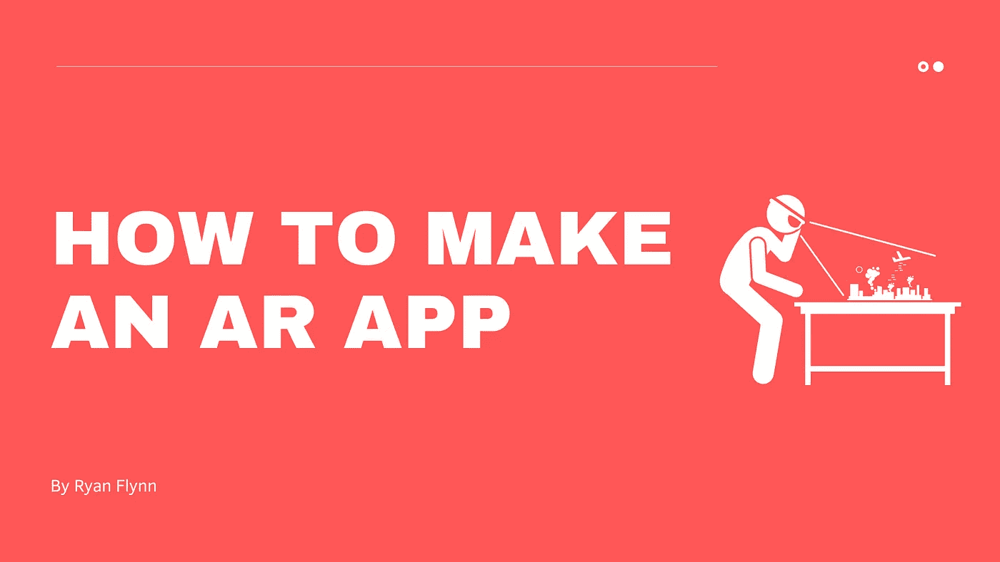
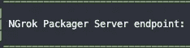

# 如何使用 React Native 制作 AR 应用

> 原文：<https://levelup.gitconnected.com/how-to-make-an-ar-app-using-react-native-92d0b8dad9b9>

**简介**

如果你像我一样，你可能最近对不断增长的增强现实领域感兴趣。无论你是否玩过热门游戏 Pokemon GO，或者使用 Snapchat 面部过滤器，你都可能遇到过某种形状或形式的 AR，你可能想知道如何才能做出类似的东西。随着马克·扎克伯格(Mark Zuckerburg)等行业领袖声称 AR 是未来，现在是开始制作 AR 应用的绝佳时机。大多数手机现在都有硬件来增强我们的现实，我们不再需要昂贵的耳机来将技术从屏幕上带到现实世界中。在本教程中，我想向您展示如何开始使用 React Native 和 Viro 制作跨平台 AR 应用程序。

**安装病毒**

很多教程会说，你应该使用 Unity 或虚幻引擎来制作跨平台的 AR 应用程序，但作为一名网络和移动工程师，对我来说，使用我所知道的东西更有意义。就我个人而言，我试图限制我擅长的技术数量(在我可以的地方)，所以我寻找一种方法来一起使用 AR 和 React Native。我发现这个叫做 [Viro](https://viromedia.com/viroreact) 的平台就是这么做的。

[此处是快速入门指南的链接，可帮助您在机器上安装 Viro。](https://docs.viromedia.com/docs/quick-start)

在你的电脑上安装了 Viro 之后，你需要在你的移动设备上安装 Viro Media 应用，这样你就可以测试你的应用了。

**使用病毒**

现在您已经安装了 Viro，是时候创建一个示例项目了。首先在你的终端上运行`react-viro init ViroSample — verbose`。这将在您选择的任何目录下创建一个示例项目。打开该项目，在您的终端中运行一个经典的`npm start`，您应该会看到类似这样的内容，后面跟有一个链接:

现在进入手机上的 Viro 应用程序，点击汉堡菜单，然后进入“进入测试床”。在这里，您将输入终端提供给您的 NGrok 链接。

现在你应该能够环顾你的房间，看到“你好，世界！”在拐角处偷看。

**结论**

恭喜你。您刚刚创建了第一个 AR 移动应用程序。现在，您将想要开始浏览 Viro 文档，以便继续了解 AR，以及您可以用它做的所有疯狂的事情。祝你好运！

**来源:**

 [## 快速入门(Mac/Linux)

### 快速入门指南，让您在 10 分钟内设置和开发 AR/VR 应用程序！(不需要 Xcode 或 Android Studio

docs.viromedia.com](https://docs.viromedia.com/docs/quick-start)  [## 教程 AR

### 本教程要求完成快速入门。本教程是一步一步的指导开发一个简单的…

docs.viromedia.com](https://docs.viromedia.com/docs/tutorial-ar)