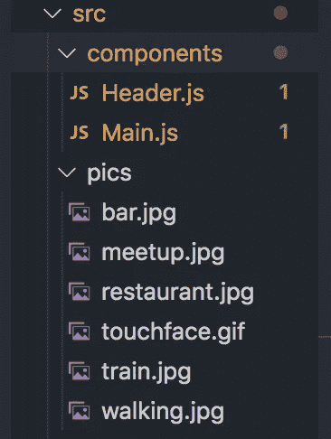

# 如何在 React:冠状病毒版中制作图片库

> 原文：<https://levelup.gitconnected.com/how-to-make-an-image-gallery-in-react-coronavirus-edition-19eff3878c3f>


在这个社交媒体的时代，照片就是一切。你家人度假的个人相册，狗和猫的生日聚会，还有上周末朋友勒索的照片现在都在网上了。因此，这就是为什么我对在 React 应用程序中构建一个简单的“图片画廊”组件感兴趣，用户可以在其中来回翻动图片。

为了纪念当前的国际健康危机和疫情，我想将 React 应用程序的主题献给冠状病毒新冠肺炎，这是自地铁关闭恐慌以来纽约发生的最糟糕的事情。在这个图库中，我将展示自从冠状病毒关闭纽约以来我错过做的事情😢。

下面是如何在 React 中编写一个“图片画廊”的代码。首先，在“src”下创建一个“pics”文件夹。在“图片”文件夹中，放置所有您将使用的图片。



在将存放您的“图库”的组件中，像这样导入图像:

```
import React, { Component } from 'react';
import bar from '../pics/bar.jpg';
import train from '../pics/train.jpg';
import meetup from '../pics/meetup.jpg';
import touchface from '../pics/touchface.gif';
import restaurant from '../pics/restaurant.jpg';
import walking from '../pics/walking.jpg'
```

接下来，创建状态对象。State 将保存`index`和`picList`，这是一个图像数组。Index 对应于 picsList 数组的索引值。

```
state = {
index: 0,
picList: [bar, train, meetup, touchface, restaurant, walking]
}
```

让我们制作两个按钮来浏览图片。一个按钮称为“上一个”，另一个按钮称为“下一个”。我们可以首先使用函数`onClickNext()`构建“下一步”按钮。

```
onClickNext= () => {
  if (this.state.index + 1 === this.state.picList.length {
    this.setState({
      index: 0
    })
  } else {
    this.setState({
      index: this.state.index + 1
    })
  }
}
```

if 语句显示，如果索引值已经达到其极限，即等于 picList 数组的长度，则索引被重置为 0(在 setState 中)。因此，图片库将重新开始播放第一张图片。

否则，索引将增加 1，并移动到列表中的下一张图片。

现在让我们使用函数`onClickPrevious()`构建“上一步”按钮。

```
onClickPrevious= () => {
  if (this.state.index - 1 === -1 ){ this.setState({
      index: this.state.picList.length - 1
    })
  } else {
    this.setState({
      index: this.state.index - 1
    })
  }
}
```

上面的 if 语句显示，如果索引值为-1，图片库将转到最后一张图片。否则，索引将递减 1，并移回到列表中的前一个图片。

`render`方法应该是这样的:

```
render() {
  return (
    <div>
       <button *onClick*={this.onClickPrevious}> Previous </button> <button *onClick*={this.onClickNext}> Next </button>
    </div>
  );
}
```

整个代码应该如下所示:

添加了一些 CSS

最后，成品:

 [## 我讨厌冠状病毒

### 我讨厌冠状病毒。

ihatecoronavirus.surge.sh](http://ihatecoronavirus.surge.sh/) 

保持安全和健康。记住:洗手液是你新的最好的朋友。👋