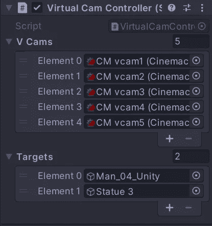

# 如何使用 Cinemachine 和 C#在 Unity 中制作交互式摄像机

> 原文：<https://levelup.gitconnected.com/how-to-make-an-interactive-camera-in-unity-using-cinemachine-and-c-31cad0143057>

虽然电影摄影是一个非常视觉化的探险，但在 Unity 中使用 cinemachine 允许用户通过脚本控制最终的摄像机。在本文中，我将制作一个*交互式相机*，当用户输入被按下时，它会改变目标并放大。

**变数**

对于这个解决方案，我使用了三个*变量*。你完全可以使用单个对象变量，但是对于我的目的，我将围绕这个*数组*系统来构建。有两个*游戏对象*数组变量，一个用于虚拟*摄像机*，另一个用于*注视目标*。最后一个 *int* 变量数组存储了三个期望的*值*，我将用它们来调整*视场*。这个*脚本*在所有虚拟摄像机的*父*对象上。

这是选中的*父*对象 *(Vcams)* ，上面有*脚本*。注意，序列化字段中的游戏对象*数组*为空*。当按下*播放*按钮时，这些列表将通过*脚本*填充。*

**摄像机目标**

第一个*目标*将是这里的*玩家*对象。

我创建了一个名为*目标*的新*标签*，然后将其分配给*检查器*中的*玩家*。

下一个焦点*目标*将是这个巨大的*雕像*。

雕像也获得了一个新的*标签*的*目标*。

**初始化**

这里在 void *Start* 方法中，我可以为数组制作所需对象的附件。虚拟*摄像机*是由它们的*类型*找到*的。*然后，由于他们有一个*父*对象持有这个*脚本*，他们的*组件*通过*getcomponentsinchilds*被抓取。*第一个摄像机*【0】上的聚焦*镜头*，被设置为焦距*数组* (60)中的第一个存储值。通过在场景中搜索带有*目标(玩家和雕像)的*标签*的*游戏对象*来填充*目标数组*。*最后，为每个找到的目标运行一个 *foreach* 循环，将其*名称*打印到*控制台*。

**带间隙测试**

在按下 *Play* 按钮后，*虚拟摄像机*被显示为按照它们在数组中的*元素*编号的适当顺序填充。*注意:如果不使用来自父代的 GetComponent 来获取摄像机，它们仍然可以工作，并在这里填充，但是顺序不同。**目标*数组显示两个*标记的*对象被*发现*。

*foreach* 循环运行，两个目标*名称*被打印到*控制台*。

**用户输入**

因为这些动作将快速响应*玩家*按下*按钮*，我需要检查 void *Update* 中的*输入*。首先检查*空格键*，如果*被按下*，则调用*方法*来改变相机上的焦距。接下来检查 *R 键*，当*按下*时，调用*方法*改变摄像机*目标*。

**改变焦距**

这种情况下的默认焦距是 60*(_ focal distances[0])*。第一个 *if 语句*检查焦距是否等于 *60* ，如果是，则改为下一个焦距 *(40)* 。如果焦距是 40，它会*将*设置为 20，然后如果是 20，它会*将*复位回 60。当重复按下*空格键*时*完成变焦循环*。

在*检查器*中，您可以看到当*按压空间*时*视场*循环通过*数组*的*值*。

这是一张在*游戏*视图中相机*变焦*的 gif 图。

**改变注视目标**

改变*查看*目标的方式类似。第一个 *if 语句*检查目标*是否为空*。如果还没有分配给的注视目标*，它将抓取数组中的第一个目标。一旦初始目标被分配，接下来的两条语句在两个*目标之间来回切换。我还需要访问每个*目标*的*变换*，因为这是*查看*时使用的参考点。

第一次按下 *R 键*时，*第一个*目标被分配给*查看*。

重复按压，然后在两个可用的*目标*之间来回翻转。

这是在*游戏*视图中的样子。

就是这样！感谢您的阅读！