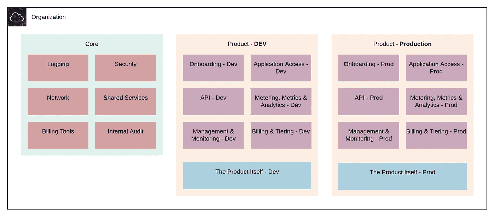

# 如何使 AWS 组织成为一个强大的基础

> 原文：<https://levelup.gitconnected.com/how-to-make-aws-organizations-into-a-strong-foundation-d931bda5c821>

## 在 AWS 中运行您的 SaaS 产品可能需要一个强大、通用的基础和大量的 AWS 帐户！但是你如何管理它们呢？

我曾经写过云技术如何完美地适合 SaaS 的产品。在 [ResponseTap](https://medium.com/responsetap-engineering) ,我们已经通过 AWS 的绿地重建充分利用了这种共生关系。这是一个地狱般的学习曲线…我想分享一些经验教训。

重建的一个关键因素是有效利用 [AWS 组织](https://aws.amazon.com/organizations/),让我们能够跨多个 AWS 帐户有效地隔离和管理我们的服务。

格雷格·法罗摄影

在多个帐户之间划分功能和职责非常重要。它有助于您提高安全性，并充分利用 AWS 服务。让我们开始吧…

# 什么是“AWS 组织”？

这里有两件事:一个一般概念和一个 AWS 服务。

**概念**:当一家公司利用云提供商时，它几乎总是需要不止一个“账户”。这有许多原因(更多见下文)。这个帐户集合通常被称为“组织”。

**服务:**为了使多个云帐户的编排和管理更加容易，AWS 为此提供了一项特定的服务。AWS 客户可以通过[控制台](https://console.aws.amazon.com/organizations/home)和 [API](https://docs.aws.amazon.com/organizations/latest/APIReference/Welcome.html) 与该服务进行交互。在此服务中，您可以执行许多操作，包括:

*   创建新帐户。
*   邀请现有客户“加入”组织。
*   管理对单个帐户或帐户组的安全访问。
*   集中管理成本和计费。
*   在帐户之间共享资源。

# 为什么我需要多个账户？

当你第一次涉足云计算时，你很可能会从一个账户开始，也许是两三个。起初，这可能就足够了。由于只有几个帐户，管理相对容易，安全性和限制可能不太重要。

当您开始扩大规模时，从概念验证和实验过渡到生产就绪型系统，这种简单的设置是不够的。您将需要采取更严格的措施来确保适当保护您的数据和服务的完整性，并管理您的成本。

理论上，所有这些都可以在一个账户中实现。然而，在实践中，这比你采用多个账户要困难得多，风险也大得多。诀窍在于，为特定的目的建立特定的账户。通过这样做，你可以更容易地圈护资源。这有以下好处:

*   清晰、简化的安全策略可帮助您保护资源和数据的安全。
*   分离成本，帮助你确定你把钱花在哪里。
*   “环境”的明确分离和限制，无论是出于开发、测试还是生产目的。

格雷格·法罗摄影

# 我需要知道多少？

AWS 在这个问题上提供了相当多的建议。不幸的是，这很难拼凑和理解。他们最近推出了新的服务来使这变得更容易，这些服务以 [AWS 控制塔](https://aws.amazon.com/controltower/features/)为中心。

当 ResponseTap 开始构建他们的 AWS 组织时，这些工具还不存在。即使在撰写本文时，也不可能让控制塔*继承现有的组织资产，如组织单位和账户。我们不得不自己解决很多问题。*

如果你是从零开始，我的建议是从提供的 AWS 工具开始，尤其是 AWS 控制塔。这些工具背后有很多好的想法，它们将继续被开发。

> 但是…

无论您是从零开始还是开发一个成熟的产品，理解一个结构良好、安全的组织的构建块都是至关重要的。

## 组织单位

管理账户的一个基本原则是 [*组织单元(OU)*](https://docs.aws.amazon.com/organizations/latest/userguide/orgs_manage_ous.html) 。ou 允许您任意将帐户和其他 ou 组合在一起，以便它们可以作为一个单元进行管理。

您可以将 [*服务控制策略(SCP)*](https://docs.aws.amazon.com/organizations/latest/userguide/orgs_manage_policies_scp.html) 应用于 ou。这些策略可以描述 OU 的访问和资源限制。以下是一些例子:

*   仅允许在特定区域内部署资源。
*   阻止使用特定的 AWS 服务，如 EC2。
*   防止用户删除某些资源(如 CloudTrail 日志)。

[AWS 提供了一些更详细的例子。](https://docs.aws.amazon.com/organizations/latest/userguide/orgs_manage_policies_example-scps.html)

# 如何构建你的组织

## 从顶端开始

在最高级别，您组织内的资产将属于以下类别之一:

从 2 个 ou 开始

**产品:**构成产品一部分或以某种方式支持产品的资产。你想要建造的东西。

**核心:**这些资产也许不太明显，但同样重要。他们是你产品的*配角*。

这些资产将包括您的交付机制(部署管道)、您的安全和网络资产。它们还将包括您的审计和遵从工具。换句话说，这些资产支持你在云平台中的存在，但不是你产品的一部分。

在您的组织中将这两个组织单位表示为两个组织单位是很有意义的。您可能希望将这些资产组作为一个整体来应用限制，而将它们建立为独立的 ou 将使这变得更容易。

从概念上理解你的产品是如何构成的是很重要的。这将有助于您在创建帐户和 ou 时做出正确的决定。

 [## SaaS 产品是如何构成的？

### 软件即服务(SaaS)产品现在非常普遍。“云”的兴起为…提供了完美的媒介

medium.com](https://medium.com/responsetap-engineering/how-is-a-saas-product-structured-ff50109d300c) 

# 该产品

在您的*产品* OU 中，除了主要的产品功能之外，您还需要支持几个功能:

*   on boarding——您的用户如何加入您的服务，以及为此提供支持所需的任何操作。
*   用户界面/应用程序访问——产品的漂亮外观可能需要大量资源。
*   API——采用 API 优先的方法来开发你的产品将对你非常有利。您可能还想提供一个面向用户的 API，这需要一些资源。
*   计量、指标和分析——您的用户如何与您的产品互动？这些互动花费了你多少钱？回答这些问题对于提高产品的价值和盈利能力至关重要。您将需要部署资源来帮助您找到这些答案。
*   管理和监控—确保产品正常工作，并根据您的流量模式进行缩放，将有助于保证您的用户获得最佳体验。这也是集中记录服务将存在的地方。
*   计费和分层—产品需要确保公平使用和正确计费，以便保持可靠的收入。

构建产品 OU

这些元素都是为了支持你的产品，而不是为你的用户提供价值。但是它们的有效实施是帮助你实现产品价值最大化的重要跳板。

为产品的每个部分创建一个 OU 是明智的。这样做允许您根据最小特权(POLP)原则(T9)轻松地限制对这些元素的访问。

## 产品本身

根据其复杂性，您可能需要大量的 ou 和帐户来分隔产品的逻辑部分。对于更简单的产品，这可能是不必要的。在以下两者之间找到平衡很重要:

*   内部资源很少的许多 ou 和帐户的管理费用
*   在同一个 OU 或帐户中拥有太多资源的风险(想想 POLP)。

不要太在意马上得到这个。如果你遵循了这篇文章中的其他建议，那么你仍然可以很好地维护这个产品。

# 核心 OU

无论你的产品做什么，它都必须有一些基本功能的支持。这些职能涵盖广泛，但将确保本组织的交付、安全、基础设施和合规性得到妥善处理。这些是组成的函数

我相信以下每个功能都可以用一个帐户来表示。但是，如果您有一个特别复杂的需求，您可能更喜欢为每个需求使用一个 ou，每个 ou 中有一个或多个帐户。

## 记录

您的云提供商的日志和审计跟踪就在这里。不要将这与您的产品日志混淆。

该帐户应该从组织中的所有其他帐户的*收集 CloudTrail 和配置日志。一旦集中，就有可能正确管理对这些日志的访问，并防止意外或恶意删除。*

将日志放在中心位置也使得从一个地方调试和调查问题变得更加容易。

## 安全性

安全关键资产的存储和维护，例如跨帐户角色和 AWS 配置资源的存储。它也是 CloudTrail 功能的所在地——但重要的是，CloudTrail 日志的*存储*是单独存储在*日志*中的。

该 OU/帐户可以被锁定，使得这些重要资产很难被非法使用。

## 网络

跨其他帐户和 ou 共享的任何网络资源都应集中维护，以便于控制和维护。这可能包括 VPC 基线模板、任何 VPN 或直接连接等资源。*

*非常感谢 [Gavin Lewis](https://medium.com/u/428e9d0694cb?source=post_page-----d931bda5c821--------------------------------) 提供的额外信息:

> 现在，网络几乎可以分离成自己的核心帐户，然后通过利用[资源访问管理器](https://aws.amazon.com/ram/)在您组织内的帐户间共享。这样做减少了我从事的一个项目在提供新帐户方面的大量开销，因为我们不再需要在路由表中创建新的 VPC、对等连接和路由。

集中维护这些资源可确保工程师不必在所有其他帐户中从头开始配置网络资源。他们可以从这里的示例和共享网络资源中受益。

## 计费工具

仔细控制您的云支出至关重要。为了实现这一点，重要的是要有适当的工具来进行监控、报警和自动操作，以防止超支。

将这些工具组合在一起，可以更容易地控制云支出，让人们清楚地看到钱花在了哪里。

## 内部审计

无论是法律合规性还是公司的内部合规性规则，维护一个合规的产品将确保它坚持高标准。拥有设计、架构、安全等方面的规则和原则将有助于产品的高质量。

强制遵守将需要专业工具。一些工具可能是内部构建的，另一些可能是购买的。这些工具将根据具体要求进行配置。所有这些资产应该放在一起。

## 共享服务

有些资源自然不属于其他 ou 和账户，但却是不可或缺的。这些资源可以被分离或分组，以便于维护。它们可能包括:

*   将您的代码和配置交付给组织的部署工具和管道。
*   限制监控，以便在组织的任何部分接近云提供商施加的限制时发出警报。

所有二级组织单位

# 开发环境呢？

上面描述的组织结构都很好。但是，我们还没有讨论初始编码和将代码投入生产之间的步骤。

这些步骤将包括多个不同的部署环境。根据您的软件开发生命周期(SDLC ),您可以使用一个或多个环境，例如生产、预生产、集成、开发和沙盒。

每个环境将复制完整生产堆栈的部分或全部。

在下面的示例中，使用了每个 OU 的单个实例，但是在其中每个环境都有一个帐户。这种设置得益于更简单的 OU 设置。这使您可以针对给定的用例轻松地应用策略。但是，这是以每个环境更复杂的策略管理为代价的。

包含每个环境的帐户的静态 ou

在下面的示例中，为每个环境复制了所有与产品相关的 ou。这使得应用基于环境的限制更加简单。然而，这是以每个用例更复杂的策略管理为代价的。

为每个环境复制产品 ou

最终，您将不得不自己决定哪一个最适合您的需求。请记住，您是在管理每个环境的 scp 的简单性和管理每个用例的 scp 的简单性之间进行选择。

如果这有助于你做决定，我们选择了第一个例子。到目前为止，我们没有理由对这个决定感到后悔😄。

# 总结

我希望这一指导是明确的和合乎逻辑的。正如我在开始时提到的，信息就在那里，如果你能挖掘出来，但很难找到。我和 ResponseTap 团队花了数周时间进行研究和设计。

我希望这份指南能帮你节省一些时间，以便你能比我们更快地建立*你的*组织！祝您好运🍀！