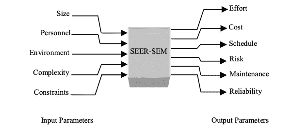

# 如何做出更好的估计

> 原文：<https://levelup.gitconnected.com/how-to-make-better-estimates-5889150191d8>

## 以下是如何更好地进行软件评估的方法

来自 [Pexels](https://www.pexels.com/photo/woman-in-black-sleeveless-top-writing-on-whiteboard-3861970/?utm_content=attributionCopyText&utm_medium=referral&utm_source=pexels) 的 [ThisIsEngineering](https://www.pexels.com/@thisisengineering?utm_content=attributionCopyText&utm_medium=referral&utm_source=pexels) 摄影

评估提供商业价值。估算的准确性可以带来更好的预算。您可以估计工作的成本，轻松地安排发布，以及正确的项目计划。

以下是你可以做的事情，以使评估更好。

# 评估模型是如何工作的？

软件评估研究至今。已经开发了很多模型。这些是我们将涉及的几个模型:

*   微小的
*   可可莫
*   功能点
*   SEER 模型

**SLIM** 考虑到代码源码行。用两个因素修正，人力集结指数和生产率因素。

生产率系数是对过程 efficiency⁵.的一种度量代码行数与人力的比率给出了生产率因素。人力建设是 variation⁵.发展计划的结果

这些数字有两种计算方法。根据经验数据校准模型。使用类似的过去的项目，并得到的因素。或者回答 22 个问题，得到 MBP 和 PF 的估计值。

斯利姆专注于员工。它根据员工生产力和整个项目生命周期给出了估计。

> 斯利姆的目标是调查人员配备水平、进度和努力之间的关系。⁵

编码后，可以使用 SLIM 方法。这是这个指标的主要问题。

**COCOMO** 或构造成本模型，系统规模的因素。基本模型的几个因素是人工月和数千个交付的代码行。

中间模型更复杂。在实际估算中需要 15 个因素。考虑到这些因素，给出了精炼的中间 COCOMO。

评估者会检查所有的成本因素。基于评级的评级项目。从该表中选择成本动因系数。

将这 15 个因子相乘，得到一个 [EAF](https://www.geeksforgeeks.org/software-engineering-cocomo-model/) 。该努力调整系数用于公式中，以给出精确的 COCOMO。

有人会说这是评估软件的最佳标准。成本动因是主观的，这会导致错误的估计。

**函数** [**点**](https://www.tutorialspoint.com/estimation_techniques/estimation_techniques_function_points.htm) 模型不查看源代码行。[功能点](https://en.wikipedia.org/wiki/Function_point)是度量单位，是业务功能的单位。

功能用户需求被分类。[输出、查询、输入、内部文件和外部接口](https://www.pmi.org/learning/library/software-measuring-function-point-methodology-6201)。分类之后，评估用例的复杂性，并附加功能点。

人们可以对故事点进行类比。故事点描述用户故事，功能点描述功能用例。

[SEER-SEM⁵](https://arxiv.org/pdf/1004.1239.pdf)

SEER (系统评估和资源估算)是一个专有的 model⁵.该模型交付评估、工作计划和所需的资源。

该模型适用于以下参数:

*   有效的代码行
*   开发者技术
*   程序调试时间

对工作量、缺陷和成本进行评估。就大小而言，SEER 同时考虑了功能点和代码行。

# 这些模型有助于评估吗？

功能点根据开发人员的生产力而变化。高级和初级开发人员的工作是有区别的。批评者认为，在需求不明确的情况下工作，会产生错误的估计。

这些模型在未校准的环境下效果不佳。平均错误率在 500%左右。这是意料之中的，因为这些模型未经校准，不能通用。

> 总的来说，基于模型的技术适用于预算、权衡分析、计划和控制以及投资分析。⁵

基于以前的项目开发新软件会导致糟糕的评估。每个项目都有自己的困难、领域和方面。

> 使用功能点或类似的模型估计得更好。

批评家认为 COCOMO 掩盖了估算的猜测。

当涉及到代码行时，有很多因素。代码质量、开发人员的创造力以及代码的重用。

伟大的开发人员用 50 行代码做了很多事情。糟糕的 200 行代码做不到这一点。

函数计数与源代码行相关。评估人员可以使用这个度量来评估代码行。即使考虑到这一点，每个项目的行数也是个别的。

软件分析师 Capers Jones 指出，following⁴.使用 FP 模型的项目，具有更少的范围蔓延，25%的进度延误，并且每个功能点节省 25-75 美元。

# 结论

以上方法都可以用于软件评估。你不应该对这件事陷得那么深。

好的软件评估需要大量的经验数据。从这些模型中去掉关键思想。

从这篇文章中可以学到的几个关键观点。

源代码行不会影响评估。伟大的开发者在 500 行里做的事，后辈在 50 行里做的事。在软件评估中仍然是一个有效的度量。给出一个粗略的估计，如果你考虑到以前的发展。

开发人员的生产力效果评估。COCOMO 模型的一个衡量标准是软件工程师能力。根据成本动因，确实需要大量的最终估算。

开发团队确实会影响评估。团队中更伟大的开发人员影响估计。

在 personnel 下查看 COCOMO 模型的成本驱动因素。五分之一的指标与人员相关。

做评估没有通用的方法。已经对这一主题进行了研究。所有这些都表明估计误差很大。

# 资源

*[1]北卡罗来纳州莫尔肯-斯特沃尔德(2007 年 4 月 10 日至 13 日)。“将评估与规划扑克相结合——一项实证研究”。第 18 届澳大利亚软件工程会议。*[*IEEE*](https://en.wikipedia.org/wiki/Institute_of_Electrical_and_Electronics_Engineers)*:349–58。*[*doi*](https://en.wikipedia.org/wiki/Doi_(identifier))*:*[*10.1109/as WEC . 2007.15*](https://doi.org/10.1109%2FASWEC.2007.15)*。*[*ISBN*](https://en.wikipedia.org/wiki/ISBN_(identifier))*[*978–0–7695–2778–9*](https://en.wikipedia.org/wiki/Special:BookSources/978-0-7695-2778-9)*。*[*S2CID*](https://en.wikipedia.org/wiki/S2CID_(identifier))*[*11429738*](https://api.semanticscholar.org/CorpusID:11429738)*。***

***【2】克里斯·F·凯梅勒。1987.软件成本估算模型的实证验证。Commun。ACM 30，5(1987 年 5 月)，416-429 页。DOI:https://DOI . org/10.1145/22899.22906***

***[3]豪尔赫·阿兰达和史蒂夫·伊斯特布鲁克。2005.软件评估中的锚定和调整。i > SIGSOFT Softw。英语。注释< /i > 30，5(2005 年 9 月)，346–355。土井:*[*https://doi.org/10.1145/1095430.1081761*](https://doi.org/10.1145/1095430.1081761)**

**[4]软件估算和度量中功能点的使用乔·施菲尔德 [ppt](https://www.osti.gov/servlets/purl/1147515)**

**[5]巴沙，萨利姆&达瓦彻万，蓬努朗加姆。(2010).经验软件工作量估算模型分析。国际计算机科学与信息安全杂志。7.**