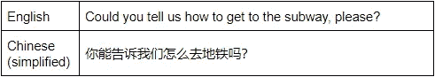
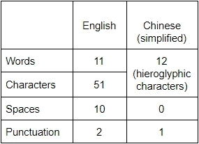
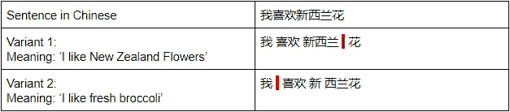

# 如何进行中文全文搜索

> 原文：<https://levelup.gitconnected.com/how-to-make-chinese-full-text-search-dd8b6df801fb>

## 权威指南

## 一种新的汉语标记化方法

> 今天我想强调一下中文搜索功能的挑战。在本文中，我们将介绍 CJK 语言全文搜索实现的主要困难，以及如何借助蝎狮搜索来克服这些困难。


[兰迪·叶](https://unsplash.com/@randymandyyyyy?utm_source=medium&utm_medium=referral)在 [Unsplash](https://unsplash.com?utm_source=medium&utm_medium=referral) 上的照片

# 中文搜索困难

汉语属于所谓的 CJK 语系(汉语、日语和韩语)。对于全文搜索工具来说，它们可能是最复杂的语言，因为在它们中，单词的含义严重依赖于大量的象形文字变体及其序列，并且字符没有拆分成单词。

中文语言细节:

*   中国的象形文字没有大小写。不管上下文如何，他们只有一个概念。
*   例如，在阿拉伯语中，字母没有附加的装饰。
*   句子中单词之间没有空格。

那么这有什么意义呢？为了在全文搜索中找到精确匹配，我们必须面对标记化的挑战，标记化的主要任务是将文本分解成用户可以搜索的低级值单元。

# 汉语的标记化/切分

更具体地说，令牌化是将一段有意义的数据(例如一个单词)转换为唯一标识符(称为令牌)的过程，该标识符在系统中表示一段数据。在全文搜索引擎中，标记作为对原始数据的引用，但不能用来猜测那些实际值。

在大多数语言中，我们使用空格或特殊字符将文本分成片段。然而，在汉语和其他 CJK 语言中，由于其形态特征，这是不可能的。然而，我们仍然需要这样做。这个过程叫做分割。

换句话说，汉语分词是分词的前提。

这里有一个例子来说明英语和汉语标记化的区别。



如你所见，中文句子只有一半短，没有任何空格、逗号，甚至没有拆分成单词，这里的每个单词都由一个或几个象形文字字符表示。这里有一个定量的比较:



另一个挑战是，中国的象形文字根据它们的顺序和组合可能有不同的含义。让我们来看看象形文字组合的不同含义:


Here we can see the combination of two hieroglyphic characters “简单” which means “Simplicity”, but if we take each of the hieroglyphs separately, they will have different meanings “简” (simple) and “单” (single).

在某些情况下，根据你在单词之间放置边界的位置，意思可能会不同。例如:



如您所见，问题在于一组字符可能被不同地分段，从而导致不同的值。

让我们看看解决中文分词问题的可能方法。

# 履行

中文文本分割有几种方法，但主要有两种:

*   N-grams:将“N”个相邻汉字的重叠组视为记号，其中“N”可以是 1-Uni；2—Bi；3-Tri；以此类推”——克”。
*   基于词典:根据词典执行分词。

中文文本分割最简单的方法是使用 N 元语法。该算法简单明了，但众所周知，它缺乏质量，并且会产生相当大的开销，该开销随着所处理的文本的长度而增长，因为每个 N 元语法都是一个单独的标记，这使得标记字典更大，并且处理搜索查询更加复杂。这在历史上是蝎狮搜索中 CJK 文本索引的常见方式。

在蝎狮搜索版本 3.1.0 中引入了一种新的中文文本分割方法，该方法基于 ICU 文本分割算法，遵循第二种方法——基于词典的分割。

# 使用 ICU 的好处

ICU 是一组开源库，为软件应用程序提供 Unicode 和全球化支持。与许多其他功能一起，它解决了文本边界确定的任务。ICU 算法在文本范围内定位单词、句子、段落的位置，或者在显示文本时识别适合换行的位置。

在蝎狮，ICU 分段的算法可以简要描述如下:

*   原始文本被视为一组符号。
*   然后蝎狮遍历数组，如果找到一组中国符号，它就把它传递给 ICU 库进行处理。
*   中文文本的分段部分替换原始的未分段部分。
*   其他自然语言处理算法( [charset_table](https://manual.manticoresearch.com/Creating_an_index/NLP_and_tokenization/Low-level_tokenization#charset_table) 、 [wordforms](https://manual.manticoresearch.com/Creating_an_index/NLP_and_tokenization/Wordforms#wordforms) 等。)应用于修改后的文本，就像在普通的分段工作流程中一样。

要启用 ICU-Chinese 分段，必须设置以下索引配置选项:

*   形态学= icu _ 中文
*   charset_table =中日韩/中文

# 配置 ICU-中文文本标记化的示例

## 索引配置

为了建立正确的中文分词索引，我们需要接触两个索引设置:“字符集表”和“词法”。

对于字符集表，有一个包含所有中文字符的内置别名“chinese”。

首先，我们来连线蝎狮:

```
# mysql -P 9306 -h0
```

并创建我们的表:

```
mysql> CREATE TABLE testrt (title TEXT, content TEXT, gid INT) charset_table = ‘chinese’ morphology = ‘icu_ chinese’;
```

## 基本用法

Let’s insert into the index a simple mixed Chinese-English sentence ‘买新的 Apple 电脑’ (‘I like Apple computers’):

```
mysql> INSERT INTO testrt (title, content, gid) VALUES ( 'first record', '买新的 Apple 电脑', 1 );
```

为了检查我们的中文内容是否按预期进行了标记，我们可以对我们的索引运行调用关键字:

```
mysql> call keywords('买新的 Apple 电脑', 'testrt');
+------+-----------+------------+
| qpos | tokenized | normalized |
+------+-----------+------------+
| 1    | 买        | 买         |
| 2    | 新的      | 新的        |
| 3    | 电脑      | 电脑        |
+------+------ ----+------------+
```

我们可以看到中文文本被分成了 4 个单词，这是意料之中的。

And now let’s make a search against our content field with a query phrase ‘Apple 电脑’ (‘Apple computers’):

```
mysql> SELECT * FROM testrt WHERE MATCH ('[@content](http://twitter.com/content) Apple 电脑');
+---------------------+------+--------------+----------------------+
| id                  | gid  | title        | content              |
+---------------------+------+--------------+----------------------+
| 5477080993472970753 |    1 | first record | 买新的 Apple 电脑        |
+---------------------+------+--------------+----------------------+
```

正如我们所看到的，搜索已经成功执行，我们得到了预期的结果，尽管我们在这个例子中使用的原始句子和查询短语在单词之间没有任何分隔符。

我们可以使用“SHOW META”命令来查看关于查询的扩展信息，并确保我们的句子被正确地分割成单独的单词:

```
mysql> SHOW META;
+---------------+--------+
| Variable_name | Value  |
+---------------+--------+
| total         | 1      |
| total_found   | 1      |
| time          | 0.199  |
| keyword[0]    | 电脑    |
| docs[0]       | 1      |
| hits[0]       | 1      |
+---------------+--------+
```

We see that our search phrase was indeed split up into ‘apple’ and ‘电脑’ (‘computers’) just as we supposed it to be done.

## **结论**

实现中文全文搜索并不是一件容易的事情，但是蝎狮搜索可以轻松应对。因此，如果你需要一个简单可靠的中文搜索服务或应用程序，你知道该用什么。你也可以在这里[以互动课程的形式找到这篇文章。](https://play.manticoresearch.com/icu-chinese/)