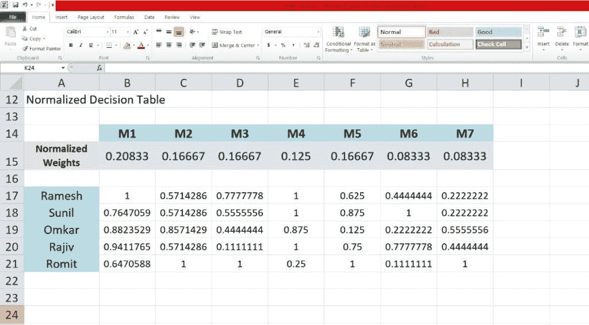
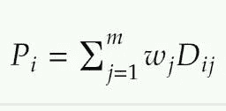
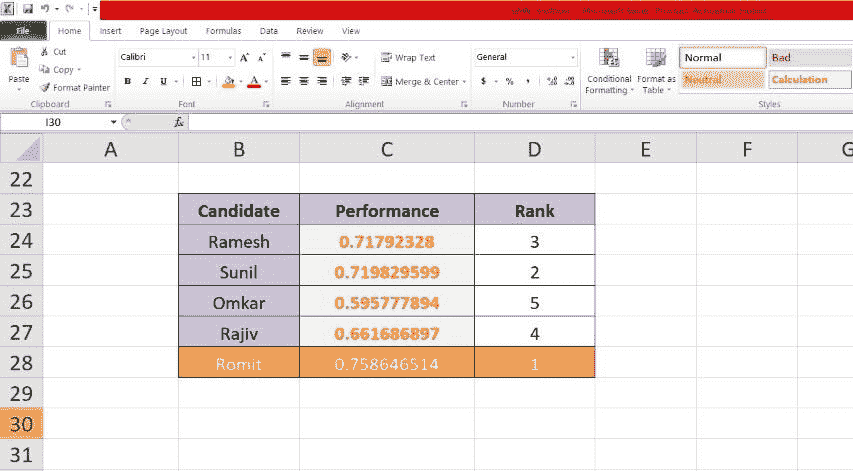

# 如何用 Excel 做决策？

> 原文：<https://levelup.gitconnected.com/how-to-make-decisions-using-excel-7bbbe252b385>

照片由[延斯·勒列](https://unsplash.com/@madebyjens?utm_source=medium&utm_medium=referral)拍摄，转自 [Unsplash](https://unsplash.com?utm_source=medium&utm_medium=referral)

我们都必须在生活中做出重要的决定。作为个人，我们希望确保他们是正确的。我们可能需要考虑我们的选择，评估它们并选择正确的方法来做决定。

即使是企业也必须根据可用数据做出重要决策。随着需求的增加和技术的进步，一些计算机化的方法被用于主要商业决策。

因此，需要**决策支持系统**来自动化决策。

# 决策支持系统

那么什么是 DSS 呢？决策支持系统可以被描述为一个计算机程序，用于支持组织和企业所做的决策。DSS 分析大量数据，并将其编译成做出决策所需的必要信息。DSS 被用于包括医学在内的各种领域。为了帮助诊断病人，医生可以使用 DSS 来帮助诊断和开处方。

DSS 使用几种方法进行决策。我们将讨论一种方法，即 MADM(多属性决策)。

# MADM

MADM 方法涉及从一组给定的备选方案中做出决策。顾名思义，MADM 使用多个属性来做出这些决定。一个 MADM 问题由一个决策表来表示。给定一个决策表，DSS 的任务是找出最佳方案，并对每个方案进行排序。决策表有四个部分:

*   可供选择的事物
*   属性
*   每个属性的权重
*   每个属性的得分(或指标)

通过下面的例子，你会理解以上四个部分。

## 构建一个问题

假设有一家公司正在进行招聘计划，而你是一名招聘人员。从这个项目中，你列出了 5 名候选人，并对他们进行了面试。现在，你要确保根据每个候选人在面试中的表现来雇佣合适的人

入围的候选人是备选者。下表显示了判断候选人的属性。每个属性都有一个分配给它的权重，这表明该属性在决策过程中有多重要。

最大权重分配给候选人必须具备的*领域知识* (M1)，以适合该角色。其他重要属性是*过去的经验*、*团队成员*、*沟通技巧、*以及其他权重低于 M1 但仍然重要的属性。

你通过给每个面试者的每个属性打分(或指标)来评估他们。所有这些都在下面的决策表中提到:

列包含属性，而行包含所有面试的候选人及其相应属性的度量。因此，构造了一个多属性决策问题。

## 正常化

在应用任何方法之前，您首先需要[规范化](https://g.co/kgs/ep8Sf4)决策表中的值。规范化很重要，因为数据列可能使用不同的刻度或者不同的单位。

在我们的示例中，属性 M1 的等级为 0-20，而其他属性的等级为 0-10。现在，为了应用任何方法，您需要将所有属性放在同一范围内，即 0–1。

要规范化每个值，取每个属性的最大值(跨列)，如上表所示。然后将每个值除以其对应列的最大值。

对于 SAW 方法(下面解释)，我们还需要归一化权重，使得权重之和等于 1。为此，我们将每个重量值除以总和。归一化决策表以及归一化权重如下所示:

以上数值都是用 Excel 中的公式计算出来的。

## SAW 方法

现在，您已经准备好应用 SAW(简单加法加权)方法。此方法根据每个候选人的指标计算他们的绩效。替代品的性能(P i)由下式给出:

在哪里，

上面的公式给出了最终的表现，并允许您**对每个候选人进行排名**。

从上面的截图可以看出，Romit 是最佳候选人，因为他的绩效得分最高。拉梅什和苏尼尔紧随其后。这是 SAW 方法的最终结果。

唷！那是相当多要接受的。如果你第一次读不懂这个方法，不要担心。再次浏览这些步骤，以便更好地理解该方法。SAW 是对备选方案进行排序的一种非常简单和直接的方式(它本质上只是一种[加权平均](https://www.investopedia.com/terms/w/weightedaverage.asp))，因此，在 MS Excel 这样的知名软件上实现起来非常容易。你可以在这里下载 excel 文件[。](https://docs.google.com/spreadsheets/d/1FCIG8LDXIBQP4CrRkdYHYC5bENiD5KRR/edit?usp=sharing&ouid=106203601992022145510&rtpof=true&sd=true)

# 结论

决策支持系统用于借助几种数学方法做出商业决策，其中一种是 MADM。我们讨论了如何构造一个 MADM 问题并将其应用到现实世界的例子中。我们使用 SAW 方法进行决策，并在 Excel 中实现了同样的方法。

如果您无法理解内容或对解释不满意，请在下面评论您的想法。新想法总是受欢迎的！如果你喜欢这篇文章，请鼓掌。**订阅**、**关注**我获取每周内容。如果你想讨论什么，请随时在[推特](https://twitter.com/nkunal25)上给我发信息。到那时，再见！！

*原载于 2022 年 1 月 9 日我的* [*Wordpress 博客*](https://kunal25blog427239099.wordpress.com) *。*