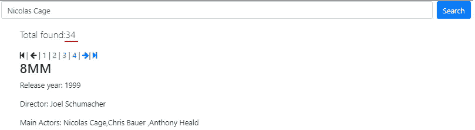

# 如何进行分面搜索

> 原文：<https://levelup.gitconnected.com/how-to-make-faceted-search-b2b91a485ec7>

## 权威指南

## 蝎狮搜索—分面搜索

> 分面搜索是大海捞针的重要功能，可为所有类型的应用提供更好的用户搜索体验。在本教程中，我们将了解什么是分面搜索，以及如何做一个简单的搜索。


分面搜索是现代搜索应用程序的一个基本功能，如[自动完成](https://manticoresearch.com/2020/03/31/simple-autocomplete-with-manticore/)，拼写纠正和搜索关键词高亮显示。尤其是电子商务产品。

当我们处理大量数据和各种相互关联的属性时，无论是大小、颜色、制造商还是其他，它都可以派上用场。当查询大量数据时，搜索结果通常包含大量不符合用户期望的条目。分面搜索允许最终用户明确指定他们希望他们的搜索结果满足的维度。

简单地说，它提供了根据搜索项目的属性过滤搜索结果的能力。

让我们假设用户想要找到尼古拉斯·凯奇主演的电影，所以他在搜索栏中键入他的名字。这将返回不同年份、不同导演、不同 IMDB 评分和评级的电影搜索结果。

这可能是它看起来的样子:



我们可以看到，用户有 34 部不同的电影和他喜欢的演员，但他如何从这么大数量的电影中选择看什么呢？

分面搜索来了。我们可以让用户找到他想看的电影，让他能够选择额外的参数，如“年份”，“评级”，“导演的名字”和“IMDB 分数”等。

这是分面搜索结果的外观:


通过分面搜索，我们可以确定用户到底想要什么。通过选择这些方面，用户可以获得更相关的搜索结果，这使得搜索在用户体验和业务目标方面更好、更方便、更有用。

因此，让我们看看刻面搜索是如何工作的，以及您如何为您的搜索应用程序自己制作它。

## 实现电影分面搜索

在蝎狮搜索中，有一种优化保留了原始查询的结果集，并在每个方面计算中重用它。由于聚合被应用于已经计算的文档子集，所以它们是快速的，并且总执行时间在许多情况下可能仅比初始查询稍大。可以将方面添加到任何查询中，方面可以是任何属性或表达式。分面结果包含分面值以及分面计数。使用 [SQL SELECT](https://docs.manticoresearch.com/latest/html/sphinxql_reference/select_syntax.html?&_ga=2.45842017.496378934.1587628640-256554266.1587628640#select-facet) 语句，通过在查询的最后以下面的格式声明它们，可以使用方面:

```
FACET {expr_list} [BY {expr_list}] [ORDER BY {expr | FACET()} {ASC | DESC}] [LIMIT [offset,] count]
```

当然，您可以在一个[多查询](https://docs.manticoresearch.com/latest/html/searching/multi-queries.html)中发送您想要的所有查询，但是如果您正在寻找一个更优雅的解决方案，还有 FACET 子句。

现在，我们将使用电影方面运行几个查询，如:

*   标题 _ 年份
*   内容分级
*   导演姓名

并且将使用[间隔](https://docs.manticoresearch.com/latest/html/searching/expressions,_functions,_and_operators.html?highlight=interval#expr-func-interval)来获得 IMDB 分数的整数范围内的值。

让我们尝试一下自动完成课程中“电影”索引的一些简单方面，并对几个属性执行简单方面。例如，让我们从“导演姓名”属性中选择“罗伯特·德尼罗”。

```
SELECT * FROM movies WHERE MATCH('robert de niro') LIMIT 10 FACET title_year FACET content_rating FACET director_name;
```

这给出了多个结果集，其中第一个来自我们的主查询，其余的是方面。每个方面结果都包含属性值和组计数。

```
+------------+----------+
| title_year | count(*) |
+------------+----------+
|       1987 |        1 |
|       1991 |        1 |
|       2005 |        1 |
|       1997 |        3 |
|       1974 |        1 |
|       2001 |        2 |
|       2002 |        2 |
|       1999 |        2 |
|       1985 |        1 |
|       1995 |        1 |
|       2016 |        2 |
|       2009 |        1 |
|       2004 |        4 |
|       1990 |        1 |
|       2013 |        3 |
|       2015 |        3 |
|       2011 |        2 |
|       2010 |        3 |
|       1996 |        3 |
|       1973 |        1 |
+------------+----------+
20 rows in set (0.10 sec)

+----------------+----------+
| content_rating | count(*) |
+----------------+----------+
| R              |       37 |
| PG-13          |       12 |
| PG             |        4 |
+----------------+----------+
3 rows in set (0.10 sec)

+----------------------+----------+
| director_name        | count(*) |
+----------------------+----------+
| Brian De Palma       |        1 |
| Martin Scorsese      |        7 |
| John Polson          |        1 |
| Quentin Tarantino    |        1 |
| Francis Ford Coppola |        1 |
| John Herzfeld        |        1 |
| Harold Ramis         |        2 |
| Terry Gilliam        |        1 |
| Michael Caton-Jones  |        1 |
| James Mangold        |        1 |
| Dan Mazer            |        1 |
| Kirk Jones           |        1 |
| Joel Schumacher      |        1 |
| Nick Hamm            |        1 |
| Peter Segal          |        1 |
| Jonathan Jakubowicz  |        1 |
| Scott Mann           |        1 |
| David O. Russell     |        2 |
| Gary McKendry        |        1 |
| Jon Turteltaub       |        1 |
+----------------------+----------+
20 rows in set (0.10 sec)
```

## 分面排序

默认情况下，方面结果不进行排序，并且也限制为 20 行。每个方面都可以有自己的限制子句。可以这样做:

```
SELECT * FROM movies WHERE MATCH('robert de niro') LIMIT 10 FACET title_year LIMIT 5 FACET content_rating LIMIT 1 FACET director_name LIMIT 100;

+------------+----------+
| title_year | count(*) |
+------------+----------+
|       1987 |        1 |
|       1991 |        1 |
|       2005 |        1 |
|       1997 |        3 |
|       1974 |        1 |
+------------+----------+
5 rows in set (0.19 sec)

+----------------+----------+
| content_rating | count(*) |
+----------------+----------+
| R              |       37 |
+----------------+----------+
1 row in set (0.19 sec)

+----------------------+----------+
| director_name        | count(*) |
+----------------------+----------+
| Brian De Palma       |        1 |
| Martin Scorsese      |        7 |
| John Polson          |        1 |
| Quentin Tarantino    |        1 |
| Francis Ford Coppola |        1 |
 .................................
| Tony Scott           |        1 |
| Nancy Meyers         |        1 |
| Frank Oz             |        1 |
| Neil Jordan          |        1 |
+----------------------+----------+
42 rows in set (0.19 sec)
```

如您所见，默认情况下，结果没有排序。每个方面都可以有自己的排序规则，例如，我们可以使用 COUNT(*)按计数对组进行排序:

```
SELECT * FROM movies WHERE MATCH('robert de niro') LIMIT 10 FACET title_year ORDER BY COUNT(*) DESC;
+------------+----------+
| title_year | count(*) |
+------------+----------+
|       2004 |        4 |
|       2013 |        3 |
|       2015 |        3 |
|       1997 |        3 |
|       2010 |        3 |
|       1996 |        3 |
|       2000 |        3 |
|       2001 |        2 |
|       2002 |        2 |
|       1999 |        2 |
|       2016 |        2 |
|       2011 |        2 |
|       2012 |        2 |
|       2008 |        2 |
|       1985 |        1 |
|       1991 |        1 |
|       1995 |        1 |
|       2009 |        1 |
|       1990 |        1 |
|       2005 |        1 |
+------------+----------+
20 rows in set (0.09 sec)
```

或者我们可以按属性排序，例如标题年份:

```
SELECT * FROM movies WHERE MATCH('robert de niro') LIMIT 10 FACET title_year ORDER BY title_year DESC;
+------------+----------+
| title_year | count(*) |
+------------+----------+
|       2016 |        2 |
|       2015 |        3 |
|       2013 |        3 |
|       2012 |        2 |
|       2011 |        2 |
|       2010 |        3 |
|       2009 |        1 |
|       2008 |        2 |
|       2005 |        1 |
|       2004 |        4 |
|       2002 |        2 |
|       2001 |        2 |
|       2000 |        3 |
|       1999 |        2 |
|       1998 |        1 |
|       1997 |        3 |
|       1996 |        3 |
|       1995 |        1 |
|       1991 |        1 |
|       1990 |        1 |
+------------+----------+
20 rows in set (0.09 sec)
```

# 刻面选择

在最简单的例子中，我们使用 FACET attr_name，结果集将包含 attr_name 和 count 列。

但是一个方面可以由多个属性构成:

```
SELECT * FROM movies WHERE MATCH('robert de niro') LIMIT 10 FACET director_facebook_likes,director_name BY director_name ORDER BY director_facebook_likes DESC;
+-------------------------+---------------------+----------+
| director_facebook_likes | director_name       | count(*) |
+-------------------------+---------------------+----------+
|                   17000 | Martin Scorsese     |        7 |
|                   16000 | Quentin Tarantino   |        1 |
|                   12000 | Tony Scott          |        1 |
|                   11000 | Harold Ramis        |        2 |
|                     737 | David O. Russell    |        2 |
|                     541 | Joel Schumacher     |        1 |
|                     517 | Michael Cimino      |        1 |
|                     446 | James Mangold       |        1 |
|                     287 | John Frankenheimer  |        1 |
|                     278 | Nancy Meyers        |        1 |
|                     277 | Neil Jordan         |        1 |
|                     272 | Barry Levinson      |        3 |
|                     226 | Jon Turteltaub      |        1 |
|                     116 | Jay Roach           |        2 |
|                     105 | Michael Caton-Jones |        1 |
|                     102 | Martin Brest        |        1 |
|                      89 | Rodrigo Cortés      |        1 |
|                      88 | Peter Segal         |        1 |
|                      88 | George Tillman Jr.  |        1 |
|                      80 | Paul Weitz          |        1 |
+-------------------------+---------------------+----------+
20 rows in set (0.01 sec)
```

# 方面中的表达式

在某些情况下，我们不希望在实际值上出现分歧。最常见的例子是产品价格，因为我们可以有各种各样的价值。我们希望得到一个范围列表，而不是实际值的方面。这可以通过函数 INTERVAL()轻松实现。

在我们的示例中，我们使用 imdb_score，因为它是一个浮点值，我们显然不想按其分组，相反，我们只按整数值之间的范围分组:

```
SELECT * FROM movies WHERE MATCH('robert de niro') LIMIT 100 FACET title_year LIMIT 100 FACET content_rating LIMIT 100 FACET director_name LIMIT 100;
Empty set (0.09 sec)

+------------+----------+
| title_year | count(*) |
+------------+----------+
|       1987 |        1 |
|       1991 |        1 |
|       2005 |        1 |
|       1997 |        3 |
|       1974 |        1 |
|       2001 |        2 |
|       2002 |        2 |
|       1999 |        2 |
|       1985 |        1 |
|       1995 |        1 |
|       2016 |        2 |
|       2009 |        1 |
|       2004 |        4 |
|       1990 |        1 |
|       2013 |        3 |
|       2015 |        3 |
|       2011 |        2 |
|       2010 |        3 |
|       1996 |        3 |
|       1973 |        1 |
|       2000 |        3 |
|       1988 |        1 |
|       1977 |        1 |
|       1984 |        1 |
|       1980 |        1 |
|       2012 |        2 |
|       2008 |        2 |
|       1998 |        1 |
|       1976 |        1 |
|       1978 |        1 |
|       1989 |        1 |
+------------+----------+
31 rows in set (0.07 sec)

+----------------+----------+
| content_rating | count(*) |
+----------------+----------+
| R              |       37 |
| PG-13          |       12 |
| PG             |        4 |
+----------------+----------+
3 rows in set (0.08 sec)

+----------------------+----------+
| director_name        | count(*) |
+----------------------+----------+
| Brian De Palma       |        1 |
| Martin Scorsese      |        7 |
| John Polson          |        1 |
| Quentin Tarantino    |        1 |
| Francis Ford Coppola |        1 |
| John Herzfeld        |        1 |
| Harold Ramis         |        2 |
| Terry Gilliam        |        1 |
| Michael Caton-Jones  |        1 |
| James Mangold        |        1 |
| Dan Mazer            |        1 |
| Kirk Jones           |        1 |
| Joel Schumacher      |        1 |
| Nick Hamm            |        1 |
| Peter Segal          |        1 |
| Jonathan Jakubowicz  |        1 |
| Scott Mann           |        1 |
| David O. Russell     |        2 |
| Gary McKendry        |        1 |
| Jon Turteltaub       |        1 |
| Paul Weitz           |        1 |
| Ethan Maniquis       |        1 |
| Jerry Zaks           |        1 |
| Jay Roach            |        2 |
| George Tillman Jr.   |        1 |
| Martin Brest         |        1 |
| Garry Marshall       |        1 |
| Sergio Leone         |        1 |
| Rodrigo Cortés       |        1 |
| Jon Avnet            |        1 |
| John Frankenheimer   |        1 |
| Bibo Bergeron        |        1 |
| Barry Levinson       |        3 |
| John Curran          |        1 |
| Des McAnuff          |        1 |
| Justin Zackham       |        1 |
| Mary McGuckian       |        1 |
| Michael Cimino       |        1 |
| Tony Scott           |        1 |
| Nancy Meyers         |        1 |
| Frank Oz             |        1 |
| Neil Jordan          |        1 |
+----------------------+----------+
42 rows in set (0.08 sec)
```

# 互动课程


在本教程中，你将学习如何在蝎狮搜索分面搜索。

如果你参加我们免费的“蝎狮刻面”[互动课程](https://play.manticoresearch.com/faceting/)，你可以了解更多关于刻面搜索的知识，该课程有一个命令行和网络面板，便于学习。