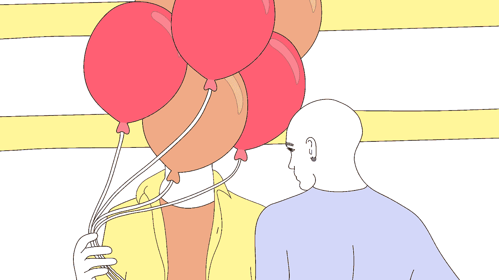

# 作为创始人如何交友

> 原文：<https://levelup.gitconnected.com/how-to-make-friends-as-a-founder-9725217c6c10>

## 创始人倦怠、抑郁和孤独感泛滥。太多的创始人在孤立中挣扎。让我们结束这一切吧。

**原贴于**[**mattmunson . me**](https://www.mattmunson.me/make-friends-as-a-founder/)**。订阅** [**这里**](https://www.mattmunson.me/#subscribe) **定期更新。**

# 一个人在酒吧

我独自坐在酒吧里。当女服务员放下我的沙拉并问我是否还需要什么时，我旁边的啤酒已经喝了一半。

我感到非常孤独。

“我要告诉谁？”我问自己。“我一个人怎么熬过这一关？”

前一天，我的(现在是前妻)妻子告诉我她有了外遇，我们的第二个孩子不是我的。突然，我发现自己在考虑和一个 18 个月大的孩子做单亲父母。

我也在思考如何重新开始，独自一人，如何度过这一切，同时努力让我苦苦挣扎的创业公司存活下来。

生活从未如此沉重。

我从未感到如此孤独。

因为我两年前才搬回洛杉矶，所以我在城里没有很多亲密的朋友。

我需要朋友。真正的朋友。我可以向其吐露我生活中正在发生的事情的人。我急需它们。

我一个人做不到。

# 创始人孤独几乎无处不在

我现在可以看到，7 年后回头看，我并不是唯一感到孤独的人。

从那以后的一些年里，我是一个 CEO 小组的成员，这个小组每月都聚会，并且做得很好，彼此之间变得真实，真正地建立了友谊。我们在异地相遇，我们每个人都位于这个国家的不同地方。

加入我们小组几年后，我记得有几个成员透露，在他们的“现实生活”(即在我们小组之外)中，他们没有任何这样的朋友。在这个团体之外，没有人像我们这些团体成员那样真正了解他们生活中发生的事情。我记得当他们分享时，我对他们每个人的悲伤和深深的同情。

现在，作为一名教练，我从我的许多首席执行官/创始人客户那里听到了类似的观点。

在我们最早的谈话中，许多与我交谈过的领导者向我吐露了他们在生活中以及在他们的创始人或领导旅程中感到多么孤独。

我们的大多数领导人都感到孤独。

这是一个他妈的大问题。

# 孤独的真正痛苦

创始人/领导者的生活是一种难以独自生活的生活。这是一段艰难的旅程。

创建一家公司充满了起起落落。即使是一个成功的公司的发展也是一次疯狂的过山车之旅。

创始人比企业中的任何人都更能切身感受到起伏。

在我自己担任创始人兼首席执行官的时候，有些日子我觉得自己站在世界之巅。收入在增长，或者一些有眼光的风投在向我们示好，或者一些关键的雇员同意了。

然而，更常见的是充满失败的剧痛的日子。当融资没有到位，或者一个主要的收入渠道中断，而我们的银行账户又快空了。或者，就像我坐在那个酒吧里的那个星期发生的那样，我的商业之外的个人生活中的一些东西崩溃了。

大多数创始人都是在人生中疯狂的时期创建公司的。

对我来说，我刚刚从欧洲漂洋过海回到洛杉矶。在同样的两年里，我:

*   移动了两个国家
*   结婚了
*   创办了一家公司
*   有了我的第一个孩子
*   买了我的第一栋房子

由于许多人在 20 多岁或 30 多岁时创建公司，你可能也很熟悉类似的生活事件。

公司在消费。

因此，虽然许多 20 多岁和 30 多岁的人大多数晚上都在和朋友聚会，但许多创始人都在埋头做生意。

我遇到的许多创始人和领导者在创业多年后醒来，发现自己与几年前还很亲密的朋友和家人疏远了。

通常，这种孤独感会在联系和支持最重要的时候出现，就像我一样。

无论你的工作走向何方，无论你的公司破产，你发现自己在收拾残局，还是它变成下一艘$1B+火箭船，你都需要支持。

或早或晚，我们每一个人醒来都会发现，我们最需要的是我们在早期为之牺牲的东西。

是时候打破这种神话了，这种孤独、无畏、牛仔式的创始人除了笔记本电脑之外不需要任何人或任何东西。

# 利害攸关的是什么

如果你放任这疯狂的旅程，它会夺走你的生命。

仅去年一年，我就花时间辅导过一些创业者，他们:

*   与毒瘾或酒瘾作斗争
*   每天都要面对焦虑和深度抑郁
*   面对主要的心脏或大脑问题
*   醒来后发现他们已经失去了生活和工作的所有动力

你不能独自茁壮成长。

在我担任首席执行官的最初几年，当我身边没有亲密的朋友时，我发现自己不断地将自己的内部经验与其他创始人在媒体和社交媒体上分享的外部经验进行比较。

我告诉自己，我一定是做错了，因为我似乎是唯一一个挣扎的人。

没有密友，我发现不可能对我的工作保持任何洞察力。我认为自己是一个新兴的有远见的人，对我们的市场和公司有令人兴奋的想法。但事实是，我几乎看不到眼前的挑战或情绪以外的东西。

没有亲密的朋友在我身边，没有人帮助我抬起头来，看到更大的画面。

没有大局观，就不可能成为一名有效的创始人或首席执行官。大局也许是这项工作最重要的部分。

# 朋友对生意有好处

我遇到的许多首席执行官都希望感觉他们一天中的每时每刻都致力于他们业务的成功。

花在享受生活、放松或占据空间上的时间感觉被浪费了。

关于这一点，我有不同的担忧和观点，但即使我们一天 24 小时围绕工作成功进行设计，我还是认为朋友对生意有好处。

“朋友时间”是值得花的时间。

创业就是通过独创性和创新来解决难以置信的难题。要做到这一点，你需要保持头脑清醒。

你不能独自保持头脑清醒。

成为一名有效的首席执行官就是要看到更大的图景。朋友会帮忙的。

创业几年后，我发现回顾过去，在任何一年里，真正重要的事情其实只有 2-3 件。在正确的时间转向，找到那个转折点——创造新的特征，成为一个关键的高级雇员。

如果你日复一日地深陷其中，就很难看出什么才是真正重要的。

朋友可以帮你抬起头来。

# 我们做这些工作到底是为了什么？

抛开生意不谈，关系才是最重要的。

我们中的许多人创办公司，部分是为了找到通往财务自由和我们时代自由的道路。

这些都是值得为之奋斗的美好事物。但是拥有时间和自由的意义不就是和爱的人一起享受那段时间和自由吗？

相信我，一旦*成功*，你就不会想*开始*交亲密朋友。

现在开始。

从现在开始，你甚至会发现你不必独自承受痛苦。

在我担任 CEO 的那些年里，减轻这个角色重量的最有效方法之一就是和一位密友共进晚餐。一个能让我完全展现自我的人。

对我影响最大的朋友是那些我可以和他们分享我整个人生的人，就像那时一样:

*   工作挑战
*   我的恐惧
*   关系挑战
*   我的目的问题
*   快乐和胜利
*   未来的梦想

这个也可以给你。现在。从今天开始。

先说怎么做。

# 成年后如何交友

这里有五个想法，让你现在就开始构建你梦想中的支撑结构:

# 与你失去的人重新联系

你可能知道，在你的初创企业中，挽回流失的客户比赢得新客户更容易。

所以让我们在这里应用同样的策略。

有没有一些你曾经很亲密的朋友，但是因为工作、地理或懒惰而失去了联系？

你会如何邀请他们回来？

# 去他妈的网络。交朋友。

在创办和运营公司的过程中，这项工作经常会让我们与其他创始人进行对话。

随着吸引力、资金或其他成功的到来，社交活动、晚宴、会议等邀请开始滚滚而来。

我以前讨厌那些东西。

我发现任何与人际关系网有关的事情都让人筋疲力尽，并尽可能避免。

我仍然讨厌其中的很多东西。但是用不同的镜头来看待它对我很有帮助。

我现在看任何晚餐或活动都是为了和一个新朋友一起离开。不是 50 张名片或“关系”，而是一个新的或潜在的朋友。

朋友比关系更有力量。而且他们更有趣。

通往友谊的道路是脆弱。

所以我试图在任何事件中识别那些看起来真实的人(或一个人)。

我没有深入我的全部生活故事(很明显，我把它留给了我的写作！)但我会尝试在交谈中进行探索，并尝试在感到舒适的时候带头公开分享。

脆弱产生脆弱。在我看来，脆弱是通往真正友谊的最直接的途径。

# 对其他创始人要真实

这里有一个关于创始人对创始人关系的说明。

我们能不能都同意不再使用“我要杀了它”这种语言？

留着在推特上说吧。或者更好的是，一起跳过它。

当你有机会与其他创始人见面并共度时光时，抓住机会诚实地讲述从无到有建立一家公司的疯狂起伏。

因为你知道吗？他们也没有杀死它。

很少有房间比一屋子的初创企业创始人更充满痛苦(好吧，这是第一世界的痛苦，但你明白我的意思。)

试试看。

你可以从小处着手。

下次你遇到一个新的创始人，她问事情怎么样，看着她的眼睛说‘这是艰难的一周！’

脆弱产生脆弱。

如果我们要建立一个更加充满友谊和支持，而不是沉迷和抑郁的创业生态系统，那就从我们每个人开始。

# 首先列出 5 个潜在客户

那些年前，当我坐在那个酒吧里时，我以一种或许你也会觉得有帮助的方式开始。

我知道我无法独自熬过那一年。我知道我需要身边有亲密的朋友。我知道此刻在洛杉矶我没有那些亲密的朋友。

但我确实有熟人。你可能也是。

所以我强迫自己列了一个 5 的清单。

我问自己，“如果我必须选择 5 个人来分享我现在疯狂离婚的生活，我会选择谁？”

我列出了我的清单:

*   沃伦
*   焰炟
*   屈赛
*   马特(男子名ˌ等于 Matthew)
*   梅格

他们当时都不是密友。大多数我去年才见过。

但是你知道什么是疯狂的吗？快进到今天，名单上的人是我在这个星球上最亲密的朋友中的五个。

那是怎么发生的？

我在脆弱方面冒了很大的风险。

我一个接一个地往下看。我邀请每个人喝咖啡或吃晚餐。我和他们每个人分享了我生活中发生的事情。我说:

> *“我知道我们没有那么亲密。但是我生活中有些事情需要和别人分享。我希望你能接受我与你分享。”*

我名单上的每个人都以开放、同情和爱接受了我的伤害和需要。

那些命运攸关的对话会产生多么美好的友谊。

我并不假装当时我认识的每一个人都能像那些人一样优雅地接受我的悲伤。我也不是建议你向下一个走进你家门的人倾诉你最深的痛苦。

然而，我想说的是，对我们每个人来说，我们可以得到的支持和社区可能比我们每天所能得到的要多得多。

对我来说，这种潜力的释放来自于我决定变得真实，变得脆弱，面对我生命中直觉认为最值得我信任的人。

列出自己的清单感觉如何？

# 来自洛杉矶的拥抱

无论你今天发现自己在哪里，我知道没有简单或直接的方法来消除孤独感。

但还是有希望的。

很可能你需要的人也需要你。

如果你为了你的生意而推迟友谊，那么把这篇文章当作一个专业 CEO 教练开的绿灯，让你离开办公桌去交朋友。这可能是你今年度过时间的最好方式。

你的事业会感谢你，因为你的思想会感谢你。

更重要的是，你未来的自己会感谢你。

祝你旅途平安。

马特(男子名ˌ等于 Matthew)