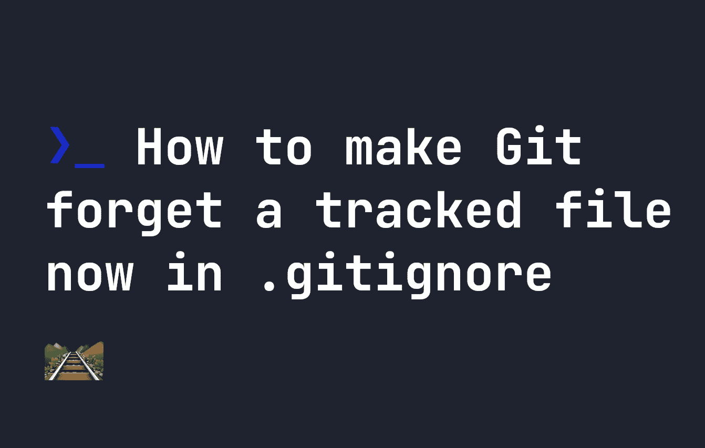

# 如何让 Git 忘记一个被跟踪的文件？gitignore

> 原文：<https://levelup.gitconnected.com/how-to-make-git-forget-a-tracked-file-now-in-gitignore-dec633e64c28>



当我们在 git 中跟踪一个文件时，它有时会被缓存并保持跟踪，即使我们将它添加到我们的`.gitignore`文件中。这仅仅是因为`.gitignore`阻止文件被添加到 Git 的跟踪系统中，但它不会主动删除那些已经被跟踪的文件。当您有一些不想再被跟踪的东西，但似乎又不能从 git 存储库中删除它时，这可能会导致问题。

幸运的是，有一个简单的方法可以解决这个问题。`git`有一个内置的`rm`功能，让我们删除缓存或跟踪的修改。要运行它，您可以使用下面的命令删除一个特定的文件，其中`[filename]`可以与您希望停止跟踪的文件一起删除:

```
git rm --cached [filename]
```

类似地，如果需要删除整个目录，使用表示**递归**的`-r`标志，从跟踪中删除整个目录和其中的所有内容:

```
git rm -r --cached [directory]
```

运行此命令后，您可以添加一个提交，并将其推送到您的遥控器:

```
git add .
git commit -m "Removed tracked files which shouldn't be tracked"
git push
```

**注意**这不会从您的本地计算机中删除文件，但是会从您的 git 存储库中删除对文件的跟踪。它还会在您下一次`git pull`时从其他开发者的计算机或服务器上删除文件。请小心使用这个命令，因为几周前我不小心用它删除了 [FJOLT](https://fjolt.com/) 上的所有图片。:)